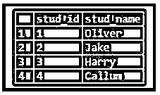

# PostgreSQL 临时表

> 原文：<https://www.educba.com/postgresql-temporary-table/>

## PostgreSQL 临时表简介

PostgreSQL 有一个非常有用的数据库特性，它能够为当前事务或数据库会话创建临时表。它有助于管理未处理的数据。顾名思义，临时表的寿命很短，它不会被永久存储；每次，我们都必须为每个事务或数据库会话创建一个临时表。临时表存在于特定数据库会话持续时间的数据库中，或者存在于当前事务中。在当前事务结束或数据库会话结束时，临时表会被自动删除。临时表对其他事务和数据库会话是不可见的。

**语法:**

<small>Hadoop、数据科学、统计学&其他</small>

为了创建临时表，我们必须使用 CREATE TEMPORARY TABLE 语句，如下所示:

`CREATE TEMPORARY TABLE temp_table_name(  … );`

此外，我们可以在上面定义的 CREATE 语句中使用 TEMP 关键字代替 TEMPORARY 关键字，并将其重写如下:

`CREATE TEMP TABLE temp_table_name( … );`

### PostgreSQL 中的临时表是如何工作的？

*   临时表对其他事务和数据库会话是不可见的。
*   临时表对于我们在其中创建表的当前事务或数据库会话是可见的。
*   我们可以在数据库中创建一个与永久表同名的临时表，实际上并不推荐这样做。临时表隐藏用相同名称定义的永久表，直到没有为相应的数据库会话或事务删除它。
*   如果我们有一个与永久表同名的临时表，我们就不能访问永久表。

### 如何创建 PostgreSQL 临时表？

我们可以在 CREATE table 语句中使用 TEMP 或 TEMPORARY 关键字来创建临时表。

请考虑下面的示例，该示例使用 CREATE TABLE 语句分别借助 TEMP 和 TEMPORARY 关键字创建了两个表“student”和“teacher”。

#### 1.使用表关键字

`CREATE TEMP TABLE student(stud_id serial NOT NULL PRIMARY KEY, stud_name VARCHAR(80));`

借助以下语句和语法，使用上述语句说明创建的表:

`select * from student;`

#### 2.使用临时关键字

`CREATE TEMPORARY TABLE teacher(teacher_id serial NOT NULL PRIMARY KEY, teacher_name VARCHAR(80));`

借助以下语句和语法，使用上述语句说明创建的表:

`Select * from teacher;`

现在，假设我们有一个名为“users”的表，它已经存在于数据库中。

我们将使用下面的 CREATE table 语句创建永久的“users”表。

`CREATE TABLE users(id int, name VARCHAR(80));`

现在，我们将一些数据添加到永久的“用户”表中。下面的 INSERT INTO 语句将在永久的“users”表中添加一些记录。

`INSERT INTO users(id, name) VALUES (1,'Oliver'), (2,'Jake'),  (3,'Harry');`

通过使用以下快照和 SQL 语句来说明上述语句的结果。

`Select * from users;`

**输出:**

我们将创建一个临时表，其名称与我们创建的永久表相同。

我们将使用下面的 CREATE table 语句创建临时的“users”表。

`CREATE TEMPORARY TABLE users(id int, name VARCHAR(80));`

现在，我们将一些数据添加到临时“用户”表中。下面的 INSERT INTO 语句将在临时“users”表中添加一些记录。

`INSERT INTO users(id, name) VALUES (4, 'Callum');`

现在我们有了一个用户表，它既是永久的也是临时的，但是在 PostgreSQL 中，临时表隐藏了事务或数据库会话中永久表的定义。

这里，我们将尝试使用下面的语句从用户的表中获取所有记录。

`select * from users;`

**输出:**

使用下面的快照说明上述语句的结果。

在上面的快照中，我们可以看到返回的结果集来自临时用户的表，而不是来自永久用户的表。

### 如何在 PostgreSQL 临时表中插入数据？

现在，我们将一些数据添加到在 CREATE TABLE 部分创建的临时表中。

下面的 INSERT INTO 语句将在“student”和“teacher”表中添加一些记录。

`INSERT INTO student(stud_name) VALUES ('Oliver'), ('Jake'), ('Harry'), ('Callum');`

通过使用以下快照和 SQL 语句来说明上述语句的结果。

`select * from student;`

**输出:**

`INSERT INTO teacher(teacher_name) VALUES ('Jack'), ('Connor'), ('Jacob'), ('John');`

通过使用以下快照和 SQL 语句来说明上述语句的结果。

`select * from teacher;`

**输出:**

### 如何删除 PostgreSQL 临时表？

为了删除临时表，我们使用 DROP TABLE 语句，如下所示。

`DROP TABLE temp_table_name;`

考虑下面的示例，该示例将删除在上面的创建表部分中创建的“学生”和“教师”表:

以下语句将删除学生表。

`DROP TABLE student;`

以下语句将删除教师表。

`DROP TABLE teacher;`

与为 CREATE TABLE 语句定义 TEMP 或 TEMPORARY 关键字一样，删除表时没有必要提到这些关键字。

### 结论

在这里，我们看到了如何使用 PostgreSQL 临时表，以及 PostgreSQL 临时表如何存储数据。此外，我们还添加了一些 PostgreSQL 临时表的示例。

### 推荐文章

这是一个 PostgreSQL 临时表的指南。这里我们用例子来讨论 PostgreSQL 中临时表的工作原理，创建，插入和删除。您也可以看看以下文章，了解更多信息–

1.  [PostgreSQL 唯一约束](https://www.educba.com/postgresql-unique-constraint/)
2.  [PostgreSQL 自然连接](https://www.educba.com/postgresql-natural-join/)
3.  [PostgreSQL 完全连接](https://www.educba.com/postgresql-full-join/)
4.  [PostgreSQL REGEXP _ MATCHES()](https://www.educba.com/postgresql-regexp_matches/)
5.  [PostgreSQL 主键](https://www.educba.com/postgresql-primary-key/)
6.  [PostgreSQL 表空间？](https://www.educba.com/postgresql-tablespaces/)