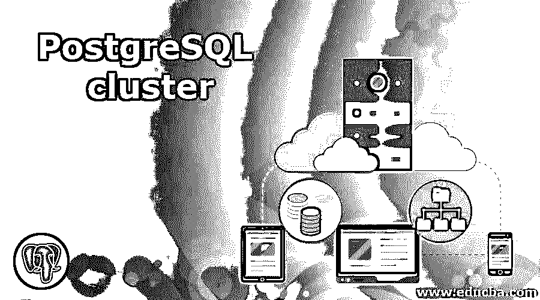
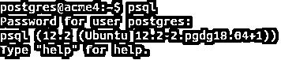
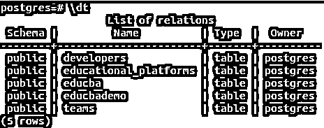
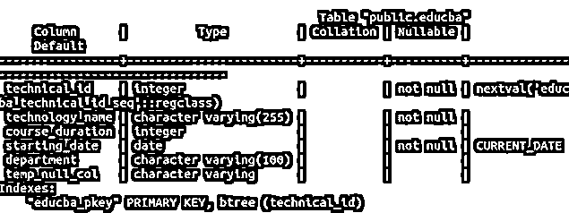
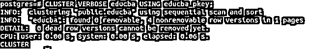
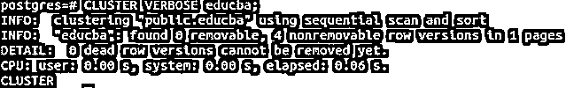

# PostgreSQL 集群

> 原文：<https://www.educba.com/postgresql-cluster/>

## PostgreSQL 集群简介

数据库的主要目的是存储用户所需的数据，并使其在需要时可供使用和操作。尽管这种说法似乎说起来容易，实现起来也容易，但在现实中，要确保大量存在的所有用户都可以使用单个数据库是非常困难的。高可用性一直是数据库工程师面临的挑战。为了克服这些问题，使用了多种技术。其中一个关键的问题是数据库表的聚集。聚类是一种只执行一次的操作，它会导致基于指定的某个索引对表中的数据进行重新排序，否则，该表上存在的任何索引都会被考虑用于聚类。

**语法:**

<small>Hadoop、数据科学、统计学&其他</small>

`CLUSTER [VERBOSE] nameOfTable [ USING nameOfIndex ]`
或
`CLUSTER [VERBOSE]`

*   **nameofttable:**这是您希望集群的表的名称。
*   **NameOfIndex:** 索引的名称已经在名为 nameOfTable 的表上定义，您要对该表进行聚类。这是可选参数。如果未指定，则考虑对表上定义的索引进行聚集。甚至表的名称也是可选的。如果没有指定表名，所有当前数据库表都将根据各自的索引进行聚集。
*   **Verbose:** 这是一个可选参数，如果指定了该参数，在触发集群查询后，将在控制台上打印关于正在执行的集群进程的信息。

### PostgreSQL 集群的工作方式

这是一次性操作。一旦在表上完成，所有的记录都会根据表中定义的索引重新排序。此后，无论何时对表进行操作，比如插入、更新或删除表中的记录，都不会保持聚类过程中的顺序。为此，您可以尽可能定期地再次执行聚类操作，或者可以借助名为 FILLFACTOR 的存储参数对表进行设置，当设置为小于 100%时，可以在执行更新操作时保持聚类顺序，因为如果该页上有空间，值会尝试存储在同一页上。

如果集群是在事务块内部完成的，那么就不会执行集群操作。如果在触发集群命令时没有指定任何参数，则根据哪个用户正在触发，将执行命令步骤。如果用户是超级用户，那么该数据库中存在的所有表都将被聚集和重新聚集，以防它们已经基于各自的索引被聚集。如果发出该命令的不是超级用户，则该用户拥有的表将被重新聚集，如果该操作是第一次在该表上执行，则该表将被重新聚集。

当我们对一个特定的表进行集群操作时，在此期间，我们不能对其执行任何读或写操作，因为该表被独占锁定，只能在集群操作完成后才能被访问。另外，请注意，SQL 不支持任何类似 cluster 的语句，而在 PostgreSQL 中，CLUSTER 操作与所有最新版本以及 PostgreSQL 8.3 之前的版本兼容。

### PostgreSQL 集群实现示例

以下是 PostgreSQL 集群的示例:

使用 psql 命令对 PostgreSQL 数据库 psql 命令 shell 执行 C，并在需要时输入密码，如下所示

#### 示例 1–PostgreSQL 数据库命令外壳

**命令:** `psql`

**输出:**

现在，让我们使用命令\dt 检查数据库中的可用表，在我的例子中，该命令产生以下输出。

**命令:** `\dt`

**输出:**

正如我们所看到的，在我的数据库中有 5 个表。让我们描述名为 educba 的表，使用\d educba 命令找出在该表上定义的键，该命令产生以下输出–

**命令:** `\d educba;`

**输出:**

我们可以看到，在表 educba 的 technical_id 列上定义了一个名为 educba_pkey index 的主键约束。如果数据库中没有任何表，可以使用 CREATE TABLE 语句创建一个表，并在该表上定义索引。该表将进一步用于聚类。

#### 示例 2–对表进行聚类

现在，我们将使用下面的查询语句在名为 educba_pkey 的索引上聚集 educba 表

**命令:** `CLUSTER educba USING educba_pkey;`

**输出:**

正如我们所看到的，唯一的集群是我们对 educba 表进行集群后得到的输出，如果集群操作执行成功，这是正确的。但是与所执行的集群操作相关的任何信息都不会打印在控制台上。为此，我们可以使用 VERBOSE 参数。指定后，将打印所有与群操作相关的信息。让我们尝试执行以下命令。

**命令:** `CLUSTER VERBOSE educba USING educba_pkey;`

**输出:**

使用 VERBOSE 后，我们可以看到控制台上打印的所有与集群操作相关的信息，这些信息指定了删除了多少死行以及查询执行了多长时间。

此后，每当我们在 educba 表上操作 CLUSTER 时，它将考虑 educba_pkey 进行重新集群，因为 PostgreSQL 会记住表被集群的所有键。

**命令:** `CLUSTER VERBOSE educba;`

**输出:**

我们可以基于我们希望执行重新排序的某个键手动执行一次集群操作。然后，编写脚本，通过执行 CLUSTER tableName 命令定期对表进行重新聚集。即使在表中进行了多次更新和插入，重新排序仍会保持不变。

### 结论

聚类极大地提高了性能，并且在执行时非常快速地检索查询结果集，即降低了 done，因为记录现在在聚类之后出现在单个位置中，并且不是失真的格式。这逐渐影响了数据库对用户的可用性。随着执行时间的减少，访问时间也会减少，从而使数据库可供其他用户使用，从而实现高性能和数据库可用性。

### 推荐文章

这是 PostgreSQL 集群的指南。这里我们讨论 PostgreSQL 集群的介绍和实际例子以及不同的子查询表达式。您也可以浏览我们推荐的文章，了解更多信息——

1.  [PostgreSQL 时间戳简介](https://www.educba.com/postgresql-timestamp/)
2.  [PostgreSQL 日志|前 9 个参数](https://www.educba.com/postgresql-log/)
3.  [PostgreSQL While 循环指南](https://www.educba.com/postgresql-while-loop/)
4.  [PostgreSQL 函数|如何工作？](https://www.educba.com/postgresql-functions/)
5.  [PostgreSQL 自动递增](https://www.educba.com/postgresql-auto-increment/)
6.  [PostgreSQL Trunc() |如何工作？](https://www.educba.com/postgresql-trunc/)
7.  [PostgreSQL 回合|示例](https://www.educba.com/postgresql-round/)