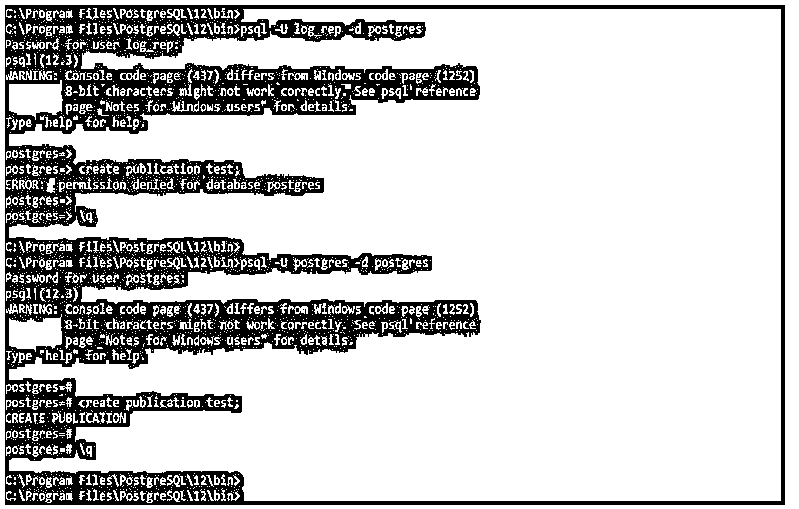
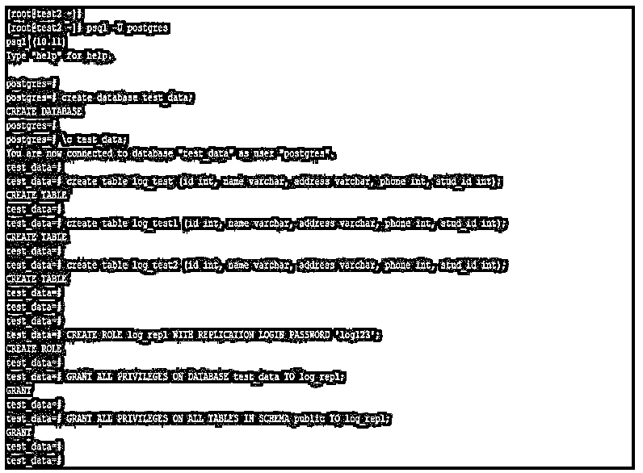
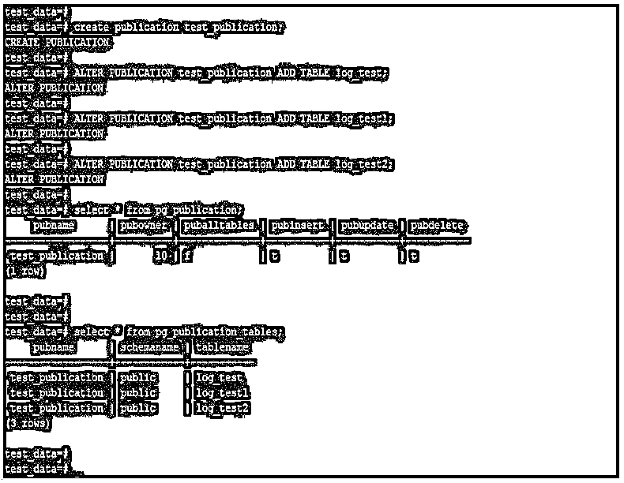
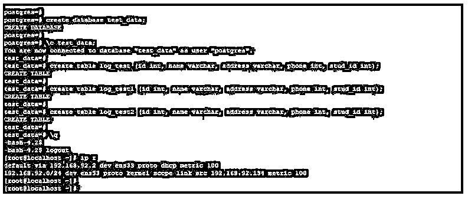

# PostgreSQL 逻辑复制

> 原文：<https://www.educba.com/postgresql-logical-replication/>

## PostgreSQL 逻辑复制简介

PostgreSQL 逻辑复制用于将表从主服务器复制到从服务器，我们在 PostgreSQL 中使用逻辑复制来复制指定的表。PostgreSQL 逻辑复制的特性是从 PostgreSQL 10 版本开始的，在 PostgreSQL 10 版本之前，逻辑复制在 PostgreSQL 中不可用，在旧版本中，我们使用 slony 复制来复制 PostgreSQL 中的指定表。我们必须复制指定的表数据，而不是复制服务器的全部数据。

### PostgreSQL 逻辑复制是如何工作的？

为了配置逻辑复制，我们需要添加监听地址作为数据库主私有 IP 地址，并且需要将 wal 级别配置为逻辑。配置完该参数后，我们需要重启 PostgreSQL 服务以使该参数生效。为了配置逻辑复制，我们需要在主服务器上配置发布，在从服务器上配置订阅。

<small>Hadoop、数据科学、统计学&其他</small>

下面是发布和订阅的工作。

#### 1.出版

*   发布被定义为发布者节点。我们正在将指定的表添加到在从属服务器上复制的发布中。
*   发布还被定义为主服务器上的更改将反映在从服务器上。
*   PostgreSQL 逻辑复制将不同于 PostgreSQL 中使用的其他对象，如模式或数据库。
*   我们可以使用 PostgreSQL 中的 create publication 命令来创建发布。

下面是 PostgreSQL 中创建发布的语法。

**语法:**

`create publication publication_name;`

*   在上面的语法中，create publication 被定义为在 PostgreSQL 中创建新发布的命令。
*   发布名称被定义为我们正在创建的用于设置逻辑复制的发布的名称。
*   要在 PostgreSQL 中创建发布，我们需要拥有超级用户权限来创建它。

下面的例子表明，我们需要有超级用户权限来创建发布。

**代码:**

`psql -U log_rep -d postgres
create publication test;
psql -U postgres -d postgres
create publication test;`

**输出:**

*   PostgreSQL 逻辑复制发布仅包含我们从主服务器复制到从服务器的表。
*   Insert、update 和 delete 语句将从主服务器复制到从服务器。
*   我们在发布中添加的表在将表添加到发布中时，将为每个表创建一个副本标识。
*   在主服务器上创建一个发布后，我们可以创建一个发布的多个订阅。
*   我们可以在 PostgreSQL 中创建多个发布来复制不同服务器上的数据。

#### 2.签署

*   我们已经在从属服务器上创建了订阅。订阅在 PostgreSQL 中被定义为订户。
*   使用发布，我们可以在逻辑复制中设置订阅。订阅数据库或从属服务器的工作方式与 PostgreSQL 的其他实例相同。
*   如果需要，我们可以创建多个订阅。在逻辑复制中，我们可以创建单个发布的多个订阅。
*   复制槽用于从发布服务器接收更改，并将应用于从属服务器。
*   订阅服务器也称为袖手旁观服务器，这是我们在流复制中定义的。
*   要在 PostgreSQL 中创建订阅，我们需要拥有超级用户权限来创建它。

下面的例子表明，我们需要有超级用户权限来创建订阅。

**代码:**

`psql -U log_rep -d postgres
CREATE SUBSCRIPTION test CONNECTION 'host=192.168.92.135 port=5432 password=pass123 user=db_testing dbname=db_test' PUBLICATION test;`

**输出:**

### PostgreSQL 逻辑复制示例

下面是提到的例子:

下面是创建逻辑复制的步骤

#### 第一步

我们在下面定义主从 IP。

**192 . 168 . 92 . 135-主**

**192 . 168 . 92 . 134–从属**

#### 第二步

在主服务器上配置 PostgreSQL 配置文件。我们需要在 postgresql.conf 文件中的主服务器上添加以下参数。

**代码:**

`Listen_address = “*”
Wal_level = logical
vi /var/lib/pgsql/10/data/postgresql.conf`

**输出:**

#### 第三步

重新启动主服务器上的 PostgreSQL 服务，以使配置参数的更改生效。

**代码:**

`systemctl stop postgresql-10
systemctl start postgresql-10`

**输出:**

#### 第四步

在主服务器上的 hba.conf 文件中添加从服务器条目。

**代码:**

`vi /var/lib/pgsql/10/data/pg_hba.conf
host    all  all 192.169.92.134/32 trust`

**输出:**

#### 第五步

在主服务器上创建数据库、用户和表。

**代码:**

`psql -U postgres
create database test_data;
\c test_data;
create table log_test (id int, name varchar, address varchar, phone int, stud_id int);
create table log_test1 (id int, name varchar, address varchar, phone int, stud_id int);
create table log_test2 (id int, name varchar, address varchar, phone int, stud_id int);
CREATE ROLE log_repl WITH REPLICATION LOGIN PASSWORD 'log123';
GRANT ALL PRIVILEGES ON DATABASE test_data TO log_repl;
GRANT ALL PRIVILEGES ON ALL TABLES IN SCHEMA public TO log_repl;`

**输出:**

#### 第六步

在主服务器上创建发布，并将表添加到发布中。

**代码:**

`create publication test_publication;
ALTER PUBLICATION test_publication ADD TABLE log_test;
ALTER PUBLICATION test_publication ADD TABLE log_test1;
ALTER PUBLICATION test_publication ADD TABLE log_test2;
select * from pg_publication;
select * from pg_publication_tables;`

**输出:**

#### 第七步

在副本服务器上创建相同的数据库和表。

**代码:**

`create database test_data;
\c test_data;
create table log_test (id int, name varchar, address varchar, phone int, stud_id int);
create table log_test1 (id int, name varchar, address varchar, phone int, stud_id int);
create table log_test2 (id int, name varchar, address varchar, phone int, stud_id int);`

**输出:**

#### 第八步

在从属服务器上创建订阅。

**代码:**

`CREATE SUBSCRIPTION test_subscription CONNECTION 'host=192.168.92.135 port=5432 password=log123 user=log_repl dbname=test_data' PUBLICATION test_publication;
select * from pg_subscription;`

**输出:**

#### 第九步

测试复制。

形容词（adjective 的缩写）在主服务器上。

**代码:**

`\c test_data;
insert into log_test values (1, 'ABC', 'Mumbai', 1234567890, 101);`

**输出:**

b.在从属服务器上。

**代码:**

`select * from log_test;`

**输出:**

### 推荐文章

这是 PostgreSQL 逻辑复制指南。在这里，我们将讨论 PostgreSQL 逻辑复制是如何工作的，并给出相应的示例和步骤。您也可以看看以下文章，了解更多信息–

1.  [PostgreSQL 真空](https://www.educba.com/postgresql-vacuum/)
2.  [PostgreSQL 中的数组](https://www.educba.com/array-in-postgresql/)
3.  [PostgreSQL 递归查询](https://www.educba.com/postgresql-recursive-query/)
4.  [PostgreSQL 自动递增](https://www.educba.com/postgresql-auto-increment/)