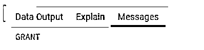
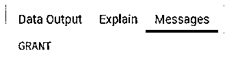
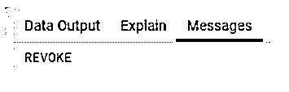
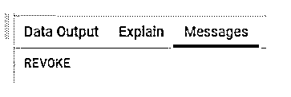
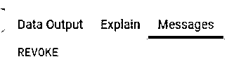

# PostgreSQL 刷新权限

> 原文：<https://www.educba.com/postgresql-flush-privileges/>

## PostgreSQL 刷新权限简介

以下文章概述了 PostgreSQL 刷新权限。PostgreSQL 提供了一个用户管理工具来处理用户权限。我们授予用户不同的权限以及撤销用户权限。刷新权限是一种用户管理功能，我们可以撤销用户的所有授予权限，这意味着我们可以重置用户的所有授予权限。刷新权限意味着向服务器发送指令以重新加载所有授予的权限。刷新权限在数据库管理系统中起着重要的作用，因为刷新权限是管理的一部分。在刷新权限中，我们执行不同的操作，如撤销用户的单个权限、单个用户的多个权限等。

**语法:**

<small>Hadoop、数据科学、统计学&其他</small>

`revoke privilege on schema name from user name;`

**说明:**

*   在上面的语法中，revoke privilege 用于重置用户的所有 grant 特权，schema name 用于指示表名和数据库名，其中用户名是指定的用户名，on 和 from 是关键字。

### PostgreSQL 中的刷新权限是如何工作的？

*   我们必须在系统中安装 PostgreSQL。
*   我们需要关于 PostgreSQL 的基础知识。
*   我们必须要求用户和模式执行刷新权限。
*   我们必须了解用户管理的基本知识，也就是如何使用它。
*   我们可以借助 psql 和 pgAdmin 对用户进行不同的操作。

在刷新权限之前，让我们看看如何向用户授予不同类型的权限，如下所示。

*   **select:** 在这个特权中，假设在我们使用 select 特权的时候，用户需要从表中选择任意一列。
*   **insert:** 在此权限下假设用户需要在表中插入数据，这时我们使用 insert 权限。
*   **update:** 在这个特权中，假设用户需要在我们使用 update 特权时更新表中的任何记录。
*   **delete:** 在这个特权中，假设用户需要从表中删除任何记录，这时我们使用 delete 特权。
*   **create:** 在这个特权中假设用户需要在我们使用 create 特权时在指定的数据库中创建一个新表。
*   **temporary:** 在这个特权中，假设在我们使用临时特权时，用户需要为特定时间段创建一个新的临时表。
*   **授予所有权限:**在此权限中，用户可以授予所有权限。GRANT 命令用于向用户分配权限。

现在让我们看看如何给用户分配特权。

**选择权限:**

**语法:**

`grant privilege on object to user name;`

**说明:**

*   在上面的语法中，grant 是一个命令，select 是特权，object 是指定的表名，而 user name 表示我们要为其分配 select 特权的指定用户名。

**举例:**

`grant select on emp t sam;`

**说明:**

*   在本例中，我们看到了如何向 sam 用户授予 select 权限。
*   通过使用下面的快照来说明上述声明的最终结果。

现在让我们看看如何向单个用户授予多个特权。

**语法:**

`grant  privilege 1,   privilege 2…..   on  table name  to user name;`

**说明:**

*   在上面的语法中，grant 是一个命令，其中 privilege 1、privilege 2 是我们需要分配的特权，table name 是指定的表名，user 是指定的用户名。

**举例:**

`grant select, insert, update on  emp to sam;`

**说明:**

*   在上面的示例中，我们为 sam 用户分配了多个权限，其中 select、insert 和 update 是权限，emp 是表名，sam 是用户名。
*   通过使用下面的快照来说明上述声明的最终结果。

让我们看看如何使用刷新特权来刷新特权。我们使用 REVOKE 命令。刷新权限也称为重置操作。

**举例:**

`revoke select on emp from sam;`

**说明:**

*   在上面例子中，假设在我们使用上述语句时，用户需要刷新 sam 用户的 select 权限。
*   通过使用下面的快照来说明上述声明的最终结果。

现在，让我们看看如何刷新单个用户的多个权限。

**语法:**

`revoke privilege 1, privilege 2,…….   .privilege N on table name from user name;`

**说明:**

*   在上面的语法中，特权 1、特权 2 是刷新特权，表名表示指定的表名，用户名表示指定的用户名，on 和 from 是关键字。

**举例:**

`revoke update, insert on emp from sam;`

**说明:**

*   在上面例子中，假设用户想要刷新多个特权，此时我们使用上面的语句，其中 update 和 insert 是特权，emp 是表名，sam 是用户。
*   通过使用下面的快照来说明上述声明的最终结果。

让我们看看如何为多个用户刷新多个权限。

**语法:**

`revoke privilege 1,privilege 2, ………….privilege N on table name from user 1, user2,……. .user N;`

**说明:**

*   在上面的语法中，其中特权 1 和特权 2 是刷新特权，其中表是指定的表名，用户 1 和用户 2 是指定的用户名。

**举例:**

`revoke  select,  insert on emp from  sam, jenny;`

**说明:**

*   在上面的例子中，我们使用 revoke 命令刷新特权，其中 select 和 insert 是特权，emp 是指定的表名，sam、jenny 是指定的用户。
*   在本例中，我们为多个用户刷新了多个权限。On 和 from 是关键字。
*   通过使用下面的快照来说明上述声明的最终结果。

### 结论

从上面的文章中，我们看到了 flush 特权的基本语法。我们还看到了如何在 PostgreSQL 中用每种类型的不同示例实现它们，比如单个用户和多个用户的多个特权。从本文中，我们看到了如何在服务器上处理 PostgreSQL 中的 flush 特权。

### 推荐文章

这是一个 PostgreSQL 刷新权限的指南。这里我们讨论 PostgreSQL 刷新权限的介绍以及刷新权限的工作原理。您也可以看看以下文章，了解更多信息–

1.  [PostgreSQL TO_CHAR](https://www.educba.com/postgresql-to_char/)
2.  [PostgreSQL VARCHAR](https://www.educba.com/postgresql-varchar/)
3.  [PostgreSQL 平均值](https://www.educba.com/postgresql-average/)
4.  [PostgreSQL MIN()](https://www.educba.com/postgresql-min/)