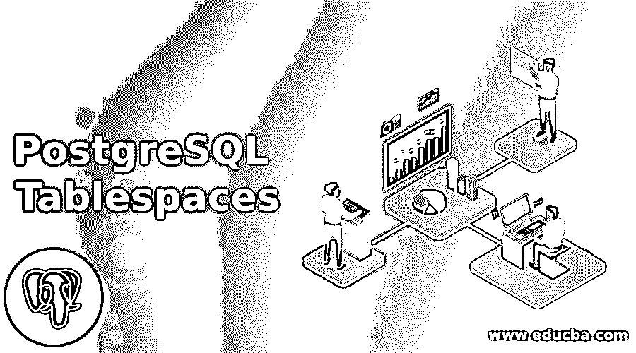
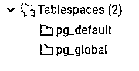
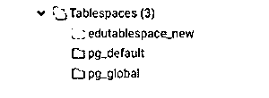
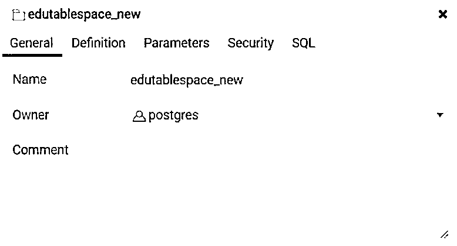
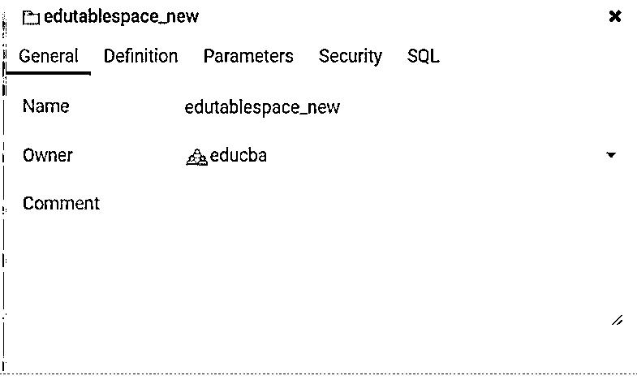

# PostgreSQL 表空间

> 原文：<https://www.educba.com/postgresql-tablespaces/>

## PostgreSQL 表空间简介

PostgreSQL 表空间是驱动器或磁盘上的一个物理位置，PostgreSQL 在此存储包含数据库对象(如索引和表等)的数据文件。PostgreSQL 使用它来将逻辑名称映射到磁盘或驱动器上的物理位置。

它有以下两个默认表空间:

<small>Hadoop、数据科学、统计学&其他</small>

*   **pg_default:** 存储所有用户数据。*   **pg_global:** 存储所有全局数据。

### PostgreSQL 中的表空间是如何工作的？

*   执行创建表空间的用户是 PostgreSQL 表空间的所有者。
*   SQL 语句还允许我们通过在 OWNER 子句中指定名称，将其所有权分配给不同的用户。
*   LOCATION 子句下定义的路径用于创建 PostgreSQL 表空间；此路径是到空的绝对路径。为了从/向该目录读取和写入数据，系统用户必须拥有该目录。

### 如何在 PostgreSQL 中创建表空间？

让我们举例说明以下创建新表空间的语法:

**语法:**

`CREATE TABLESPACE tablespace_name
OWNER user_name
LOCATION directory_path;`

**说明:**

**1。表空间名称**

用于创建新 PostgreSQL 表空间的 PostgreSQL 表空间的名称。我们无法定义以 pg_ 开头的名字；以 pg_ 开头的名称是为 PostgreSQL 系统表空间保留的。

**2。用户名**

定义的名称是将拥有新创建的 PostgreSQL 表空间的用户。如果没有定义 user_name，那么执行该语句的用户将拥有新创建的 PostgreSQL 表空间。它只能由超级用户创建，并且他们可以将表空间的所有权分配给非超级用户。

**3。目录 _ 路径**

它将使用 LOCATION 子句中定义的目录。目录路径应该定义为绝对路径。此外，定义的目录应该由用户拥有，并且必须为空。

让我们看一下下面显示默认表空间的快照:

以下示例将在指定位置创建一个名为“edutablespace”的表空间。

`CREATE TABLESPACE edutablespace
OWNER postgres
LOCATION 'C:\MyFolder\Articles\Tablespaces';`

借助下面的快照说明上述语句的结果。

< img class = " align one size-medium WP-image-321346 " src = " https://www . edu CBA . com/academy/WP-content/uploads/2020/03/PostgreSQL-Tablespaces-2-300×133 . jpg " alt = " PostgreSQL Tablespaces 2 " width = " 300 " height = " 133 "/

### 如何在 PostgreSQL 中改变表空间？

为了使用 alter TABLESPACE 语句对表空间执行一些 ALTER 操作，您应该是超级用户或其所有者。我们不能更改表空间使用的位置，因为 PostgreSQL 还不支持它。

假设我们已经创建了一个表空间，我们希望在 ALTER TABLESPACE 的帮助下更改表空间定义，如下所示:

`ALTER TABLESPACE action;`

**说明:**

**动作:**

它允许我们执行一些操作，如重命名表空间名称、更改表空间的所有者以及设置一些表空间参数。

1.要修改表空间名，我们使用以下语句:

`ALTER TABLESPACE tablespace_name RENAME TO new_name;`

以下语句将 edutablespace 表空间重命名为 edutablespace_new:

`ALTER TABLESPACE edutablespace RENAME TO edutablespace_new;`

借助下面的快照说明上述语句的结果。

2.要修改表空间所有者，我们使用以下语句:

`ALTER TABLESPACE tablespace_name OWNER TO new_owner;`

目前，edutablespace_new 的所有者是 Postgres

以下语句将 edutablespace_new 表空间的所有者更改为' educba '

`ALTER TABLESPACE edutablespace_new OWNER to educba;`

借助下面的快照说明上述语句的结果

3.修改表空间的参数。

`ALTER TABLESPACE tablespace_name SET parameter = value;`

### 如何在 PostgreSQL 中删除表空间？

要删除它，您应该是所有者或超级用户。

考虑以下语法:

`DROP TABLESPACE IF EXISTS tablespace_name;`

**说明:**

在 DROP TABLESPACE 子句后定义它的名称。

IF EXISTS 帮助我们防止删除不存在的表空间的错误。

在删除之前，我们需要确保表空间是空的，这意味着验证表空间中没有数据库对象。

`DROP TABLESPACE edutablespace_new;`

上述语句将删除 edutablespace_new 表空间。

### 结论

我们希望从上面的文章中；您已经学习了如何使用 CREATE TABLESPACE 语句创建表空间，以及如何使用 PostgreSQL ALTER help TABLESPACE 语句更改表空间的定义。

### 推荐文章

这是 PostgreSQL 表空间的指南。在这里，我们讨论 PostgreSQL 表空间的介绍以及如何通过例子来改变它们。您也可以看看以下文章，了解更多信息–

1.  [什么是 PostgreSQL？](https://www.educba.com/what-is-postgresql/)
2.  [PostgreSQL 主键|如何工作？](https://www.educba.com/postgresql-primary-key/)
3.  [PostgreSQL IF 语句|如何工作？](https://www.educba.com/postgresql-if-statement/)
4.  [PostgreSQL 自动递增](https://www.educba.com/postgresql-auto-increment/)
5.  [PostgreSQL Trunc() |如何工作？](https://www.educba.com/postgresql-trunc/)