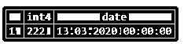
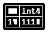
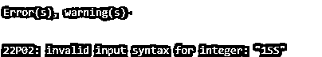
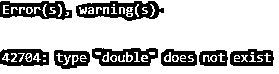
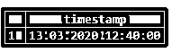
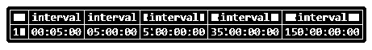
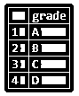
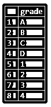
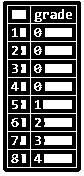

# PostgreSQL 中的强制转换

> 原文：<https://www.educba.com/cast-in-postgresql/>

## PostgreSQL 中的强制转换简介

在处理多个数据库中的事务时，数据转换是几乎所有编程范例都支持的基本要求。PostgreSQL 为我们提供了 CAST 操作符，我们可以使用它将一种数据类型转换为另一种数据类型。我们可以在 PostgreSQL 中进行各种类型的转换操作，比如将字符串转换为整数，将字符串转换为日期，将日期转换为字符串，还可以转换为布尔值，等等。

**语法:**

<small>Hadoop、数据科学、统计学&其他</small>

`CAST (exp AS target_type );`

**说明:**

*   **target_type:** 定义我们在其中转换 exp 值的目标数据类型。

### PostgreSQL 中的 CAST 运算符是如何工作的？

cast 运算符用于将一种数据类型转换为另一种数据类型，其中决定了表列或表达式的数据类型。目标数据类型是表达式要转换成的数据类型。CAST 运算符的另一个版本的语法也如下所示:

**语法:**

`Expression::type`

考虑下面的例子来理解 PostgreSQL 转换的工作原理:

**代码:**

`SELECT
'222'::INTEGER,
'13-MAR-2020'::DATE;`

**输出:**举例说明下面的快照来理解上面语句的结果。

### 在 PostgreSQL 中实现 CAST 的示例

现在，让我们看看下面的例子，它将一种数据类型转换为另一种数据类型。

#### 1.字符串转换为整数

**1。**使用以下语句进行转换:

**代码:**

`SELECT
CAST ('111' AS INTEGER);`

**输出:**举例说明下面的快照，以理解上述语句的结果:

**2。**如果给定值不可转换为目标数据类型，PostgreSQL CAST 运算符将引发错误。考虑下面的例子，

**代码:**

`SELECT
CAST ('1SS' AS INTEGER);`

**输出:**执行上述 SQL 语句后，PostgreSQL 会给我们以下错误:值包含一个字符。

#### 2.字符串到日期转换

使用以下语句将字符串常量转换为日期类型:

**代码:**

`SELECT
CAST ('2020-03-13' AS DATE),
CAST ('13-MAR-2020' AS DATE);`

**输出:**举例说明下面的快照，以理解上述语句的结果:

#### 3.字符串到双精度转换

**1。**现在，尝试使用以下语句将字符串常量转换为双精度类型:

**代码:**

`SELECT
CAST ('22.2' AS DOUBLE);`

**输出:**执行上述 SQL 语句后，PostgreSQL 会给我们以下错误:值包含精度。

**2。**为了正确执行上述语句；我们必须使用下面的语法，而不是 DOUBLE，我们必须使用 DOUBLE 精度，

**代码:**

`SELECT
CAST ('22.2' AS DOUBLE PRECISION);`

**输出:**举例说明下面的快照，以理解上述语句的结果:

#### 4.字符串到布尔型转换

使用以下语句将字符串常量转换为布尔类型，其中“false”、“false”、“F”和“F”转换为 FALSE，“true”、“true”、“T”和“T”转换为 TRUE，如下所示:

**代码:**

`SELECT
CAST('FALSE' as BOOLEAN),
CAST('false' as BOOLEAN),
CAST('F' as BOOLEAN),
CAST('f' as BOOLEAN),
CAST('TRUE' AS BOOLEAN),
CAST('true' AS BOOLEAN),
CAST('T' as BOOLEAN),
CAST('t' as BOOLEAN);`

**输出:**举例说明以下快照，以理解上述语句的结果:

#### 5.字符串到时间戳转换

**1。**使用以下语句将字符串常量转换为时间戳类型

**代码:**

`SELECT '2020-03-13 12:40:00'::timestamp;`

**输出:**举例说明下面的快照，以理解上述语句的结果:

#### 6.字符串到区间转换

使用以下语句进行转换:

**代码:**

`SELECT '5 minute'::interval,
'5 hour'::interval,
'5 day'::interval,
'5 week'::interval,
'5 month'::interval;`

**输出:**举例说明下面的快照，以理解上述语句的结果:

#### 7.带表铸件

**1。**现在，让我们使用 CREATE TABLE 语句创建一个名为“Grades”的新表，其中包含一个名为“Grade”的列，如下所示:

**代码:**

`CREATE TABLE Grades (
Grade VARCHAR(1)
);`

**2。**现在，使用 insert 语句将一些数据插入“Grades”表，如下所示:

**代码:**

`INSERT INTO Grades(Grade)
VALUES
('A'),
('B'),
('C'),
('D');`

**3。**借助以下快照和 SQL 语句说明 Grades 表的内容。

**代码:**

`SELECT
Grade
FROM
Grades;`

**输出:**

**4。**现在，假设需求发生了变化，我们必须以数字格式而不是字符格式存储成绩，因此使用下面的语句，我们可以在成绩表中插入数值。

**代码:**

`INSERT INTO Grades(Grade)
VALUES
('1'),
('2'),
('3'),
('4');`

**5。**现在，等级表将混合存储数字和字符类型的评级。借助以下快照和 SQL 语句说明 Grades 表的内容。

**代码:**

`SELECT
Grade
FROM
Grades;`

**输出:**

**6。**因此，我们将使用以下语句将 Grades 表的 Grade 列中的所有值转换为 integer 类型，

**代码:**

`SELECT
CASE
WHEN grade~E'^\\d+$' THEN
CAST (grade AS INTEGER)
ELSE
0
END as grade
FROM
Grades;`

**输出:**使用下面的快照说明上面语句的结果

### 结论

我们希望通过上面的文章，您已经理解了如何使用 PostgreSQL CAST 操作符，以及 PostgreSQL CAST 如何将一种数据类型转换为另一种数据类型。此外，我们还添加了一些 PostgreSQL 强制转换运算符的示例，以便详细理解它们。

### 推荐文章

这是一个 PostgreSQL 中的 CAST 指南。这里我们讨论语法，CAST 操作符是如何工作的，以及用正确的代码和输出实现的例子。您也可以浏览我们的其他相关文章，了解更多信息——

1.  [PostgreSQL 获取](https://www.educba.com/postgresql-fetch/)
2.  [PostgreSQL 数据库](https://www.educba.com/postgresql-database/)
3.  [PostgreSQL 中的游标](https://www.educba.com/cursors-in-postgresql/)
4.  [PostgreSQL 排序依据](https://www.educba.com/postgresql-order-by/)
5.  [如何使用 PostgreSQL RANK()？](https://www.educba.com/postgresql-rank/)
6.  [PostgreSQL 布尔值指南](https://www.educba.com/postgresql-boolean/)
7.  [学习 PostgreSQL COALESCE](https://www.educba.com/postgresql-coalesce/)
8.  [类似 PostgreSQL 的前 11 个例子](https://www.educba.com/postgresql-like/)