# PostgreSQL 中的 hstore

> 原文：<https://www.educba.com/hstore-in-postgresql/>

## PostgreSQL 中 hstore 的介绍

为了将键值对视为单个实体，PostgreSQL hstore 模块实现了 hstore 数据类型，该数据类型可用于各种情况，如半结构化数据或包含多个属性的行，我们不能经常尝试获取这些属性。键和值的数据类型是字符串。PostgreSQL hstore 数据类型类似于我们在其他编程语言中使用的字典；PostgreSQL hstore 特定于该列。没有必要预先定义密钥。

**语法**

<small>Hadoop、数据科学、统计学&其他</small>

`column_name hstore`

**解释:**数据类型为 store 的列的名称。

### hstore 数据类型在 PostgreSQL 中如何工作？

为了使用 hstore 数据类型，我们需要启用 hstore 扩展。我们可以借助 hstore 扩展将 contrib 模块加载到 PostgreSQL 实例中。为 hstore 创建扩展的语法如下:

`CREATE EXTENSION hstore;`

Hstore 存储键和值对，我们必须在键和值字段周围添加双引号，如下所示:

`“<key>”:”<value>”`

如果列的值不适合关系列，则使用 PostgreSQL hstore 数据类型。PostgreSQL hstore 列是动态工作的，这意味着您不需要在创建表之前指定键；您可以创建一个包含 hstore 列的表，然后用不同的键插入值。

### 在 PostgreSQL 中实现 hstore 数据类型的示例

为了理解 hstore 数据类型的示例，我们将创建一个名为“employee”的表，其中包含 hstore 数据类型。

使用 CREATE TABLE 语句创建一个数据类型为 hstore 的表“employee ”,如下所示:

`CREATE TABLE employee (
id serial primary key,
name VARCHAR (255),
data hstore
);`

数据列将包含雇员的属性，如工作类型、薪水和联系电话。employee 表的数据列属于 hstore 数据类型。

现在，我们将借助以下 INSERT INTO 语句将行插入到 employee 表中，如下所示:

`INSERT INTO employee (name, data)
VALUES
(
'Oliver Jake',
'"contact_number" => "9912002430",
"salary" => "30000",'
);`

在这里您可以看到逗号分隔的键-值对的列表，数据被插入到 hstore 列中。使用以下 SELECT 语句和快照说明 employee 表的内容:

`SELECT * FROM employee;`

现在，我们将使用 INSERT INTO 语句插入另一行，如下所示。

`INSERT INTO employee (name, data)
VALUES
(
'Jacob John',
'"contact_number" => "9912002440",
"salary" => "40000",'
);`

使用以下 SELECT 语句和快照说明 employee 表的内容:

`SELECT * FROM employee;`

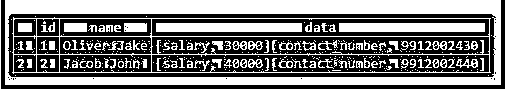

#### 示例# 1–从 hstore 列中检索数据

我们可以使用下面的语句从 hstore 列获取数据。

**代码:**

`SELECT
data
FROM
employee;`

**输出:**

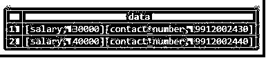

#### 示例 2–检索 hstore 的特定键的数据

为了获取 hstore 类型的数据列的特定键，我们可以使用箭头(->)操作符，如下所示:

**代码:**

`SELECT
data -> 'salary' AS salary
FROM
employee;`

**输出:**

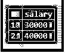

#### 示例# 3–带有键值的 Where 子句

我们可以在 where 子句中添加一个条件，以便在箭头(->)运算符的帮助下过滤行:

**代码:**

`SELECT
name,
data -> 'contact_number' AS Contact
FROM
employee
WHERE
data -> 'salary' = '30000';`

**输出:**

#### 示例# 4–插入一个键值对

我们可以使用 hstore 列添加一个键值对。这里，我们将使用以下语句在 Employee 表的数据列中添加工作类型:

**代码:**

`SELECT
name,
data -> 'job_type' AS JobType
FROM
Employee;`

**输出:**

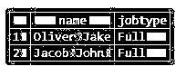

#### 示例 5–更新键值对

我们可以修改 hstore 列的键值对。使用以下语句将“job_type”键的值更新为“Part”。

**代码:**

`UPDATE employee
SET data = data || '"job_type"=>"Part"' :: hstore;`

**输出:**

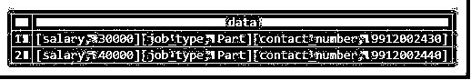

#### 示例 6–删除键值对

我们可以使用下面的语句，从 store 类型的数据列中删除键值对。

这里我们将删除数据列中的键-值对“job _ type”= >“Part ”:

**代码:**

`UPDATE employee
SET data = delete(data, 'job_type');`

**输出:**

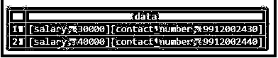

#### 示例# 7–获取存储在 hstore 列中的所有密钥

为了获取存储在 hstore type 列中的所有键，我们必须使用 keys()函数或 skey()函数，如下所示:

**代码:**

`SELECT
akeys (data)
FROM
employee;`

**输出:**

PostgreSQL 提供的 skey()函数用于获取结果集合:

**代码:**

`SELECT
skeys (data)
FROM
employee;`

**输出:**

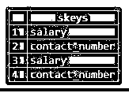

#### 示例# 8–从数据列获取所有值

与键类似，我们可以使用 PostgreSQL 提供的 avals()函数或 svals()函数从 hstore 类型的数据列中获取所有值:

**代码:**

`SELECT
avals (data)
FROM
employee;`

**输出:**

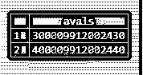

PostgreSQL 提供的 svals()函数用于获取结果集合:

**代码:**

`SELECT
svals (data)
FROM
employee;`

**输出:**

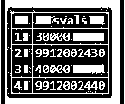

#### 示例 9–将 hstore 数据转换为 JSON 数据

我们可以使用 PostgreSQL 的 hstore_to_json()函数将 hstore 数据转换为 json:

**代码:**

`SELECT
name,
hstore_to_json (data) json_data
FROM
employee;`

**输出:**

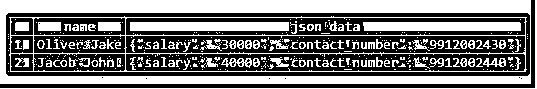

#### 示例# 10–将 hstore 数据转换为集合

我们可以使用 PostgreSQL 的 each()函数将 hstore 数据转换为集合。

**代码:**

`SELECT
name,
(EACH(data) ).*
FROM
employee;`

**输出:**

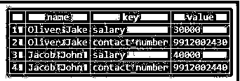

### 结论

我们希望通过上面的文章，您已经理解了如何使用 PostgreSQL hstore 数据类型，以及 PostgreSQL hstore 数据类型如何以键值对的形式存储数据。此外，我们还添加了一些 PostgreSQL hstore 的示例来详细理解它。

### 推荐文章

这是 PostgreSQL 中 hstore 的指南。这里我们讨论 PostgreSQL 中 hstore 的介绍，语法，它是如何工作的，以及更好理解的例子。您也可以浏览我们的其他相关文章，了解更多信息——

1.  [PostgreSQL IF 语句](https://www.educba.com/postgresql-if-statement/)
2.  [PostgreSQL For 循环](https://www.educba.com/postgresql-for-loop/)
3.  [PostgreSQL 主键](https://www.educba.com/postgresql-primary-key/)
4.  [PostgreSQL 列表表](https://www.educba.com/postgresql-list-tables/)