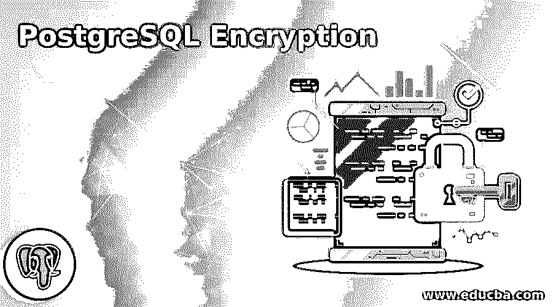
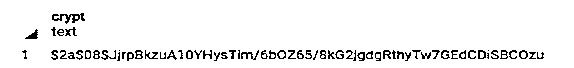
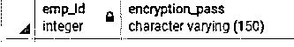
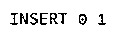
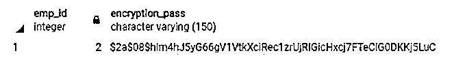
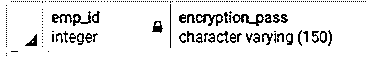

# PostgreSQL 加密

> 原文：<https://www.educba.com/postgresql-encryption/>

## PostgreSQL 加密简介

PostgreSQL 提供不同级别的加密，并在保护记录和数据免受不同攻击方面提供灵活性，如数据库服务器盗窃、非法管理员和不安全的网络等。需要加密来保护敏感数据，如银行数据库和金融数据库等。基本上，加密意味着我们用解密密钥将数据从一种形式编码成另一种形式。解密密钥也是私有的，而且很大，只有你自己能看懂。当我们加密数据时，这意味着我们将明文转换为密文，这种加密只有在解密密钥的帮助下才能理解。PostgreSQL 有一个为安全数据库提供密码存储加密的选项；它还为表中的特定列提供加密。

**语法:**

<small>Hadoop、数据科学、统计学&其他</small>

`create extension statement with pgcrypto;`

**说明:**

*   在上面的语法中，我们使用 create extension 语句和 pgcrypto 命令。

### PostgreSQL 中是如何进行加密的？

不同的组织处理不同类型的数据，如财务交易，或者我们可以考虑医疗记录；这是非常安全的信息，我们需要存储到数据库中。因此，安全是确保数据安全的主要因素。

PostgreSQL 有如下不同的加密选项:

#### 1.静态数据的加密

静态数据意味着我们将无用的数据存储在磁盘上。当我们在云环境中托管数据库时，这意味着我们将所有访问权限授予用户，因此在那个时候，我们需要加密来保护磁盘上的数据不被窃取。

#### 2.全磁盘加密

全磁盘加密的基本概念是指我们保护所有包含数据的文件和临时存储。有时很难保护特定的文件或临时存储，因为选择文件或数据不是一件容易的事情，因此 PostgreSQL 提供了一种完整的磁盘加密方法。这种方法的主要优点是不需要特别注意。

#### 3.基于文件的加密

在基于文件的加密中，它通过使用可堆叠的加密文件系统来加密文件和目录。PostgreSQL 使用 pg_crypto 加密文件和目录。在这种方法中，我们使用公钥加密方法。这种方法的主要缺点是，它使一些文件加密，这些文件攻击者很容易恢复。

#### 4.实例级加密

在这种方法中，使用了缓冲区的概念，其中所有文件都作为加密的静态数据存储在磁盘中。每次写操作都会从 shard 缓冲区中自动加密磁盘中的数据。在这种方法中，我们使用两个不同的命令来加密数据，例如 initdb 命令用于初始化数据库，pgcrypto.keysetup _parameter 命令用于从服务器获取加密的密钥。

#### 5.客户端加密

有时，数据库管理员无法信任当时的客户端；数据库管理员使用客户端加密方法来加密来自客户端的数据。应用客户端加密方法后，未加密的数据不会显示在服务器上。

#### 6.加密网络上的数据

在这种方法中，SSL 连接在将数据发送到网络之前会对所有数据进行加密。数据库管理员指定主机和所需的 SSL 连接，因此它为此使用不同的配置文件。

### PostgreSQL 加密示例

以下是 PostgreSQL 加密的示例:

**代码:**

`create extension pgcrypto;`

**说明:**

*   在上面的例子中，我们使用带有 pgcrypto 命令的 create extension 语句。
*   pgcrypto 命令用于保持加密方法。
*   我们通过使用下面的快照来说明上述声明的超额结果的轮廓。

**输出:**

之后，我们使用哈希和 blowfish 技术对密码进行加密；散列使用 4 或 8 轮。

**代码:**

`select crypt('admin', gen_salt('bf', 8));`

**说明:**

*   在上面的语句中，我们使用了一个带有 crypt 参数的 select 语句，其中我们使用散列和 blowfish 技术加密了管理员密码。
*   这里我们使用 8 轮加密密码。
*   我们通过使用下面的快照来说明上述声明的超额结果的轮廓。

**输出:**

对于进一步的过程，我们需要一个表，所以我们使用下面的语句创建了一个表。

**代码:**

`create table demo_sample(emp_id int, encryption_pass varchar (150));`

**说明:**

*   借助上面的语句，我们创建了一个 demo_sample，它具有不同的属性，比如 emp_id 和 encryption_pass，数据类型为。
*   我们通过使用下面的快照来说明上述声明的超额结果的轮廓。

**输出:**

**

** 

上面的快照显示我们成功地创建了一个 demo_sample 表，下面的快照显示了实际创建的表，如下所示。

**输出:**

**

** 

之后，我们使用下面的语句将记录插入到 demo_sample 中，如下所示。

**代码:**

`insert into demo_sample (emp_id,encryption_pass) values (1,'$2a$08$kBHePoCfMR7WGDocDKY04.9ZOgKwhkea8dDJzE1phufJRKJ7qoqAe');
insert into demo_sample (emp_id,encryption_pass) values (2,'$2a$08$hIm4hJ5yG66gV1VtkXciRec1zrUjRIGicHxcj7FTeClG0DKKj5LuC’);`

**说明:**

*   在上述语句的帮助下，我们在 demo_sample 表中插入了一条记录，该记录具有不同的值，如 emp_id 和加密的密码，如上述语句所示。
*   我们通过使用下面的快照来说明上述声明的超额结果的轮廓。

**输出:**

假设我们需要检查密码是正确还是错误，那么我们可以使用如下语句。

**代码:**

`select * from demo_sample where emp_id = 2 and encryption_pass = crypt('admin', encryption_pass);`

**说明:**

*   在上面的语句中，我们使用 select 和 where 子句来检查密码是正确还是错误；这里，我们检查 emp_id =2 和加密的密码，如上面的语句所示。
*   我们通过使用下面的快照来说明上述声明的超额结果的轮廓。

**输出:**

当我们当时使用 hacker 命令时，它不会从加密的密码中返回任何一行。

下面我们来看看如何使用黑客命令。

**代码:**

`select * from demo_sample where emp_id = 2 and encryption_pass = crypt('hacker', encryption_pass);`

**说明:**

*   在上面的语句中，我们只是将单词改为 hacker，而不是 admin 密码，如上面的语句所示。执行上述语句后，它不返回任何行值。
*   我们通过使用下面的快照来说明上述声明的超额结果的轮廓。

**输出:**

### 结论

从上面的文章中，我们已经看到了在 PostgreSQL 中创建扩展的基本语法以及与加密相关的不同命令。此外，我们还发现了如何在 PostgreSQL 中使用每种技术的不同示例来实施它们。从本文中，我们看到了如何在 PostgreSQL 中处理加密。

### 推荐文章

这是 PostgreSQL 加密指南。这里我们讨论一下入门，PostgreSQL 中是如何进行加密的？还有例子。您也可以看看以下文章，了解更多信息–

1.  [PostgreSQL 日期时间](https://www.educba.com/postgresql-datetime/)
2.  [PostgreSQL 或](https://www.educba.com/postgresql-or/)
3.  [PostgreSQL OID](https://www.educba.com/postgresql-oid/)
4.  [PostgreSQL 聚集索引](https://www.educba.com/postgresql-clustered-index/)