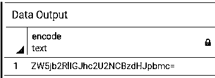
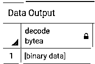
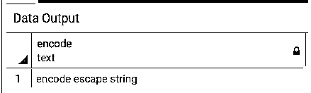
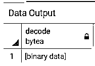
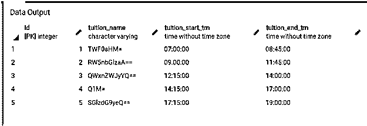
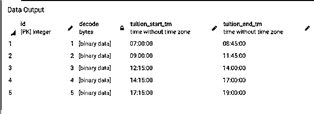
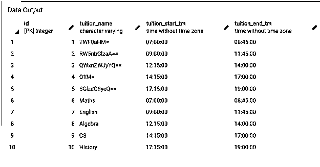
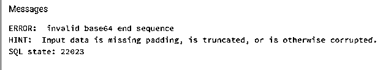

# PostgreSQL 解码()

> 原文：<https://www.educba.com/postgresql-decode/>

## PostgreSQL DECODE()函数的定义

PostgreSQL DECODE()函数用于从输入字符串中解码或提取二进制数据，该字符串为文本格式，并且已经使用 PostgreSQL Encode()函数进行了编码。PostgreSQL DECODE()函数接受需要解码的输入文本和用户希望它解码的参数类型。给 PostgreSQL Decode()函数的参数应该与 PostgreSQL Encode()函数中使用的参数类型相同。PostgreSQL 支持编码和解码函数的各种格式，如 base64、escape 等。

**语法:**

<small>Hadoop、数据科学、统计学&其他</small>

为了说明 PostgreSQL DECODE()函数，请考虑以下语法:

`decode(string input_text, format type_text)`

**说明:**

*   input _ text–这定义了将被解码的输入文本字符串。
*   type _ text–它定义了我们期望在其中解码输入文本的。

### PostgreSQL DECODE()函数是如何工作的？

1.  PostgreSQL DECODE()函数接受两个输入参数；第一个是用户想要解码的文本，第二个是用户想要解码的参数类型。
2.  给 PostgreSQL Decode()函数的参数应该与 PostgreSQL Encode()函数中使用的参数类型相同。
3.  PostgreSQL DECODE()函数根据指定的类型返回文本的解码二进制数据。

### 例子

1.  考虑下面的例子，我们将使用下面的 SQL 语句对格式为“base64”的字符串“encode base64 string”进行编码。

`select encode('encode base64 string', 'base64');`

使用下面的快照说明上述语句的结果。

我们将使用上述编码示例中的编码“zw5b 2 rligjhc 2c 2 ncbzdhjpbmc = ”,并通过使用以下 SQL 语句将其用于解码。

`select decode('ZW5jb2RlIGJhc2U2NCBzdHJpbmc=', 'base64');`

使用下面的快照说明上述语句的结果。

2.  考虑下面的例子，我们将通过使用下面的 SQL 语句用格式“escape”对字符串“encode escape string”进行编码。

`select encode('encode escape string', 'escape');`

使用下面的快照说明上述语句的结果。

然后，我们将使用上述编码示例中的编码“编码转义字符串”,并通过使用以下 SQL 语句将其用于解码。

`select decode('encode escape string', 'escape');`

使用下面的快照说明上述语句的结果。

3.  考虑以下示例，我们将使用 CREATE TABLE 语句创建一个新表，该表将存储学费的详细信息。

`CREATE TABLE tuitions (
id serial PRIMARY KEY,
tuition_name VARCHAR NOT NULL,
tuition_start_tm TIME NOT NULL,
tuition_end_tm TIME NOT NULL
);`

现在，我们将使用 base64 格式对学费名称进行编码，然后使用 INSERT INTO 语句将一些数据插入学费表，如下所示:

`INSERT INTO tuitions(tuition_name, tuition_start_tm, tuition_end_tm)
VALUES
( encode('Maths','base64'), '07:00:00', '08:45:00'),
( encode('English','base64'), '09:00:00', '11:45:00'),
( encode('Algebra','base64'), '12:15:00', '14:00:00'),
( encode('CS','base64'), '14:15:00', '17:00:00'),
( encode('History','base64'), '17:15:00', '19:00:00');`

通过使用以下 SQL 语句和一个快照来说明 tuitions 表的结果。

`SELECT * FROM tuitions;`

考虑以下 PostgreSQL DECODE()函数的示例，它将从 tufty _ name 列返回二进制数据，这里我们将使用“base64”作为格式类型，因为我们在向表中插入数据时使用了相同的格式类型。

`select id, decode(tuition_name, 'base64'), tuition_start_tm, tuition_end_tm from tuitions;`

使用下面的快照说明上述语句的结果。

在上表的上述状态中，所有的行都有 tufty _ name 列的编码记录。现在，我们将使用下面的 INSERT INTO 语句，在不对学费名称进行编码的情况下，在“学费”表中插入一些记录。

`INSERT INTO tuitions(tuition_name, tuition_start_tm, tuition_end_tm)
VALUES('Maths', '07:00:00', '08:45:00'),
('English', '09:00:00', '11:45:00'),
('Algebra', '12:15:00', '14:00:00'),
('CS', '14:15:00', '17:00:00'),
('History', '17:15:00', '19:00:00');`

通过使用以下 SQL 语句和一个快照来说明 tuitions 表的结果。

`SELECT * FROM tuitions;`

现在，我们在“学费”表中混合了编码和解码的数据，所以每当我们试图通过解码“学费名称”来检索记录时，我们都会得到异常。

使用以下 SQL 语句和快照说明预期的异常:

`select id, decode(tuition_name, 'base64'), tuition_start_tm, tuition_end_tm from tuitions;`

***

*** 

### 结论

我们希望通过上面的文章，您已经理解了如何使用 PostgreSQL DECODE()函数以及 PostgreSQL DECODE()函数是如何工作的。此外，我们还添加了几个 PostgreSQL DECODE()函数的示例来详细理解它。

### 推荐文章

这是 PostgreSQL DECODE()的指南。这里我们讨论 PostgreSQL DECODE()的介绍、语法、工作原理和相应的例子。您也可以浏览我们的其他相关文章，了解更多信息——

1.  [PostgreSQL 不为空](https://www.educba.com/postgresql-not-null/)
2.  [PostgreSQL 时间戳](https://www.educba.com/postgresql-timestamp/)
3.  [PostgreSQL 中的外键](https://www.educba.com/foreign-key-in-postgresql/)
4.  [PostgreSQL 子查询](https://www.educba.com/postgresql-subquery/)