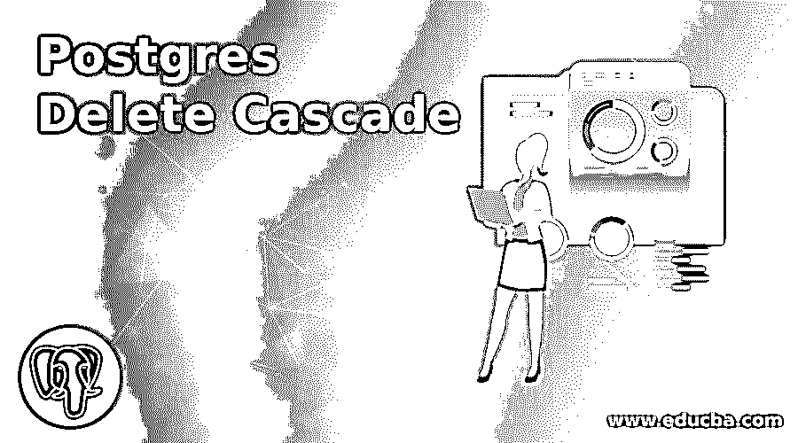
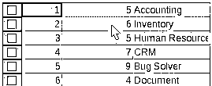
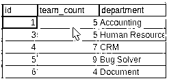
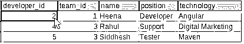

# Postgres 删除级联

> 原文：<https://www.educba.com/postgres-delete-cascade/>

## Postgres 删除级联简介

在 Postgres Delete Cascade 中，我们将了解如何在关系数据库包含多个表并且这些表之间有外键约束的情况下管理数据库 CRUD 操作 Delete。每当我们在 PostgreSQL 中对一个表的记录执行删除操作时，非常有必要考虑被删除记录的表是否与其他表有外键关系。在这种情况下，大多数被操作的记录来自父表，而其他被引用的表是子表。父表的每条记录都引用子表的一条或多条记录。

在执行删除操作时，保持数据库表及其内容的一致性非常重要。如果任何子表包含要删除的引用记录，则不应该出现这种情况。这里是我们可以在 PostgreSQL 中使用 Delete cascade 的地方。要学习删除级联，您需要在计算机上安装 PostgreSQL，并具备一些查询语法和查询构建的基本知识。通过在命令提示符下键入以下命令，可以检查您的计算机上是否安装了 PostgreSQL。

<small>Hadoop、数据科学、统计学&其他</small>

`psql -V`

当我们使用“ON DELETE CASCADE”关键字提到引用表中的外键约束时，提到在被引用表上执行的操作应该以级联方式对引用记录进行操作。

### 如何使用 Postgres 删除级联

只有当表涉及外键约束时，才使用 Delete cascade。因此，首先需要理解什么是外键。每当一个表包含一个或多个记录，并且这些记录的字段或字段组唯一地表示其他某个表的记录时，我们就说第一个表是引用表或子表，其记录被引用的表是被引用表或父表。如果我们希望在引用记录出现在其他一些表中时避免对被引用记录的操作，那么我们设置外键。当我们使用删除级联时，如果被引用条目被删除，即父记录被删除，那么它的所有被引用记录，即子记录也被自动删除。

在这里，我们将借助一个例子来学习如何在 PostgreSQL 中使用 delete cascade。该示例将包含两个表，即团队和开发人员。每个开发人员属于一个或另一个团队，一个团队由许多开发人员组成。在数据库中维护两者的记录时，我们将首先为它们中的每一个创建表。

**步骤 1:** 首先，让我们为团队创建一个表，这将是我们主要引用的父表。

**代码:**

`CREATE TABLE teams (
id SERIAL PRIMARY KEY,
team_count INTEGER,
department VARCHAR (100)
);`

**步骤 2:** 现在，我们将为开发人员创建一个表，它将作为引用表或子表。团队和开发人员之间的关系太多了。team_id 将是我们的引用键，它将引用团队表的 id。

**代码:**

`CREATE TABLE developers (
developer_id INTEGER NOT NULL,
team_id INTEGER REFERENCES teams (id),
name VARCHAR (100),
position VARCHAR (100),
technology VARCHAR (100),
PRIMARY KEY (developer_id,team_id)
);`

**解释:**上面的查询将为团队创建一个引用表“developers”。但是，在删除团队记录时，它将限制我们删除，并且如果开发人员的表中存在任何引用记录，则不允许删除团队记录的 id，因为默认删除值是 DELETE RESTRICT。

**步骤 3:** 现在，如果我们想从具有特定 id 的团队中删除记录，以及开发人员表中引用被删除的团队记录的所有引用记录，那么我们将使用删除级联。下面是我们在创建开发人员表时可以使用的语法。

**代码:**

`CREATE TABLE developers (
developer_id INTEGER NOT NULL,
team_id INTEGER REFERENCES teams (id) ON DELETE CASCADE,
name VARCHAR (100),
position VARCHAR (100),
technology VARCHAR (100),
PRIMARY KEY (developer_id,team_id)
);`

**步骤 4:** 现在我们将把一些记录插入到父表 teams 中。

**代码:**

`INSERT INTO teams (id, team_count, department) VALUES
('1','5','Accounting'),
('2','6','Inventory'),
('3','5','Human Resource'),
('4','7','CRM'),
('5','9','Bug Solver'),
('6','4','Document');`

**第五步:**我们在开发商的子表/参照表中插入一些参照记录。

**代码:**

`INSERT INTO developers (developer_id, team_id, name, position, technology) VALUES
('1','2','Payal','senior SD','Java'),
('2','1','Heena','Developer','Angular'),
('3','2','Sayali','Developer','Hibernate'),
('4','3','Rahul','Support','Digital Marketing'),
('5','3','Siddhesh','Tester','Maven');`

**步骤 6:** 让我们检查是否所有的记录都正确地插入到表格中。

`SELECT * FROM teams;`

`SELECT * FROM developers;`

**步骤 7:** 现在我们将学习如何使用 delete cascade，并对上面创建的表执行删除操作。在正常情况下，如果我们将从父表中删除记录，并且子表包含引用记录，则不允许删除，但是由于我们使用删除级联，父表中的记录以及所有引用记录都将被删除。现在，我们将删除团队 id 为 2(库存)的所有记录。由于使用了删除级联，所有团队 id 为 2 的开发人员记录(Payal 和 sayali)将被自动删除。

`DELETE FROM teams WHERE id=2;`

现在让我们看看目录。

表团队包含如下记录:

而开发者包含如下内容:

### 结论

在数据库结构中，在执行任何 CRUD 操作时，考虑表之间的外部关系是非常重要的。维护数据库中数据的一致性和整洁性极其重要。如果父记录不存在，则不应有任何子记录引用父记录的已删除记录。如上所示，删除级联可以在 PostgreSQL 中使用，以便在引用的父记录被自动删除时删除所有子记录，这有助于保持完整性。

### 推荐文章

这是一个 Postgres 删除级联指南。这里我们讨论一个 Postgres Delete Cascade 的介绍，如何用编程例子来使用它。你也可以通过我们的其他相关文章来了解更多

1.  [如何创建 PostgreSQL 模式？](https://www.educba.com/postgresql-schema/)
2.  [如何在 PostgreSQL 中创建、重命名、删除、复制表](https://www.educba.com/postgresql-table/)
3.  [使用示例创建 PostgreSQL 视图](https://www.educba.com/postgresql-views/)
4.  [在 PostgreSQL 中实现 TRUNC()的查询示例](https://www.educba.com/postgresql-trunc/)