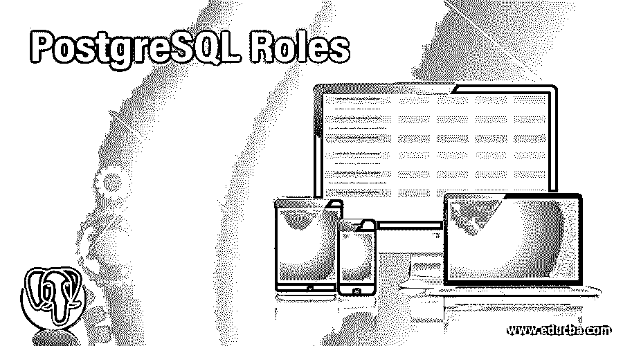
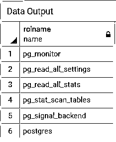
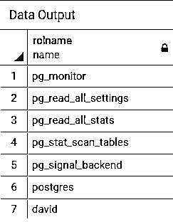
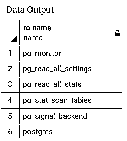
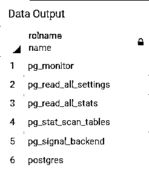
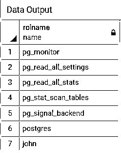
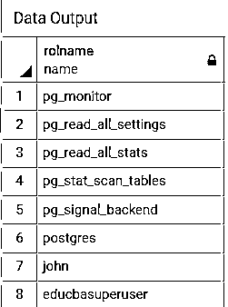
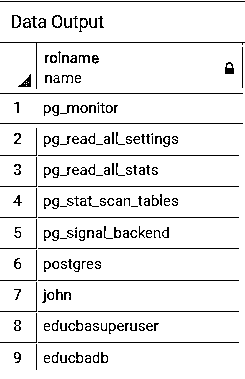
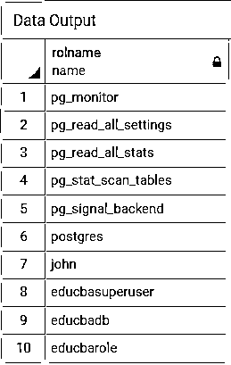
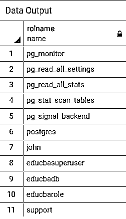

# PostgreSQL 角色

> 原文：<https://www.educba.com/postgresql-roles/>

## PostgreSQL 角色介绍

为了管理访问数据库的权限，PostgreSQL 使用了角色机制。我们可以将角色创建为用户角色或组角色。用户可以拥有登录权限，而组角色没有登录权限。PostgreSQL 从版本 8.1 开始支持用户和组机制。我们可以在被视为一个组的角色中创建一个角色，但不允许有循环成员。我们可以根据需要创建角色，也可以删除角色。每当我们删除一个角色，PostgreSQL 就会删除它的所有成员和特权。

### PostgreSQL 角色是如何工作的？

*   我们可以将角色创建为用户角色或组角色。
*   如果您正在创建组角色，则可以将用户添加到组中，并且您可以授予或撤销角色的权限。
*   我们可以删除角色，但在此之前，我们需要重新分配其所有数据库对象，因为 PostgreSQL 会删除被删除角色的所有特权和成员资格。
*   在 PostgreSQL 中，无法创建具有登录权限的组角色。

### 如何创建 PostgreSQL 角色？

请考虑下面的 CREATE ROLE 语句，它解释了如何创建新角色:

<small>Hadoop、数据科学、统计学&其他</small>

**代码:**

`CREATE ROLE role_name;`

考虑下面的语句和快照，它将说明集群中存在的所有角色:

**代码:**

`SELECT rolname FROM pg_roles;`

**输出:**

使用以下语句为演示创建一个名为“David”的角色:

**代码:**

`CREATE ROLE David;`

现在执行上面的语句后，执行下面的语句和快照，这将说明集群中存在的所有角色:

**代码:**

`SELECT rolname FROM pg_roles;`

**输出:**

### 如何删除 PostgreSQL 角色？

请考虑下面的 DROP ROLE 语句，该语句解释了如何删除组角色或用户角色。

**代码:**

`DROP ROLE role_name;`

使用以下语句删除名为“David”的角色进行演示:

**代码:**

`DROP ROLE David;`

现在执行上面的语句后，执行下面的语句和快照，这将说明集群中存在的所有角色:

**代码:**

`SELECT rolname FROM pg_roles;`

**输出:**

### 实现 PostgreSQL 角色的示例

考虑下面的语句和快照，它将说明集群中存在的所有角色:

**代码:**

`SELECT rolname FROM pg_roles;`

**输出:**

我们可以创建具有数据库属性的角色，如下所示:

1.  登录，
2.  超级用户，
3.  数据库创建，
4.  角色创造，
5.  密码等。

**1。**考虑以下 CREATE ROLE 语句，该语句解释了如何创建具有以下功能的角色

*   登录权限，
*   密码，以及
*   有效日期。

`CREATE ROLE John WITH PASSWORD 'edCBA2020' VALID UNTIL '2021-01-01';`

现在执行上述语句后，执行下面的语句和快照，这将说明集群中存在的所有角色:

**代码:**

`SELECT rolname FROM pg_roles;`

**输出:**

**2。**考虑以下 CREATE ROLE 语句，该语句解释了如何创建具有超级用户状态的角色。超级用户忽略所有授权检查:

`CREATE ROLE eduCBASuperUser SUPERUSER;`

**Note:** The user must be a superuser in order to create another superuser.

现在执行上面的语句后，执行下面的语句和快照，这将说明集群中存在的所有角色:

**代码:**

`SELECT rolname FROM pg_roles;`

**输出:**

**3。**考虑以下 CREATE ROLE 语句，该语句解释了如何创建具有数据库创建权限的角色:

`CREATE ROLE eduCBADB CREATEDB;`

现在执行上面的语句后，执行下面的语句和快照，这将说明集群中存在的所有角色:

**代码:**

`SELECT rolname FROM pg_roles;`

**输出:**

**4。**考虑以下 CREATE ROLE 语句，该语句解释了如何创建具有角色创建权限的角色:

`CREATE ROLE eduCBARole CREATEROLE;`

现在执行上面的语句后，执行下面的语句和快照，这将说明集群中存在的所有角色:

**代码:**

`SELECT rolname FROM pg_roles;`
**输出:**

**5。**考虑以下 CREATE ROLE 语句，该语句解释了如何创建没有登录权限的组角色。

`CREATE ROLE group_role;`

考虑下面的示例，该示例将创建一个名为“Support”的组角色:

`CREATE ROLE Support;`

现在执行上面的语句后，执行下面的语句和快照，这将说明集群中存在的所有角色:

**代码:**

`SELECT rolname FROM pg_roles;`

**6。**考虑以下 GRANT 语句，该语句说明了如何将用户角色添加到组角色:

`GRANT group_role to user_role;`

考虑以下示例，该示例说明了如何将名为“John”的用户角色添加到名为“Support”的组角色中:

`GRANT Support TO John;`

**7。**考虑以下 REVOKE 语句，该语句说明了如何从组角色中删除用户角色:

`REVOKE group_role FROM user_role;`

考虑以下示例，该示例说明了如何从名为“Support”的组角色中删除名为“John”的用户角色:

`REVOKE Support FROM John;`

**Note:** PostgreSQL does not allow circular membership loops while creating roles.

### 结论

我们希望通过上面的文章，您已经理解了如何使用 PostgreSQL 角色以及 PostgreSQL 角色是如何工作的。此外，我们还添加了几个 PostgreSQL 角色的示例来详细理解它。

### 推荐文章

这是 PostgreSQL 角色指南。在这里，我们讨论 PostgreSQL 角色、语法、创建和删除方法的介绍，并举例说明如何实现。您也可以浏览我们的其他相关文章，了解更多信息——

1.  [PostgreSQL 中的游标](https://www.educba.com/cursors-in-postgresql/?source=leftnav)
2.  [PostgreSQL UNION ALL](https://www.educba.com/postgresql-union-all/?source=leftnav)
3.  [PostgreSQL 中的索引](https://www.educba.com/indexes-in-postgresql/?source=leftnav)
4.  [PostgreSQL DISTINCT](https://www.educba.com/postgresql-distinct/?source=leftnav)