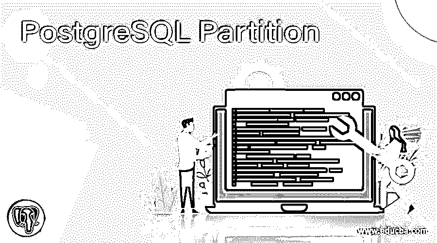
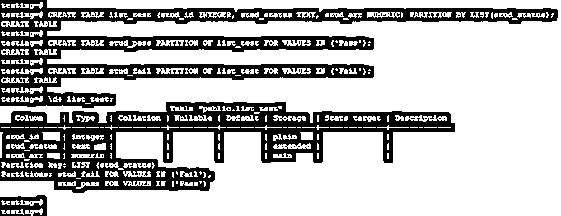
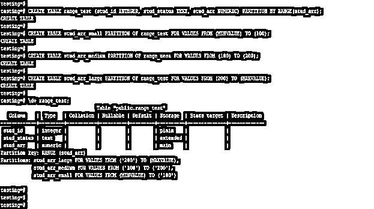
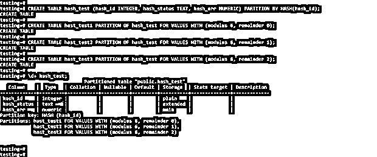

# PostgreSQL 分区

> 原文：<https://www.educba.com/postgresql-partition/>

## PostgreSQL 分区的定义

PostgreSQL 分区用于大型表，我们也在大型表行上使用分区。它用于提高查询的性能，我们可以通过在表上创建分区来提高查询的性能。基本上，它分为列表分区、范围分区、散列分区和多级分区，每种分区都有多种形式。我们可以提高大型表上选择操作的性能，分区聚合和连接可以提高查询的性能。

**语法:**

<small>Hadoop、数据科学、统计学&其他</small>

下面是语法

*   **列表分区**

`Create table name_of_table (name_of_column1 data_type, name_of_column2 data_type, name_of_column3 data_type, …, name_of_columnN data_type) Partition BY List (name_of_column);
Create table name_of_table PARTITION of partition_table_name for values in (‘partition value’);`

*   **范围划分**

`Create table name_of_table (name_of_column1 data_type, name_of_column2 data_type, name_of_column3 data_type, …, name_of_columnN data_type) Partition BY Range (name_of_column);
Create table name_of_table PARTITION of partition_table_name for values from value1 to value2;`

*   **哈希分区**

`Create table name_of_table (name_of_column1 data_type, name_of_column2 data_type, name_of_column3 data_type, …, name_of_columnN data_type) Partition BY Hash (name_of_column);
Create table name_of_table PARTITION of partition_table_name for values with(Modulus, remainder);`

**参数:**

*   **创建表—**这被定义为使用列表、范围和散列分区创建分区表。我们在创建表的同时创建表分区。
*   **表名—**定义为使用分区创建表。我们可以在创建表的时候为表定义一个分区。
*   **列 1 的名称到列 N 的名称–**这被定义为在一个表上创建一个列，并在该表上定义分区。
*   **数据类型—**这被定义为在创建表格时分配给表格列的数据类型。我们可以按照我们在表上配置的分区来定义数据类型。
*   **Partition by hash—**这被定义为在表上创建一个散列分区。我们可以在创建分区时使用模数和余数。
*   **按列表分区—**这被定义为在表上创建一个列表分区。我们可以在创建分区时使用表的列名。
*   **按范围分区—**这被定义为在表上创建范围分区。我们可以在创建分区时使用表的列名。
*   **模数和余数–**这是创建哈希分区时使用的哈希分区参数。

### 如何在 PostgreSQL 中进行分区？

我们可以执行如下划分。基本分为以下三种。

*   列表分区。
*   范围划分。
*   哈希分区。

PostgreSQL 10 支持范围和列表类型分区，并且从 PostgreSQL 版本 11 开始提供散列分区。我们可以如下详细讨论分区。

*   #### List partition

PostgreSQL 中的列表分区是基于预定义的值创建的，用于保存已分区表的值。List partition 保存不属于 PostgreSQL 中任何其他分区的值。

*   #### Scope division

范围分区保存 PostgreSQL 分区中提供的范围内的值。我们需要在创建范围分区时指定最小和最大范围的值。范围分区中的最小值包含在内，范围分区中的最大值不包含在内。

*   #### Hash partition

我们可以利用 PostgreSQL 中每个分区的模和余数来创建散列分区。在 hash 中，将通过使用余数和模数生成哈希值来插入分区行。

*   在 PostgreSQL 中使用分区可以提高查询速度，在 PostgreSQL 中可以提高选择查询的速度。
*   与普通表相比，使用分区大容量装载数据和从表中删除数据更快。操作是在每个分区中执行的，因此它比普通的表要快。
*   PostgreSQL 中的每个分区将包含基于我们在创建分区时定义的频率的数据。
*   PostgreSQL 中的声明性分区非常灵活，可以很好地控制用户访问 PostgreSQL 中的数据。
*   我们可以在一个表列上创建一个分区，根据列数据我们已经决定了分区的类型。
*   基本上，我们在 PostgreSQL 中使用列表和范围分区。

### 例子

下面是 PostgreSQL 中的分区示例。

#### 示例 1:在表上创建列表分区

以下示例显示了在表上创建列表分区。我们已经在 stud_status 列上创建了列表分区。

`CREATE TABLE list_test (stud_id INTEGER, stud_status TEXT, stud_arr NUMERIC) PARTITION BY LIST(stud_status);
CREATE TABLE stud_pass PARTITION OF list_test FOR VALUES IN ('Pass');
CREATE TABLE stud_fail PARTITION OF list_test FOR VALUES IN ('Fail');
\d+ list_test;`

#### 示例 2:在表上创建范围分区

下面的例子显示了在表上创建范围分区。我们已经在 stud_arr 列上创建了一个范围分区。

`CREATE TABLE range_test (stud_id INTEGER, stud_status TEXT, stud_arr NUMERIC) PARTITION BY RANGE(stud_arr);
CREATE TABLE stud_arr_small PARTITION OF range_test FOR VALUES FROM (MINVALUE) TO (100);
CREATE TABLE stud_arr_medium PARTITION OF range_test FOR VALUES FROM (100) TO (200);
CREATE TABLE stud_arr_large PARTITION OF range_test FOR VALUES FROM (200) TO (MAXVALUE);
\d+ range_test;`

#### 示例 3:在表上创建散列分区

下面的例子说明了在表上创建一个散列分区。我们已经在 hash_id 列上创建了一个散列分区。

`CREATE TABLE hash_test (hash_id INTEGER, hash_status TEXT, hash_arr NUMERIC) PARTITION BY HASH(hash_id);
CREATE TABLE hast_test1 PARTITION OF hash_test FOR VALUES WITH (modulus 6, remainder 0);
CREATE TABLE hast_test2 PARTITION OF hash_test FOR VALUES WITH (modulus 6, remainder 1);
CREATE TABLE hast_test3 PARTITION OF hash_test FOR VALUES WITH (modulus 6, remainder 2);
\d+ hash_test;`

### 推荐文章

这是一个 PostgreSQL 分区指南。这里我们讨论一下定义，如何在 PostgreSQL 中进行分区？以及代码实现的例子。您也可以看看以下文章，了解更多信息–

1.  [PostgreSQL 锁表](https://www.educba.com/postgresql-lock-table/)
2.  [PostgreSQL 聚集索引](https://www.educba.com/postgresql-clustered-index/)
3.  [PostgreSQL 浮点型](https://www.educba.com/postgresql-float/)
4.  [PostgreSQL 最大值](https://www.educba.com/postgresql-max/)