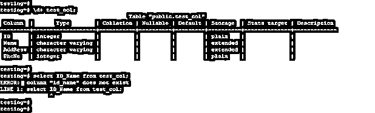
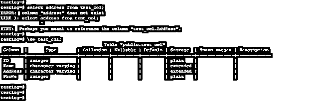
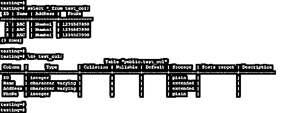
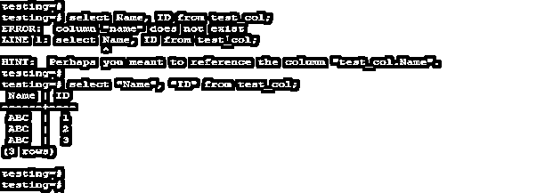
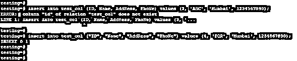
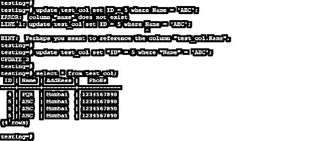
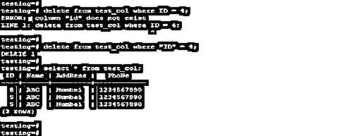
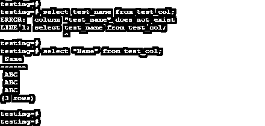
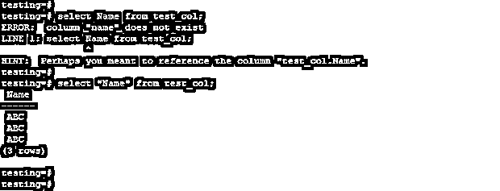

# PostgreSQL 列不存在

> 原文：<https://www.educba.com/postgresql-column-does-not-exist/>

## PostgreSQL 列的定义不存在异常

PostgreSQL 列不存在当我们使用表中不存在的列时会出现异常，或者当所使用的列名为小写，而我们在查询中使用大写时会出现异常。我们可以用很多方法来避免这个异常，比如用双引号引起我们必须得到异常的列的列名。我们还可以检查表中是否存在列名。如果表中不存在列名，那么我们需要在表中创建相同的列名。

**语法:**

<small>Hadoop、数据科学、统计学&其他</small>

下面是除 PostgreSQL 之外不存在的列名的语法。

*   **列名不存在异常使用 select**

`Select name_of_column from name_of_table limit (number);`

1.  **错误:**列名 _of_column 不存在
2.  **Line1:** 从 name_of_table limit (number)中选择 name _ of _ column

*   **列名不存在异常使用插入**

`Insert into name_of_table (name_of_column1, name_of_column2, name_of_column3, …, name_of_columnN) values (Value_of_column1, Value_of_column2, Value_of_column3, …, Value_of_columnN);`

1.  **错误:**列“列名”不存在
2.  **行 1:** 插入到表名(列名 1，列名 2，列名 3，…，列名)值(列名 1，列名 2，列名 3，…，列名)

*   **列名不存在异常使用更新**

`update name_of_table set name_of_column = (value_of_column) where condition;`

1.  **错误:**列“列名”不存在
2.  **行 1:**update name _ of _ table set name _ of _ column = value _ of _ column 其中 name _ of _ column = ' value _ of _ column '；

*   **列名不存在异常使用删除**

`Delete from name_of_table where name_of_column = value_of_column;`

1.  **错误:**列“列名”不存在
2.  **第 1 行:** delete from name_of_table 其中 name _ of _ column = value _ of _ column；

下面是 PostgreSQL 中列名不存在异常的参数描述语法。

*   **Select-**当我们必须对指定列执行 Select 操作时，将显示列名不存在异常。
*   **Insert–**列名不存在当我们必须对指定的列执行插入操作时，将显示异常。
*   **更新–**当我们必须对指定列执行更新操作时，将显示列名不存在异常。
*   **删除-**列名不存在当我们必须对指定的列执行删除操作时，将显示异常。
*   **列名–**这被定义为列名，我们从该列名收到异常，即列名不存在。
*   **表名–**这被定义为表名，我们从该表中收到了列名不存在的异常。

### PostgreSQL 中如何引发列不存在异常？

*   当表中不存在列时，会出现“列不存在”异常。如果搜索列在表中不存在，那么它将引发该列在表中不存在的异常。
*   下面的例子表明，如果一个搜索列在表中不存在，它将给出列名不存在的异常。

`\d+ test_col;
select ID_Name from test_col;`

*   在上面的示例中，我们使用了 ID_Name 列来搜索 test_col 表中的数据，但是它会发出一个错误消息，指出该列名在表中不存在，因为 ID_Name 列在表中不存在。
*   为了选择、更新、删除和插入数据到表中，我们需要定义正确的列名，这是我们已经搜索的数据。
*   此外，如果我们的列名包含混合字母，我们需要在双引号中定义列名。
*   下面的例子表明，当我们在操作中使用混合字母列时，我们需要定义双引号。

`select address from test_col;
\d+ test_col;`

*   在上面的例子中，我们使用了包含混合字母的地址列，在使用该列后，它将发出一个错误，因为它将包含混合列字母。

### 例子

*   下面是一个列不存在异常的例子。我们已经用一个 test_col 表来描述一个列名不存在异常的例子。
*   下面是 test_col 表的数据和表结构。

`select * from test_col;
\d+ test_col;`

**1。使用 select** 出现列名不存在异常

*   以下示例显示了使用 select 操作时列名不会出现异常。

`select Name, ID from test_col;
select "Name", "ID" from test_col;`

**2。使用 insert** 时列名不存在异常

*   下面的示例显示了使用插入操作时列名不会出现异常。

`insert into test_col (ID, Name, AddRess, PhoNe) values (3, 'ABC', 'Mumbai', 1234567890);
insert into test_col ("ID", "Name", "AddRess", "PhoNe") values (4, 'PQR', 'Mumbai', 1234567890);`

**3。使用更新**时列名不存在异常

*   以下示例显示了使用更新操作时列名不会出现异常。

`update test_col set ID = 5 where Name = 'ABC';
update test_col set “ID” = 5 where “Name” = 'ABC';
select * from test_col;`

**4。列名不存在异常使用删除**

*   下面的示例显示了使用删除操作时列名不会出现异常。

`delete from test_col where ID = 4;
delete from test_col where “ID” = 4;
select * from test_col;`

### 如何避免列不存在异常？

*   我们可以通过指定列的名称来避免列不存在的异常。下面是避免列不存在异常的例子。

`select test_name from test_col;
select “Name” from test_col;`

*   我们还可以通过对列使用双引号来避免这个异常。下面的例子说明了使用双引号来避免异常。

`select Name from test_col;
select “Name” from test_col;`

### 结论

当我们在执行任何操作时没有使用指定的列名时，PostgreSQL 中会出现列不存在异常。此外，当我们没有在 PostgreSQL 中对不匹配的大写字母列名使用双引号时，也会出现这种情况。

### 推荐文章

这是一个不存在的 PostgreSQL 列指南。这里我们分别讨论 PostgreSQL 中列不存在异常的定义、语法和产生的原因，并举例说明。您也可以看看以下文章，了解更多信息–

1.  [PostgreSQL 枚举](https://www.educba.com/postgresql-enum/)
2.  [Postgresql 计数](https://www.educba.com/postgresql-count/)
3.  [PostgreSQL 分区](https://www.educba.com/postgresql-partition/)
4.  [PostgreSQL 描述表](https://www.educba.com/postgresql-describe-table/)