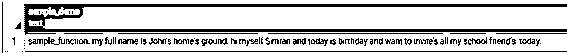
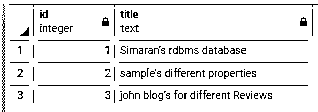

# PostgreSQL 转义单引号

> 原文：<https://www.educba.com/postgresql-escape-single-quote/>

## PostgreSQL 转义单引号的定义

通常，在 PostgreSQL 中，单引号和双引号通常用于任何文本数据。忽略或避开单引号是所有数据库开发人员的共同要求。通过使用双引号和反斜杠，我们可以避免单引号的复杂性，并且易于阅读和维护。基本上在 PostgreSQL 中，单引号是用来定义字符串常量的，当一个字符串有单引号时，你需要用双引号来代替它，对单引号进行转义的主要问题取决于 PostgreSQL 的版本，这意味着你可以使用不同的符号对数据库中的单引号进行转义。

**语法:**

<small>Hadoop、数据科学、统计学&其他</small>

`select ‘Text’ ‘Text’;`

**说明:**

在上面的语法中，我们使用 select 语句用双引号转义单引号，如上面的语句所示。

另一种避免单引号的方法如下。

`select E ’Text\’Text’;`

**说明:**

在上面的语法中，我们使用了 select 语句，但是这种语法适用于旧版本的 PostgreSQL 字符串常量，使用 E 和反斜杠\来转义单引号。但是反斜杠的主要问题是，当我们用双引号和多个反斜杠替换单引号时，很难阅读和维护，所以 PostgreSQL 版引入了美元引号，以避免开发人员的复杂性。

### 如何在 PostgreSQL 中转义单引号？

让我们看看如何在 PostgreSQL 中转义单引号，如下所示。

基本上，单引号用于将令牌定义为字符串；这是 PostgreSQL 中用于不同目的的上下文。当我们在单引号中写入任何文本时，它都被视为引用对象，标识符用双引号文本表示。例如，假设我们的语句如下

`select ‘Welcome in PostgreSQL’;`

其中我们使用了单引号，那么我们如何转义单引号，如下所示

选择“在 PostgreSQL 中也欢迎我”；

在此语句中，我们通过替换双引号来转义单引号，如上面的语句所示。

### 例子

让我们试着通过下面不同的例子来理解我们如何避免单引号。

PostgreSQL 已经提供了$ dollar 特性而没有转义单引号，所以我们可以如下定义函数或创建函数。

`CREATE OR REPLACE FUNCTION sample_function(insert_text_asname text)
RETURNS text AS
$$
SELECT 'sample_function. my full name is ' || insert_text_asname || '.';
$$
language SQL strict;`

**说明:**

在上面的示例中，我们创建了一个函数名作为 sample_function，它具有不同的参数，如上面语句中所示的您的名称，它通过使用具有相同参数的 select 语句返回。通过使用下面的快照来说明上述公告的最终结果。

我们写的同一个函数，或者我们可以说它等价于一个转义引用。

`CREATE OR REPLACE FUNCTION sample_function(insert_text_asname text)
RETURNS text AS
'
SELECT ''sample_function. my full name is '' || insert_text_asname || ''.'';
'
language sql strict;`

**说明:**

在上面的例子中，我们用双引号创建了具有相同参数的相同函数。但是当我们比较这两种说法时，我们意识到$$ dollar 更容易阅读和理解。

`CREATE OR REPLACE FUNCTION sample_demo(insert_pgsql text)
RETURNS text AS
$$
DECLARE var_result text;
BEGIN
EXECUTE insert_pgsql INTO var_result;
RETURN var_result;
END;
$$
language 'plpgsql' STRICT;`

**说明:**

在上面的例子中，我们用不同的参数创建了一个示例名 sample_demo，如上面的语句所示，它返回结果文本。通过使用下面的快照来说明上述公告的最终结果。

当我们使用上面创建的函数时，让我们看看如何从字符串中转义单引号，如下所示。

#### 示例#1

`SELECT sample_demo($sql$SELECT sample_function($phrase$John's home's ground$phrase$)
|| $phrase$ hi myself Simran and today is birthday and want to invite’s all my school friend’s  today.$phrase$ $sql$);`

**说明:**

在上面的例子中，我们使用了函数 sample_demo 和 sample_function 常量字符串，这里我们使用了美元符号来转义单引号。通过使用下面的快照来说明上述公告的最终结果。

让我们与单引号进行比较

`SELECT sample_demo(‘SELECT sample_function(“John””s home””s ground$phrase$)
|| “hi myself Simran and today is birthday and want to invite”s all my school friend”s.”’);`

**解释**

在上面的语句中，我们使用双引号来转义单引号，但是很难读取和维护字符串，这也增加了编码的复杂性，但是当我们指定美元$时，比较双引号会更好，如上面的示例所示。

让我们看另一个使用双引号来转义单引号的例子，如下所示。

#### 实施例 2

首先，使用 create table 语句创建一个表，如下所示。

`CREATE TABLE sample_quote
(
ID int
, Title TEXT
);`

**说明:**

在上面的例子中，我们创建了一个表名 sample_quote，它有两个属性，如上面的语句所示。通过使用下面的快照来说明上述公告的最终结果。

现在，我们使用 insert into 语句插入一些记录，如下所示。

`INSERT INTO sample_quote
VALUES
(1,E'Simaran\'s rdbms database')
,(2,E'sample\'s different properties')
,(3,'john blog''s for different Reviews');`

**说明:**

借助上面的语句，我们插入一些记录，如上面的语句所示。看这里，我们在上面的语句中同时使用了双引号和 E\反斜杠。通过使用下面的快照来说明上述公告的最终结果。

使用以下语句查看 sample_quote 中所有带有(r)的数据。

`select * from sample_quote where Title like E'%\'s%';`

**解释**

借助上面的语句，我们可以看到那些在字符串中有一个字符的标题。通过使用下面的快照来说明上述公告的最终结果。

### 结论

我们希望通过这篇文章，您已经了解了 PostgreSQL 转义单引号。从上面的文章中，我们已经了解了 PostgreSQL 转义单引号的基本语法。此外，我们还发现了如何在 PostgreSQL 中使用每种技术的不同示例来实施它们。从本文中，我们了解了如何在 PostgreSQL 中处理转义单引号。

### 推荐文章

这是一个 PostgreSQL 转义单引号的指南。这里我们讨论 PostgreSQL 中单引号的定义，语法，如何转义？，以及代码实现示例。您也可以看看以下文章，了解更多信息–

1.  [PostgreSQL 日期时间](https://www.educba.com/postgresql-datetime/)
2.  [PostgreSQL 或](https://www.educba.com/postgresql-or/)
3.  [PostgreSQL 枚举](https://www.educba.com/postgresql-enum/)
4.  [PostgreSQL 缓存](https://www.educba.com/postgresql-caching/)