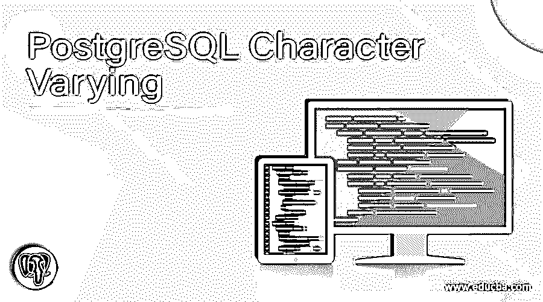
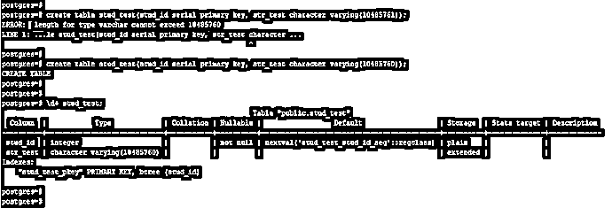
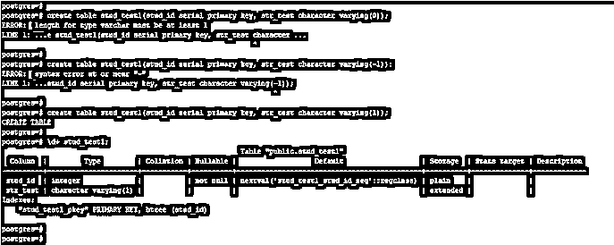
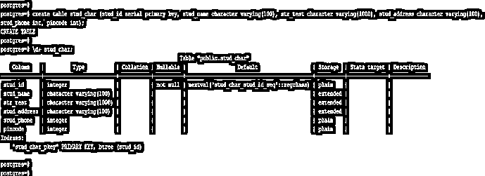
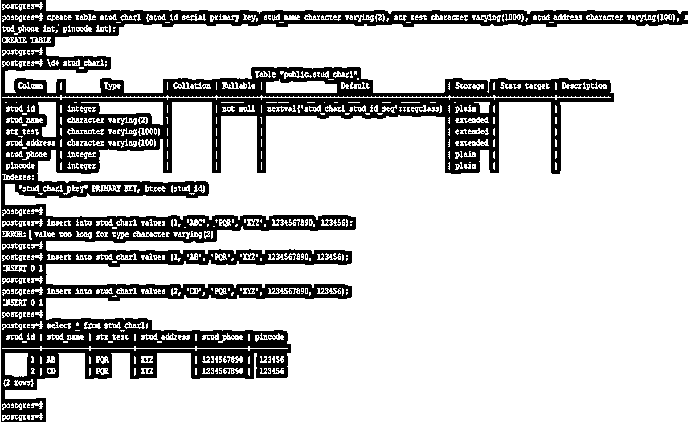
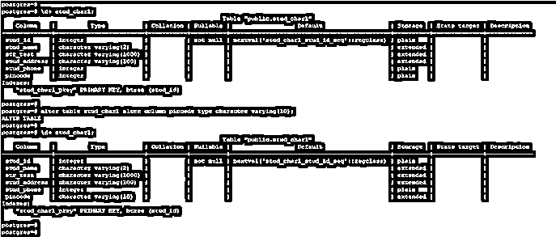

# PostgreSQL 字符变化

> 原文：<https://www.educba.com/postgresql-character-varying/>

## PostgreSQL 字符变化的定义

PostgreSQL 字符可变在没有长度说明符的情况下使用，字符可变类型将接受 PostgreSQL 中任何大小的字符串。在 PostgreSQL 中，varying 基本上是 varchar 的别名，所以在 character varying 和 varchar 之间只有一个区别，即 character varying 比 PostgreSQL 中的 varchar 更友好。在 PostgreSQL 中，char (n)的符号是字符(n)的别名，varchar (n)是字符 varying (n)的别名。如果我们使用了不带长度说明符的字符变量，它将接受任何长度的字符串。

**语法:**

<small>Hadoop、数据科学、统计学&其他</small>

下面是 PostgreSQL 中字符变化的语法。

*   `Character varying (n)`

**或**

*   `Create table table_name (column_name character varying (n));`

运筹学

*   `Alter table table_name (Name of table name which column we have altering) alter column column_name (Name of column which we have altering) type character varying (n);`

**下面是 PostgreSQL 中字符变化的参数描述语法。**

*   **字符变化–**这指定我们使用列数据类型作为字符变化。字符变化的工作原理与 PostgreSQL 中的 varchar 数据类型相同。我们可以传递一些列字段中允许的字符。
*   **表名–**我们可以在创建表时为列名定义字符可变数据类型。当我们为列定义字符变化的数据类型时，表名很重要。
*   **列名–**这被定义为列的名称，在该列上我们已经将数据类型定义为字符变化。我们可以在创建表时定义数据类型，也可以在创建表后使用 alter 命令定义数据类型。
*   **Alter–**该命令用于改变列，以改变字符变化时的数据类型。

### PostgreSQL 中的字符变化是如何工作的？

*   下面是 PostgreSQL 中字符可变数据类型的工作方式。
*   在 PostgreSQL 中，有两种主要的字符数据类型，即字符和可变字符，我们可以用正整数 n 来定义数据类型的值。
*   PostgreSQL 中使用字符可变数据类型的字符大小的最大限制是 10485760。
*   以下示例显示了 PostgreSQL 中使用字符可变数据类型的字符大小为 10485760。

`create table stud_test(stud_id serial primary key, str_test character varying(10485761));
create table stud_test(stud_id serial primary key, str_test character varying(10485760));
\d+ stud_test;`

*   在上面的第一个示例中，我们必须将字符变化数据类型的大小定义为 10485761，但是在 PostgreSQL 中不允许使用该值，因为字符变化数据类型的最大大小是 10485760。
*   它会将错误显示为“错误:varchar 类型的长度不能超过 10485760”。
*   在第二个例子中，我们将字符变化数据类型的大小定义为 10485760。这是允许的，所以使用这个尺寸表被创建。
*   PostgreSQL 中使用字符可变数据类型的字符大小的最小限制是 1。在 PostgreSQL 中使用字符可变数据类型时，不允许零或负值。
*   下面的示例显示了不允许的字符变化数据类型的最小大小、零和负值。

`create table stud_test1(stud_id serial primary key, str_test character varying(0));
create table stud_test1(stud_id serial primary key, str_test character varying(-1));
create table stud_test1(stud_id serial primary key, str_test character varying(1));
\d+ stud_test1;`

*   在上面的第一个例子中，我们使用的字符变化数据类型的大小是零，但零值是不允许的，所以它会显示一条错误消息“错误:varchar 类型的长度必须至少为 1”。
*   在上面的第二个例子中，我们使用的字符变化数据类型的大小是-1，但负值是不允许的，所以它会显示一个错误消息为“错误:语法错误在或接近“-”。
*   在第三个示例中，我们使用大小作为一，使用一个大小表创建，因为在 PostgreSQL 中，字符变化数据类型的最小大小是一。
*   Character varying 和 varchar 是相同的，但是大多数数据库不提供 character varying 数据类型，但是 PostgreSQL 提供了相同的数据类型。
*   字符可变是 SQL ANSI 标准的正式类型。它将支持所有 SQL 兼容性。
*   字符可变是 PostgreSQL 中最有用也是最重要的数据类型，不需要长度说明符。

### 例子

下面是 PostgreSQL 中字符变化数据类型的示例。

#### 示例# 1–在创建表格时定义字符变化数据类型

下面的例子表明我们在创建表的时候已经定义了数据类型。在下面的例子中，我们必须定义 stud_name、str_test 和 stud_address 列的字符变化数据类型。

`create table stud_char (stud_id serial primary key, stud_name character varying(100), str_test character varying(1000), stud_address character varying(100), stud_phone int, pincode int);
\d+ stud_char;`

#### 示例 2–将值插入字符变化数据类型列

下面的示例显示了包含字符变化数据类型的列上的插入值。

*   我们使用表名 stud_char1 将数据插入到字符可变数据类型列中。

`create table stud_char1 (stud_id serial primary key, stud_name character varying(2), str_test character varying(1000), stud_address character varying(100), stud_phone int, pincode int);
\d+ stud_char1;
insert into stud_char1 values (1, 'ABC', 'PQR', 'XYZ', 1234567890, 123456);
insert into stud_char1 values (1, 'AB', 'PQR', 'XYZ', 1234567890, 123456);
insert into stud_char1 values (2, 'CD', 'PQR', 'XYZ', 1234567890, 123456);
select * from stud_char1;`

#### 示例 3–在创建表后，将列的数据类型更改为字符变化

以下示例显示了创建表后更改列的数据类型。我们必须更改密码列的数据类型。

`\d+ stud_char1;
alter table stud_char1 alter column pincode type character varying(10);
\d+ stud_char1;`

### 推荐文章

这是一个 PostgreSQL 字符变化的指南。这里我们讨论一下介绍，PostgreSQL 中的字符变化是如何工作的？分别举例说明。您也可以看看以下文章，了解更多信息–

1.  [PostgreSQL 日期时间](https://www.educba.com/postgresql-datetime/)
2.  [PostgreSQL 或](https://www.educba.com/postgresql-or/)
3.  [PostgreSQL 枚举](https://www.educba.com/postgresql-enum/)
4.  [PostgreSQL 日志查询](https://www.educba.com/postgresql-log-queries/)