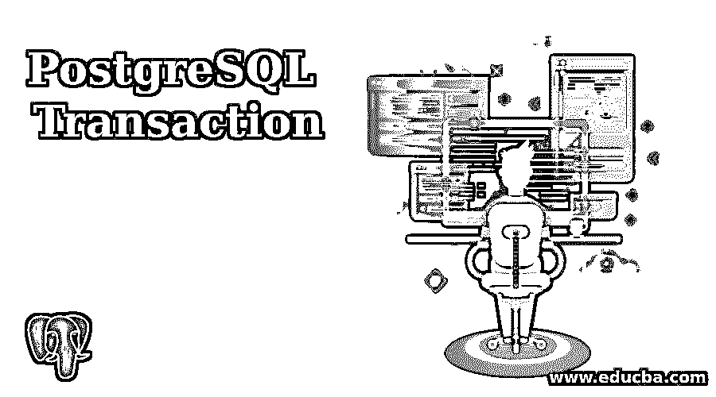
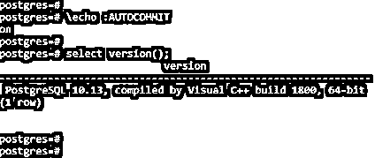
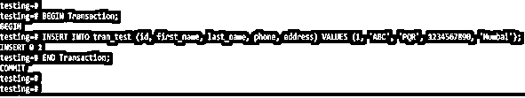
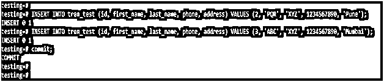
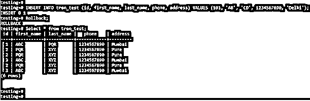

# PostgreSQL 事务

> 原文：<https://www.educba.com/postgresql-transaction/>

## PostgreSQL 事务简介

使用 commit、begin 和 rollback 语句的 PostgreSQL 事务句柄；PostgreSQL 数据库事务是由一条或多条语句组成的工作单元。一个完整交易的例子是从一个银行账户转账到另一个银行账户或从 ATM 机取款；在任何数据库中，一个完整的交易都包括从一个帐户借记资金，并成功地将其贷记到另一个帐户。PostgreSQL 事务是 ACID(原子性、一致性、隔离性和持久性)兼容的，PostgreSQL 中的事务是完全 ACID 兼容的。任何数据库中的事务都由一个或多个按顺序执行的语句组成。

### PostgreSQL 中的事务是如何工作的？

下面是 PostgreSQL 中事务语句的工作方式。

<small>Hadoop、数据科学、统计学&其他</small>

**1。**PostgreSQL 中的每条语句都有不同的用途或工作。下面是事务的属性。

*   原子数
*   一致性
*   隔离
*   持久性

**2。**原子性是由我们已经在数据库上执行的完全完成或未完成的操作组成的。如果事务中途失败，则事务回滚到最后一个保存点。

**3。**PostgreSQL 中的一致性属性定义为数据库在最后一个事务保存点之前正确地更改了其事务状态。在处理事务时，事务的一致性更重要。

**4。**隔离在 PostgreSQL 中定义为使事务操作能够独立完成和操作。此外，服务器上正在运行的事务对彼此是透明的。

**5。**在 PostgreSQL 中，持久性被定义为我们需要确保我们在数据库上执行的操作的结果包含失败。持久性是 PostgreSQL 中事务最重要的属性。

**6。**PostgreSQL 中的事务定义为我们在数据库上执行的一个或多个更改的传播。

7 .**。** PostgreSQL 数据库事务也被定义为在表上插入记录，从表中删除行，或者更新行。

**8。**一个事务可以是单个更新、插入或删除，也可以是多个更新、删除或插入语句。

**9。**虽然我们必须在数据库上执行交易，但控制交易以确保交易成功与否是至关重要的。此外，我们需要处理在事务运行时发生的数据库错误。

10。我们可以将单个集合中的查询数量进行 club，创建一个集合后，在单个事务中逐个执行。

**11。**事务在每个数据库中都非常重要和有用；这也是 PostgreSQL 数据库的基本概念。

**12。** Begin、commit、rollback 和 savepoint 是我们在 PostgreSQL 中使用过的事务控制命令。

13。 Begin 命令在 PostgreSQL 中被定义为事务的开始。我们可以在 PostgreSQL 中使用 begin 关键字启动事务。我们还可以使用 begin transaction 语句启动事务。

**14。** Commit 命令用于保存我们在数据库上执行的事务。我们必须使用 commit 关键字在 PostgreSQL 中保存事务。

15。我们还可以使用 end transaction 来提交在数据库服务器上执行的事务。

16。回滚命令用于将事务回滚到特定的点。回滚是 PostgreSQL 中事务控制的一个基本而有用的命令。

**17。**保存点定义为我们在数据库上执行的事务的部分回滚。

18。PostgreSQL 中的事务控制语句将仅用于 DML(数据操作语言)命令。DML 命令用于插入、更新和删除。事务控制命令不用于创建和删除数据库或表。

**19。**创建和删除操作被自动提交给数据库，因此不需要每次都提交事务。

20。成功提交交易后，我们无法回滚交易。要回滚事务，我们需要在数据库上关闭自动提交。

**21。**在 PostgreSQL 中，autocommit 命令的默认设置是 ON。以下示例显示了自动提交命令的默认设置如下。

**查询:**

`\echo :AUTOCOMMIT`

**输出:**

### PostgreSQL 事务语句

下面是 PostgreSQL 中使用的事务语句。

*   开始
*   犯罪
*   反转

#### 1.开始

*   Begin 语句是用于启动新事务的事务语句。为了开始一个新的事务，我们在 PostgreSQL 中使用了 begin 语句。
*   下面是 PostgreSQL 中 begin 语句的语法。

**语法:**

**1。**开始或

**2。**开始交易或

**3。开始工作**

*   使用 begin transaction 或 begins work 时，上述语法是相同的。
*   下面是 PostgreSQL 中 begin 语句的示例。我们在开始语句后插入了一个语句。
*   在开始语句之前，Insert 语句已成功执行。

**例子**

**查询:**

`BEGIN Transaction;
INSERT INTO tran_test (id, first_name, last_name, phone, address) VALUES (1, 'ABC', 'PQR', 1234567890, 'Mumbai');
END Transaction;`

**输出:**

#### 2.犯罪

*   PostgreSQL 中的 Commit 命令对于将事务保存到数据库服务器非常重要。
*   下面是 PostgreSQL 中 commit 语句的语法。

**语法:**

**1** 。提交或

**2** 。提交事务或

**3** 。提交工作

*   上述语法在使用提交事务或提交工作时是相同的。
*   下面是 PostgreSQL 中提交语句的一个示例。我们必须向数据库中插入两条语句；插入后，我们在数据库上提交了相同的内容。

**例子**

**查询:**

`INSERT INTO tran_test (id, first_name, last_name, phone, address) VALUES (2, 'PQR', 'XYZ', 1234567890, 'Pune');
INSERT INTO tran_test (id, first_name, last_name, phone, address) VALUES (3, 'ABC', 'XYZ', 1234567890, 'Mumbai');
commit;`

**输出:**

#### 3.反转

*   回滚用于从特定点回滚事务。下面是 PostgreSQL 中 rollback 语句的语法。

**语法:**

**1** 。回滚或

**2** 。回滚事务或

**3** 。回滚工作

**例子**

在上面的例子中，我们已经将下面的语句插入到表中，并且相同的语句在插入后被回滚。

**查询:**

`INSERT INTO tran_test (id, first_name, last_name, phone, address) VALUES (101, 'AB', 'CD', 1234567890, 'Delhi');
Rollback;
Select * from tran_test;`

**输出:**

### 推荐文章

这是一个 PostgreSQL 事务指南。这里我们讨论 PostgreSQL 事务的介绍和实际例子以及不同的子查询表达式。您也可以浏览我们推荐的文章，了解更多信息——

1.  [如何在 PostgreSQL 中通知 Works？](https://www.educba.com/postgresql-notify/)
2.  [PostgreSQL 时间戳简介](https://www.educba.com/postgresql-timestamp/)
3.  [PostgreSQL NOW() |如何工作？](https://www.educba.com/postgresql-now/)
4.  [PostgreSQL 随机|示例](https://www.educba.com/postgresql-random/)