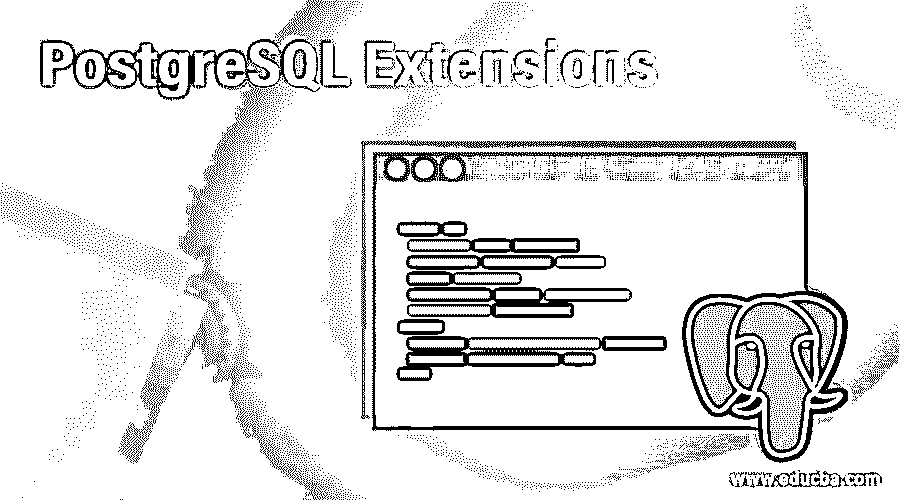
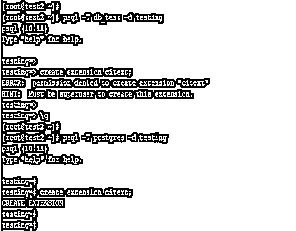
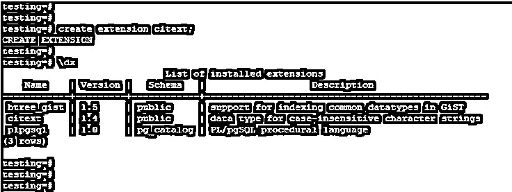
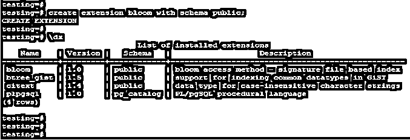
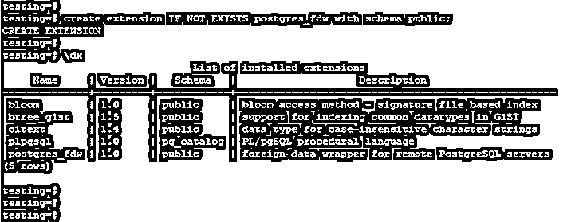
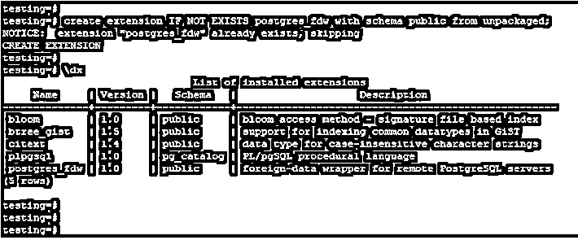
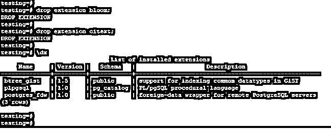

# PostgreSQL 扩展

> 原文：<https://www.educba.com/postgresql-extensions/>

## PostgreSQL 扩展简介

PostgreSQL 扩展被定义为模数，用于提供额外的运算符和函数；PostgreSQL 中有多个可用的扩展。创建一个扩展命令，它会将新的扩展加载到我们已经连接的当前模式中。我们还可以通过指定模式的名称从不同的模式中加载指定的扩展。我们需要在已经创建了扩展的对象上创建特权；要创建扩展，我们需要所有者或超级用户权限。

### 语法和参数

下面是扩展的语法。

<small>Hadoop、数据科学、统计学&其他</small>

**1。创建或加载扩展**

`Create extension name_of_extension with schema name_of_schema version version_of_extension from old_version_of_extension;`

**2。如果不存在，使用参数**创建或加载扩展

`Create extension [if not exist] name_of_extension with schema name_of_schema version version_of_extension from old_version_of_extension;`

**3。掉线分机**

`Drop extension name_of_extension;`

**参数:**

下面是扩展的参数描述语法。

*   **创建扩展:**这被定义为创建一个用于加载新扩展的扩展命令。我们可以在单个模式中加载多个扩展，以便在数据库中使用。
*   **扩展名:**加载扩展时，我们需要在 PostgreSQL 中定义扩展名。
*   **With schema:** 这被定义为加载具有指定模式的扩展；如果我们没有定义任何模式，那么扩展将加载当前连接的模式。
*   **模式名:**这被定义为我们在 PostgreSQL 中加载扩展时使用的模式名。如果我们没有定义任何模式名，那么扩展将加载当前连接的模式。
*   **版本:**这被定义为我们在加载时用于扩展的版本。
*   **删除扩展:**我们可以使用删除扩展命令删除一个已加载的扩展。
*   **旧版本的扩展:**这被定义为通过使用 PostgreSQL 中的扩展版本在 PostgreSQL 中创建扩展。
*   **If not exist:** 使用 If not exist 关键字时，如果数据库中存在相同的扩展名，则不会显示错误。同时下发通知。

### PostgreSQL 中的扩展是如何工作的？

*   下面是 PostgreSQL 中扩展的工作方式。
*   如果我们同时需要 PostgreSQL 中的额外函数和操作符，我们必须在 PostgreSQL 中加载一个指定的扩展。
*   下面的例子表明，我们需要所有者或超级用户权限来加载 PostgreSQL 中的扩展。

`psql -U db_test -d testing
create extension citext;
psql -U postgres -d testing
create extension citext;`

*   在上面的第一个例子中，我们必须尝试使用 db_test 用户创建一个扩展，但是它会发出错误 permission denied creation extension，因为 db_test 用户没有超级用户特权。
*   在第二个例子中，我们使用 Postgres user 创建了一个扩展；使用 Postgres 用户，我们创建了一个作为上下文的扩展。默认情况下，Postgres 用户拥有超级用户权限。
*   在下面的 PostgreSQL 中，扩展是可用的。
*   Tsearch2
*   Timetravel
*   Tcn
*   表格功能
*   Sslinfo
*   凹陷
*   改善
*   邮政债券 _fdw
*   Postgis _ 拓扑
*   Postgis _ tiger _ 地理编码器
*   后缀
*   Plv8
*   Plpgsql
*   Plperl
*   PLL
*   Plcofee
*   密码
*   Pgrouting
*   Pgrowlocks
*   Pgstattuple
*   页面检查
*   Pg _ 缓冲区缓存
*   Pg_freespacemap
*   Pg _ 预警
*   Pg _ stat _ 语句
*   Pg_trgm
*   Pg _ 可见性
*   地址标准化器
*   地址 _ 标准化者 _ 数据 _ 用户
*   自动同步
*   花
*   Btree_gin
*   Btree_gist
*   Chkpass
*   Citext
*   立方
*   Dblink
*   字典 _int
*   Dict_xsyn
*   地球距离
*   文件 _fdw
*   Moddatetime
*   Ltree
*   我会的
*   不是
*   Intarray(内部阵列)
*   插入用户名
*   Hstore_plperly
*   Hstore_plperl
*   哈萨克斯坦共和国
*   模糊 strmatch

### PostgreSQL 扩展的示例

下面是 PostgreSQL 中的一个扩展示例。

#### 1.将扩展加载到当前连接的数据库

以下示例显示了将扩展加载到当前连接的数据库中。我们有一个加载 citext 扩展。

`create extension citext;
\dx`

#### 2.通过指定模式名来加载扩展

以下示例显示了通过指定 schema name 参数来加载扩展。我们有一个装货区。

`create extension bloom with schema public;
\dx`

#### 3.通过指定 if Not Exist 参数来加载扩展

以下示例显示了通过指定 if not exist 参数来加载扩展。我们有一个加载 postgres_fdw 扩展。

`create extension IF NOT EXISTS postgres_fdw with schema public;
\dx`

#### 4.通过指定 from 参数加载扩展

以下示例显示了通过从参数中指定来加载扩展。我们有一个加载 postgres_fdw 扩展。

`create extension IF NOT EXISTS postgres_fdw with schema public from unpackaged;
\dx`

#### 5.丢弃扩展

*   以下示例显示了 PostgreSQL 中 drop 扩展。我们必须使用 drop extension 命令删除扩展。
*   在下面的例子中，我们必须删除 bloom 和 citext 扩展。

`drop extension bloom;
drop extension citext;
\dx`

### 推荐文章

这是一个 PostgreSQL 扩展的指南。在这里，我们还讨论了 postgresql 中的介绍和扩展是如何工作的，以及不同的例子和它们的代码实现。您也可以看看以下文章，了解更多信息–

1.  [PostgreSQL Like](https://www.educba.com/postgresql-like/)
2.  [PostgreSQL 内部连接](https://www.educba.com/postgresql-inner-join/)
3.  [PostgreSQL 事务](https://www.educba.com/postgresql-transaction/)
4.  [PostgreSQL 物化视图](https://www.educba.com/postgresql-materialized-views/)