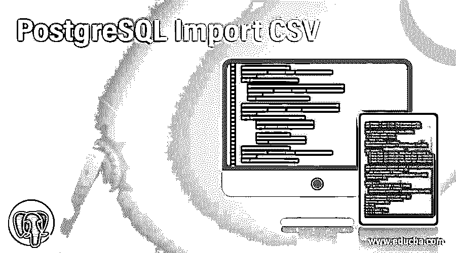
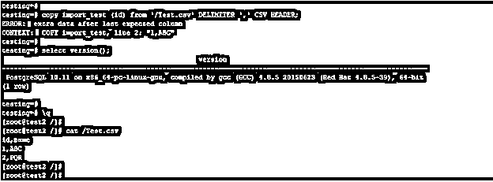
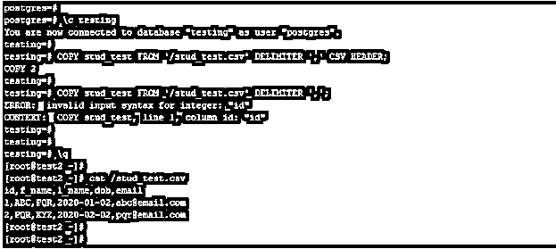
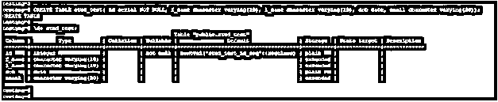
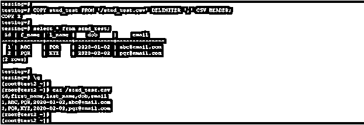
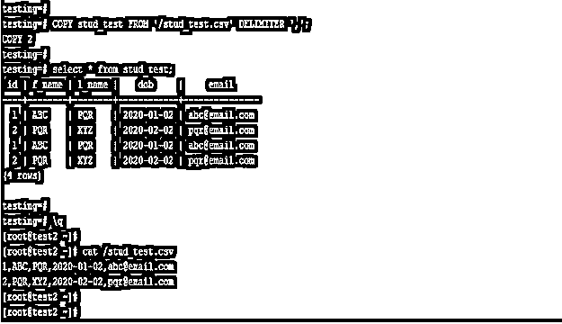
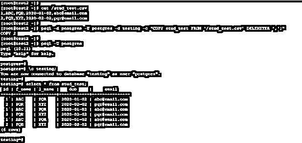

# PostgreSQL 导入 CSV

> 原文：<https://www.educba.com/postgresql-import-csv/>

## PostgreSQL 导入 CSV 简介

PostgreSQL 导入 CSV 定义为通过使用 CSV 文件将数据加载到表中，我们已经使用逗号分隔文件(CSV)将数据从文件导入到 PostgreSQL 表中。要将数据从 CSV 文件导入到表中，数据库中需要存在相同的表，我们还需要 CSV 文件中存在数据的表的相同结构。从 CSV 文件导入数据是 PostgreSQL 中非常有用和重要的操作，用于从文件中导入数据。我们必须使用 copy 命令从 CSV 文件导入数据。

### 语法和参数

下面是将 CSV 文件导入 PostgreSQL 表的语法。

<small>Hadoop、数据科学、统计学&其他</small>

`COPY table_name (Column_name1, column_name2, …, column_nameN) from file_name (Path of file) Delimiter [ Character of delimiter which was we have used ] CSV [Header of CSV file.]`

`COPY name_of_table from name_of_file Delimiter [ Character of delimiter which was we have used ]`

下面是将 CSV 导入 PostgreSQL 表的参数描述语法。

*   **Copy:** 这是 PostgreSQL 中的一个命令，用于将数据从 CSV 文件导入到表中。copy 命令对于将数据导入 PostgreSQL 表非常有用。
*   **表格名称:**表格名称指定我们从 CSV 文件导入数据的表格的名称。
*   **列名 1 到列名:**我们必须用 copy 命令定义列名。列名指定我们必须插入或加载 CSV 文件中的数据，我们在 copy 命令中指定了该列。
*   **From:** 该关键字用于指定 CSV 文件名，我们从该文件名将数据导入到表中。
*   **文件名或文件路径:**这指定了我们将数据导入到表中文件的名称。它被定义为文件的路径，我们需要在 PostgreSQL 中用 copy 命令定义绝对路径。
*   **分隔符:**这被定义为用分号分隔的值。在 PostgreSQL 中，我们可以使用任何分隔符来分隔列的值。
*   **CSV 文件头:**定义为从 CSV 文件导入数据的表格的列名。数据有自己的标题来定义或从文件中导入数据。

### 如何在 PostgreSQL 中导入 CSV？

下面是在 PostgreSQL 中将 CSV 文件导入到表中的工作。我们使用 PostgreSQL 中的 copy 命令来导入文件。要将数据从 CSV 文件导入到表格中，我们需要遵循以下事项或数据库中存在相同的表格。

#### 1.创建与 CSV 文件结构相同的表格

要将 CSV 文件中的数据导入到表格中，需要使用相同的名称和结构创建相同的表格。列的数量和数据类型需要相同，并且存在于 CSV 文件中。从 CSV 文件导入数据时，不允许列不匹配。如果列名和数据不匹配，它将发出错误消息“错误:最后一个预期列后有额外数据”。下面是一个例子，我们在将数据导入到表中时，要求列名和数据名相同。

**代码:**

`copy import_test (id) from 'https://cdn.educba.com/Test.csv' DELIMITER ',' CSV HEADER;
[root@test2 /]# cat /Test.csv`

**输出:**

#### 2.确定分隔符

基本上，我们使用逗号来分隔值，但是在一些文件中，我们使用另一个分隔符来分隔值。我们也可以使用“|”、制表符“\t”或换行符“\n”来分隔这些值。PostgreSQL 中制表符分隔的值也称为 TSV 文件。将数据从 CSV 文件导入表格时，分隔符非常重要。

#### 3.检查数据是否有表头

*   一些 CSV 文件包含文件头，或者一些文件不包含文件头。标题只是我们在表中定义的列名。
*   头在 CSV 文件的第一行定义。如果 CSV 文件包含标题，那么我们需要在 copy 命令中定义标题。
*   当 CSV 文件中不存在标题时，没有必要定义标题。

下面的例子表明，当 CSV 文件包含标题时，我们需要定义标题。

**代码:**

`COPY stud_test FROM 'https://cdn.educba.com/stud_test.csv' DELIMITER ',' CSV HEADER;
COPY stud_test FROM 'https://cdn.educba.com/stud_test.csv' DELIMITER ',';
cat /stud_test.csv`

**输出:**

### 在 PostgreSQL 中实现导入 CSV 的示例

下面是提到的例子:

我们已经使用 stud_test 表描述了将 CSV 文件导入 PostgreSQL 表的示例。

下面是 stud_test 表的结构。

**代码:**

`CREATE TABLE stud_test( id serial NOT NULL, f_name character varying(10), l_name character varying(10), dob date, email character varying(20));
\d+ stud_test;`

**输出:**

#### 1.使用标题将 CSV 文件导入表格

在下面的例子中，我们使用 header 将 CSV 文件导入到表格中。我们已经使用 stud_test 表从 CSV 文件导入数据。

**代码:**

`COPY stud_test FROM 'https://cdn.educba.com/stud_test.csv' DELIMITER ',' CSV HEADER;
select * from stud_test;
cat /stud_test.csv`

**输出:**

#### 2.不使用标题将 CSV 文件导入表格

在下面的例子中，我们将 CSV 文件导入到表格中，而没有使用文件头。我们已经使用 stud_test 表从 CSV 文件导入数据。

**代码:**

`COPY stud_test FROM 'https://cdn.educba.com/stud_test.csv' DELIMITER ',';
select * from stud_test;
cat /stud_test.csv`

**输出:**

#### 3.从 shell 提示符将 CSV 文件导入到表中

在下面的例子中，我们使用 shell 提示符将 CSV 文件导入到表中。

**代码:**

`psql -d postgres -U postgres -d testing -c "COPY stud_test FROM 'https://cdn.educba.com/stud_test.csv' DELIMITER ',';"
select * from stud_test;`

**输出:**

### 结论

我们将数据从 CSV 文件导入到表中，从 CSV 文件导入数据比普通的插入要快。我们导入了带有和不带有指定标题的文件。此外，我们可以使用列名和 copy 命令从 CSV 文件导入数据。

### 推荐文章

这是一个 PostgreSQL 导入 CSV 的指南。在这里，我们讨论了 PostgreSQL 导入 CSV 的介绍，语法，它如何与查询的例子。您也可以浏览我们的其他相关文章，了解更多信息——

1.  [PostgreSQL 递归查询](https://www.educba.com/postgresql-recursive-query/)
2.  [PostgreSQL 管理](https://www.educba.com/postgresql-administration/)
3.  [PostgreSQL 主键](https://www.educba.com/postgresql-primary-key/)
4.  [PostgreSQL 中的游标](https://www.educba.com/cursors-in-postgresql/)