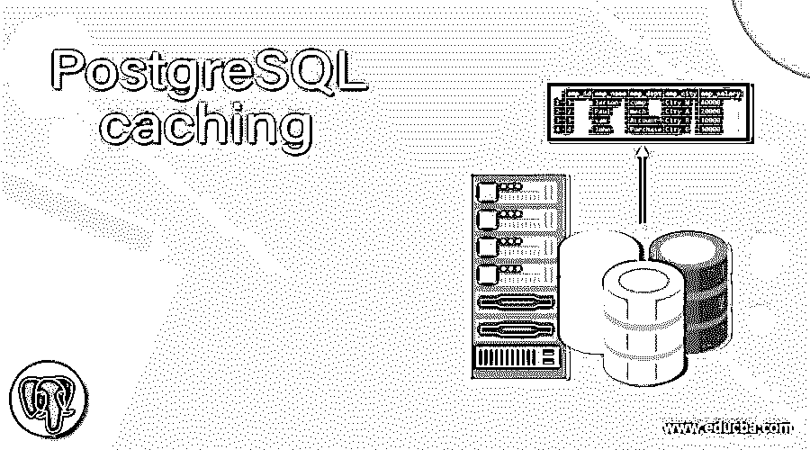
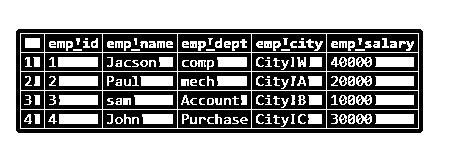
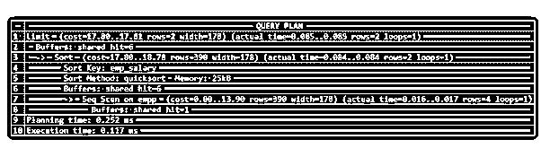
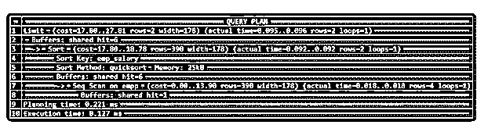
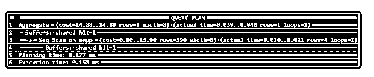

# PostgreSQL 缓存

> 原文：<https://www.educba.com/postgresql-caching/>

## PostgreSQL 缓存的定义

PostgreSQL 中的数据缓存不合适，或者我们可以说不是预分配的，它只能计算，并且取决于工作负载。PostgreSQL 中缓存的主要目的是提高服务器的性能。缓存意味着当我们执行一个查询时，它会经历不同的阶段，其中有一个阶段我们称之为规划阶段。在计划阶段，我们为查询执行选择最佳和合适的计划。缓存是临时内存，用于提高查询和服务器的性能。缓存是根据查询执行计划分配的，一旦执行了查询，缓存就会消失。

**语法:**

<small>Hadoop、数据科学、统计学&其他</small>

`explain (analyze, buffers) select * from table name order by column name limit;`

**说明:**

在上面的语法中，我们使用解释性语句来显示数据库表以及查询执行工具的性能。其中分析和缓冲用于显示查询语句的详细结构，之后我们使用 select 语句通过不同的参数(如 order by 子句)进行表选择。

### PostgreSQL 中的缓存是如何工作的？

我们必须在您的系统中安装 PostgreSQL。我们需要关于 PostgreSQL 的基础知识。我们必须需要一个数据库表来执行 PostgreSQL 中的缓存操作。我们只需要关于缓存的基本知识，这意味着它是如何工作的。

基于系统的 PostgreSQL 进程，即当 PostgreSQL 进程通过 SQL 查询语句请求任何访问时，此时 PostgreSQL 请求缓冲区分配。如果内存块可用，那么它直接返回结果。如果一个内存块不可用，那么它将通过缓冲区分配来获得一个空闲的内存块用于执行查询。

### 例子

让我们看一个不同的例子来更好地理解 PostgreSQL 缓存，如下所示。

#### 示例#1

为了查看查询的性能，我们需要一个表来检查查询语句的性能。因此，让我们首先使用如下查询语句创建一个表。

`create table empp (emp_id serial PRIMARY KEY, emp_name varchar(30), emp_dept varchar[],emp_city varchar[],emp_salary text[]);`

**说明:**

在上面的示例中，我们创建了一个具有不同属性的 emp 表，如 emp_id、emp_name、emp_dept、emp_city 和 emp_salary，它们具有不同的数据类型，如上面的语句所示。

现在，使用下面的语句将一些记录插入到 emp 表中，如下所示。

`Insert into empp (emp_name, emp_dept, emp_city, emp_salary) Values ('Jacson','{"comp"}' , '{"City W"}', '{"40000"}'), ('Paul', '{"mech"}', '{"City A"}', '{"20000"}'), ('sam', '{"Account"}','{"City B"}','{"10000"}'), ('John', '{"Purchase"}', '{"City C"}','{"30000"}');
select * from empp;`

**说明:**

借助上述语句，我们将 4 条记录插入到一个 empp 表中。使用下面的快照说明上述声明的最终结果。

现在让我们通过使用如下的缓存概念来看看上面语句的性能测试。

#### 实施例 2

`explain (analyze,buffers) select * from empp order by emp_salary limit 2;`

**说明:**

在上面的例子中，我们执行了一个选择查询，这意味着数据操作查询。当我们执行 select 语句时，如果该页在内存中可用，那么它就能够被写入，否则他们从磁盘中获取该页进行写入。当我们执行上面的语句时，它显示了 select 语句的详细结构。这里我们使用缓冲区来分析选择查询。使用下面的快照说明上述声明的最终结果。

上面的快照显示共享命中意味着缓存配置是正确的。它显示实际时间、计划时间和执行时间。

让我们看看当我们执行如下相同的查询语句时会发生什么。

*T0】*

 ***说明:**

这里我们执行相同的查询语句，然后它显示不同的共享命中率、实际时间、计划时间和执行时间的值。使用下面的快照说明上述声明的最终结果。

#### 示例#3:顺序扫描

顺序扫描意味着 PostgreSQL 中没有索引，必须从磁盘中获取所有记录或数据，因此这给缓存获取数据带来了问题。当我们使用单次扫描时，它会擦除缓存中的所有数据，因此会使用不同的方式来处理这些数据。它不使用 LRU 算法，而是使用如下一系列缓冲区。

`explain (analyze,buffers) select count(*) from empp;`

**说明:**

在上面的例子中，我们展示了一个顺序缓冲区的概念，其中共享命中是 1，这意味着它使用单个缓冲区来执行。该值可能会有所不同，即它取决于查询语句。使用下面的快照说明上述声明的最终结果。

### 如何提高 PostgreSQL 中缓存的性能？

当我们想到缓存时，这意味着它提高了操作速度，提高了数据的检索速度。让我们讨论不同的场景来提高缓存的性能，如下所示。

**1。查询性能中的瓶颈情况**

在讨论上述问题的解决方案之前，让我们了解一下为什么查询很慢。第一个原因是你的系统性能。这意味着，当我们在系统上运行应用程序时，我们会检查系统的性能。对于这种情况，任何 CPU 或网络瓶颈都可能会影响您的进程，即从数据库获取数据。该问题解决方案是定期检查系统的健康状况，并检查瓶颈增加或数据库大小的增加。

**2。内部高速缓存性能**

内部缓存性能是指数据库表的命中率。有时数据库表的命中率低是由于数据库内部缓冲空间不足，这是表命中率低的主要原因。所以在 PostgreSQL 中，我们使用共享缓冲区的概念来避免数据库表的低速率。共享缓冲区用于管理数据库的缓冲区空间。

### 结论

我们希望从这篇文章中你已经了解了 **PostgreSQL** **缓存**。从上面的文章中，我们学习了基本语法 **PostgreSQL** **缓存**。我们还学习了如何在 PostgreSQL 中实现它们，每个方法都有不同的例子。从本文中，我们了解了如何在 PostgreSQL 中处理 **PostgreSQL** **缓存**。

### 推荐文章

这是一个 PostgreSQL 缓存指南。在这里，我们讨论 PostgreSQL 中的高速缓存是如何工作的？如何提高 PostgreSQL 中缓存的性能？和示例。您也可以看看以下文章，了解更多信息–

1.  [PostgreSQL 比较字符串](https://www.educba.com/postgresql-compare-strings/)
2.  [PostgreSQL 文本搜索](https://www.educba.com/postgresql-text-search/)
3.  [PostgreSQL OID](https://www.educba.com/postgresql-oid/)
4.  [PostgreSQL 聚集索引](https://www.educba.com/postgresql-clustered-index/)*