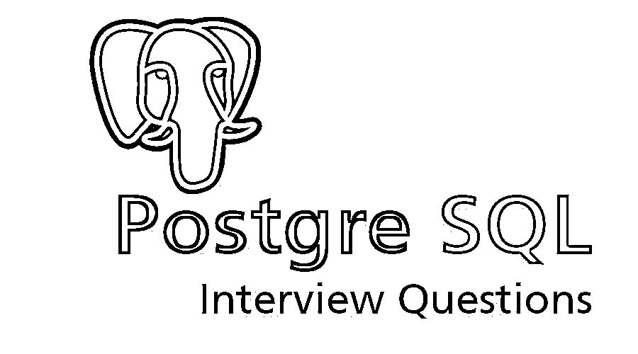

# PostgreSQL 面试问题

> 原文：<https://www.educba.com/postgresql-interview-questions/>

## PostgreSQL 面试问答介绍

PostgreSQL 是一个对象关系数据库管理系统(ORDBMS)。这是一个强大的开源对象关系数据库系统。任何公司或其他私人实体都不控制 PostgreSQL，源代码是免费提供的。PostgreSQL 可以在所有主流操作系统上运行，包括 Linux、UNIX 和 Windows。它支持文本、图像、声音和视频，包括 C/C++、Java、Perl、Python、Ruby 和开放式数据库连接的编程接口。

### 装置

按照以下步骤在 Windows 系统上安装 PostgreSQL:

<small>Hadoop、数据科学、统计学&其他</small>

*   从 EnterpriseDB 中选择最相关的 PostgreSQL 版本。
*   以管理员身份运行下载的软件。请选择您要安装它的位置。
*   安装的下一步是选择存储数据的目录。默认情况下，它存储在“data”目录下。
*   它会提示您输入密码，以使存储的数据更加安全。
*   下一步是设置默认端口。
*   安装完成后，会显示一条消息。

**PostgreSQL 的特性**

*   **语言支持** : PostgreSQL 支持四种标准的过程语言 PL/pgSQL、PL/Tcl、PL/Perl、PL/Python。
*   **索引** : PostgreSQL 支持 B+树、hash、广义搜索树、倒排索引。用户还可以创建定制的索引。
*   **视图** : PostgreSQL 支持创建虚拟表的视图。
*   **规则**允许 PostgreSQL 重写和支持传入查询的层次结构。
*   **继承**:在 PostgreSQL 中，一个表可以被设置为从一个“父”表继承它的特征。
*   **用户自定义函数**:它支持在数据库内部创建几乎所有的新对象，如类型转换、数据类型、域、函数(包括聚合函数)和索引(包括自定义类型运算符的自定义索引)。

现在，如果你想找一份与 PostgreSQL 相关的工作，你必须准备好 2022 年的 PostgreSQL 面试问题。每个面试都与职位描述不同，但是要通过面试，你需要对 PostgreSQL 流程有一个很好的准确的了解。在这里，我们准备了至关重要的 PostgreSQL 面试问题和答案，这将有助于你在面试中取得成功。

以下是面试中常见的 12 个重要的 PostgreSQL 面试问题和答案。这些问题分为以下两部分:

### 第 1 部分 PostgreSQL 面试问题(基础)

这第一部分包括基本的 PostgreSQL 面试问题和答案。

#### Q1。PostgreSQL 的主要特点是什么？

**答案:**
以下是 PostgreSQL 的一些特性

*   对象关系数据库。
*   对 SQL 的支持和可扩展性。
*   灵活的 API 和数据库验证。
*   MVCC 和过程语言，
*   WAL 和客户机-服务器。

#### Q2。PostgreSQL 中的立方根运算符(||/)是什么？

**回答:**
返回一个数的立方根
例如，Select | |/16“16 的立方根。”

#### Q3。简要解释 PostgreSQL 中的函数。

**答:**
函数是必不可少的，因为它们有助于在服务器上执行代码。一些编程函数的语言是 PL/pgSQL，PostgreSQL 的本地语言，以及其他脚本语言，如 Perl、Python、PHP 等。统计语言 PL/R 也可以用来提高函数的效率。

让我们转到下面的 PostgreSQL 面试问题。

#### Q4。能解释一下 Pgadmin 吗？

**答案:**
Pgadmin 是一个众所周知的形成图形化前端管理工具的特性。这个特性在艺术许可证下发布的自由软件中是可用的。Pgadmin iii 是在 artistic 许可下发布的新数据库管理工具。

#### Q5。什么是多版本控制？

**答案:**
使用多版本并发控制或 MVCC 来避免不必要的数据库锁定。这消除了用户登录数据库的时间延迟。当其他人正在访问内容时，会出现此功能或时间延迟。所有交易都作为记录保存。

#### Q6。PostgreSQL 9.1 会有哪些新特点？

**回答:**
在更新项目的过程中，你永远无法确定哪些功能会被加入，哪些不会被删除。该项目有精确和严格的质量标准，在设定的截止日期之前，有些补丁可能符合也可能不符合。目前，9.1 版本正在开发一些基本特性，包括 JSON 支持、同步复制、最近邻地理搜索、列级排序、SQL/MED 外部数据连接、安全标签和仅索引访问。然而，到 Postgre 9.1 发布时，这个列表极有可能完全改变。

### 第 2 部分 PostgreSQL 面试问题(高级)

现在让我们来看看高级 PostgreSQL 面试问题。

#### Q7。什么是命令 enable-debug？

**答:**
enable-debug 命令用于启用所有应用程序和库的编译。这个过程的执行通常会妨碍系统，但也会放大二进制文件的大小。[调试](https://www.educba.com/what-is-debugging/)出现的符号通常有助于开发人员发现与他们的脚本相关的错误和其他问题。

#### Q8。PostgreSQL 有哪些索引？

**答:**
这些是内置的函数或方法，如 GIST 索引、哈希表和 B 树，用户可以使用它们向后扫描索引。用户还可以定义他们的 PostgreSQL 索引。

#### Q9。PostgreSQL 中的哪个选项用于检查在事务的前一部分中受影响的行？

**答案:**
SQL 标准是由关于三种现象的四个事务隔离级别定义的。并发事务之间必须防止这三种现象。不想要的现象是

*   **幻像读取**:重新执行查询的事务，返回一组满足搜索条件的行，然后发现对情况有帮助的行的位置由于另一个最近提交的事务而发生了变化。
*   **不可重复读取**:重新读取之前读取的数据，然后发现另一个事务已经修改了数据的事务。
*   **脏读**:读取由并发未提交事务写入的数据的事务是脏读。

让我们转到下面的 PostgreSQL 面试问题。

#### Q10。什么是 CTID？

**答:**
ctid 是每个 PostgreSQL 表中的一个字段[，它根据特定表中的块和偏移位置来标识特定的物理行。索引条目使用它们来指向物理行。它对于表中的每条记录都是唯一的，可以快速表示元组的位置。逻辑行的 CTID 在更新时会发生变化，因此 CTID 不能用作长期的行标识符。但是，当预计不会出现竞争更新时，在事务中标识一行有时会很有帮助。](https://www.educba.com/postgresql-table/)

#### Q11。代币是什么？

**答案:**
令牌是任何源代码的积木。已知它们包括许多独特的字符符号。这些可以被视为常量、引用标识符、其他标识符和关键字。关键字令牌由预定义的 [SQL 命令](https://www.educba.com/sql-commands-update/)和含义组成。标识符用于表示变量名，如列、表等。

#### Q12。PostgreSQL 中 Array_To_String 的用途是什么？

**答案:**
Array _ To _ String 函数使用提供的分隔符连接数组元素。

### 推荐文章

这指导了 PostgreSQL 面试问题和答案的列表。在这里，我们讨论了最常见的面试问题，并给出了详细的答案，以帮助候选人轻松应对面试。您也可以阅读以下文章，了解更多信息——

1.  [MySQL 面试问题](https://www.educba.com/mysql-interview-questions/)
2.  [NoSQL 面试问答](https://www.educba.com/nosql-interview-questions/)
3.  [TSQL 面试问题](https://www.educba.com/tsql-interview-questions/)
4.  [SQL 面试问答](https://www.educba.com/advance-sql-interview-questions/)
5.  [SQL Server 面试问题](https://www.educba.com/sql-server-interview-questions/)