# 动力双视觉

> 原文：<https://www.educba.com/power-bi-visuals/>

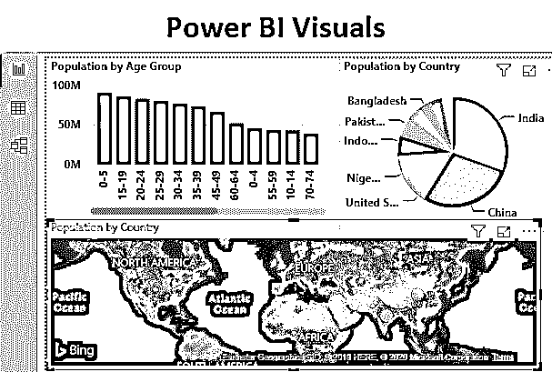

## 什么是 Power BI 视觉效果？

Power BI 可视化是 Power BI 提供的图表、图形、表格、卡片等类型，用于可视化我们的数据。Power BI 中可用的图表与 MS Office 中的图表几乎相同。我们有条形图、柱形图、簇条形图/柱形图、堆积条形图/柱形图、线形趋势图、散点图、饼图和圆环图、地图/填充地图、切片图等。所有这些提到的图表类型都以各种方式用于特定的独特的个人应用程序。

### 如何使用 Power BI 视觉效果？

我们可以在窗口右侧的报告中找到 Power BI 视觉效果，如下所示。

<small>Hadoop、数据科学、统计学&其他</small>

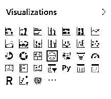

这里我们有一个样本人口数据，它已经在一个标准的格式擦洗。

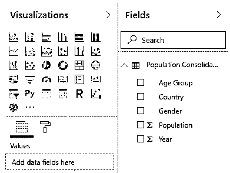

现在，我们将使用上传的数据，并在 Power BI 中进行可视化操作。你可以从下面下载 excel 数据，用于建筑视觉效果。如果你能下载并和我们一起练习，就更好了。

#### 示例#1

让我们首先使用下面的数据创建一个简单的图表。由于数据是巨大的，所以这将有助于我们给出美丽的图表和视觉效果。

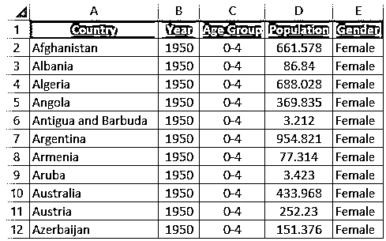

*   要在 Power BI 中上传这些数据，点击主页菜单中的**获取数据**选项。现在选择我们想要连接的信号源类型。这里我们擦洗了 excel 文件中的人口数据。所以我们将浏览并打开该文件。

*   选择需要连接的板材。在这里，该工作表是**工作表 1** 。

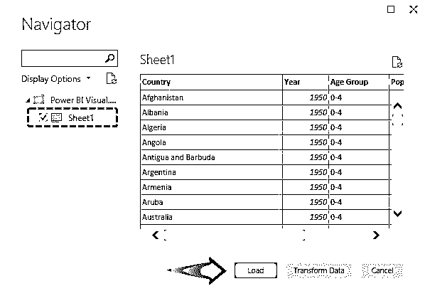

*   正如我们在导入的图表的字段部分名称下看到的那样，是总体整合数据。有年龄组，国家，性别，人口和年份。

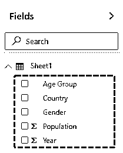

*   我们将重命名字段部分的数据表，以使其标准化。为此，双击该名称或右键单击并选择**重命名**。新名称将是**人口综合数据**。

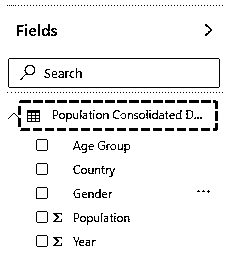

*   首先，我们将绘制如下突出显示的簇状柱形图。

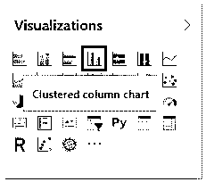

*   一旦我们这样做了，我们将得到一个空白的聚集柱形图，如下面的报告选项卡所示。

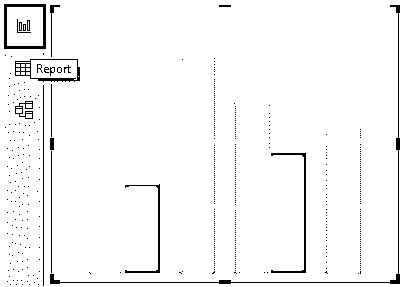

*   现在在已经选择的图表中选择我们想要映射的数据。假设如果我们希望看到相同年龄组的人口，我们需要从如下所示的**字段**部分进行选择。

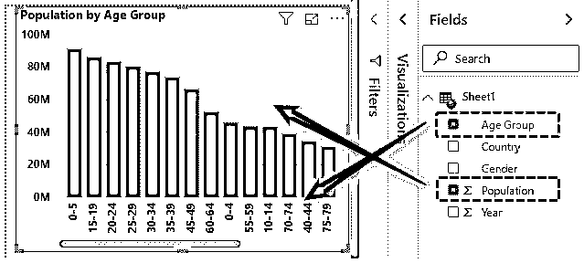

如我们所见，年龄组显示在轴字段中，而人口计数显示在值字段中。同样的数据也可以使用聚类行图表进行映射。簇状列和簇状行之间的区别在于映射的数据是垂直的，而簇状行是水平的。

为了使我们创建的图表更有吸引力，我们可以添加和删除某些内容。

*   可视化下面还有 3 个选项，分别是**字段、格式**和**分析**，如下图**所示。**

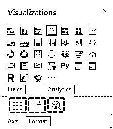

*   从**字段中，**我们可以删除已经添加的字段，也可以添加新字段。这是我们可以改变我们想要看到的数学单位的部分。
*   从**格式**中，我们可以用多种方式格式化颜色、轴、数据标签、标题。
*   通过**分析**，我们可以在图表上绘制最小值、最大值、平均值、百分位数和中间值。

#### 实施例 2

*   让我们看看可视化部分的另一种图表。在这个例子中，我们将看到如何创建和设置饼图。为此，我们将从可视化部分选择**饼图**选项，如下所示。

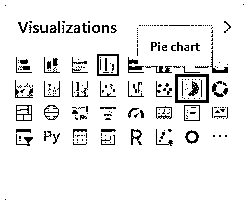

*   一旦我们这样做了，我们将在报告选项卡中得到一个空白的饼图。

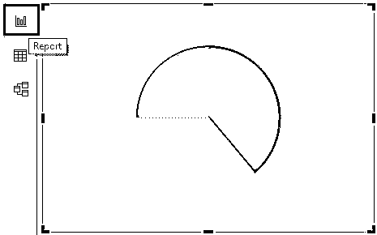

*   现在，我们将选择要映射到此饼图的数据字段。在这里，我们将绘制全国人口图。

*   正如我们所看到的，在一张小小的饼状图上绘制了如此多的国家。让我们现在应用过滤器。为此，我们将使用不同的过滤选项，该选项在如下所示的**过滤器**部分下可用。

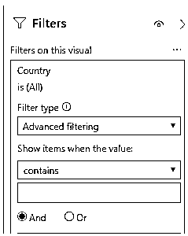

*   现在，我们将按群体筛选前 10 个数据集。完成后，点击应用过滤器。

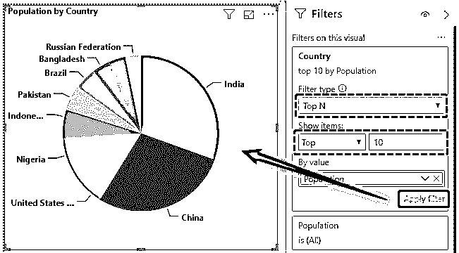

*   现在，如果我们想要查看用于创建更新的饼图的过滤数据。在图上点击右键，选择**显示数据**选项。
*   这将显示数据与国家名称，他们的人口数字如下所示。

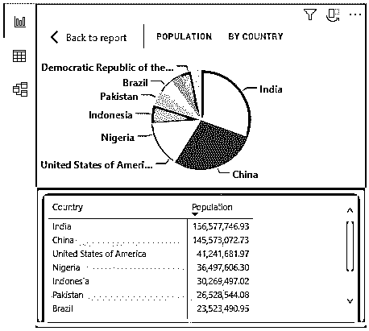

#### 实施例 3

*   上面所示的例子也可以使用相同的参数绘制在**图**上。

为此，从可视化中选择地图绘图，如下所示。

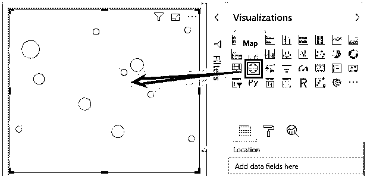

*   让我们选择我们想在地图上看到的字段。这里，我们将在类似于示例 2 的地图上绘制国家人口。

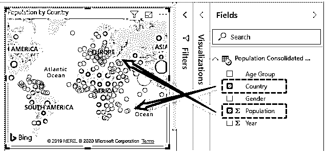

*   正如我们所看到的，我们的地图上有很多国家的数据超载。因此，我们将再次应用相同类型的过滤器，并获得如下所示的前 10 个国家名称。

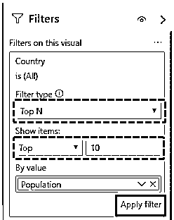

*   我们将获得人口参数排名前 10 位的国家的更新地图。

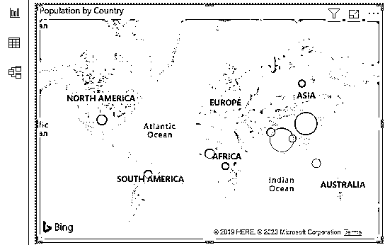

为了使这张地图更漂亮，我们也可以改变主题。在这里，我们将可视化部分的主题从**道路**地图更改为**航空地图**。

*   航空地图将如下图所示。

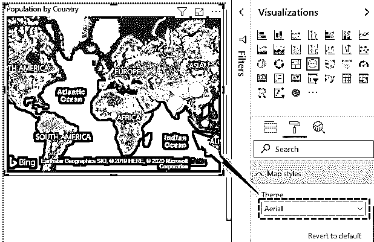

**Note** **:**I have done so much of formatting to these charts, you can download the Power BI Visuals file from below link and apply each formatting technique as applied.You can download this Power BI Visuals Template here – [Power BI Visuals Template](#popmake-227875)

### 强大的 BI 视觉优势

很少解释强力 BI 视觉效果的优点:

*   Power BI 视觉效果远胜于 Excel 图表。我们可以以多种方式使用任何类型的图表。
*   与 Excel 图表相比，在 Power BI 中使用任何图表都没有限制。
*   我们可以改变数据，使用 DAX 修改和擦除它，然后用它来创建视觉效果。
*   Power BI Visuals 是进行可视化分析的一个非常强大的工具。

### 要记住的事情

*   使用前，首先根据需要修改输入数据。在创建图表之前清理数据非常重要。
*   我们可以使用两种以上的图形创建任何自定义的视觉效果。
*   虽然我们可以直接上传数据并开始创建视觉效果，但强烈建议在将数据用于视觉效果之前先学习如何格式化数据。

### 推荐文章

这是增强 BI 视觉效果的指南。在这里，我们将讨论如何使用 Power BI 视觉效果，并提供一些实用示例，如簇状柱形图、饼状图和地图以及可下载的 Power BI 模板。您也可以阅读以下文章，了解更多信息——

1.  [如何在](https://www.educba.com/power-bi-gantt-chart/) [Power BI](https://www.educba.com/power-bi-gantt-chart/) 中创建甘特图？
2.  [使用项目符号图在 Power BI 中定制视觉效果](https://www.educba.com/power-bi-bullet-chart/)
3.  [电源 BI 连接](https://www.educba.com/power-bi-connections/)
4.  [电力 BI 饼状图完整指南](https://www.educba.com/power-bi-pie-chart/)

