# Power BI 教程

> 原文：<https://www.educba.com/power-bi-tutorial/>

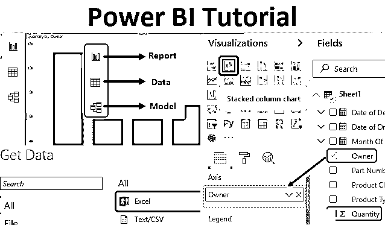

**Power BI 初学者教程(目录)**

*   [Power BI 桌面初学者教程](#Power BI Desktop Tutorial for Beginners)
*   【Power BI 桌面入门教程
*   [如何在 Power BI 中导入数据？](#How to Import?)

## 面向初学者的 Power BI 桌面教程

这本面向初学者的 Power BI 桌面教程讲述了初学者在开始学习数据可视化时需要掌握的所有基本知识。Power BI ，BI 代表**商业智能**，是使用数据可视化的一个非常强大的工具。市场上有许多数据可视化工具，如 Tableau、SAP BI，但 Power BI 是最容易学习的。多年来，我们一直使用 MS Excel 来创建不同的[图和图表](https://www.educba.com/excel-charts-graphs/)，但这也有局限性。在新时代，我们有一个伟大的工具，如 Power BI，它也是微软的产品。在任何笔记本电脑和台式机上安装 Power BI 都非常容易，我们将在下面的示例中看到这一点。

<small>Hadoop、数据科学、统计学&其他</small>

在 Power BI 中创建图形或视觉效果的过程与我们过去在 Excel 中执行的过程相同。Power BI 使用原始数据作为输入。一旦我们将数据上传到 Power BI 中，我们还可以对数据进行清理、修改和擦除。但是我们不能在功率 BI 数据窗口中更改任何值。

此外，与 excel 相比，我们有不同的方法来获取 excel 中的数据，我们有更多的方法来获取 Power BI 中的数据。与其他 BI 工具相比，获取数据非常容易。除了在台式机和笔记本电脑中安装 Power BI 之外，我们还可以尝试将 Power BI 作为“SAAS”([软件即服务](https://www.educba.com/what-is-software-as-a-service-saas/))用于移动设备。Power BI 有 32 位和 64 位版本，可从微软网站下载。

试想一下，技术更新到什么程度了。从旧的 Excel 图表到最新的 Power BI cool 图表。

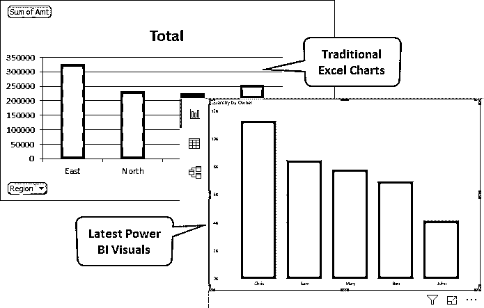

正如我们已经提到的，Power BI 在 SAAS 下有不同类型的服务，如 Power BI 桌面、服务和移动应用版本。Power BI 通常以开发人员和分析师的身份出现。但是 Power BI 中的工作包括分析、可视化、图表、数据连接和映射。

### Power BI 桌面教程入门

这里我们有一些电子时代的销售数据样本，如手机、平板电脑和台式机。我们可以看到还有一些其他标题，如地区、产品类别、日期和所有者。这种多样的数据对于在 Power BI 中获得不同类型的视觉效果非常有帮助。下面是它的截图。因为数据是 1000 行，所以在这里看不到全部。

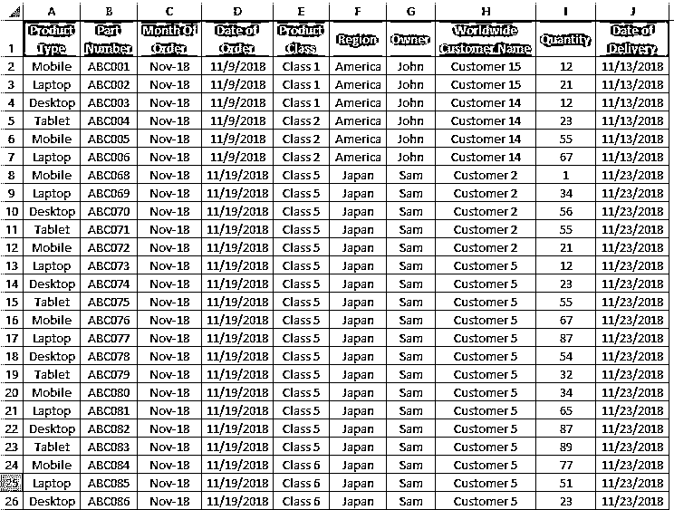

Power BI 易于安装在我们想要的任何系统中。

*   首先从[powerbi.microsoft.com](https://powerbi.microsoft.com/en-us/)网站安装电源 BI。这将带您进入 Power BI 的直接页面。
*   转到此链接，从产品选项卡中选择 Power BI Desktop，如下所示。

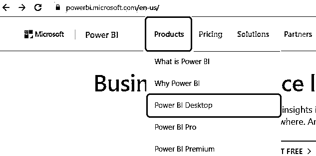

*   点击免费下载安装 Power BI Desktop。

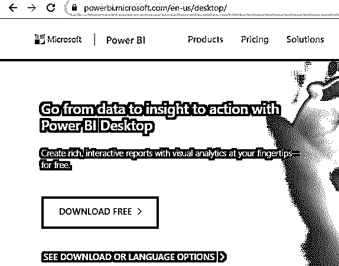

*   一旦下载并安装。打开电源 BI。我们将看到 Power BI 要求我们登录或跳过的第一页。如果是用于官方目的，我们会登录并使用。如果没有，我们可以点击关闭(X)按钮跳过这一步。

*   这是我们的第一个权力 BI 窗口。如我们所见，突出显示了 3 个选项，即报告、日期和模型。

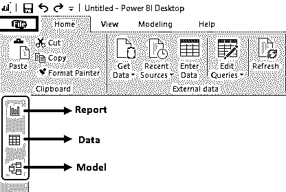

1.  **报告:**这是我们可以创建和查看图表和视觉效果的第一个字段。Power BI 中有许多类型的图表。其中大部分我们都见过，也在 MS Excel 中使用过。
2.  **数据:**在这里，我们可以看到上传或获取的数据。在这里，我们也可以对数据头和数据进行修改。
3.  **模型:**这是我们可以通过链接两个或更多的表或数据来创建模型的地方。

### 如何在 Power BI 中导入数据？

要在 Power BI 中导入数据，

*   点击主页菜单栏中的**获取数据**选项，如下所示。

*   我们将获得在 Power BI 中导入数据的不同方法和选项。在所有选项下，我们将看到不同的选项，如 Excel、Text/CSV、XML 或不同的数据库选项，我们可以链接这些选项以获得 Power BI 中的视觉效果。因为我们在 Excel 中已经有了数据，所以我们将选择如下所示的 **Excel** 。然后点击**连接**选项。

*   浏览文件位置并打开它。

*   Power BI 将定位并连接该文件。选择要打开的工作表名称。这里我们的工作表被命名为 **Sheet1** 。勾选该框并点击**加载**选项。

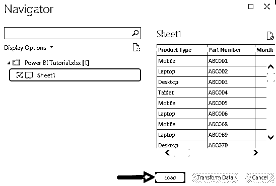

*   数据上传后，点击右侧的数据选项。这将有助于我们看到刚刚上传的完整数据。该工作表的工作方式完全类似于 excel 工作表中的表格。我们可以看到所有的标题，过滤表，可以像在 Excel 中一样使用。
*   此外，在“字段选项”中，我们可以看到最近对数据所做的更改。如果我们修改数据，比如删除任何列或行，改变位置，就会在这里看到。

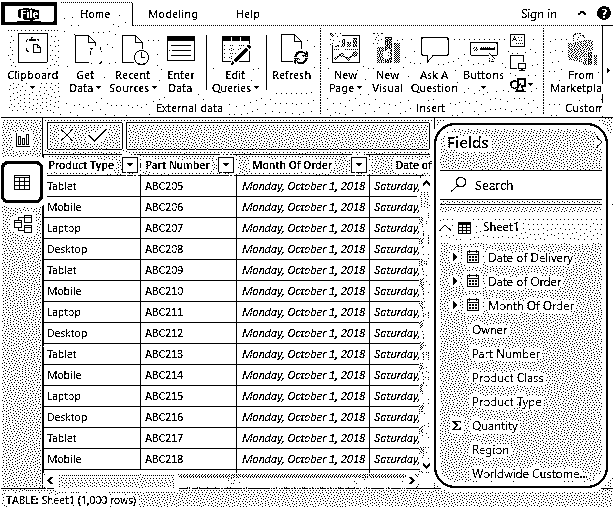

*   现在，要创建可视化图表或图形，请转到我们在上面看到的数据选项上方的**报告**选项。

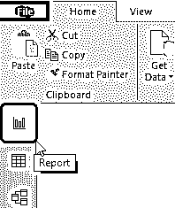

*   在右侧，我们有不同的可视化和字段选项。现在选择任何我们想要看到的可视化。假设堆积柱形图是一个。在这里，我们将看到如下突出显示的所有者明智的数据。首先，选择堆叠列选项，并选择我们想要映射的数据。

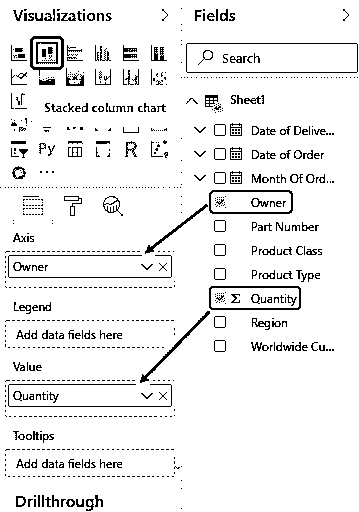

*   我们将看到我们的第一个图表，它是 Owner wise 销售数据的堆积柱形图，如下所示。

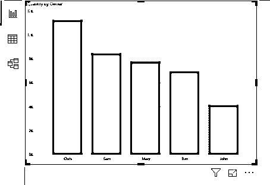

这就是如何在 Power BI 中创建一个简单的图表。我们可以像在 Excel 中一样在一个工作表中创建多个图表，我们将在下一个 Power BI 桌面教程中学习。

### 利弊

下面提到了利弊。

*   与其他 BI 工具不同，我们可以免费使用它的全部权限。
*   如果需要，我们也可以使用 Power BI Web 工具。
*   在 Power BI 中创建图表的过程与 MS Excel 相同。
*   Power BI 不能用于 iOS 笔记本电脑和台式机。

### 关于 Power BI 桌面教程要记住的事情

*   我们可以用单个数据创建多个图表和可视化。
*   我们不能改变数据中的任何东西，但我们可以改变视图，对数据进行排序，并使数据易于理解。
*   在一个页面上，我们可以创建多个图表。一页上的图表数量取决于我们使用的空间大小。
*   始终记得保存创建的绘图或图表。并且可以保存为 Power BI 扩展**。pbix** 。

### 推荐文章

这是一个给初学者的电力 BI 教程指南。在这里，我们学习了基本的 Power BI 可视化工具技术，以及如何将数据导入 Power BI Desktop，并分析了优缺点。您也可以阅读以下文章，了解更多信息——

1.  [电力毕达克斯](https://www.educba.com/power-bi-dax/)
2.  [电力 BI 报告](https://www.educba.com/creating-reports-in-power-bi/)
3.  [电源 BI 图标](https://www.educba.com/power-bi-icon/)
4.  [如何在 Power BI 中使用日历 DAX 功能？](https://www.educba.com/power-bi-calendar/)
5.  [功率 BI IF 语句](https://www.educba.com/power-bi-if-statement/)

