# 电力 BI 中的 KPI

> 原文：<https://www.educba.com/kpi-in-power-bi/>

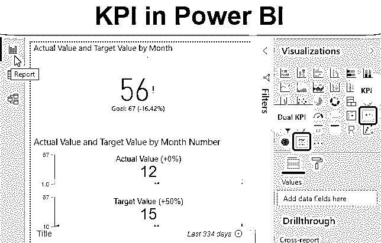

## Power BI KPI 简介

KPI(关键绩效指标)是帮助我们分析数据的参数。我们希望在 Power BI 中使用的每个数据都有一些参数或 KPI，这些参数或 KPI 驱动我们希望看到的图形。我们应该监控数据的 KPI，以分析数据的变化、增长和衰退。这些 KPI 也成为衡量点，帮助我们跟踪业务。借助 Power BI 中的 KPI 视觉效果，我们实际上可以获得我们想要的分数来改善业务。我们实际上看到，我们已经确定了什么目标，我们在 KPI 图表上获得了什么实际数字。

### Power BI 仪表板中的 KPI 类型

Power BI 中有两种 KPI。

<small>Hadoop、数据科学、统计学&其他</small>

**1。单一 KPI:** 单一 KPI 有 3 组字段，分别是指标、趋势轴和目标。

在哪里，

*   **指示器:**显示实际值与目标值的对比。
*   **趋势轴:**这应该是月份名称或者数字轴线。
*   **目标目标:**显示要达到的目标。

**2。双重 KPI:** 双重 KPI 有轴、顶值、底值。

在哪里，

*   **轴:**有月份名称或数字。
*   **上限值和下限值:**这些是单个 KPI 图表中的上限值和下限值。

### 如何在 Power BI 中使用 KPI 可视化？

以下是在 Power BI dashboard 中使用 KPI 视觉效果的不同示例:

#### 电力 BI 中的 KPI–示例 1

在本例中，我们将看到单个 KPI。为此，我们有如下所示的数据。因此，您可以从下面的链接下载用于本例的 excel 工作簿。

You can download this KPI in Power BI Excel Template here – [KPI in Power BI Excel Template](#popmake-167767)

其中有月数、月份、实际值和目标值。正如我们在上面看到的，所有这些值都是单个 KPI 中的字段所必需的。

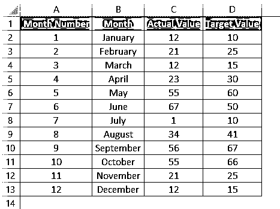

*   进入 Power BI，点击**获取数据**选项，如下所示。

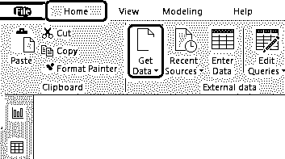

*   选择如下图所示的 excel 文件并**连接**。

*   浏览并选择文件。

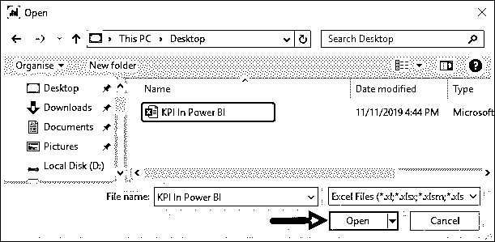

*   检查包含数据的工作表名称。这里我们的工作表是 Sheet1。之后点击**加载**按钮，如下所示。

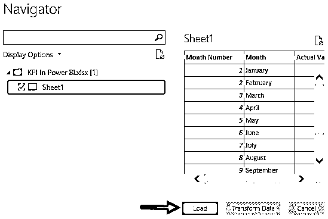

*   我们将能够在**字段**部分看到上传数据头的名称。

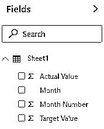

*   从可视化部分选择 **KPI** 可视化类型，如下所示。我们将仅在报告屏幕中看到 KPI 图表的预览。

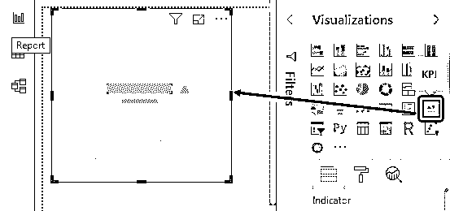

我们可以根据需要增加和调整 KPI 图表的大小。

*   正如我们在文章开头看到的那样，我们现在将相关字段拖动到相关部分，如下所示。

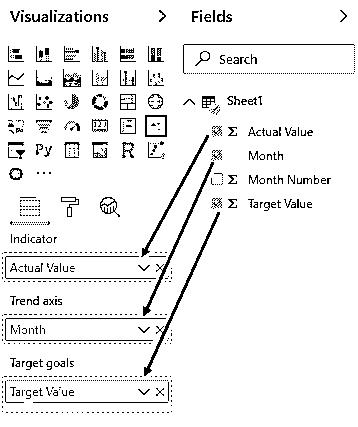

*   一旦我们这样做了，我们将看到我们的单个 KPI 图表中包含了值。

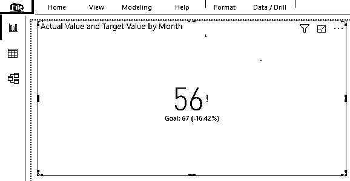

这是 Power BI 中内置的最终单一 KPI 图表。

#### 电力 BI 中的 KPI–示例 2

双重 KPI 图表未内置于 Power BI 可视化中，且不易访问。为此，您需要点击可视化底部的 3 个点，如下所示。这将给我们一个资源列表，我们可以从中添加新的可视化。现在选择**从市场导入**选项。

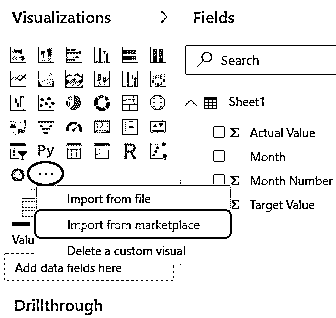

*   将出现一个登录窗口，要求我们登录。如果您在组织中工作，那么您可以使用您的公司凭据登录，否则 Outlook 的任何学生登录 id 也可以在这里工作。

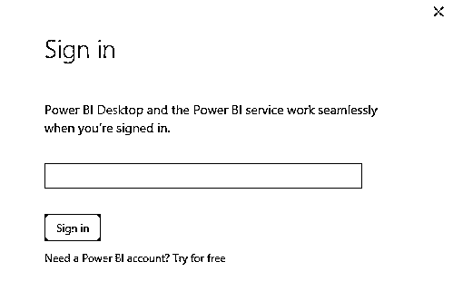

*   一旦我们做到这一点，这将把我们带到如下所示的 [Power BI Visuals](https://www.educba.com/power-bi-visuals/) 市场。在这里，我们可以选择任何我们想要的视觉效果，并将它们添加到我们的列表中。

*   在搜索框中，搜索**双 KPI** ，点击**添加**，如下图所示。

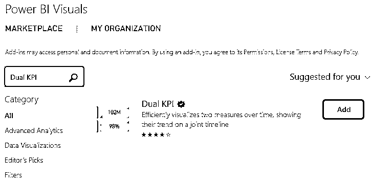

*   之后，我们将能够在 Power BI 的可视化部分找到双重 KPI 视觉效果，如下所示。现在从可视化中选择**双 KPI** 。

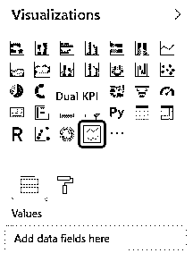

*   双重 KPI 图表如下所示。此图表有两个 KPI 图表，由位于其底部的主图表绘制。

*   现在，我们将拖动并添加相应的字段，如下所示。

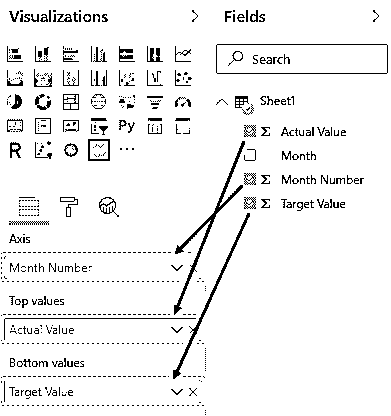

*   我们的双重 KPI 图表如下所示。正如我们所看到的，图表的上方和下方分别显示了实际值和目标值。这样，我们可以很容易地比较实际值和目标值。

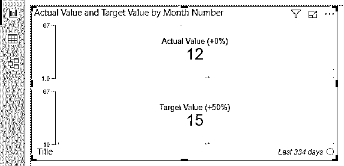

这个图表的好处是，当我们将光标移到图表上时，我们将能够看到任何一点的实际值和目标值。

**NOTE: **Power BI KPI file can also be downloaded from the link below and the final output can be viewed.You can download this KPI in Power BI Template here – [KPI in Power BI Template](#popmake-227875)

### Power BI 仪表板中 KPI 的利与弊

*   这很好地比较了两组字段的实际值和目标值。
*   单一 KPI 图表易于实现。
*   当我们在图上移动光标时，我们可以看到数据的变化。
*   那些没有登录 ID 的人可能无法从市场添加新的可视化。

### 要记住的事情

*   默认情况下，双重 KPI 图表在可视化中不可用。我们需要从 Power BI Market Place 下载并添加更多图表以供将来使用。
*   建议使用双重或多重 KPI 图表，而不是单一或默认 KPI 图表。因为双重或多重 KPI 图表在所有点上都给出了更准确的值。
*   我们可以从市场上进口任何自定义视觉。
*   如果输入文件的数据非常少，我们可以通过将值复制粘贴到单元格中来插入数据，如上面的示例所示。
*   在处理大量数据时，请始终以不同的时间间隔将文件保存在 Power BI 中，以避免丢失数据。
*   双重 KPI 图表不允许我们使用月份名称。它总是更喜欢月份号。

### 推荐文章

这是 Power BI Dashboard 中的 KPI 指南。在这里，我们将讨论如何使用 Power BI KPI(关键绩效指标)视觉效果以及一个实际的例子。您也可以阅读以下文章，了解更多信息——

1.  [电力 BI 报告指南](https://www.educba.com/creating-reports-in-power-bi/)
2.  [功率 BI DAX 示例](https://www.educba.com/power-bi-dax/)
3.  [如何在 Power BI 中使用滤镜 DAX 功能？](https://www.educba.com/power-bi-filter/)
4.  [在 Power BI 中创建示例仪表板](https://www.educba.com/power-bi-dashboard-samples/)

