# Power BI 日历

> 原文：<https://www.educba.com/power-bi-calendar/>

## Power BI 日历简介

Power BI DAX 函数非常神奇，可以灵活地进行许多复杂的计算。我们可以使用 Power BI Desktop 做的事情之一是使用日历功能，我们可以通过提及开始和结束日期来创建日历。不仅是手动日历，我们还可以从数据表中创建日历。好的，在这篇文章中，我们将带您了解 Power BI 中的日历功能。

### Power BI 中的日历功能是做什么的？

CALENDAR 是一个 DAX 函数，可用于根据提供的开始日期和结束日期在 Power BI 中创建日历表。所以就这么简单，下面是日历函数的语法。

<small>Hadoop、数据科学、统计学&其他</small>

要创建日历，我们需要日期，所以我们需要提供**开始日期&结束日期。**例如，如果您想要创建 2019 年 8 月的日历，则开始日期将是“2019 年 8 月 1 日日起”，结束日期将是“2019 年 8 月 31 日日。

关于这个日历函数，我们需要担心的另一件事是，在提供开始日期和结束日期时，我们不能像往常一样简单地输入日期，而是需要利用日期函数来分别给出年、月和日。

### 如何使用 Power BI 中的日历功能？

以下是在 Power BI 中使用日历功能的不同示例:

#### Power BI 日历–示例 1

*   例如，假设我们需要为 2019 年 8 月创建一个日历，在 Power BI 的“建模”选项卡下，单击“新表”选项。

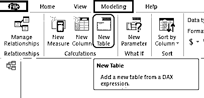

*   这将要求您命名表格，将其命名为“2019 年 8 月日历”。

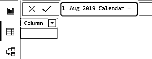

*   现在打开日历 DAX 功能。

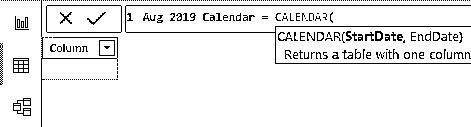

*   由于我们正在创建 2019 年 8 月的日历，我们需要提供**开始日期**，因此我们的开始日期将是“2019 年 8 月 1 日日，因此要输入该日期，我们需要使用 DATE DAX 函数。

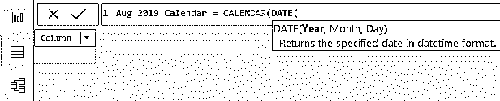

*   对于这个日期 DAX 函数，我们需要输入**年、月和日**参数。所以输入年为 2019，月为 08，日为 01。

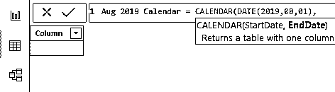

*   下一个参数是**结束日期**,因此要提供结束日期，需要打开一个日期函数。

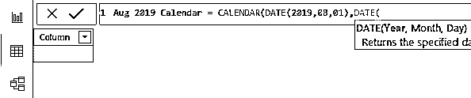

*   为此，请将年设置为 2019 年，月设置为 08 年，日设置为 31 年。

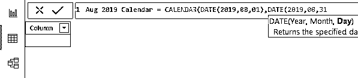

*   好，关闭两个括号，按回车键得到结果。

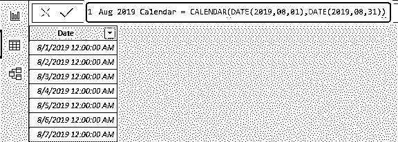

*   这里我们有从 2019 年 8 月 1 日 st 到 2019 年 8 月 31 日 st 的日期栏。其中一个问题是它的格式不正确，它是“MM-DD-YYYY”格式，前面有时间。因此，如下所示更改此日历的格式。

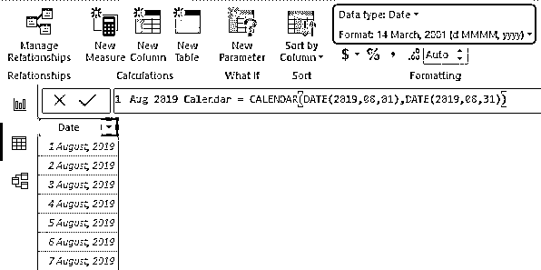

现在，日历的格式是“D MMMM，YYYY”的形式。

#### Power BI 日历–示例 2

我们已经看到了如何利用 CALENDAR 函数通过在 Power BI 中提供开始日期和结束日期来创建日历表。想象一个场景，我们需要从实际的数据表中自动创建一个日历表。在这种情况下，我们无法查看最小日期和最大日期，因此通过使用其他 DAX 函数，我们可以自动创建一个日历。

因此，您可以从下面的链接下载用于本例的 excel 工作簿。

You can download this Power BI Calendar Excel Template here – [Power BI Calendar Excel Template](#popmake-167767)

例如，我们将使用下面的数据表。

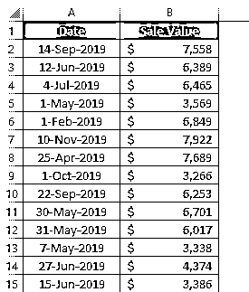

*   这是一个巨大的数据表，所以也要将这个表上传到 Power BI。

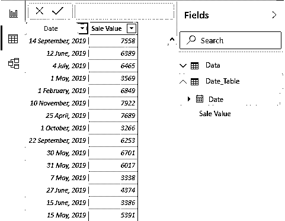

*   从这个表中，我们将创建自动日历。如上例所示创建一个新表，并打开 CALENDAR DAX 函数。

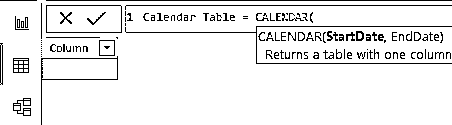

*   这里我们需要使用其他 DAX 函数从表中自动获取**开始日期**，使用 MINX 函数从表中获取最小日期。

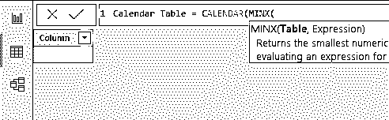

*   为此，首先我们需要从哪个表中获取最小日期，所以我们的表名是“Date_Table ”,所以与表名相同。

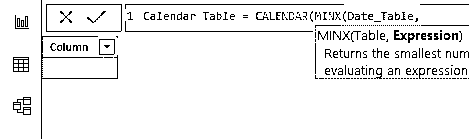

*   对于**表达式**,从上述表格中选择“日期”列。

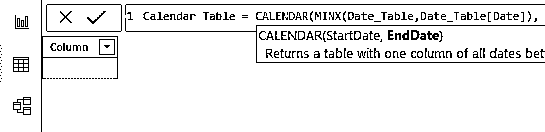

*   这将从表中获取最小日期值。类似地，我们也需要获得**结束日期**，因此为此使用 **MAXX** 函数。

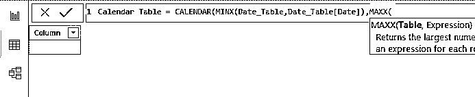

*   对于这个函数，我们需要将表名和表达式作为日期列。

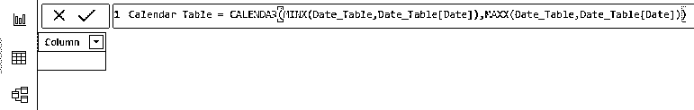

*   好了，这是所有关闭两个括号，并按回车键，以获得新的日历表。

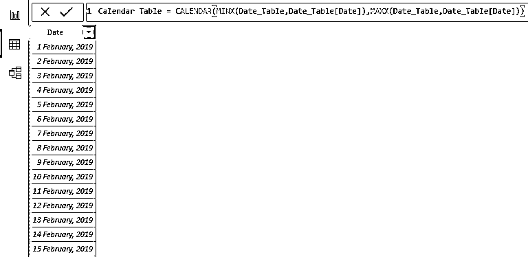

像这样，我们可以通过使用 calendar 函数创建日历表。

**NOTE: **Power BI Calendar file can also be downloaded from the link below and the final output can be viewed.You can download this Power BI Calendar Template here – [Power BI Calendar Template](#popmake-227875)

### 要记住的事情

*   默认情况下，我们将日期和时间放在一起，所以我们可以随时更改格式。
*   如果你使用日历 DAX 函数意味着你必须插入一个新表，而不是在现有表中作为新列。

### 推荐文章

这是一个权力 BI 日历指南。在这里，我们讨论如何使用日历 DAX 函数根据 Power BI 中提供的开始日期和结束日期创建日历表，并给出实际例子。您也可以阅读以下文章，了解更多信息——

1.  [如何创建 Power BI 报告？](https://www.educba.com/creating-reports-in-power-bi/)
2.  [Power BI 与 Excel(前 19 大差异)](https://www.educba.com/power-bi-vs-excel/)
3.  [Power BI 教程(如何导入数据？)](https://www.educba.com/power-bi-tutorial/)
4.  [功率 BI IF 语句](https://www.educba.com/power-bi-if-statement/)

