# Power BI 仪表板示例

> 原文：<https://www.educba.com/power-bi-dashboard-samples/>

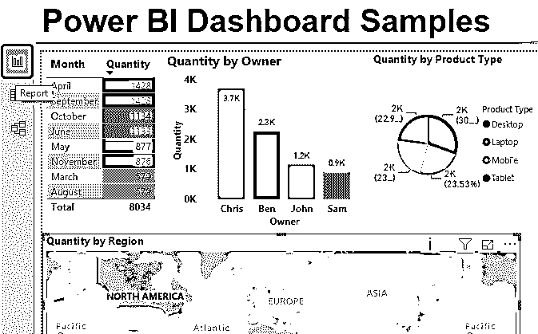

## Power BI 仪表板示例介绍

如果您曾经在 MS Excel 中创建了一个[仪表板，那么在 Power BI 中创建一个示例仪表板对您来说会很容易。但是，即使您没有，这篇关于 Power BI Dashboard 的文章也会让您感觉到创建一个是多么容易。在任何 BI 工具中创建仪表板都是关于您的想象力有多好，以及您如何在不同的图表、表格或列之间建立良好的关系，以便创建出色的可视化效果。在我们继续学习如何在 Power BI 中创建仪表板之前，首先我们需要弄清楚我们希望在仪表板上看到什么。](https://www.educba.com/dashboard-in-excel/)

仪表板是一个地方，我们可以连接不同的表和列，并创建一个有意义的可视化，这将给出任何过程，项目或业务的良好描述。

<small>Hadoop、数据科学、统计学&其他</small>

### 如何在 Power BI 中创建示例仪表板？

在任何工具中使用大量数据创建仪表板都会给仪表板和查看者留下好印象。为此，我们有一些电子产品的销售数据，如手机、笔记本电脑、台式机和平板电脑。数据显示这些产品销售了大约一年。

因此，您可以从下面的链接下载用于本例的 excel 工作簿。

You can download this Power BI Dashboard Samples Excel Template here – [Power BI Dashboard Samples Excel Template](#popmake-167767)

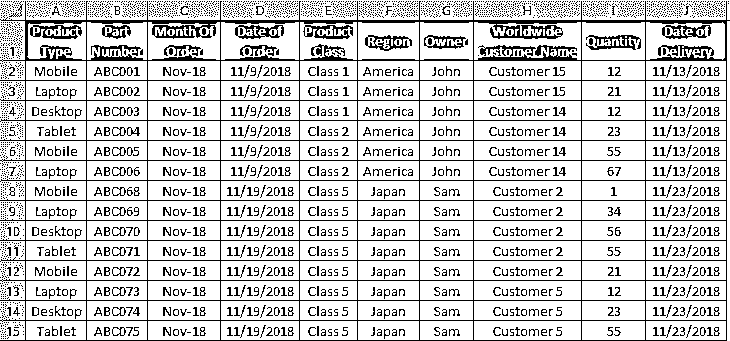

我们使用的数据有 1000 行，足以在 power BI 中创建一个示例仪表板。您可以使用相同的数据并按照步骤操作，也可以拥有自己的数据。

在 Power BI 中上传数据有两种方式。如果数据较少，那么我们可以直接将表格复制粘贴在**输入数据**选项中。如果数据量很大，比如这里有 1000 行。为此，点击**主页**菜单下的**获取数据**选项。

*   选择数据来源。在这里，我们有我们的数据在 Excel 中，所以我们选择了相同的如下截图所示。

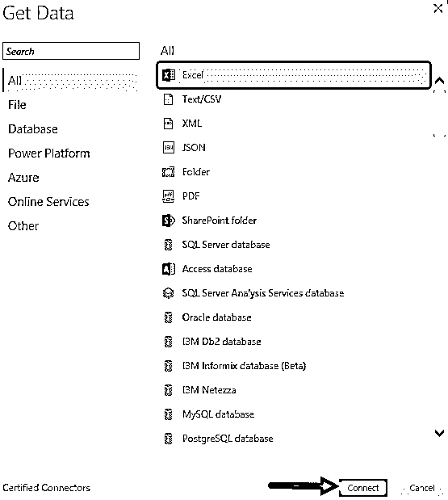

*   现在浏览文件位置并选择我们要上传的工作表。这里，具有数据的工作表被命名为**工作表 1** 。选中该框后，点击 **Load** 将数据上传到 Power BI 中。

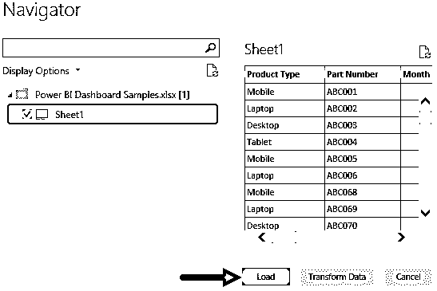

*   数据上传后，我们可以根据需要以任何名称更改上传的表的名称。在这里，我们将其重命名为**仪表板数据**。

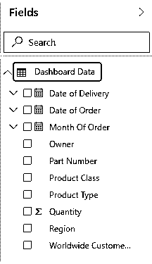

*   现在想象你想在仪表盘上看到什么。让我们先创建一个图表，在这里我们将预测每月的销售额。为此，从可视化部分选择**表格**。

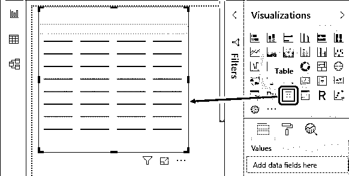

*   现在将在如下所示的值下选择月份和数量。

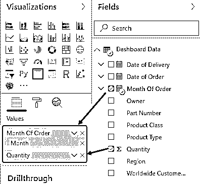

*   这将给出如下所示的可视化。

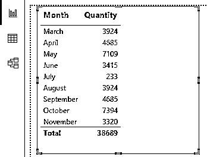

*   在可视化部分点击**数量**的下拉箭头，选择**条件格式**下的**背景颜色**。

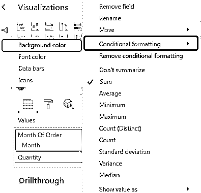

*   根据您的选择选择最低和最高值的颜色，然后单击确定。

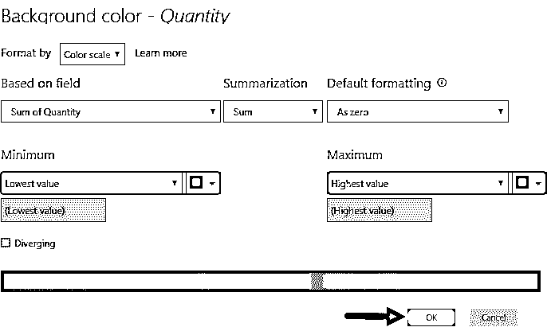

*   我们将看到数量列中的表格数据颜色根据我们选择的最低和最高值颜色而改变。

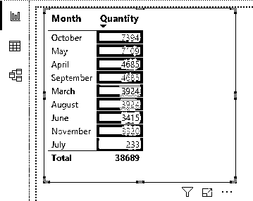

*   现在，让我们插入一个区域图表，在该图表中，我们将绘制区域及其销售数据。为此，我们将从可视化中选择**填充的地图图表**。

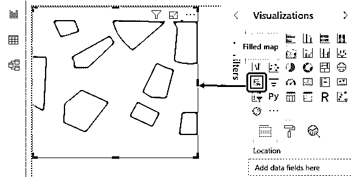

*   现在选择 Region 和 Quantity 字段，并将它们放入 Location 和 Tooltips 部分，以在地图上获得正确的视图。

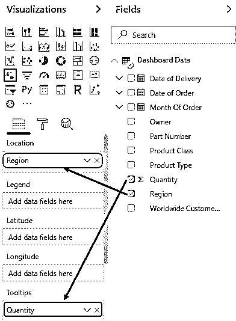

*   我们将会看到，现在地图的每个区域都用默认的颜色填充。

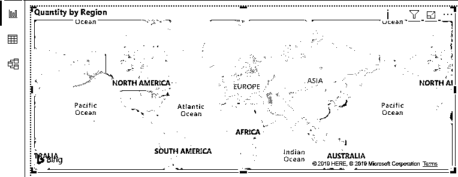

*   与上一个表格的条件格式类似，这里我们也将做同样的事情。转到格式，在**数据颜色**下选择**条件格式。**

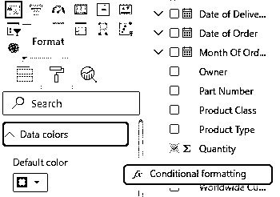

*   在这里，我们选择了一些不同的颜色范围，可能适合我们的地图。单击“确定”退出。

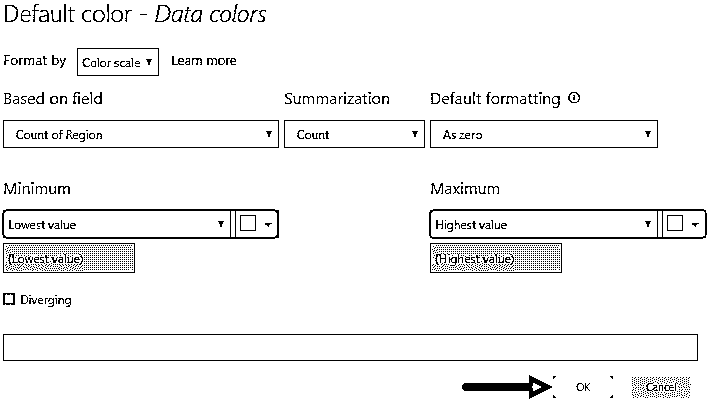

*   这就是我们的地图如何用我们选择的颜色填充。

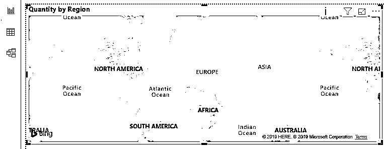

*   现在我们将插入另一个图表。这将是一个饼图，显示产品占总份额的百分比。从可视化中选择**饼图**。

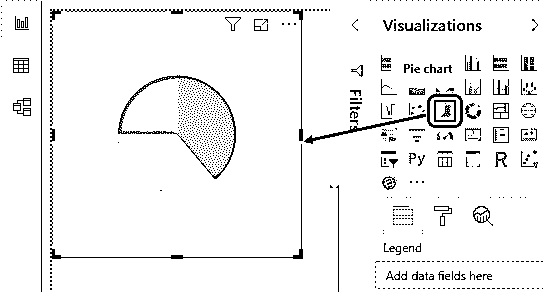

*   为了将数据映射到饼图中，我们将把产品类型和数量拖到图例和值中，如下所示。

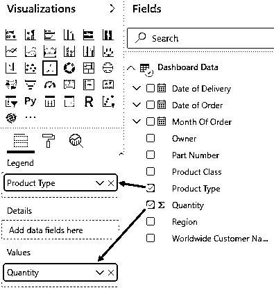

*   这将给出最终的饼图，如下所示。我们在这里添加了数据标签，并根据我们的选择更改了可视化字段部分的颜色。

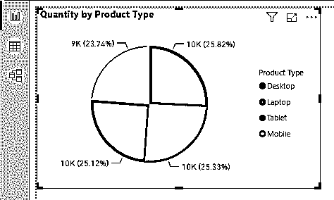

*   让我们创建最后一个图表，这是桩柱形图。这里我们会绘制，哪些销售人员已经卖出了多少数量。从可视化部分选择**堆积柱形图**。

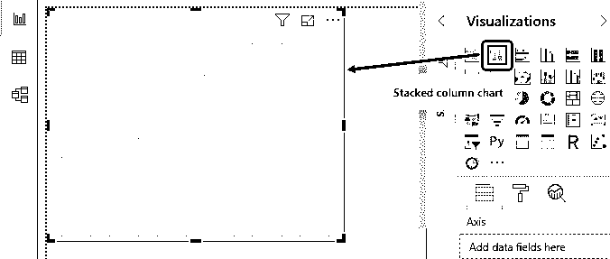

*   现在，我们将在**轴**中放置所有者，在**值**字段中放置数量。

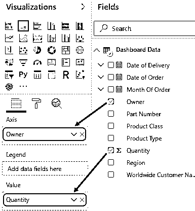

*   我们将会看到我们的柱形图现在有了正确的柱形图。这里我们也改变了每一列的颜色，并添加了数据标签。

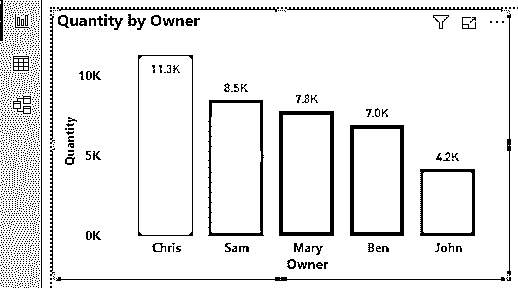

*   重新排列所有创建的图表后，我们的仪表板将如下所示。

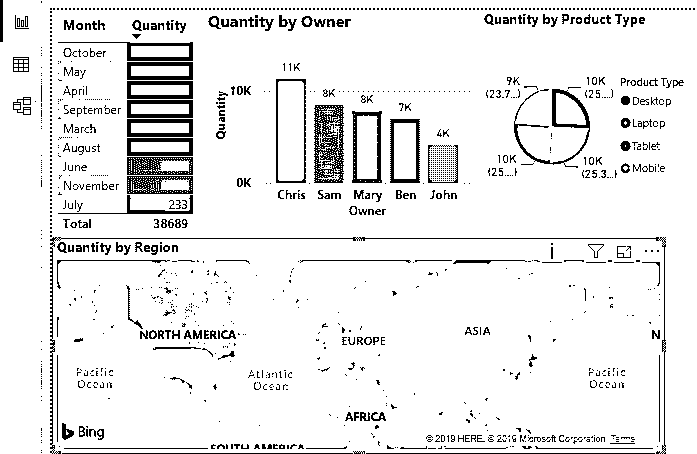

*   最后，我们添加了 3 个切片器，包括所有者、产品类别和区域。这样，我们可以选择我们想要过滤的任何字段。

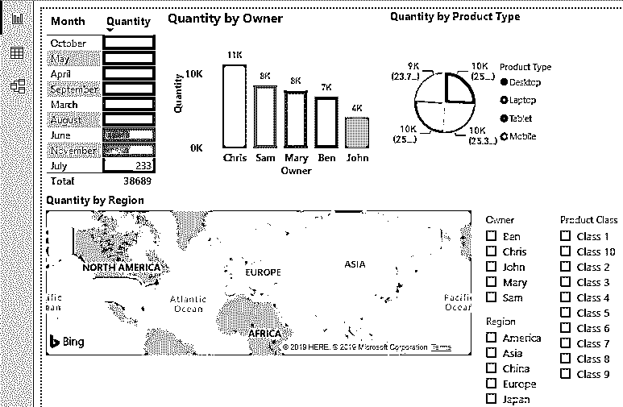

*   为了测试这一点，让我们选择任何东西。这里我们选择了美国地区，显然所有的图表都被过滤了。

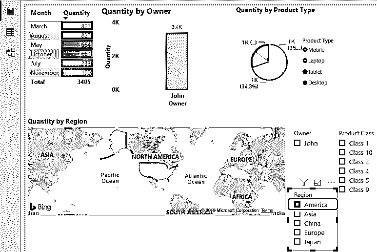

**NOTE: **Power BI Dashboard Samples file can also be downloaded from the link below and the final output can be viewed.You can download this Power BI Dashboard Samples Template here – [Power BI Dashboard Samples Template](#popmake-227875)

### Power BI 仪表板示例的优点

*   在 Power BI 中创建仪表板示例与在 MS Excel 中创建一样简单。
*   即使我们没有在 Power BI 中创建或[添加切片器，我们仍然可以根据需要过滤仪表板，只需单击任何图表字段。](https://www.educba.com/slicers-in-power-bi/)

### 要记住的事情

*   虽然我们可以选择任何我们想在图表中看到的颜色。但是建议不要选择鲜艳的颜色。
*   就使用条件格式的颜色阴影而言，请始终使用两种相反的颜色或不同的颜色波长。
*   我们也可以使用 DAX 语言在 Power BI 中创建一个示例仪表板。
*   创建仪表板后，总是将视觉效果最大化到屏幕或页面，以获得更好的视觉效果。

### 推荐文章

这是一个关于 Power BI 仪表板示例的指南。在这里，我们将讨论如何在 Power BI 中创建一个示例仪表板来连接不同的表和列，并给出一个示例。您也可以阅读以下文章，了解更多信息——

1.  [如何使用 Power BI 中的 IF 语句？](https://www.educba.com/power-bi-if-statement/)
2.  [创建电源 BI 报告的示例](https://www.educba.com/creating-reports-in-power-bi/)
3.  [Power BI 仪表板中的 KPI](https://www.educba.com/kpi-in-power-bi/)
4.  [电量 BI 日历功能](https://www.educba.com/power-bi-calendar/)

