# 功率 BI DAX

> 原文：<https://www.educba.com/power-bi-dax/>

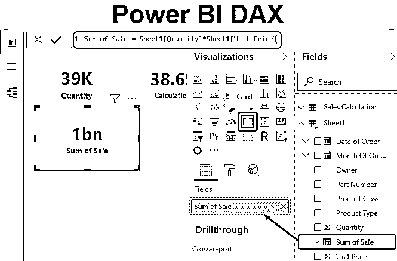

## 幂 BI DAX 函数

Power BI 中的 DAX 代表数据分析表达式。它是 Power BI 和其他[可视化工具](https://www.educba.com/data-visualization-tools/)中使用的公式表达式语言。它用于创建不同类型的公式。我们都已经在 MS excel 中使用不同的 Excel 函数很长时间了。DAX 就像 Excel 的插入功能。在 DAX 中，我们编写不同类型的公式，用于 Power BI 的数据建模。

至于得到 Excel 中任意列数据的总和，我们[使用 sum 函数](https://www.educba.com/sum-function-in-excel/)。以类似的方式，我们使用 Power BI 中的 Sum 函数来获得不同列和所选列的总和。这只是一个例子。除了 sum 之外，我们还可以执行许多类型的函数，并在 DAX 中应用许多或任何类型的数学函数。

<small>Hadoop、数据科学、统计学&其他</small>

如果我们知道如何使用 Excel 插入函数，那么我们在 Power BI 中使用 DAX 就很容易了。许多人都熟悉 DAX 中使用的数据类型。这些数据类型与 Excel 中使用的数据类型相同，如整数、双精度、字符串等。此外，这些数据类型也有不同类型的函数类别，如聚合、文本、逻辑、计数和信息。使用方法与 MS Excel 的插入功能相同。

### 如何在 Power BI 中使用 DAX 公式？

要使用 Power BI DAX 公式，您需要处理数据，因此您可以从下面用于本例的链接下载 excel 工作簿。

You can download this Power BI DAX Excel Template here – [Power BI DAX Excel Template](#popmake-167767)

我们有一些电子产品的销售数据表，如手机、台式机、平板电脑和笔记本电脑。

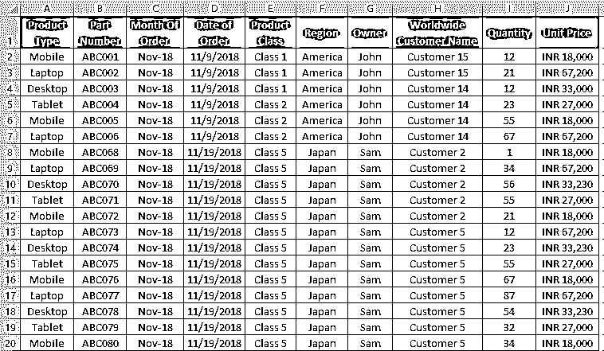

现在打开电源 BI。我们会有一个注册窗口。跳过窗口，进入 Power BI 首页。

*   要在 Power BI 中导入数据，点击主页菜单栏中的**获取数据**选项，如下所示。

*   现在选择我们想要上传的文件类型。在这里，我们的数据在一个 excel 文件中。选择 **Excel** 文件，点击**连接**。

*   这将把我们带到浏览窗口。从那里我们将搜索并打开我们想要上传的文件。

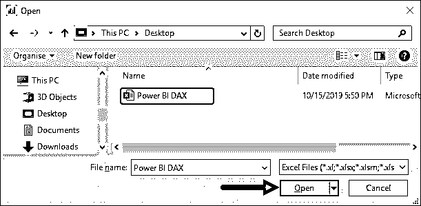

*   现在，在导航窗口中，标记我们要选择和处理的工作表。这里，我们的工作表被命名为 **Sheet1** 。一旦我们选中工作表名称旁边的框，我们将能够看到该工作表中的数据。现在点击加载按钮。如果我们想对数据做一些改变，我们可以选择转换数据。

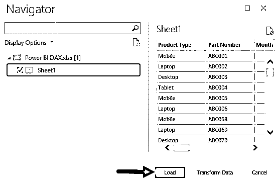

*   一旦数据上传到 Power BI 中，我们将能够在 Fields 部分看到列名，如下所示。这可以在窗口的右侧找到。

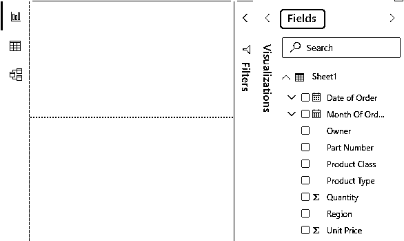

*   选择我们要用于计算的数据。假设这一列是数量。要查看数据，我们将选择**卡**可视化。

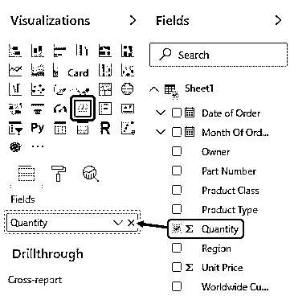

这将给出如下所示的可视化。

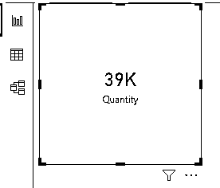

*   现在，我们将在上传列中的 **DAX** 的帮助下插入一个新列，我们将在那里插入计算销售额的公式。为此，右键单击**字段**部分中的工作表名称，创建一个新列。

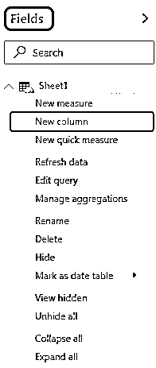

*   我们会在 Power BI 中得到一个类似 excel 的公式栏字段。在那里，我们将看到列的名称。

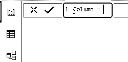

*   现在，我们可以根据需要更改列的名称。假设名称为**销售额**。要获得销售额，我们需要将 Sheet1 的**单价**和**数量**相乘，如下所示。

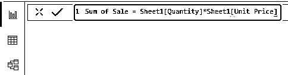

*   现在，我们将选择已创建的列**销售总额**，方法与上面类似。

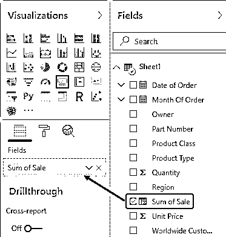

我们将会看到，根据上面用于销售总额的公式，我们在 card visual 中得到的结果是 10 亿。

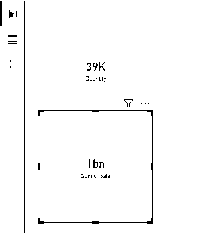

这是 DAX 中基本简单公式的使用方式。

*   现在我们将存储计算出的字段。为此，进入**主页**菜单选项卡，点击**输入数据**选项，如下所示。

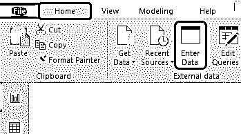

*   现在我们将获得创建表选项。输入表格的新名称作为**销售计算**并点击**加载**。

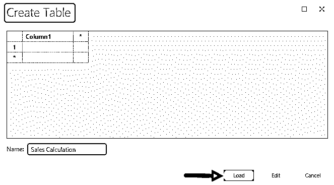

我们将看到，字段部分现在包含了我们创建的表以及它所包含的列。

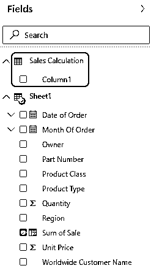

现在，我们将在我们创建的表格下看到真正的 DAX。

*   右键单击销售计算表，并在计算名称中选择一个新度量。

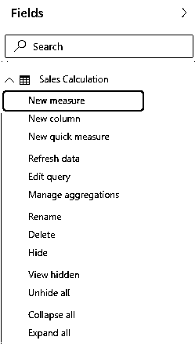

*   插入您想要的任何函数。假设说**平均**并按回车键确认。

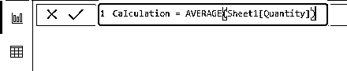

*   现在，我们将选择创建的度量**计算**，方法与上面类似。

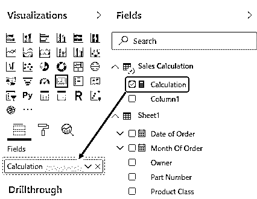

根据使用的公式，我们在 card visual 中得到的结果为 38.69。

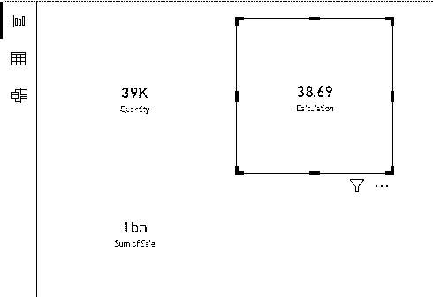

这就是我们如何使用 DAX 在 Power BI 中插入更多的函数和公式。为了更好地理解，我们可以尝试插入 Sum、Count 函数。

***NOTE: **Power BI dashboard file can also be downloaded from the link below and the final output can be viewed.*You can download this Power BI DAX Template here – [Power BI DAX Template](#popmake-227875)

### Power BI DAX 函数的优点

*   使用 DAX 并在那里插入不同的函数是非常容易的。
*   我们可以使用和链接任何工作表和函数。
*   应用和使用与我们在 MS Excel 中使用插入功能相同。

### 要记住的事情

*   DAX 不仅在 Power BI 中使用，而且在不同的可视化工具中也可以使用。
*   DAX 函数与 MS Excel 插入函数相同，而且 DAX 中的大多数函数与 MS Excel 函数的语法相同。
*   要在 DAX 中工作，我们必须知道流行的 Excel 函数及其语法，以及如何应用它们。
*   DAX 使用的数据类型与我们在 VBA 宏中使用的数据类型相同。
*   DAX 的语法应始终以在 Power BI 中上传数据时使用的工作表名称开头。

### 推荐文章

这是一个权力毕达克斯指南。这里我们讨论如何在 Power BI 中插入 DAX 公式来计算数据，并给出一个实例。您也可以阅读以下文章，了解更多信息——

1.  [Excel Hacks | Excel 模板](https://www.educba.com/excel-hacks/)
2.  [将 Excel 转换为 CSV(示例)](https://www.educba.com/convert-excel-to-csv/)
3.  [Excel 抵押计算器概述](https://www.educba.com/excel-mortgage-calculator/)
4.  [Excel 中如何计算方差？](https://www.educba.com/excel-variance/)
5.  [如何在 Power BI 中使用日历 DAX 功能？](https://www.educba.com/power-bi-calendar/)
6.  [功率 BI IF 语句](https://www.educba.com/power-bi-if-statement/)
7.  [如何在 Power BI 中使用滤镜 DAX 功能？](https://www.educba.com/power-bi-filter/)
8.  [在 Power BI 中创建示例仪表板](https://www.educba.com/power-bi-dashboard-samples/)
9.  [用于数据可视化的 Power BI 的主要特性](https://www.educba.com/power-bi-template/)
10.  [功率 BI 图表的简单步骤](https://www.educba.com/power-bi-charts/)

