# 电力双向滤波器

> 原文：<https://www.educba.com/power-bi-filter/>

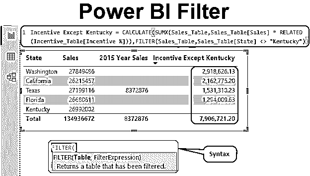

## 功率 BI 滤波器简介

筛选是我们在 MS Excel 中经常使用的一个词，用于仅查看特定的一组数据。在 MS-Excel 中，我们都熟悉下拉列表，只选择需要的项目。

然而，对于 Power BI，我们有一个过滤器下拉列表，但是在汇总数据时，我们需要使用 DAX 函数，即过滤器。例如，当我们有所有城市的销售额时，如果您只想显示一个城市的总销售额，那么我们可以使用 FILTER DAX 函数来获得一个特定城市的总销售额。

<small>Hadoop、数据科学、统计学&其他</small>

### Power BI 中的滤镜功能是做什么的？

FILTER 是简单的 DAX 函数，用于根据指定的标准汇总数据。正如我们上面所说的，当我们有所有城市的销售额时，如果你想只显示一个城市的总销售额，那么我们可以使用 FILTER DAX 函数来获得一个特定城市的总销售额。

过滤器主要用于计算功能，一般来说，应用任何类型的过滤器，以达到基于标准的总数。下面是 Power BI 中过滤函数的语法。

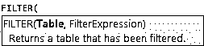

*   **Table:** 首先我们需要提到我们正在过滤的表名。
*   **过滤表达式:**在过滤表中我们需要过滤的东西是什么。在筛选单个城市销售的情况下，我们需要选择一个城市列，并通过放置等号，我们需要在双引号中输入城市名称。

### 如何在 Power BI 中使用 Filter DAX 函数？

让我们看一些例子来理解 Power BI 中 Filter DAX 函数的功能。

#### 功率 BI 滤波器–示例#1

为了演示过滤功能，请考虑下面我们将要使用的数据表。因此，您可以从下面的链接下载用于本例的 excel 工作簿。

You can download this Power BI Filter Excel Template here – [Power BI Filter Excel Template](#popmake-167767)

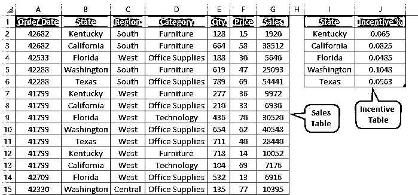

我们有两个表**“销售 _ 表”**和**“激励 _ 表”**。

*   通过下载 excel 工作簿，将这两个表格上传到 Power BI Desktop 文件。

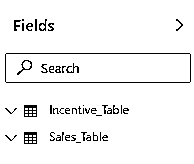

*   现在插入**表格**视图，并创建一个如下图所示的摘要。

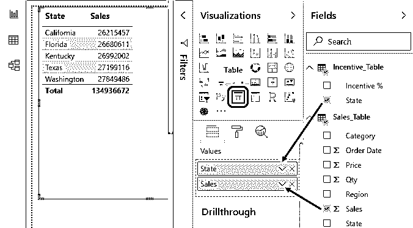

这显示了每个城市各自的总额，现在想象一下这样一种情况，我们需要每个城市 2015 年的销售汇总。在这里，我们可以包含“FILTER”函数，只对 2015 年进行过滤。

*   右键单击 **Sales_Table** 并选择**新度量**选项。

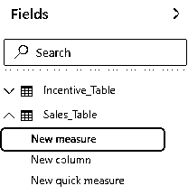

*   命名为 **2015 年销售额**。

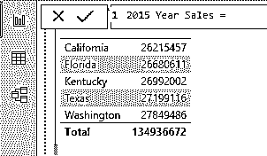

*   因为我们需要合计 2015 年的销售额，所以首先打开**计算**函数。

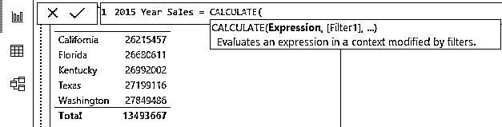

CALCULATE 函数的第一个参数是 Expression，即我们需要做什么计算，所以我们需要对 sales value 列求和。

*   所以打开 SUM 函数，从“Sales_Table”中选择“Sales”列。

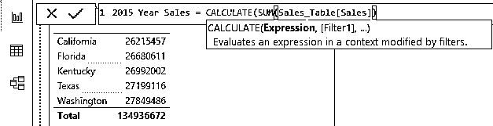

现在，这将对“销售”列求和。下一个参数是 Filter1，即在对“销售”列求和时，我们需要应用什么过滤条件。

*   所以打开**过滤**功能来应用过滤条件。

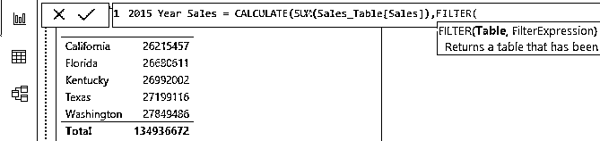

*   提及我们要应用过滤器的表名。我们应用筛选器的表是 **Sales_Table** ,因此选择相同的表名。

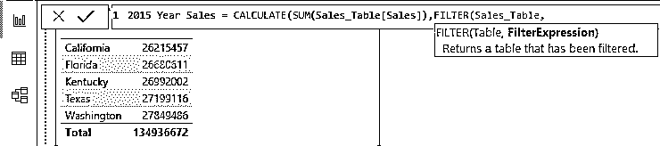

*   我们应用的筛选表达式是针对列**订单日期**的，因此选择该列。

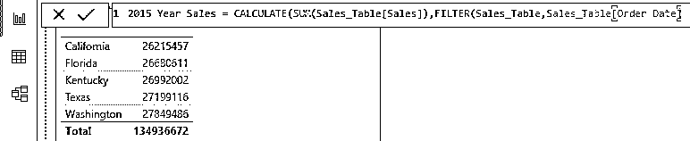

*   由于这是一个完整的日期列，我们需要从该列中选择年份项。所以打个圆点，选择**年**项。

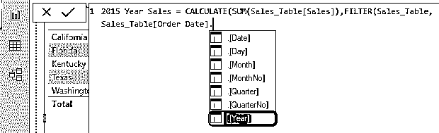

*   现在应用过滤标准为 **2015** 。

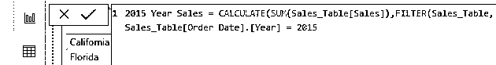

*   关闭两个括号并按回车键以仅获取 2015 年的销售值。

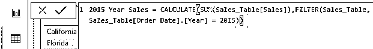

*   将这一新指标(即 2015 年销售额)拖放到可视化表格中，以获得每个城市 2015 年的总销售额。

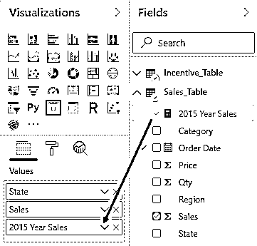

*   这将给出如下所示的可视化。

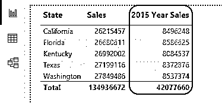

*   现在，想象一下您需要应用多个过滤器的情况，例如，我们已经为 2015 年创建了过滤器，现在假设我们只需要“德克萨斯州”的销售总额，在这种情况下，我们可以继续使用旧公式，在应用过滤器后，使用逗号来访问 CALCULATE 函数的下一个参数。

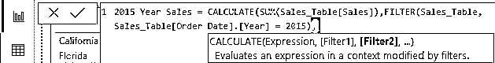

*   计算功能的下一个选项是滤波器 2，因此打开另一个**滤波器**功能。

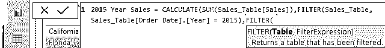

*   再次选择该表作为 **Sales_Table** 。

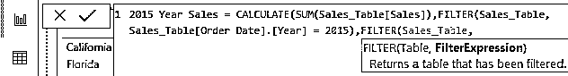

*   我们需要为列应用的筛选表达式是“State ”,因此选择“State”列。

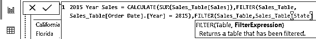

*   对于该列，我们只需要“德克萨斯州”2015 年的总销售额，因此需要加上等号，并输入标准为 **Texas** 。

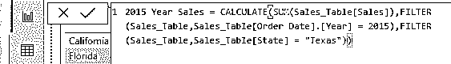

*   现在关闭两个括号，按回车键得到总数。

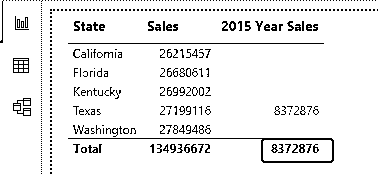

正如您在上面看到的，由于我们已经编辑了现有的公式，我们只有城市“德克萨斯州”和年份“2015”的销售值。

#### 功率 BI 滤波器–示例 2

现在，再看一个使用过滤器的例子。假设我们需要基于“State”列计算激励金额，对于每个州，我们有不同的激励百分比，因此我们需要从另一个表中获取激励百分比。

我们将使用相关函数来获取激励细节。假设我们需要创建一个度量来计算除州“Kentucky”之外的激励，右键单击 Sales_Table 并选择 New Measure，然后将名称命名为“ **Incentive Except Kentucky** ”。

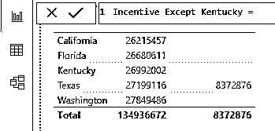

*   打开计算功能。

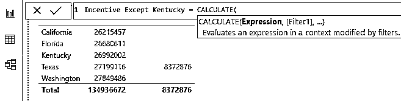

*   我们需要执行的计算是，我们需要将销售额乘以另一个表中的激励百分比，因此打开 **SUMX 函数**。

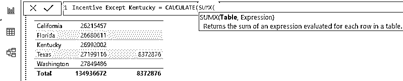

*   提及表名。

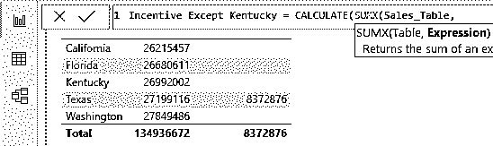

*   表达式就是我们需要做的那种计算，所以首先，选择**销售值**列。

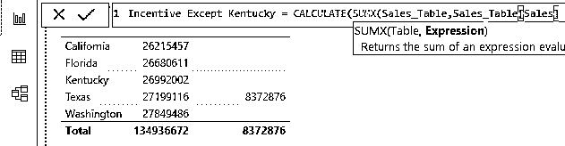

*   销售值列需要与另一个表中的激励百分比列相乘，因此打开与**相关的**函数。

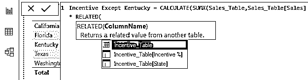

*   我们需要从 Incentive_Table 中选择的列名是“Incentive %”，所以选择相同的列名。

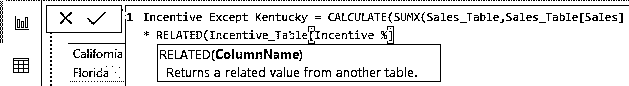

*   关闭两个括号，这将是计算的结束，现在打开**过滤器**功能。

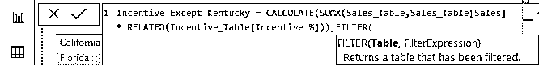

*   将表名称为 **Sales_Table** 。

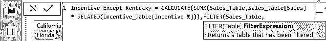

*   过滤表达式将用于除“Kentucky”之外的州，因此输入如下所示的过滤标准。

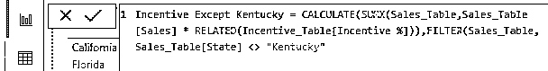

*   好了，所有的括号关闭，并按回车键得到结果。
*   将这一新措施(即除肯塔基州以外的激励措施)拖放到可视表格中，以获取激励值。

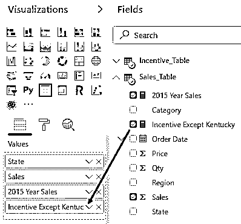

*   这将给出如下所示的可视化。

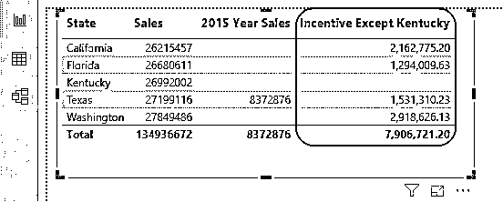

哇！!!正如您在上面看到的，我们有除“肯塔基”州之外的所有州的激励值。

**NOTE: **Power BI Filter file can also be downloaded from the link below and the final output can be viewed.You can download this Power BI Filter Template here – [Power BI Filter Template](#popmake-227875)

### 要记住的事情

*   在 Power BI 中，FILTER 函数通常与 CALCULATE 函数一起使用。
*   如果两个表之间存在关系，则使用相关函数从另一个表中获取数据。

### 推荐文章

这是一个电力双过滤器指南。在这里，我们将讨论 Power BI Filter 函数，它用于根据指定的标准以及一个实际的例子来汇总数据。您也可以阅读以下文章，了解更多信息——

1.  [使用功率 BI IF 语句](https://www.educba.com/power-bi-if-statement/)
2.  [电力毕历(例题)](https://www.educba.com/power-bi-calendar/)
3.  [电力 BI 中 KPI 介绍](https://www.educba.com/kpi-in-power-bi/)
4.  [如何创建 Power BI 报告？](https://www.educba.com/creating-reports-in-power-bi/)
5.  [用于数据可视化的 Power BI 的主要特性](https://www.educba.com/power-bi-template/)
6.  [学习电源 BI 气泡图](https://www.educba.com/power-bi-bubble-chart/)
7.  [Power BI 中可用的连接类型](https://www.educba.com/power-bi-connections/)

