# 电源 BI 图标

> 原文：<https://www.educba.com/power-bi-icon/>

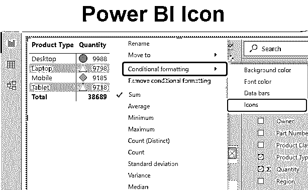

## Power BI 桌面中的图标

我们都在 MS Excel 中使用过条件格式，并在需要更改任何单元格区域的颜色或根据其趋势插入箭头或图标时使用该选项。在 Power BI 中，我们有一个名为 Power BI 图标的选项。在 Power BI 中，我们有一些可以在数据中使用的图标。以下是 Power BI 中可用的图标集列表。

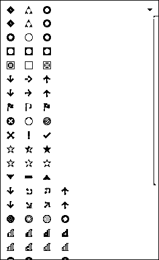

<small>Hadoop、数据科学、统计学&其他</small>

要在 Power BI 中应用图标，首先我们需要在报告选项卡中转换表格或矩阵图表类型的数据。要访问图标，请遵循以下路径。

**可视化- >字段- >值- >下拉箭头- >条件格式- >图标**

如果我们将此应用到报告选项卡中的选择**矩阵**或**表**中，则上述路径将适用。

### 如何在 Power BI 桌面中使用图标？

正如我们所讨论的，当我们将数据转换成表格或矩阵时，Power BI Icon 可以工作。在我们继续之前，我们首先需要我们将用于 Power BI 图标的数据。因此，您可以从下面的链接下载用于本例的 excel 工作簿。

You can download this Power BI Icon Excel Template here – [Power BI Icon Excel Template](#popmake-167767)

下面是 excel 表格中的数据，大约有 1000 行项目。正如我们所看到的数据显示的销售电子产品移动，笔记本电脑，平板电脑和台式机。

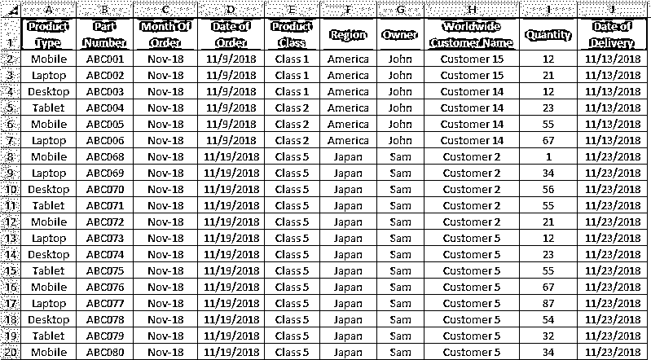

*   现在我们将把这些数据上传到 Power BI 中。为此，点击主页功能区下的**获取数据**选项。

*   选择要连接到 Power BI 的数据库文件的类型。这里我们的数据在 Excel 文件中。然后点击**连接**继续。

*   Power BI 会要求我们浏览文件位置。这样做，然后打开它。

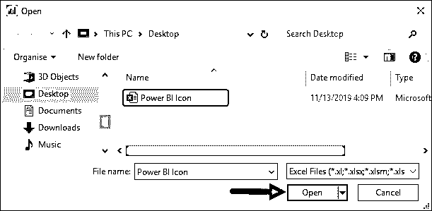

我们将在导航窗口中看到我们上传的 excel 文件。现在选择我们想要上传的工作表名称，然后点击**加载**按钮。

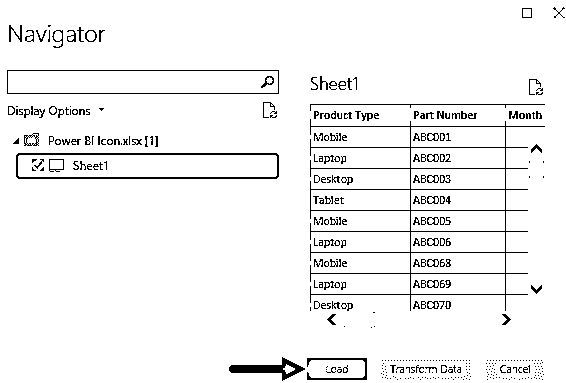

这需要一些时间来完成活动，我们的数据将上传到 Power BI 中。

*   现在我们将把上传的数据转换成矩阵或表格。让我们从可视化部分选择**矩阵**图表类型。

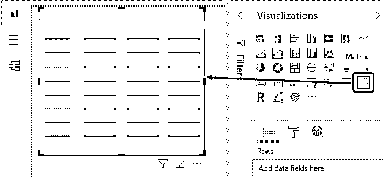

*   在这里，我们可以根据月份或产品类型创建矩阵图。现在，我们将把产品类型放在**行**中，数量放在**值**字段中。

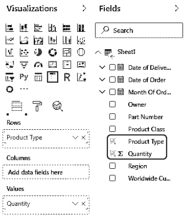

*   根据以上字段选择，我们的数据如下所示，我们可以看到每种产品的销售数量。

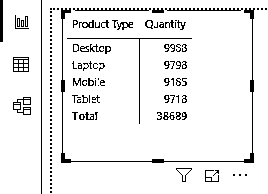

我们都知道 Excel 中的条件格式。这里，我们也将对上面的矩阵图应用条件格式规则。

*   如果售出数量大于等于 9000 但小于 9200，则颜色应为**红色**。
*   如果售出数量大于等于 9200 但小于 9800，则颜色应为**黄色**。
*   如果售出数量大于 9800，则颜色应为**绿色**。

现在，为了实现这一点，我们将选择创建的矩阵图，并从可视化部分单击下拉箭头，如下所示。

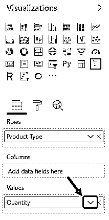

*   并从**条件格式**选项中选择**图标**，如下所示。

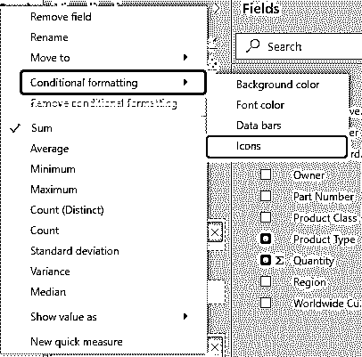

*   现在，根据上面定义的规则，我们将在条件格式图标窗口中创建相同的内容。在中，首先选择“基于”字段。这里我们的基础字段将是我们想要着色的**数量**。

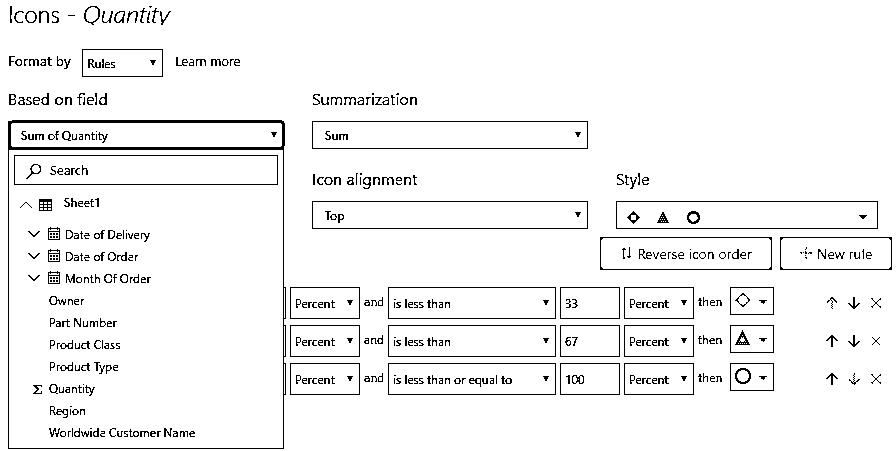

*   然后选择你想看到的图标布局。这里我们将选择数据左边的**。这意味着我们将进一步选择的图标将在数据的左侧可见。**

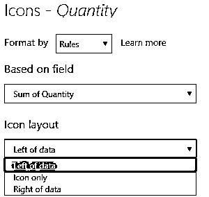

我们可以选择任何类型的颜色图标来显示值。这里我们选择了默认颜色，如下所示。

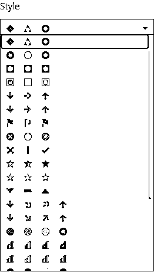

在最后一步，我们将把上面定义的所有条件放在图标中，如下所示。

*   数量> = 9000 但< 9200
*   数量> = 9200 但< 9800
*   数量> = 9800 但< 10000

完成后，点击“确定”。

现在我们会注意到，在下面的矩阵中，每个产品类型的数据左侧都会出现图标符号。

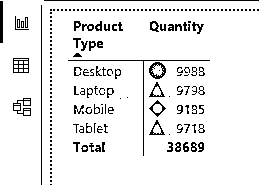

这就是我们如何在 Power BI 中使用图标，就像使用条件格式一样。

**NOTE: **Power BI Icon file can also be downloaded from the link below and the final output can be viewed.You can download this Power BI Icon Template here – [Power BI Icon Template](#popmake-227875)

### Power BI 图标的优点

*   一旦创建了矩阵或表格，就很容易在所选图表中应用和创建图标。
*   我们在图标窗口中更改已定义和创建的规则的位置。
*   对于在 MS Excel 中处理条件格式的人来说，使用 Power BI 中的图标将非常容易。

### 要记住的事情

*   在 icon 中定义规则没有限制。我们可以在 Power BI Icon 中创建任意数量的规则。
*   在图标布局中，建议使用 **数据**选项左侧的**，以便于查看者区分数值和图标以及它们之间的关系。**
*   在 Power BI 中，图标只能在表格和矩阵类型的可视化中实现。如果没有这样的图表，那么我们需要将数据转换成所需的格式。

### 推荐文章

这是一个权力 BI 图标指南。在这里，我们讨论如何在条件格式中使用桌面 power bi 图标集，并给出一个实际的例子。您也可以阅读以下文章，了解更多信息——

1.  [Power BI 初学者教程](https://www.educba.com/power-bi-tutorial/)
2.  [如何在 Power BI 中使用 DAX 公式？](https://www.educba.com/power-bi-dax/)
3.  【Power BI 仪表板与报告之间的差异
4.  [如何在 Excel 中使用图标集？](https://www.educba.com/excel-icon-sets/)
5.  [如何在 Power BI 中使用日历 DAX 功能？](https://www.educba.com/power-bi-calendar/)
6.  [功率 BI IF 语句](https://www.educba.com/power-bi-if-statement/)
7.  [如何在 Power BI 中使用滤镜 DAX 功能？](https://www.educba.com/power-bi-filter/)
8.  [在 Power BI 中创建示例仪表板](https://www.educba.com/power-bi-dashboard-samples/)
9.  [电力 BI 图表|如何创建？](https://www.educba.com/power-bi-charts/)
10.  [电源 BI 连接|类型](https://www.educba.com/power-bi-connections/)

