# Power BI 中的切片器

> 原文：<https://www.educba.com/slicers-in-power-bi/>

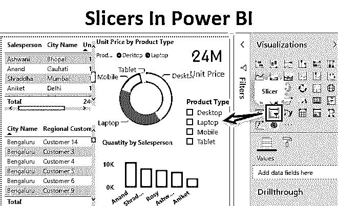

## 什么是动力切片机？

切片器是连接不同表格和图表的最酷的方式，只需点击就能过滤它们。将过滤器放在任何表中只会过滤该表中的那个表。但是过滤器不能用于过滤任何图表或图形中的数据。为此我们有切片机。大多数人都见过或使用过 Excel 中的切片器。但是，即使你没有，那么这篇文章也将帮助你了解电力阿碧地段的切片机。在切片器的帮助下，我们只需点击就可以过滤任何连接的表格、图表或矩阵。

### 如何在 Power BI 中添加切片器？

Power BI 中的切片器是最容易接触到的地方。我们可以通过单击图标从可视化部分访问切片器。如下图所示，这是可用的。

<small>Hadoop、数据科学、统计学&其他</small>

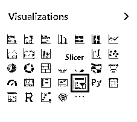

一旦我们点击它，我们将能够看到如下所示的预览空白切片。

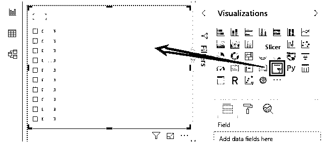

从可视化中选择切片器后，我们会看到，切片器只有一个要添加的字段，即**字段**。如果我们想在同一方向进一步过滤，我们也可以使用 Drillthroguh。现在直接在下面突出显示的部分拖动想要在切片器中看到的字段。

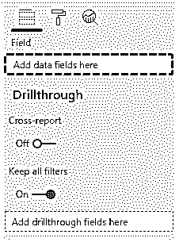

让我们一步一步地在 Power BI 中添加切片器。具体步骤如下:

You can download this Slicer In Power BI Excel Template here – [Slicer In Power BI Excel Template](#popmake-167767)

*   如果您想了解切片器是如何工作的，首先在 Power BI 中创建一个由不同类型的图表和表格组成的仪表板。下面是电子产品的销售数据，如手机、笔记本电脑、台式机和平板电脑，如下所示。我们将用它来创建一个示例仪表板。

*   将数据集加载到 Power BI 中。单击主页选项卡下的获取数据菜单。从获取数据的下拉菜单中，选择适当的数据源类型。在本例中，它是 Excel，因此单击 Excel，如下图所示。

*   从“获取数据”选项的下拉菜单中，选择我们要上传的文件源类型。在这里，我们的数据是 Excel 格式的。在导航窗口中选择文件后，它会要求我们选择要上传的工作表。这是因为数据可能不止一张，但是我们想要选择的可以是任何一张。之后，单击以黄色突出显示的 Load 按钮，将数据加载到 Power BI 中。

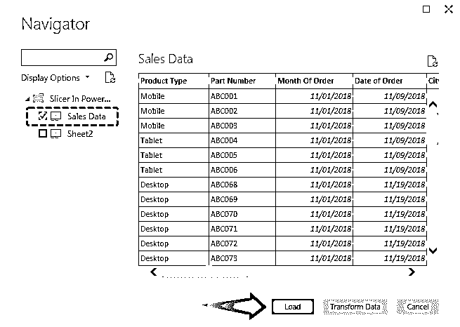

*   在上述数据的帮助下，我们创建了一个简单的仪表板，由表格、卡片、圆环图和堆叠柱形图组成，如下所示。此外，我们也为切片机保留了一些空间。

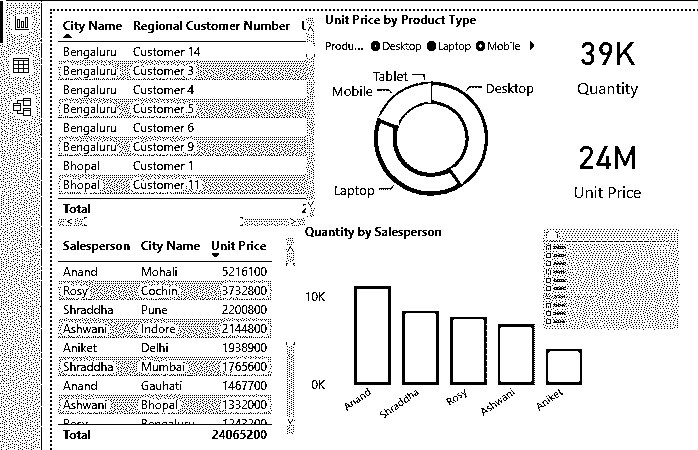

*   现在我们将添加一个切片器。为此，请遵循我们在上面学到的步骤。进入可视化界面，点击切片器图标，如下图所示。

*   现在有一些特定的字段，通过过滤，我们将看到数据的完整摘要。这里，主要字段是城市名称、产品类型和销售人员。如果我们将它们中的任何一个添加到切片器中，我们将能够用它拥有的任何参数来切片我们的数据。让我们先在切片器字段中添加产品类型。

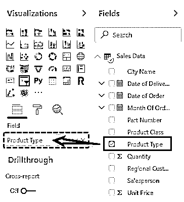

*   这是我们的第一个带有产品类型数据字段的切片器的外观。

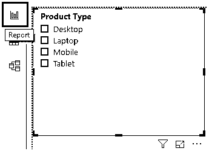

*   为了测试这一点，我们将选择任何产品类型。让我们选择**移动**。我们将会看到，完整的控制面板过滤了与产品类型**移动**相关的数据。我们可以看到总数量，总价格销售，销售移动电话的销售人员，以及他们的数量和城市名称。

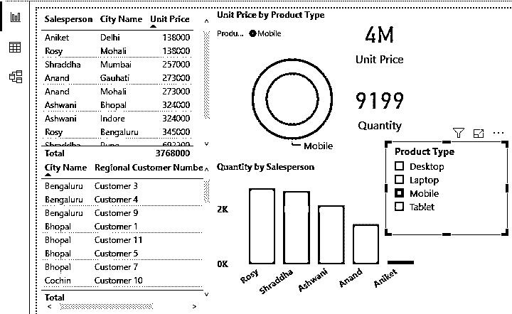

*   让我们在仪表板上多插入几个切片器。为此，请遵循相同的步骤。这里我们将为销售人员和城市名称创建切片器。

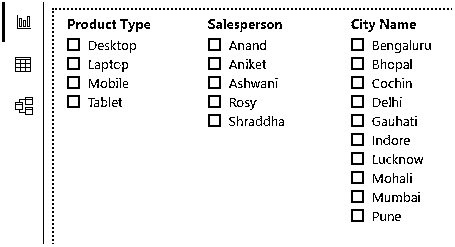

*   让我们尝试使用**桌面**过滤城市名称**科钦**和销售人员**罗斯**的数据。

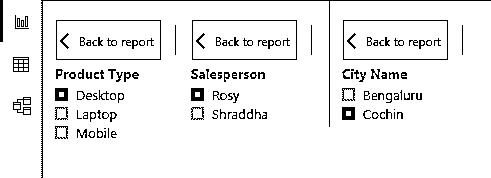

*   我们将会看到 **Rosy** 已经在 **Cochin** 售出了 1996 批总价价值 100 万卢比的产品类型**桌面**。

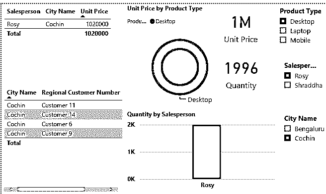

*   因此，在 Power BI 中创建一个仪表板并在其中添加 N 个切片器而无需建立连接变得非常容易。现在，让我们选择我们已经创建的任何一个切片器，并了解它们下面可用的选项和功能。

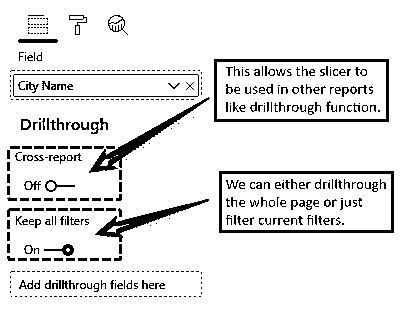

*   在“格式”下，我们还有其他选项。我们将只在这里看到重要的选项。

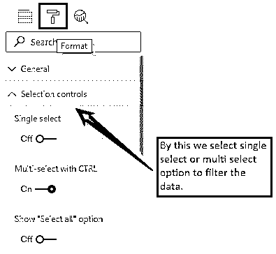

*   在格式部分还有另一个有用的选项，那就是**项**。这样，我们可以根据我们的主题改变背景和字体的颜色。

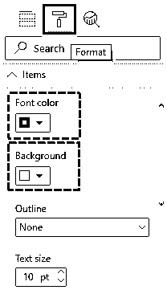

*   之后，我们有标题，背景，锁定方面，边界和视觉标题。我们可以根据需要打开和关闭屏幕下方的任何选项，并查看切片器的变化。顾名思义，所有这些都允许我们在仪表板切片器中激活该功能。

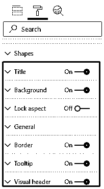

*   还有一件更重要的事要学。当我们单击任何切片器时，在右上端会有一个下拉箭头。如果我们点击它，我们将得到如下所示的列表。该列表允许我们以列表或下拉列表的形式查看切片器中的字段。目前，我们的切片器中有**列表**视图。让我们在这里选择**下拉列表**。

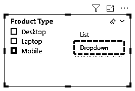

*   我们将会看到，我们的切片视图将会变成下拉列表。如果我们单击向下箭头，我们将能够看到该切片器下面列出的所有产品类型。

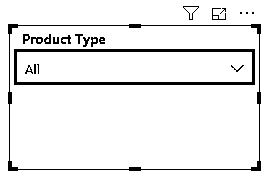

**注意:** Power BI Slicers 文件也可从下面的链接下载，并可查看最终输出。

You can download this Slicers In Power BI Template here – [Slicers In Power BI Template](#popmake-227875)

### Power BI 中切片器的优点

*   这比传统的 Excel 切片器要好很多。
*   我们不必将任何切片器与任何表格或图表连接起来。
*   它类似于我们在 MS Excel 中使用的切片器。
*   我们甚至可以改变切片机的方向。

### 要记住的事情

*   Power BI 中的切片器是视觉过滤器，在应用或选择时直接显示差异。
*   在 Power BI 中插入切片器的数量没有限制。
*   切片器的意思是，切掉我们不需要的数据，投影出我们想要显示的数据。

### 推荐文章

这是一份关于 Power BI 中切片器的指南。在这里，我们通过一个例子和可下载的模板来讨论如何在 Power BI 中添加和格式化切片器。您也可以阅读以下文章，了解更多信息——

1.  [如何在 Power BI 中使用](https://www.educba.com/power-bi-filter/) [滤镜](https://www.educba.com/power-bi-filter/) [功能？](https://www.educba.com/power-bi-filter/)
2.  [如何在](https://www.educba.com/power-bi-charts/) [功 BI](https://www.educba.com/power-bi-charts/) 中创建图表？
3.  [什么是](https://www.educba.com/power-bi-bullet-chart/) [异能匕](https://www.educba.com/power-bi-bullet-chart/)中的子弹图？
4.  [Power BI 工具提示|创建报告页面工具提示](https://www.educba.com/power-bi-tooltips/)
5.  [电源 BI 参数指南](https://www.educba.com/power-bi-parameters/)

