# Power BI IF 语句

> 原文：<https://www.educba.com/power-bi-if-statement/>

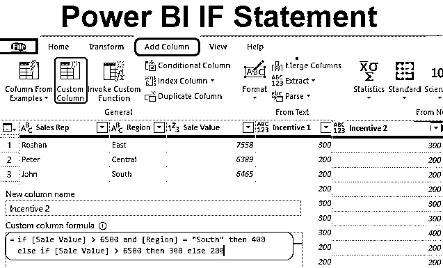

## Power BI IF 语句简介

IF 是 Excel 中最流行的说法& Power BI。如果没有 if 语句，基于多个条件获得新列几乎是不可能的，所以在获得新列时需要注意 IF 语句。

在 Power BI 中，IF 语句被用作 DAX 函数以及 Power Query 条件列，因此在本文中，我们将带您了解如何在 Power BI 中使用 IF 语句来获得新的条件列。

<small>Hadoop、数据科学、统计学&其他</small>

**Power BI 中的 IF 语句是什么？**

IF 是 MS Excel、编码语言和 Power BI 中经常使用的逻辑函数或语句。在 Power BI 中，它有两种可用方式，一种是根据 DAX 函数，另一种是根据条件添加新列的 Power 查询工具。

你一定花了很多时间来学习 MS Excel，但是使用 Power Query editor，你会发现它非常简单。此外，在撰写本文时，我们假设您已经知道 MS Excel 中的 IF 函数。

### Power BI 中的 IF 语句如何使用？

以下是在 Power BI 中使用 If 语句的不同示例:

#### Power BI IF 语句–示例 1

有关示例，请参见下面的演示数据表。因此，您可以从下面的链接下载用于本例的 excel 工作簿。

You can download this Power BI IF Statement Excel Template here – [Power BI IF Statement Excel Template](#popmake-167767)

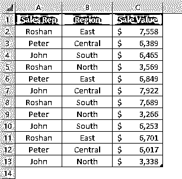

现在我们需要添加一个基于特定条件的新列“激励”,该条件如下。

“如果销售额大于 6500，则奖励为 300，否则奖励为 200”。

*   现在我已经把上面的数据表上传到 Power BI 桌面文件。

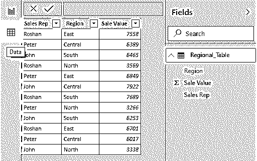

*   现在我们需要转到“Power Query”编辑器来到达条件列。在**首页**标签下点击**编辑查询**。

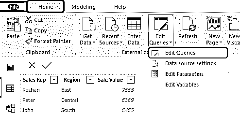

*   这将带您到超级查询编辑器窗口。

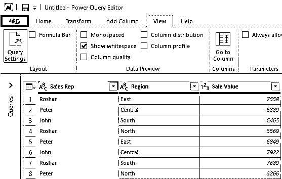

*   在这个新窗口中，转到**添加列**选项卡，并选择**条件列**。

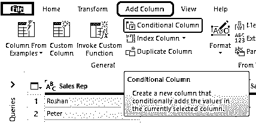

*   这将打开一个新的条件列标准窗口，如下所示。

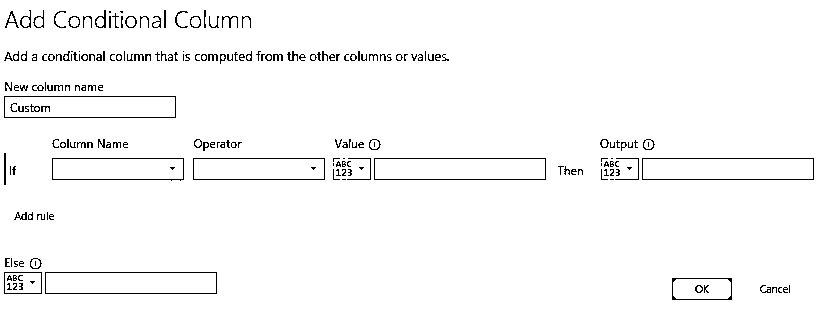

*   首先，给这个列命名为“**激励 1** ”。

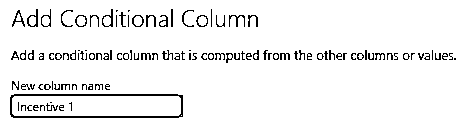

*   在此之后，我们可以看到 if 语句已经存在，因此从“列名”下拉列表中选择“销售值”列。

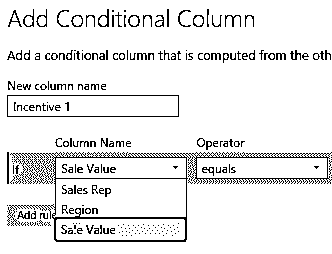

*   接下来，选择运算符大于(>)。

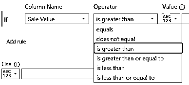

*   现在把值提到“6500”。

*   那么输出将是 300 的激励金额。

*   在 else 语句中，将激励值添加为 200。

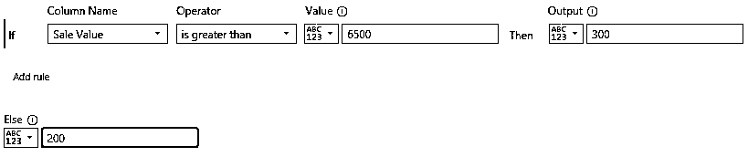

现在我们可以用清晰的英语阅读 if 语句，即“如果**销售值**大于 **6500** ，则输出为 **300** 否则为 **200。**

这看起来比 MS Excel 中的常规 IF 条件容易得多，不是吗？??单击“确定”以创建一个新的条件列。

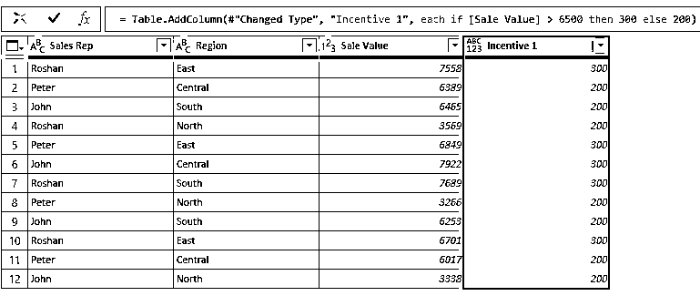

好了，我们有了一个新的“激励”栏，基于 Power BI 中给定的 if 条件。

#### Power BI IF 语句–示例 2

现在我们已经看到了如何使用 if 语句到达一个新列。类似地，设想基于多个条件到达一个新列的情况。

例如,“如果销售额> 6500，地区为“南方”,则我们需要激励值为 400，否则如果销售额> 6500，则激励值为 300 或 200。

*   因此，在这种情况下，我们需要使用“自定义列”选项。

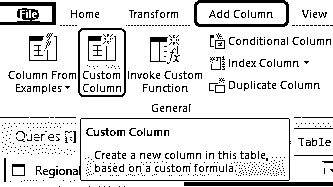

*   这将为我们打开下面的窗口。

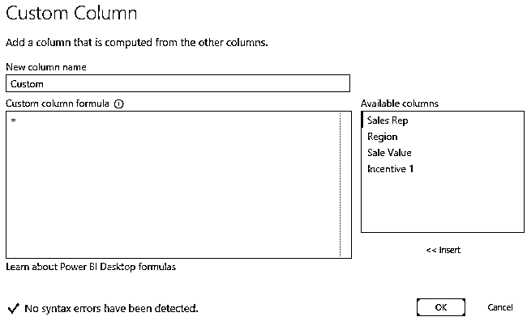

*   按照惯例，给新列命名为“**激励 2** ”。

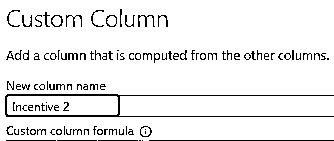

*   现在在“自定义列公式”空间中，我们需要编写“if 语句”，所以先编写 if 语句并选择了销售值列。

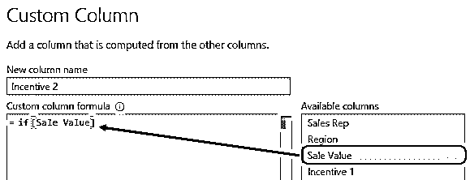

*   第一个标准是，如果销售额大于 6500，应用这个逻辑测试。

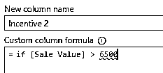

*   现在，我们还需要应用另一个逻辑条件，即如果该地区是“南方”，我们需要在这里使用 AND 语句。

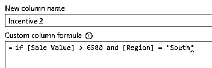

*   那么奖励就是 400。

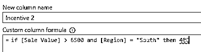

*   否则，如果我们需要做另一个逻辑测试，销售价值是否大于 6500，如果是，那么激励将是 300 或 200。因此，再应用一个 if 语句，如下所示。

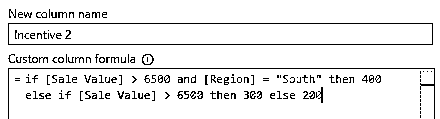

**Note:** Make sure all the formula syntax is in the lowercase letter.

好的，在这个语句中，我们首先将测试销售额是否大于 6500，地区是否为“南方”,如果两者都正确，那么奖励金额将为 400，否则将再次测试销售额是否大于 6500，如果是，那么奖励将为 300 或 200。单击“确定”获得结果。

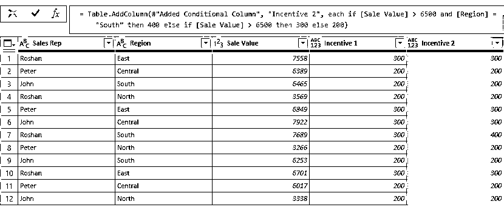

*   要查看此激励列的差异，请查看第 7 行，其中销售值> 6500，地区为“南方”，因此激励值为 400。

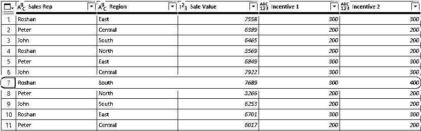

*   应用更改后，点击主页选项卡下的**关闭并应用**。

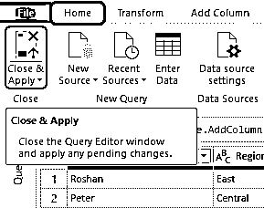

现在，在 Power BI 数据模型中，我们有了包含旧列的新列。

**NOTE: **Power BI IF Statement file can also be downloaded from the link below and the final output can be viewed.You can download this Power BI IF Statement Template here – [Power BI IF Statement Template](#popmake-227875)

### 要记住的事情

*   IF 可用做 statement 和 [DAX 函数中的 Power BI](https://www.educba.com/power-bi-dax/) 。
*   在一个语句中，所有的语法都应该是小写字符，如果任何大写包含的公式将显示错误，您可以关闭该公式。

### 推荐文章

这是一个功率 BI IF 语句的指南。这里我们讨论如何使用 Power BI 中的 If 语句来生成新列，并给出了实例。您也可以阅读以下文章，了解更多信息——

1.  [Power BI 桌面中的图标](https://www.educba.com/power-bi-icon/)
2.  [如何在 Power BI 中创建报表？](https://www.educba.com/creating-reports-in-power-bi/)
3.  [Power BI 初学者教程](https://www.educba.com/power-bi-tutorial/)
4.  [如何在 Power BI 中使用日历 DAX 功能？](https://www.educba.com/power-bi-calendar/)
5.  [如何在 Power BI 中使用滤镜 DAX 功能？](https://www.educba.com/power-bi-filter/)
6.  [用于数据可视化的 Power BI 的主要特性](https://www.educba.com/power-bi-template/)

