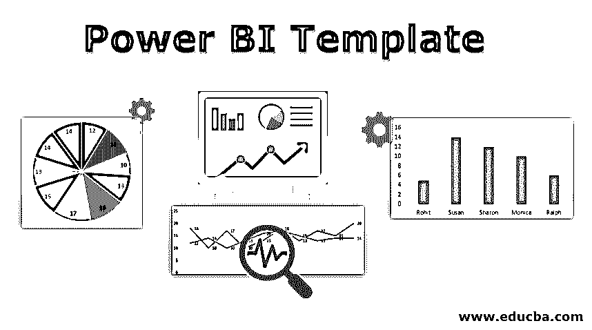

# Power BI 模板

> 原文：<https://www.educba.com/power-bi-template/>

## Power BI 模板简介

Power BI 是微软开发的一款商业和数据分析软件，[提供数据可视化](https://www.educba.com/what-is-data-visualization/)功能，提供从小规模到大规模数据的商业智能。该软件简单易用，可以创建令人惊叹的交互式仪表盘和报告。它有离线和基于云的服务，从[数据仓库](https://www.educba.com/what-is-data-warehouse/)，数据准备和可视化开始。可以根据需要从 MS Excel 或任何数据库中查找数据。Power BI 还可以选择导入模板来创建新的报告模板，用于创建报告和仪表板，为组织或客户分享宝贵的见解。

### 创建 Power BI 模板

*   Power BI 模板有助于使用新数据和信息创建类似的报告。为此，我们必须安装 Power BI 台式机。模板包含报告页面、视觉效果、数据模型定义，如模式、关系等。，以及查询定义，如查询、参数和其他元素。该信息和特征是从现有模板生成的，新模板是从现有模板生成的。首先，Power BI 是从官网下载的。
*   安装 Power BI 后，下一步是从头开始创建报告。为了构建报告，我们需要某些数据。数据可以从任何外部来源获得，如 Excel、文本、数据库等。或者我们可以手动输入数据。或者，可以从工作簿或网页中复制一部分数据并粘贴到 Power BI 中。
*   上图是从 Excel 表格数据构建的示例报告。首先，导入一个 Excel 工作表，以表格形式获取数据。在下一步中，通过拖动所需的列来创建图表、图形等，从而构建报告。为了可视化。经过一些修改，报告终于准备好了。
*   现在，我们可以通过转至“文件”>“导出”>“Power BI 模板”导出报告模板，并将其保存在系统的文件夹中。报告模板现已创建。
*   通过再次转到“文件”>“导入”>“Power BI 模板”,可以导入模板以创建新报告。导入模板时，会出现一个对话框，显示模板中用于构建报告的任何参数。然后，文件位置对话框出现，从保存数据报告的路径加载数据报告。将模板导入 Power BI 后，可以根据需要基于模板中的查询、视觉效果和元素创建仪表板和报告。Power BI 服务器可以帮助公司在内部维护或更新报告。

### Power BI 模板的重要性

作为商业智能和分析工具，Power BI 在行业中具有巨大的重要性。它对单个用户是免费的，在某种程度上，对企业是收费的。它帮助各种规模的企业分析数据和分享见解。企业可以通过交互式仪表板和报告密切监督其业务。Tableau、QlikView 等软件都可用，但微软的数据分析解决方案 Power BI 目前在企业中受到广泛推动。从 Power BI 创建的数据模型有多种应用，包括通过图表发现洞察力和检查组织的盈利或亏损情况。它对于管理层和行政人员识别部门或团队的表现也很有用。每个数据分析师，以及没有分析经验的初学者，也可以使用这个软件来构建报告。

<small>Hadoop、数据科学、统计学&其他</small>

有一些工具可以划分 BI 的权力:

*   **权限查询:**上传和操作数据。
*   **Power Pivot:** 对数据进行建模和分析。
*   **Power View 和 Map:** 将数据可视化。

### Power BI 模板的主要特性和优势

Power BI 模板的主要特性和优势如下:

*   模板允许我们从现有报告中创建用户友好的丰富报告。这个过程很简单，因为它不需要手动编程。
*   Power BI 模板具有多种功能来构建个性化的仪表盘或报告，使企业能够监控其发展。
*   问答功能是一种允许我们使用自然语言回答任何关于数据的问题的功能。
*   Power BI 嵌入了 BI 和分析功能，以提供由 Bing Maps 支持的功能丰富的报告和地理地图可视化。
*   与 SQL Server 一起，云中的 Azure analysis services 帮助用户为交互式报告和分析构建简单、可重用的数据模型。
*   模板基于现有资源构建，但可以根据需要在新报告中进行修改。
*   在生成报告时，无论是通过输入数据还是从模板导入，我们都可以连接任何数据源，如电子表格、SQL Server、SharePoint、Google Analytics，以使其更具交互性和功能丰富，从而实现完整的可视化。
*   Power BI 模板是免费的，即使对于新用户来说，使用或重用也很简单。
*   由于 Power BI 几乎每个月都会更新，因此模板和主题使报告更加美观和高效。
*   由于电力商业智能的低成本，企业可以通过监控其市场趋势和状态来实现高速度的周转。
*   通过有限的工程和工作，Power BI 模板可以从现有报告中生成新的报告，以回答有价值的见解。
*   可以安全地发布报告，以利用数据中的最新信息。
*   与云服务器集成时没有速度或内存限制。用户可以将报告共享到云中，以便从云中存储和导出数据到 Power BI，从而实现数据可视化。
*   Power BI 模板在没有任何技术支持的情况下提供报告和分析，因为它具有基于图形的设计工具和功能。
*   Power BI 中集成了 Cortana assistant，用于口头查询和访问数据中的见解，这使其更加方便。

微软已经制作了一些模板应用程序，它们是集成的软件包，可以创建定制的强大的仪表板。它有助于以更快的方式获取信息并对关键数据采取行动。

### 结论

在当今的客户服务市场中，[数据分析对于增强业务至关重要](https://www.educba.com/what-is-data-analytics/)。数据可以与金融、医疗保健或制药相关，但分析方法单一。Power BI 是企业可视化数据和获取洞察力的解决方案。因此，通过重用模板来制作新的报告是有益的。

### 推荐文章

这是一个权力 BI 模板指南。在这里，我们将介绍 Power BI 模板及其主要特性和优势。您也可以浏览我们推荐的其他文章，了解更多信息——

1.  [Power BI vs Tableau vs Qlik](https://www.educba.com/power-bi-vs-tableau-vs-qlik/)
2.  [Power BI 免费吗？](https://www.educba.com/is-power-bi-free/)
3.  [功率 BI 图](https://www.educba.com/power-bi-maps/)
4.  [电源 BI 提示](https://www.educba.com/power-bi-tooltips/)

