# 功率 BI 图

> 原文：<https://www.educba.com/power-bi-maps/>

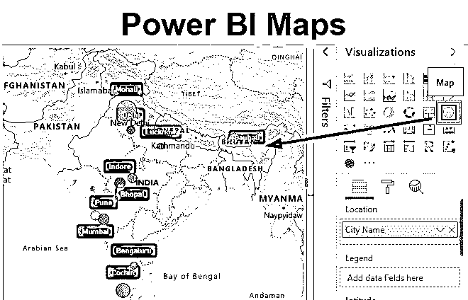

## Power BI 中的地图有哪些？

在这篇文章中，我们将看到一个关于功率 BI 图的概述。我们都曾在 MS Excel 中使用并插入过地图和 3D 地图，当我们知道我们使用的工具并不是为了创建地图图表时，实现起来相当复杂。为了克服这种情况，微软在 Power BI 中提供了许多在 MS Excel 中不容易使用的选项和功能。地图是 Power BI 中的图表之一。现在问题来了，Power BI 如何检测我们数据中的位置并将其绘制成图表？答案是，通过必应地图，它也是微软的产品。Bing 地图使用准确的名称定位城市、国家和地区名称，并将其填入 Power BI 地图。

### 如何在 Power BI 中使用地图？

在 Power BI 中，有两种类型的地图可用。一个是地图，另一个是填充地图。两种类型都在可视化部分，如下所示。

<small>Hadoop、数据科学、统计学&其他</small>

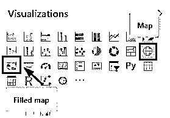

如果我们使用填充地图选项，那么我们将得到一个所有大陆的全球地图。然而，如果我们使用地图选项，那么我们将只看到那些在我们上传的数据中的区域。为了使用 Power BI 中的这些地图选项，我们需要具有标准格式的城市或位置名称的数据。下面是印度地区这类销售数据的截图。销售数据是一些电子产品，如笔记本电脑，手机，台式机和平板电脑。数据由大约 1000 条线组成，非常适合在地图上绘制。

您可以从下面用于本示例的链接下载 excel 工作簿。

You can download this Power BI Maps Excel Template here – [Power BI Maps Excel Template](#popmake-167767)

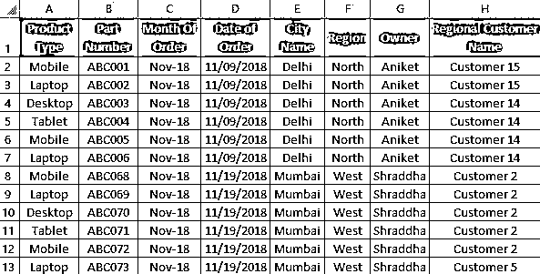

#### 功率 BI 图示例

*   让我们首先在 Power BI 中上传数据。为此，从主页菜单功能区转到获取数据选项，并选择我们想要的源类型。在这里，我们的数据是在 Excel 中，所以我们将选择相同的如下所示。

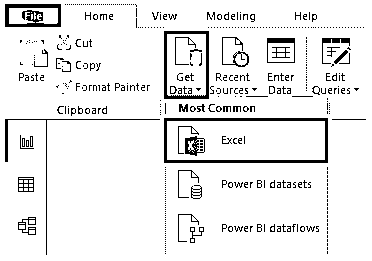

*   现在浏览文件位置，并从导航窗口中选择我们要上传的工作表。在这里，该页是 **Sheet1** ，然后点击加载。

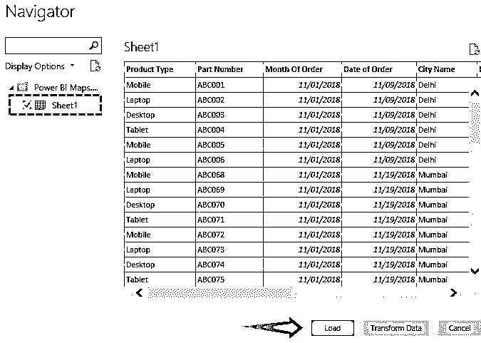

*   这可能需要一些时间。然后，我们将在字段部分看到上传的数据列，如下所示。此外，我们还将此处的表名从 Sheet1 重命名为 Sales Data，以便进行适当的同步。

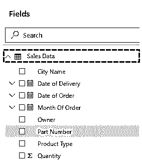

*   我们将能够在数据选项卡中看到我们上传的数据，如下所示。

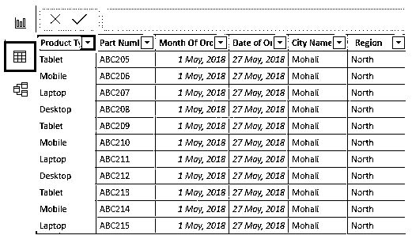

*   现在，在报告部分，从可视化中选择地图图表类型，如下所示。

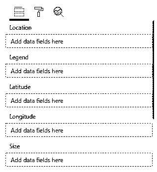

*   让我们看看并理解地图下的可用字段。

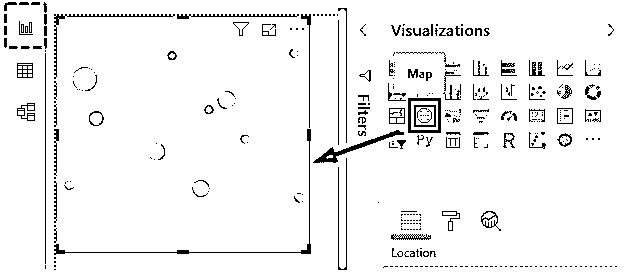

*   **位置**——地图上的地理位置，在地图上有确切的名称。
*   **图例**–这类似于位置，我们可以在此插入任何数据类型，以便在地图中查看数据。
*   **经度/纬度**–这有助于在 Bing 地图上找到位置。
*   **大小**–这可以是人口、数量或可在地图上绘制的数目。

首先，我们将城市名称添加到 Location 字段，如下所示。

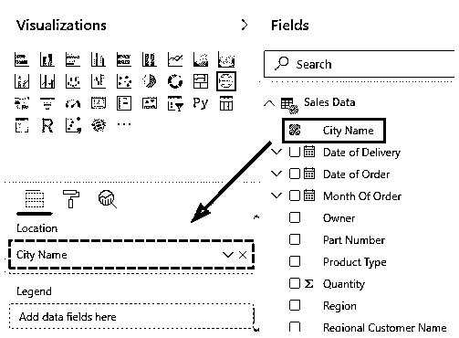

*   我们会看到城市的名字会出现在印度地图上。城市名称突出显示的颜色默认为蓝色。

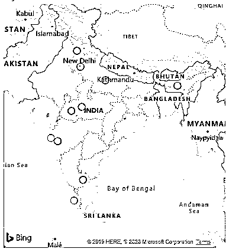

*   然后，我们将在 Size 字段部分插入售出的数量。

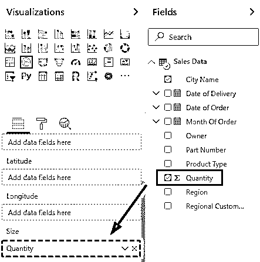

*   当我们这样做时，buddle 的大小将随着该区域中可用数据的大小而增加。泡沫越大，该城市的销售量越高。

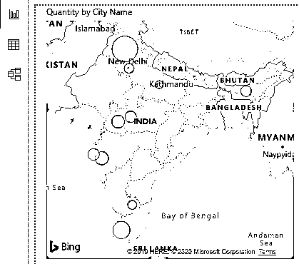

*   这就完成了 Power BI 中 Map 的创建。现在，我们可以根据需要格式化数据字段，使创建的地图看起来更好。让我们从改变分配给城市的颜色开始。为此，转到格式，并选择如下所示的数据颜色。

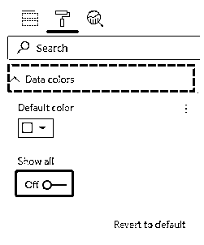

*   要查看所有城市颜色，请单击全部显示启用。在这里，我们为每个城市名称分配了不同的颜色，以区分它们。

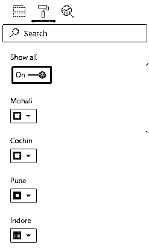

*   然后，我们将从格式选项中打开类别标签。这将有助于观众正确地看到城市的名称。

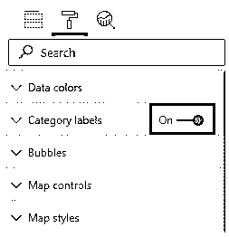

*   我们可以看到，有泡沫的城市名字看得很清楚。

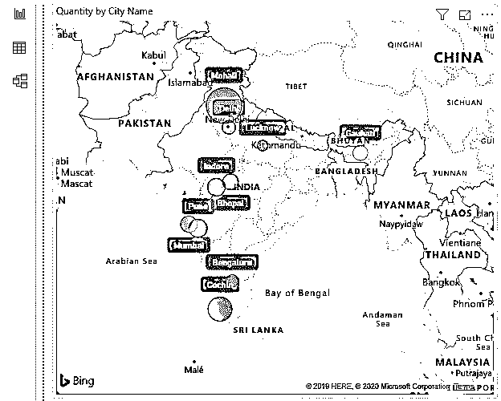

*   我们也可以根据需要改变气泡的大小。这可以从格式部分完成，如下所示。

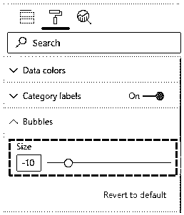

**Note**: If you have cities more than 6 or 7 then it is not advised to use this option. This will unnecessarily fill our map.

*   我们也可以改变地图的主题。默认情况下，道路主题处于选中状态。我们可以选择任何主题，使我们的地图更有吸引力。该选项的使用取决于所使用的数据。

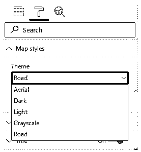

**Note: **Power BI Maps file can also be downloaded from the link below and the final output can be viewed.
You can download this Power BI Maps Template here – [Power BI Maps Template](#popmake-227875)

### 功率 BI 图的优点

*   Power BI 地图，赋予地图生命。
*   这比在 Excel 中使用地图简单多了。
*   它会根据我们使用 Bing 地图上传的数据自动选择城市名称，准确度很高。

### 要记住的事情

*   如果有全球天气数据，我们可以使用热图。
*   根据 Power BI 中使用的[数据使用正确的主题创建地图。](https://www.educba.com/power-bi-drillthrough/)
*   幂 BI 贴图比填充贴图好。地图可视化为上传的区域提供了视觉效果。之后，我们可以放大或缩小来修复地图。
*   气泡的大小应该用来显示数据的大小。

### 推荐文章

这是一个关于 Power BI 中地图的指南。在这里，我们将讨论如何在 power bi 中使用可视化地图，并提供实际示例和可下载的 power bi 模板。您也可以阅读以下文章，了解更多信息——

1.  [电力毕历(例题)](https://www.educba.com/power-bi-calendar/)
2.  [在 Power BI 中创建报告页面工具提示](https://www.educba.com/power-bi-tooltips/)
3.  [如何在 Power BI 中创建气泡图？](https://www.educba.com/power-bi-bubble-chart/)
4.  [Power BI 项目符号图| Power BI 中的自定义视觉效果](https://www.educba.com/power-bi-bullet-chart/)
5.  [电源 BI 连接指南](https://www.educba.com/power-bi-connections/)
6.  [如何设置 Power BI 主题？](https://www.educba.com/power-bi-themes/)
7.  [功率 BI 参数示例指南](https://www.educba.com/power-bi-parameters/)

