# 功率 BI 测量

> 原文：<https://www.educba.com/measures-in-power-bi/>

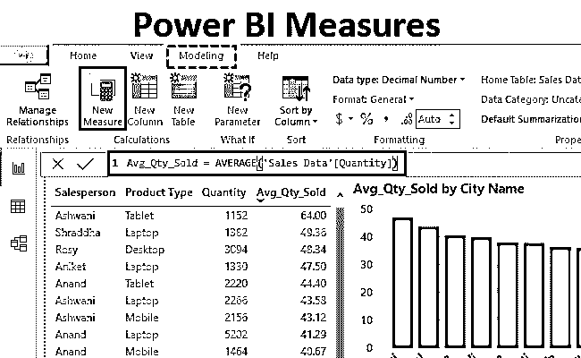

## Power BI 中度量的定义

功率 BI 中的测量值用于定义计算。这是使用 DAX 语言(数据分析表达式)完成的。DAX 计算每行的每个值。然而，如果我们在 excel 中使用这种函数，那么我们将只能获得聚合值。但是在 [Power BI using DAX](https://www.educba.com/power-bi-dax/) 中，我们可以应用我们在 Excel 中使用的任何类型的函数，这也可以在 Power BI using Measures 中使用。在 Power BI 中，我们使用 Measure 来计算不同的函数，并在 DAX 平台中执行不同的数学运算。

### 如何在 Power BI 中创建度量？

函数 fx 栏是我们编写 DAX 度量代码的地方。这里可以使用我们在 MS Excel 中见过的所有功能。如果我们在上传数据后进入编辑查询选项，我们将能够看到 fx 栏功能，我们已经在 MS Excel 中看到并使用了该功能，如下所示。

<small>Hadoop、数据科学、统计学&其他</small>

#### 示例 1–测量功率 BI

下面是一些销售数据，显示了笔记本电脑、台式机、平板电脑和手机等电子产品的销售情况。因此，您可以从下面的链接下载用于本例的 excel 工作簿。

You can download this Power BI Measures Excel Template here – [Power BI Measures Excel Template](#popmake-167767)

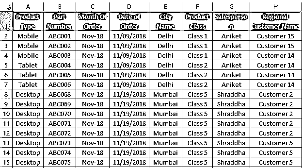

正如我们所看到的，主要列是产品类型、产品类别、单价和销售数量。我们将看到使用上述数据，并插入一些新的列和应用措施。

*   为此，上传 Power BI 中的数据。转到获取数据选项并选择源。

*   一旦我们这样做了，浏览文件位置并打开它。之后，我们将得到一个导航窗口。在此选择我们要上传到 Power BI 中的纸张。这里，该表被命名为**销售数据**。然后点击**载入**。

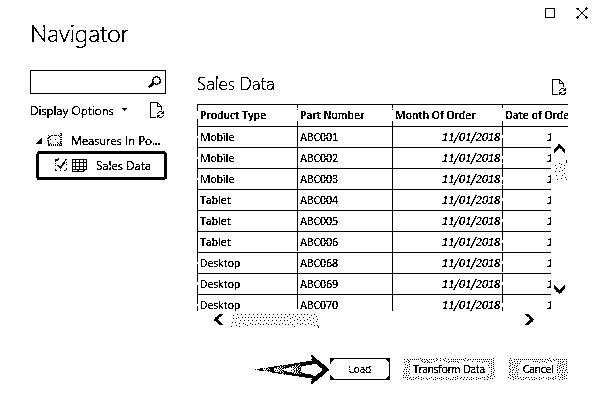

*   我们将能够在 Power BI 的**字段**部分看到上传的数据。

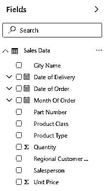

*   这也可以在数据选项卡下看到，如下所示。

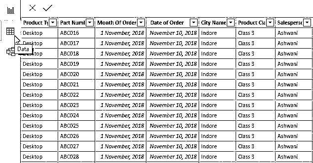

*   这里我们将从上传的表格中删除不必要的列，例如**零件号**列。

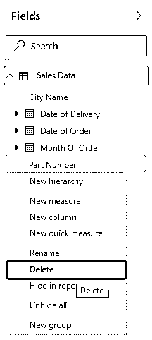

*   此外，现在让我们添加另一个新列作为**最终销售额**。为此，单击表格标题上的任意位置，并选择**新列**。

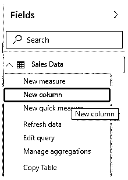

*   给我们想要新插入的列命名。这里我们给出了与上面看到的相同的数据，**最终销售额**。

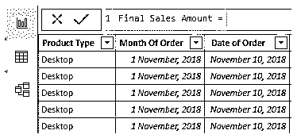

*   现在在公式中写出数学乘法公式，我们将把**单价**和**数量**相乘，得到最终的销售数字。

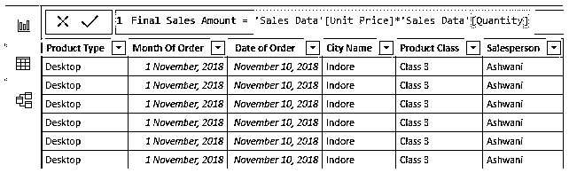

*   然后，我们将能够在**字段**部分看到新插入的列的名称。

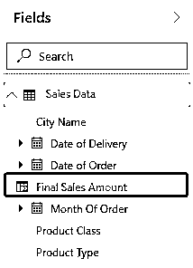

*   现在我们将创建 Measure，在这里我们将添加一个平均销售量的度量。为此，我们可以像上面一样点击右键并选择测量，或者我们可以转到**建模**功能区并从那里选择**测量**。

*   在这里，我们将创建一个计算平均销售量的方法。然后用这样的名字命名并测量。

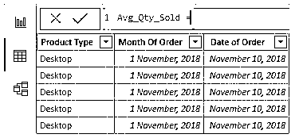

*   现在使用**平均**函数，就像我们在 MS Excel 中做的那样。

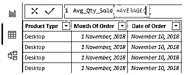

*   然后选择需要计算平均值的列。下面是将表中销售数据的**列数量**列计量。

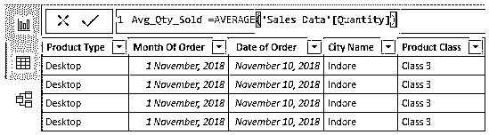

*   一旦完成，然后按回车键。我们将看到，一个名为 **Avg_Qty_Sold** 的新度量被创建在**字段**部分下，如下所示。

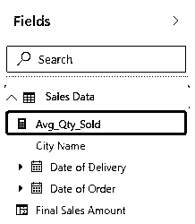

如果需要，我们可以通过在字段部分中单击 2 次来更改已创建度量的名称。

接下来，我们将转到“报告”选项卡，并使用所有创建的“度量”和“计算”列。

*   让我们使用堆积柱形图来比较每个城市的平均销售量。

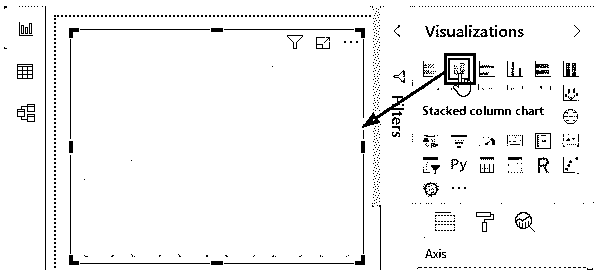

*   为此，我们将把 Avg_Qty_Sold 拖到 values 中，并将城市名称拖到 Axis 中，如下所示。

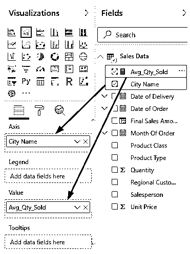

*   我们将看到每个城市平均销售量的曲线图。

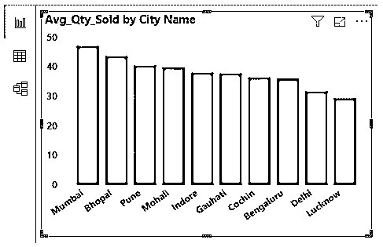

*   现在我们将创建一个表格图表。在那里我们将全面总结我们上传的销售数据。为此，从可视化部分选择表格图表。

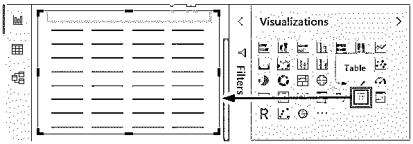

*   现在，为了应用表中创建的字段，我们首先需要确定我们需要得出什么结论。在这里，我们将显示销售人员售出的产品数量以及每个销售人员售出的平均数量。为此，我们将按顺序拖动字段，如下所示。

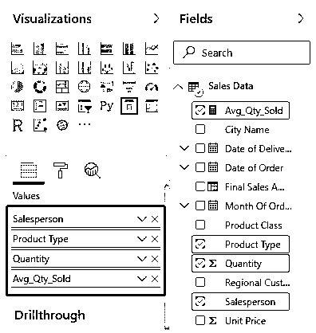

然后我们的表我们看起来像如下所示。

我们可以看到，销售人员 Ashwani 的平均销售记录最高，为 **64.00** 数量。销售人员 Shraddha 给出了所有销售人员中最高的销售数字，即 **4430** 。

这就是我们如何总结和使用创建字段和度量来显示产品，城市和销售人员平均和总销售额。

**注:**功率 BI 测量文件也可从以下链接下载，并可查看最终输出。

You can download this Power BI Measures Template here – [Power BI Measures Template](#popmake-227875)

### 功率 BI 测量的优点

*   度量在创建各种计算任务时非常有用。
*   我们可以在 Power BI 中使用 Measure 来应用所有的 MS Excel 插入函数和 Power BI 函数。
*   我们可以添加任何类型的公式来创建度量。

### 要记住的事情

*   在 Power BI 中使用度量之前，首先，使用 create measures 分析和可视化我们需要查找和总结的内容。
*   功率 BI 的测量主要使用 DAX 创建。
*   度量在表中不可见，但在同一表名的字段部分中可以看到所有度量。
*   当我们在任何图表和可视化中使用它们时，Measure 携带最终给出输出的公式。

### 推荐文章

这是一个功率 BI 测量指南。在这里，我们讨论如何在 power bi 中创建度量来计算不同的 DAX 函数，并给出了实际的例子。您也可以阅读以下文章，了解更多信息——

1.  [如何在 Power BI 中使用](https://www.educba.com/power-bi-filter/) [滤镜](https://www.educba.com/power-bi-filter/) [功能？](https://www.educba.com/power-bi-filter/)
2.  [Power BI 初学者教程](https://www.educba.com/power-bi-tutorial/)
3.  [使用功率 BI IF 语句](https://www.educba.com/power-bi-if-statement/)
4.  [电力毕历(例题)](https://www.educba.com/power-bi-calendar/)
5.  [动力 BI 地图|如何使用？](https://www.educba.com/power-bi-maps/)

