# 电源 BI 报告

> 原文：<https://www.educba.com/power-bi-report/>

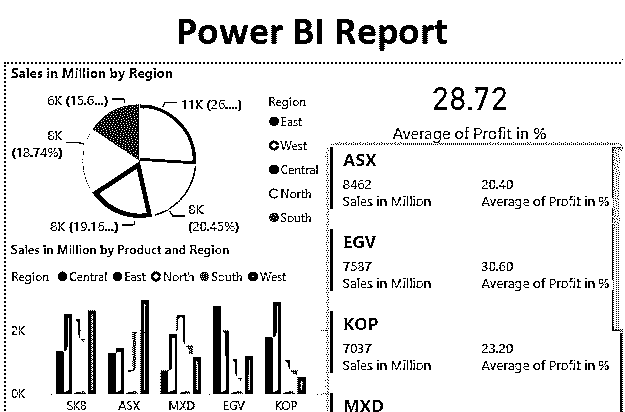

## Power BI 中的报告

报告是任何 BI 和分析工具的元素，它为工具提供了分析特征。Power BI 提供了一种方便有效的方法来构建报告，这些报告可用于推动出色的数据分析。Power BI 提供的各种功能使其成为最受欢迎的 BI 工具之一。报告使利益相关者能够更深入地挖掘数据，以获得有助于他们决策的见解。

### 在 Power BI 中创建分析报告

现在，我们将逐步完成在 Power BI 中创建报告的过程。在本演示中，我们将使用“产品区域销售”数据集。该数据集包含给定地区的各种产品的销售和利润百分比。产品和地区是维度，而销售额和“利润%”是数据集中的度量值。我们继续吧。

<small>Hadoop、数据科学、统计学&其他</small>

要创建 Power BI 报告，您需要处理数据，因此您可以从下面的链接下载 excel 工作簿，该链接用于本示例。

You can download this Power BI Report Excel Template.xlsx here – [Power BI Report Excel Template.xlsx](#popmake-167767)

**步骤 1:** 现在要在 Power BI 中创建参数，首先我们需要在 Power BI 中上传这些数据。要加载必要的数据，请单击主页选项卡中的获取数据下拉菜单。从下拉菜单中选择所需的数据源类型。在这种情况下，它是“Excel”，所以我们点击了它。

")

**步骤 2:** 现在，选择包含必需数据的文件，如下所示。

**步骤 3:** 选择文件，将我们导航到导航器窗格。从窗格中，选择所需的工作表。这种情况下，就是销售。最后，单击 Load 按钮将数据加载到 Power BI 中。

")

**步骤 4:** 加载数据后，可以在 Fields 部分看到必需的维度和度量，如下图所示。

")

**步骤 5:** 首先创建一个报告，点击可视化部分的饼图符号。当我们单击饼图符号时，饼图布局被创建，如下面的屏幕截图所示。通过饼图分析，我们希望了解每个地区对总销售额的贡献。Power BI 为我们提供了对总贡献和百分比贡献的洞察。

")

**步骤 6:** 现在，在“字段”部分，将“图例”字段中的“区域”维度和“百万销售额”拖到“值”字段 measure 中。这将为该地区创建一个饼图，以深入了解销售贡献。

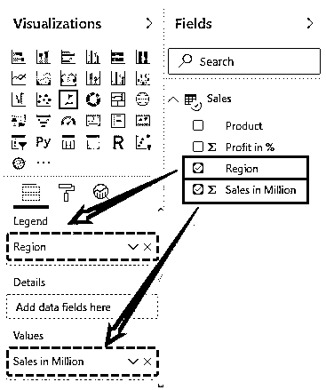

**第 7 步:**创建的饼状图如下图所示。

注意，截图是可视化的放大视图，可以通过点击**“实际视图”**选项(视图- >页面视图- >实际大小)获得。

")

**第 8 步:**接下来，我们将创建一个聚集柱形图。这张图表将使我们能够按地区分析各种产品类型的性能。为了进行分析，点击可视化中的**“簇状柱形图”**选项。

")

**步骤 9:** 在“字段”部分中，依次选择第一个“区域”维度、“百万销售额”度量值和“产品”维度。按照正确的顺序选择字段，我们将得到簇状柱形图，如下图之后的屏幕截图所示。

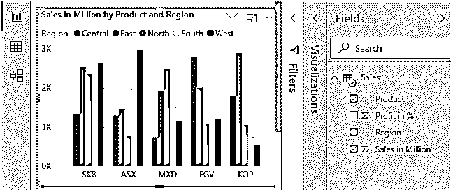

**第十步:**点击“卡片”可视化。

**步骤 11:** 使用卡片可视化非常简单。只需点击我们希望纳入分析的测量。在本例中，我们对“百万销售额”度量感兴趣，所以我们在字段部分检查了它。

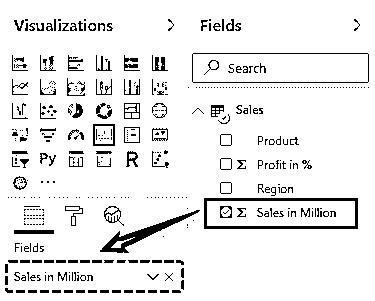

**第 12 步:**下面的屏幕截图显示了分析中的“百万销售额”度量。必须注意，应用于该度量的聚合函数起着重要的作用。在这种情况下，它是 Sum，我们得到总销售额。我们也可以有平均值，但是，在这种情况下，我们更感兴趣的是分析总销售额和相应的平均利润百分比。

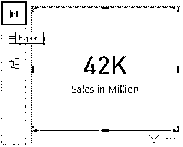

**步骤 13:** 我们还将按照上述程序将平均“利润%”指标纳入分析。默认情况下，度量值的聚合函数是 Sum。要将其更改为平均值，请转到字段部分中相应度量的下拉菜单，然后单击平均值。

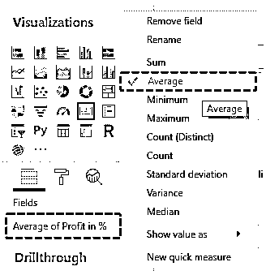

**步骤 14:** 卡片中显示文字自动变为“平均利润%”。

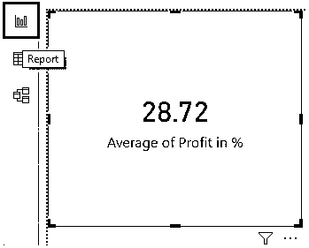

到目前为止，我们已经完成了三项分析。我们希望引入分析的第四个分析是“多行卡”。这种分析类型可以被认为类似于一个表格，它通过图表向我们提供对数据的洞察。我们将为各种产品创建此分析，以便根据产品维度分析总销售额和平均利润百分比。通过推动产品层面的分析，我们将完成销售数据集的分析。

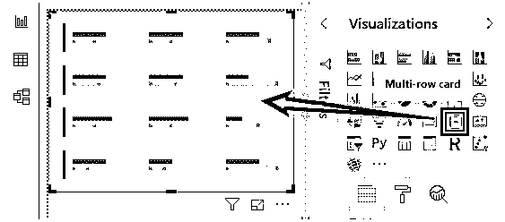

**第 16 步:**接下来，在“字段”部分，选择“产品”维度以及“利润%”和“销售额百万”度量，如下图所示。

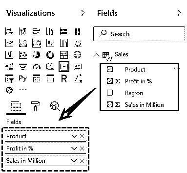

**第 17 步:**按照上述步骤，我们得到了多行卡，其中包含必需的详细信息，如下图所示。

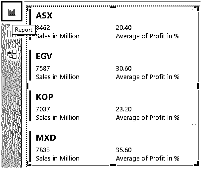

**步骤 18:** 注意，在上面的步骤中，我们按照上一节中提到的必要步骤更改了“利润%”度量的聚合函数。当我们最终完成分析时，我们应该适当地检查报告。因此，让我们来看一下使用上述步骤成功创建的报告。如下图所示。

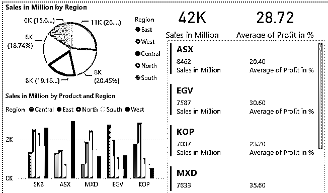

**注意:**我已经对该表进行了大量的格式化，您可以从下面的链接下载 Power BI dashboard 文件，并应用所应用的每种格式化技术。

You can download this Power BI Report Template.pbit here – [Power BI Report Template.pbit](#popmake-227875)

### 要记住的事情

*   只有在正确规划和研究数据集及其元素(即维度和度量)后，才能在 Power BI 中创建报告。
*   Power BI 提供了各种类型的可视化，每一种都有特定的用途。因此，可视化的选择应该基于上下文，并且应该最好地服务于洞察力生成的目的。

### 推荐文章

这是一份电力 BI 报告指南。在这里，我们将讨论如何在 Power BI 中创建用于分析的报告，以及一个示例和可下载的模板。您也可以阅读以下文章，了解更多信息——

1.  [如何在](https://www.educba.com/power-bi-charts/) [功 BI](https://www.educba.com/power-bi-charts/) 中创建图表？
2.  [如何设计](https://www.educba.com/power-bi-pie-chart/) [中的饼状图](https://www.educba.com/power-bi-pie-chart/)？
3.  [6 大电源 BI 连接](https://www.educba.com/power-bi-connections/)
4.  [了解电源 BI 替代方案](https://www.educba.com/power-bi-alternatives/)

