# Power BI SUMX

> 原文：<https://www.educba.com/power-bi-sumx/>

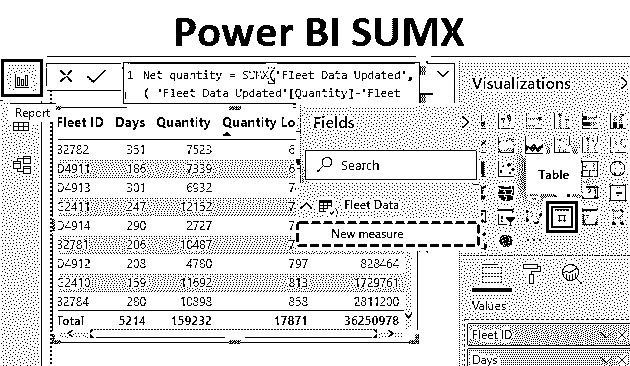

## 功率 BI 中的 SUMX

Power BI 中的 SUMX 函数有助于乘积求和。因此，它首先为每一行执行相应字段值的乘积，然后将它们相加。在 Power BI 中，函数可以通过一个度量或一个列来实现。然而，当它被应用到一个度量中时，实现是有意义的。

### 如何在 Power BI 中实现 SUMX 功能？

为了理解 Power BI 中 SUMX 函数的概念，我们将经历一个逐步的过程。在本次演示中，我们将考虑车队数据集。该数据集包含与各种车队的平均供应量和一年中运行天数相关的数据。这里重要的维度是车队 id，而重要的度量是数量和天数。使用 SUMX 函数，我们打算获得一个车队一年的总数量。让我们按照下面给出的步骤进行操作。

<small>Hadoop、数据科学、统计学&其他</small>

要应用 Power BI SUMX，您需要处理数据，因此您可以从下面的链接下载用于本示例的 excel 工作簿模板。

You can download this Power BI SUMX Excel Template here – [Power BI SUMX Excel Template](#popmake-167767)

*   **步骤 1:** 现在要在 Power BI 中创建参数，首先我们需要在 Power BI 中上传这些数据。进入主菜单，点击**获取数据**选项，了解所有信号源列表，如下所示。由于我们的数据在 excel 中，所以我们将选择 **Excel** 。

")

*   第二步:这将带我们进入浏览窗口。找到文件并打开它。从导航窗口中，选择我们想要在 Power BI 中使用的工作表，然后点击**加载**。

")

*   **步骤 3:** 当文件成功加载到 Power BI 中时，可以在 Fields 部分看到其中的维度和度量。

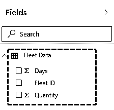

**第 4 步:**现在，在 Visualizations 部分，点击红色方框突出显示的表格符号。

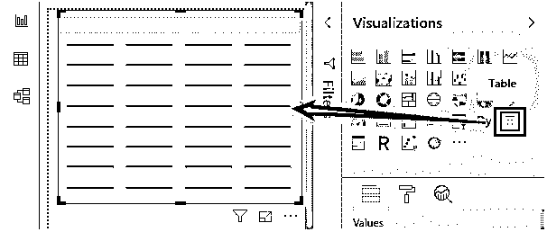

*   **步骤 5:** 接下来，在字段部分，选择所有字段，即维度天数，并测量车队 ID 和数量。当它们被选中时，会创建一个表格，如屏幕截图左侧所示。

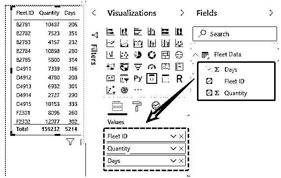

*   **第六步:**上面截图中表格的文字尺寸很小。要增加尺寸，选择“实际尺寸”选项(查看- >页面查看- >实际尺寸)。结果，我们得到了一个文本大小相当不错的表格。

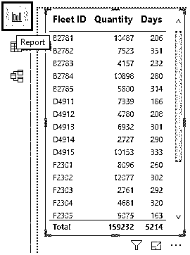

*   **第 7 步:**现在，我们打算将总量带入表中。总数量将是数量和天数的乘积。我们希望每个舰队都这样。这可以通过 SUMX 函数来实现。我们首先需要创建一个度量。因此，单击字段部分中“车队数据”表的“更多选项”,然后单击“新测量”。

")

*   **第 8 步:**当我们点击“New measure”时，我们被导航到表达式栏。度量的默认名称是 measure。

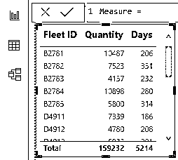

*   **步骤 9:** 将度量的名称更改为 Total Quantity，如下图所示。

")

*   **步骤 10:** 只需如下所示输入 sumx，Power BI 会自动为我们提供参数等详细信息。

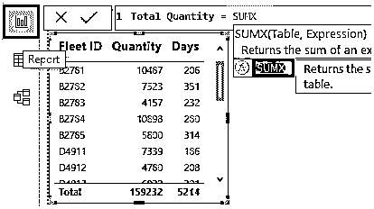

*   **步骤 11:** 当我们在函数中移动时，我们发现表是第一个参数。在此提及相关表格的名称。

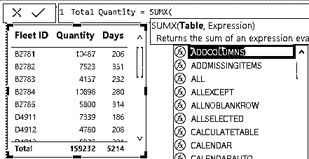

*   **步骤 12:** 现在，在这种情况下，我们只有一个表格，即“车队数据”。所以，只要按 f，我们就能在列表中找到这个表。移动到表名，并按'回车'，它成为第一个参数。

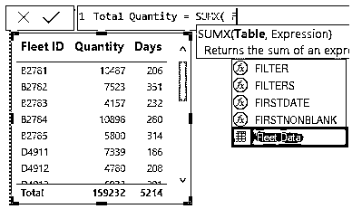

*   **步骤 13:** 一旦我们指定了表名(SUMX 函数中的第一个参数),键入逗号，下一个参数即表达式就被激活了。这是 SUMX 函数非常重要的一部分。

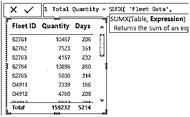

*   **步骤 14:** 仔细观察下面截图中 SUMX 函数中的表达式。我们的表达基本上是数量和天数的乘积。

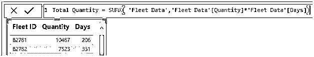

*   **第 15 步:**当使用上述步骤正确实现 SUMX 函数时，就创建了总量度量，如 Fields 部分所示。

")

*   **第 16 步:**选择总量，表格创建完成。

")

*   **第 17 步:**下表详细介绍了总数量。正如我们所看到的，测量成功地给出了正确的数字。这是因为我们对度量执行了 SUMX。如果我们在列上执行，那么对于每个车队 ID，我们将得到产品的总和，而不是每行的产品总和。

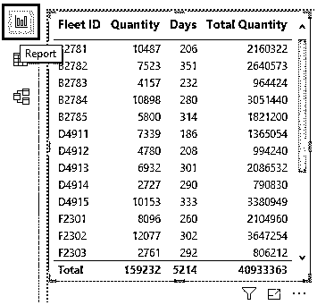

*   **步骤 18:** 现在，另一个字段“数量损失”被添加到数据源中。这一次，必须考虑净数量。公式应为天数和数量的乘积，不包括损耗。按照上一节中提到的程序，加载更新表“车队数据更新”。下面的屏幕截图显示了加载到 Power BI 中的更新数据集。

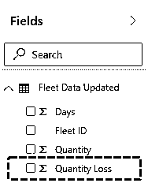

*   **第 19 步** **:** 将“数量损失”字段带入表格后，请看下表。

")

*   **第 20 步:**如下所示，我们实现了 SUMX 表达式，以纳入数量损失的影响。

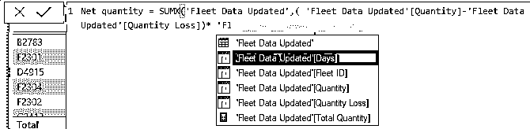

*   **步骤 21:** 仔细观察下面截图中的 SUMX 表情。只是检查它是如何工作的。

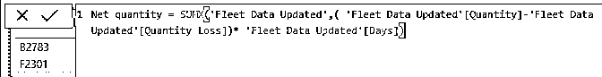

*   **步骤 22:** 现在，在字段部分，选择净数量。

")

SUMX 函数通过给我们正确的结果来完成它的工作。

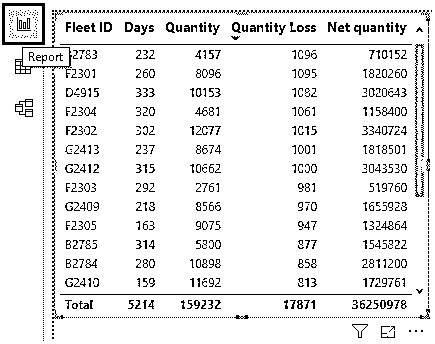

**注意:**要应用条件格式，我们需要数据，您可以下载 Power BI 文件来获得就绪表。

You can download this Power BI SUMX Template here – [Power BI SUMX Template](#popmake-227875)

### 要记住的事情

*   SUMX 函数应该通过 measure 实现，而不是通过 column 实现，否则，对于每个行到行的组合都会获得相同的结果。
*   SUMX 不同于 SUM，因为 SUM 函数只是将所有列值相加。
*   SUMX 函数的实现需要 DAX 语言的知识。

### 推荐文章

这是一个权力 BI SUMX 的指南。这里我们讨论如何用一个例子和可下载的模板来实现 SUMX 函数。您也可以阅读以下文章，了解更多信息——

1.  [如何在](https://www.educba.com/power-bi-charts/) [功 BI](https://www.educba.com/power-bi-charts/) 中创建图表？
2.  [如何设计](https://www.educba.com/power-bi-pie-chart/) [中的饼状图](https://www.educba.com/power-bi-pie-chart/)？
3.  [电源 BI 连接|前 6 名](https://www.educba.com/power-bi-connections/)
4.  [Power BI Drillthrough | Excel 模板](https://www.educba.com/power-bi-drillthrough/)
5.  [惊人的 8 次方 BI 替代方案](https://www.educba.com/power-bi-alternatives/)

