# 功率 BI 图表

> 原文：<https://www.educba.com/power-bi-charts/>

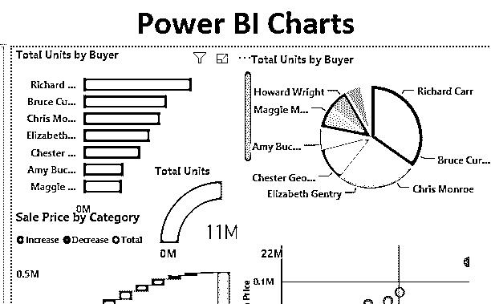

## 功率 BI 图表

Power BI 工具以其可视化图表而闻名。Microsoft Power BI 具有良好的可视化图表，这些图表在显示仪表板中的数据方面起着关键作用。如果数据表达清晰，那么发现洞见就非常容易。

### Power BI 中的十大图表类型

Power Bi 通常有 30 种不同类型的图表。但是前 10 名排行榜是:

<small>Hadoop、数据科学、统计学&其他</small>

1.  簇状条形图
2.  簇状柱形图
3.  瀑布图
4.  圆形分格统计图表
5.  圆环图
6.  折线图
7.  漏斗图
8.  对比图
9.  仪表图
10.  堆积图表

### 如何在 Power BI 中创建图表？

可视化用于有效地呈现您的数据。有不同的方法来创建可视化，将数据集加载到 Power BI 中

*   单击主页选项卡下的获取数据菜单。
*   从“获取数据”下拉菜单中，选择适当的数据源类型。
*   在这种情况下，它是 Excel，所以单击 Excel，如下图所示。

从文件存储的位置选择文件。选择必要的数据集后，在导航窗口中，从 Excel 工作簿中选择适当的工作表，然后单击 Load。

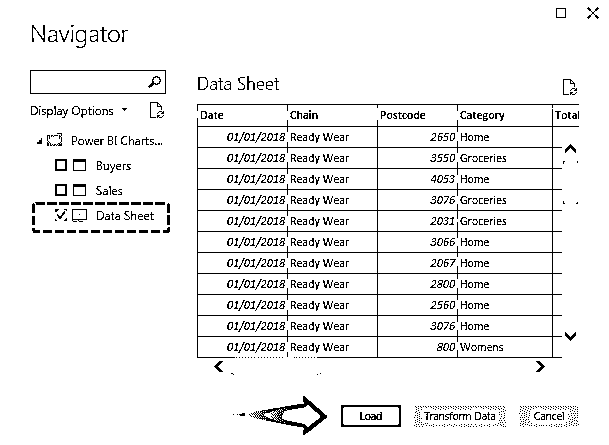

#### #1.簇状条形图

我们将看到的第一个可视化图形是簇状条形图。这个图表也被称为水平条形图。该图表通常用于查看售出的单位数量。图表中的条形可以很容易地显示出销售额。这些条形图是用于表示数据的水平条形图。

*   从可视化图表中选择条形图。

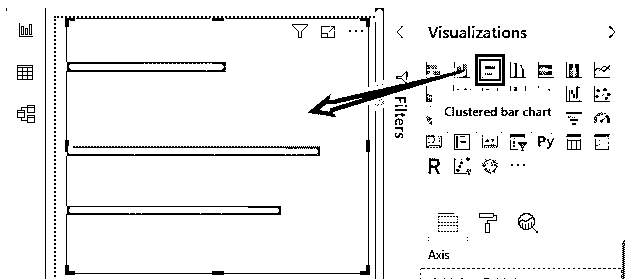

*   从买方表中选择买方，从销售表中选择总单位。

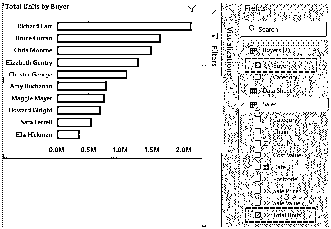

从上面的例子中，我们可以看到条形图显示了哪个买家的购买量最高。

#### #2.簇状柱形图

这个图表与簇状条形图完全相反。簇状柱形图也称为垂直条形图。该图表通常用于检查每个季度整个单位中有多少单位售出，有多少未售出。像这样，我们得到某一年的整个季度。由此，我们得出结论，在哪个季度单位销售更多。

*   从可视化图表中选择聚集柱形图。

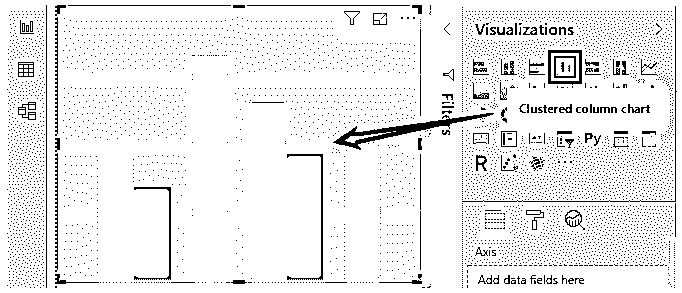

*   选择销售表中的类别，并从销售表中选择成本价和销售价。

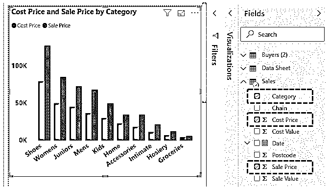

#### #3.瀑布图

瀑布图用于查看市场上各类商品的销售价格。这张图表是瀑布的形式。

*   从可视化图表中选择瀑布图。

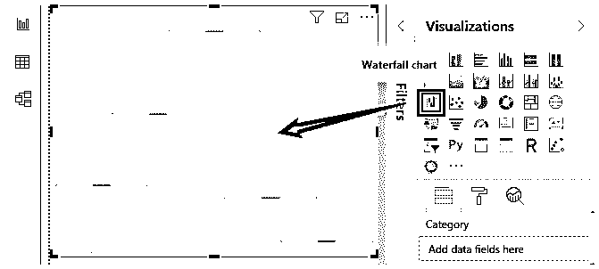

*   从销售表中选择类别选项和销售价格。

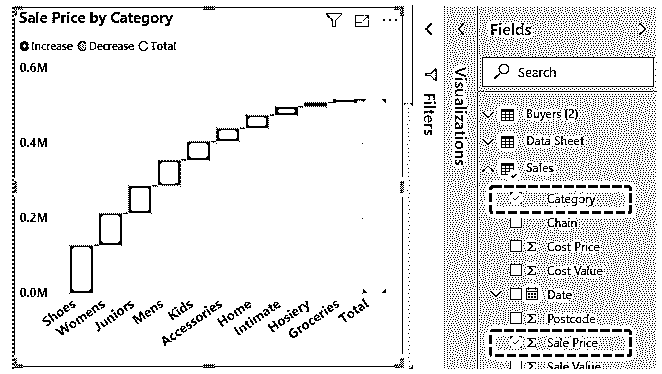

#### #4.圆形分格统计图表

饼图通常用于买方明智的总销售量。饼图一般是圆形的。里面填满了颜色。从下图我们可以得出结论，理查德·卡尔的销售额最高。

*   从可视化表格中选择饼图。

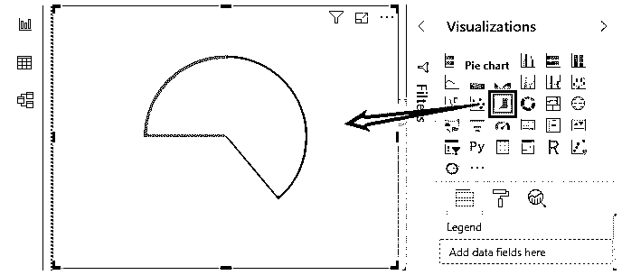

*   从买方表中选择买方，从销售表中选择总单位。

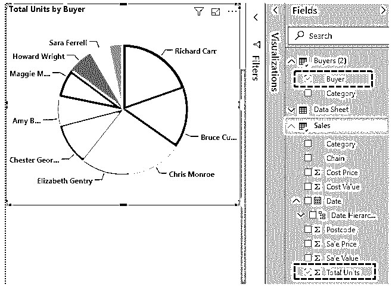

#### #5.圆环图

圆环图是圆环形式的图表。这个圆环图通常用来显示每个买家的销售额。

*   从可视化表格中选择圆环图。

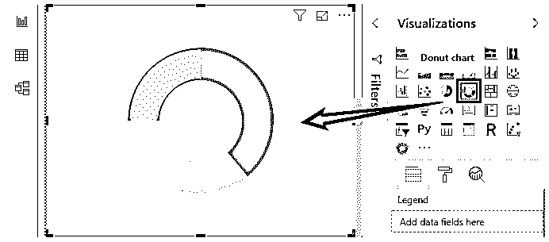

*   从 Buyers 表中选择 Buyers 选项，从 Sales 表中选择 total units。

#### #6.折线图

折线图一般在两类之间制作。图表包含线条。折线图一般用来看总产品有没有卖出去。它还说明我们是否达到了目标值。这里，两个数据点之间没有填充颜色。

*   从可视化图表中选择折线图。

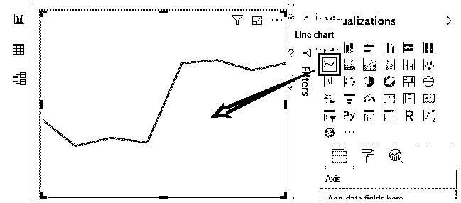

*   选择类别选项。单击成本值和销售值。

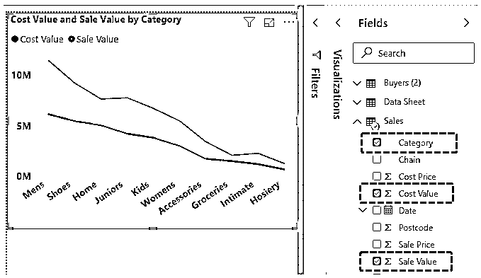

*   这显示了成本价值和销售价值之间的实际差异。

#### #7.漏斗图

漏斗图通常用于查看买方的单笔销售额。这个图表是漏斗形的，所以它是漏斗形的。

*   在可视化图表中选择漏斗图选项。

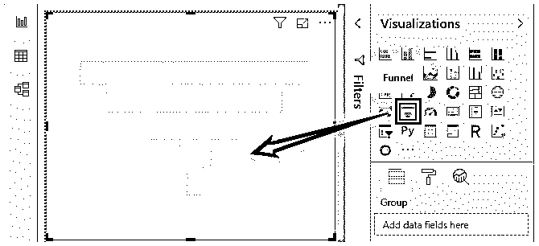

*   在“买方”表中选择“买方”选项，在“销售”表中选择“总单位”。

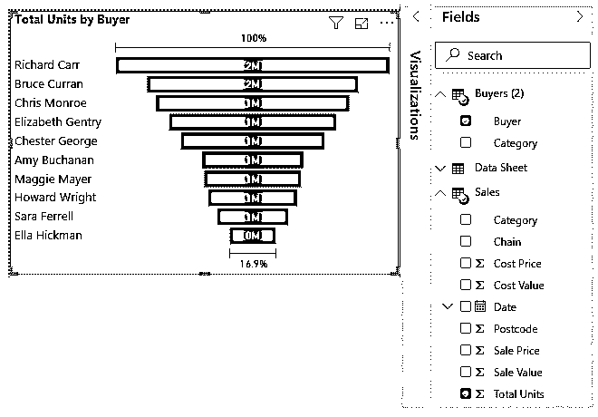

*   从上面的图表中，我们可以得出结论，理查德·卡尔正在做更多的销售。

#### #8.对比图

面积图是折线图的高级版本。这里，该区域用两个数据点之间的颜色填充。这里，我们选择了总单位、销售值和成本值。由于这个图表，决定可以很快做出。

*   从可视化表格中选择面积图。

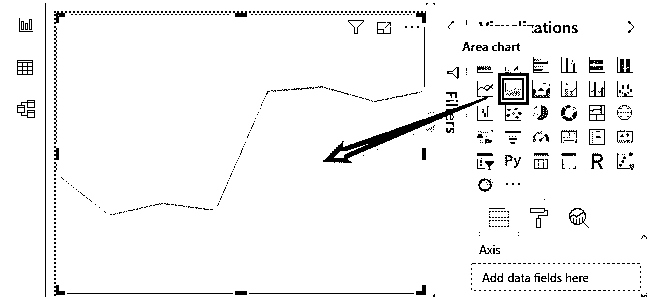

*   从销售表中选择类别以及总单位、销售值和成本值。

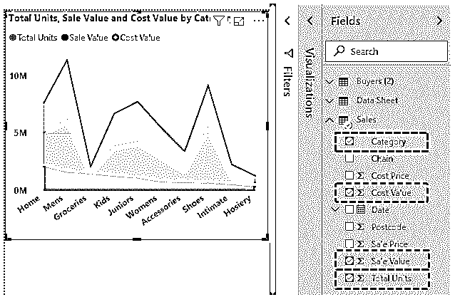

#### #9.仪表图

量表通常用于设定目标值，并检查我们最终达到了多少值。这里的目标值是 100，我们已经达到了 85。这意味着销售已经达到了 85%。

*   从可视化表格中选择仪表图。

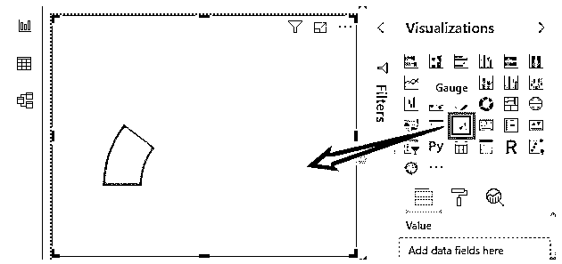

*   从销售表中选择总销售量。

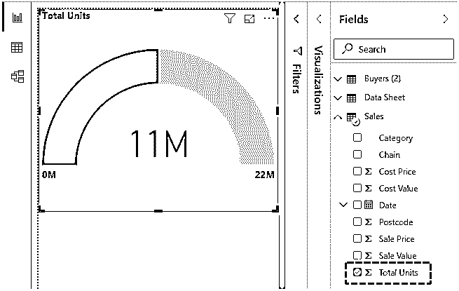

#### #10.散点图

散点图是在两个数据点之间绘制的图表。

**步骤:**

*   从可视化图表中选择散点图。

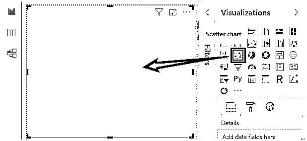

*   从销售表中选择类别，从销售表中选择成本价和销售价。

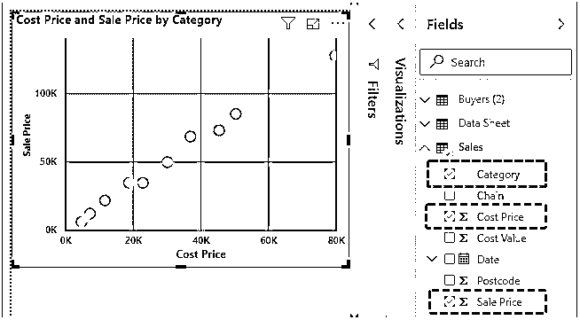

#### #11.仪表盘

仪表板是我们在一个地方显示所有图表的地方。在这里，我们可以很容易地识别见解，并向我们的客户解释。由于这一点，其他人会因为丰富的视觉化而注意倾听我们的见解。下面是我们的销售和买家数据集的仪表板。

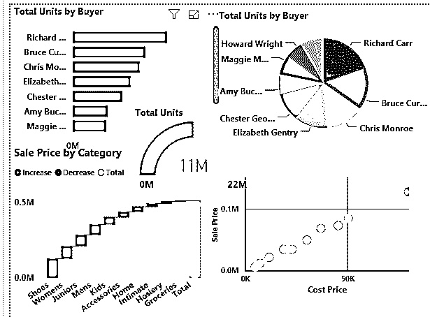

**NOTE*****:** Power BI Charts can also be downloaded from the link below and the final output can be viewed.*You can download this Power BI Charts Template here – [Power BI Charts Template](#popmake-227875)

### 要记住的事情

*   折线图和面积图不一样。主要区别是有差距。在面积图中，两点之间的间隙用颜色填充，而在折线图中，两点之间的间隙不填充。
*   甜甜圈和饼图并不相似。主要区别是圆中间的空间。在圆环图中，空间更大。它可以通过减小粒度的大小来减小。在饼图中，间隙由各自的颜色填充。

### 推荐文章

这是一份功率 BI 图表指南。在这里，我们将讨论 Power BI 中的 10 大图表类型，以及分步示例和可下载的 Power BI 图表模板。您也可以阅读以下文章，了解更多信息——

1.  [如何创建 Power BI 气泡图？](https://www.educba.com/power-bi-bubble-chart/)
2.  [使用功率 BI IF 语句](https://www.educba.com/power-bi-if-statement/)
3.  [电源 BI 提示](https://www.educba.com/power-bi-tooltips/)
4.  [电力 BI 饼状图指南](https://www.educba.com/power-bi-pie-chart/)

