# 功率 BI 饼图

> 原文：<https://www.educba.com/power-bi-pie-chart/>

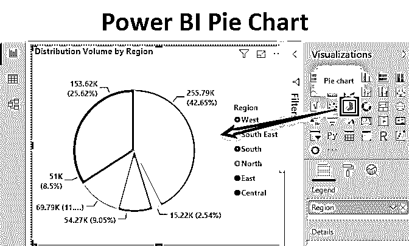

## Power BI 中的饼图

Power BI 中的饼图主要用于可视化各种类别的百分比贡献，以便评估这些类别的性能。饼图是方便的工具，因为它们提供了洞察力，可以快速有效地做出决策。Power BI 提供了一种简单快捷的方法来构建饼图。

### 如何在 Power BI 中设计饼状图？

为了理解 Power BI 中饼图的概念，我们将进行一次基于配电装置容量数据集的演示。该数据集包含分布在印度各个城市的体积。由城市代码表示的城市是配送区域层级中的最低区域。一个分销单位由许多城市组成，而该地区下有各种分销单位。重要的维度是分布单元、区域和模式，而分布量是数据集中存在的度量。维度模式表示分配产品的模式。

<small>Hadoop、数据科学、统计学&其他</small>

要设计 Power BI 饼图，您需要处理数据，因此您可以从下面的链接下载用于本示例的 excel 工作簿模板。

You can download this Power BI Pie Chart Excel Template here – [Power BI Pie Chart Excel Template](#popmake-167767)

让我们一步一步地在 Power BI 中创建和使用饼图。具体步骤如下。

*   **第一步:**将数据集加载到 Power BI 中。单击主页选项卡下的获取数据菜单。从获取数据的下拉菜单中，选择适当的数据源类型。在本例中，它是 Excel，因此单击 Excel，如下图所示。

*   **第二步:**从存储位置选择数据源文件。

*   **步骤 3:** 当文件被加载时，我们会收到一条消息，显示正在建立连接。

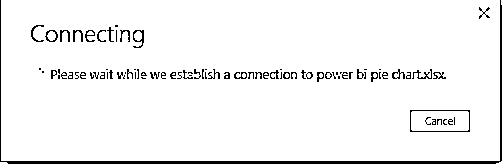

*   **步骤 4:** 一旦连接建立，我们就被导航到“Navigator”窗格。在工作簿中所有可用的工作表中单击合适的工作表。在这种情况下，我们分析的数据出现在“配电装置体积”表中，因此，单击它。

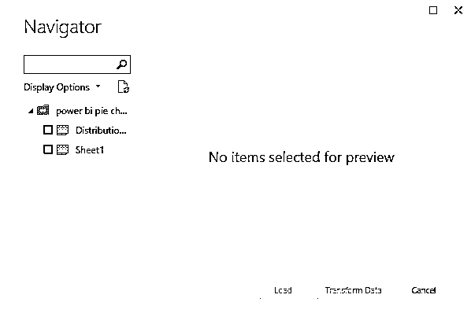

*   **步骤 5:** 当我们选择一个工作表时，它的内容会显示在右边，如下图所示。单击以黄色突出显示的 Load 按钮，将数据加载到 Power BI 中。

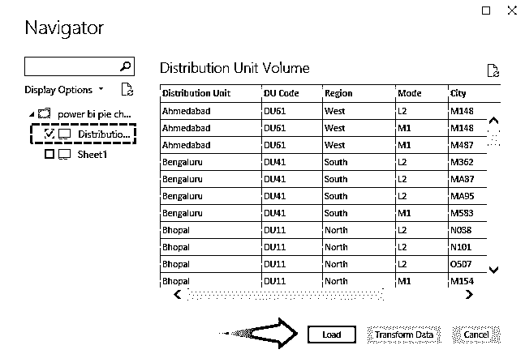

*   **步骤 6:** 当数据成功加载到 Power BI 中时，可以在字段部分看到数据集中的维度和度量，如下图所示。

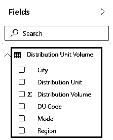

*   **第 7 步:**现在使用饼图，首先点击可视化部分的饼图符号。如下图所示。

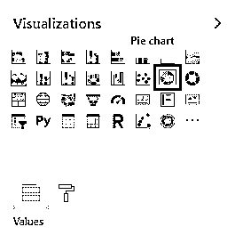

*   **步骤 8:** 当我们点击可视化部分的饼图符号时，我们得到饼图布局。为了在布局中创建一个有意义的饼图，我们必须引入必要的维度和度量。

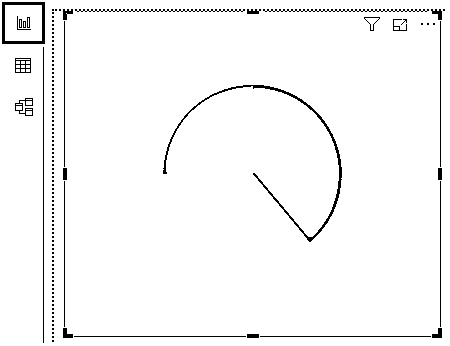

*   **第 9 步:**要创建一个以分布量为相关度量的区域饼图，请选择区域维度和分布量度量，如下面屏幕截图右侧的字段部分所示。当我们选择必要的字段时，我们会得到一个饼图，如下面截图中左侧所示。

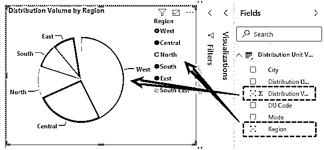

*   **第十步:**饼图及其元素的默认大小为小。我们可以通过选择“实际尺寸”选项来缩放可视化效果(视图- >页面视图- >实际尺寸)。下面的截图显示了我们使用上述方法获得的尺寸相当大的饼图。注意，功率 BI 饼图很特殊，因为从下面的截图中可以看出，我们得到了两个数据，即。维度(本例中为区域)的百分比贡献以及度量的绝对值。所以，Power BI 饼状图是相当有见地的。

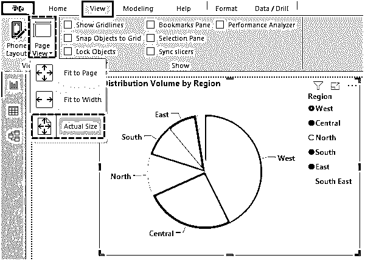

仔细观察上面的饼图，我们发现如果顺时针方向移动，扇区的大小会继续减小，反之亦然。我们也可以说，如果我们顺时针移动，数据将按降序排序，如果我们逆时针移动，数据将按升序排序。

*   **步骤 11:** 我们可以通过点击“聚焦模式”选项来增加默认饼图可视化的大小，如下图所示。

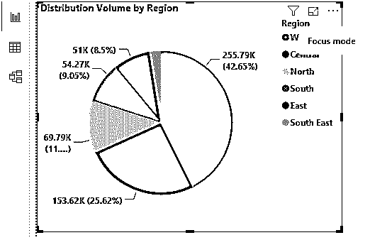

*   **步骤 12** :为了理解某些概念，我们将恢复到之前的状态。只需按下 **CTRL + Z** 即可进入饼状图的前一个状态。

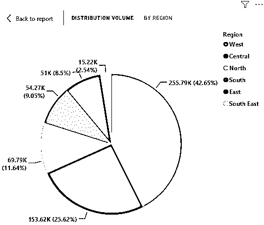

*   **步骤 13:** 现在，点击饼图的“更多选项”，我们将看到各种选项。这些选项中的大多数都是不言自明的，但是仍然必须通过逐个选择和测试来探索它们。现在，我们将对结果进行排序，在底部选择“排序方式”,然后单击“区域”,如下图所示。

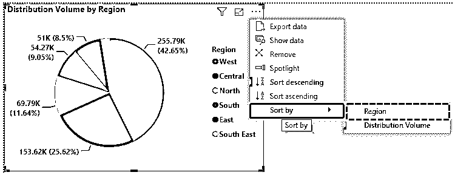

*   **第 14 步:**上述过程按照区域标签的反字母顺序对饼图结果进行排序，如下图所示。

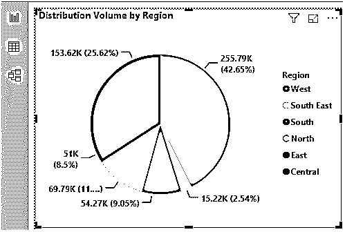

*   **步骤 15:** 我们为模式维度创建了另一个饼图，如下图所示。这个饼图让我们了解了不同分销模式的百分比份额。正如我们所看到的，Mode L2 在销售量上占有最高的份额。

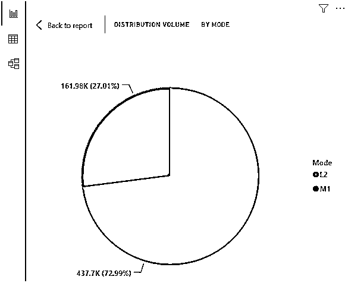

*   **第 16 步:**现在我们知道，Power BI 中的饼图提供了某项指标的绝对贡献值和百分比贡献值。如果我们打算只有百分比贡献数字呢？为此，在“值”部分，单击“分布体积度量”，并在弹出菜单的“值显示为”中，选择“总计的百分比”。

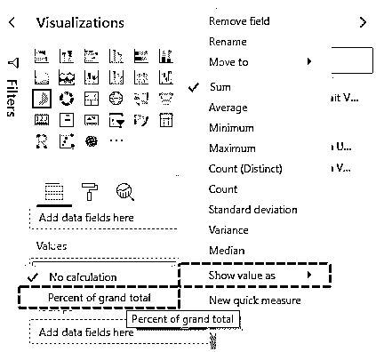

*   **步骤 17:** 现在观察下一个截图之后的截图。在这两个地方，我们得到了相同的值。

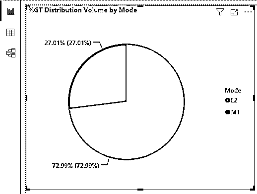

**NOTE*****:** Power BI Pie Chart file can also be downloaded from the link below and the final output can be viewed.*You can download this Power BI Pie Chart Template here – [Power BI Pie Chart Template](#popmake-227875)

### 要记住的事情

*   在 Power BI 中，我们不需要执行任何额外的步骤来获得饼图中的百分比贡献值，因为它们是由 Power BI 自动提供的。
*   饼图的其他变体(如圆环图和仪表图)不依赖于 Power Bi 中的饼图，而是作为现成的图表提供。

### 推荐文章

这是一个功率 BI 甘特图的指南。在这里，我们讨论如何在 Power BI 中设计饼图，并提供一个示例和可下载的模板。您也可以阅读以下文章，了解更多信息——

1.  [如何创建 Power BI 气泡图？](https://www.educba.com/power-bi-bubble-chart/)
2.  [什么是](https://www.educba.com/power-bi-bullet-chart/) [异能匕](https://www.educba.com/power-bi-bullet-chart/)中的子弹图？
3.  [Power BI 工具提示|创建报告页面工具提示](https://www.educba.com/power-bi-tooltips/)
4.  [异能匕钻取|如何使用？](https://www.educba.com/power-bi-drillthrough/)
5.  [如何设置 Power BI 主题？](https://www.educba.com/power-bi-themes/)
6.  [电源 BI 参数|如何工作？](https://www.educba.com/power-bi-parameters/)
7.  [电力 BI 替代方案指南](https://www.educba.com/power-bi-alternatives/)

