# Power BI 项目符号图

> 原文：<https://www.educba.com/power-bi-bullet-chart/>

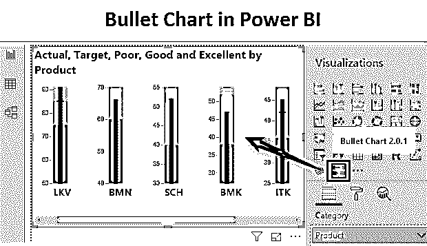

## Power BI 中的子弹图是什么？

以下文章提供了 Power BI 项目符号图的概要。项目符号图是一种可视化图表类型，可提供出色的洞察力。尽管有点复杂，但该图表是衡量 KPI 绩效的有效工具。Power BI 提供了一种复杂的机制来构建项目符号图，并使用它们来制定决策。这些图表非常有用，尤其是在要进行各种类别的性能测量的情况下。

### 如何在 Power BI 中创建项目符号图？

为了理解 Power BI 中项目符号图的概念，我们将使用产品销售数据集。该数据集包含与六种不同产品相关的数据。每种产品都有五种衡量标准，即实际、目标、差、好和优秀。使用这些方法，我们将为每个产品构建项目符号图。项目符号图考虑了多种衡量标准。让我们按如下方式进行演示。要创建项目符号图，我们需要数据。因此，您可以从下面的链接下载用于本例的 excel 工作簿。

<small>Hadoop、数据科学、统计学&其他</small>

You can download this Power BI Bullet Chart Excel Template here – [Power BI Bullet Chart Excel Template](#popmake-167767)

在接下来的部分中，我们将详细介绍在 Power BI 中创建项目符号图表的一步一步的过程。

**第一步:**将数据集加载到 Power BI 中。单击主页选项卡下的获取数据菜单。从获取数据的下拉菜单中，选择适当的数据源类型。在这种情况下，它是 Excel，所以单击 Excel，如下图所示。

**步骤 2:** 在 Navigator 窗格中，从工作簿中选择适当的工作表(本例中为 Sales)。工作表中的数据被加载，如窗格右侧所示。最后，单击以黄色突出显示的 Load 按钮，将数据加载到 Power BI 中。

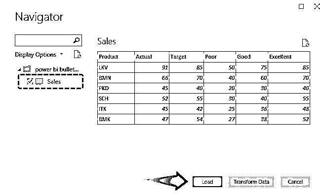

正确地遵循上述过程可以成功地将数据加载到 Power BI 中，所需的维度和度量可以在屏幕截图右侧的字段部分看到。

**步骤 3:** 我们已经加载了数据，如下图所示。

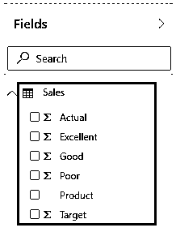

**步骤 4:** 项目符号图在可视化部分中不可用作内置图表选项，它需要从市场中导入。只需点击可视化部分的“导入自定义视觉”图标，在弹出的菜单中，点击“从市场导入”。

**步骤 5:** 现在，使用适当的凭证登录，即用户名和密码。

**步骤 6:** 我们只能使用公司或学生 ID 来访问此功能。成功登录后，我们将进入 Power BI Visuals Marketplace，如下图所示。点击 Marketplace，出现可用的视觉效果。我们必须从这些选项中选择所需的视觉效果。在左侧的搜索框中搜索所需的内容。

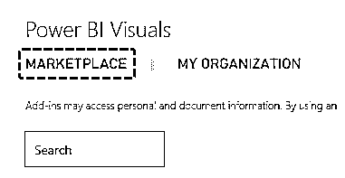

**步骤 7:** 当我们在 Marketplace 中搜索“bullet”时，会出现各种可视化选项，我们可以从中选择所需的选项。继续之前，请阅读待选选项的说明。我们选择了第一个项目符号图表选项。单击图表工具右侧的 Add 按钮，将图表添加到 Power BI 中。

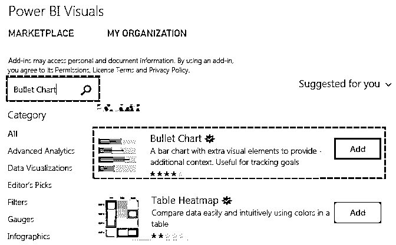

**步骤 8:** 当图表成功导入 Power BI 时，我们会得到一条成功消息，如下面的屏幕截图所示。单击“确定”继续。

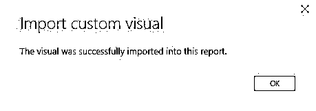

**第 9 步:**下面的截图显示了新导入的项目符号图可视化被突出显示。单击可视化部分中的项目符号图表符号。

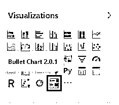

**第 10 步:**我们得到了一个项目符号图布局，如下图左侧所示。为了获得所需的项目符号图，我们将在此布局中引入必要的字段。

**步骤 11:** 现在，逐个选择字段。按顺序选择产品、实际、目标、差、好和优秀。为了生成正确的项目符号图，顺序非常重要。

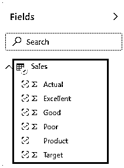

**第 12 步:**当我们按照上面的步骤正确操作时，就会生成项目符号图，如下图所示。这里，内部的黑色条代表实际度量，细长的垂直线代表目标，灰色、天蓝色和红色分别代表差、好和优秀的度量。

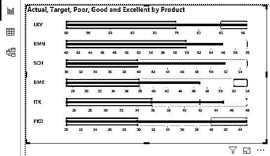

**第 13 步:**我们成功地生成了项目符号图可视化。但是，我们希望用灰色、天蓝色和红色分别表示差、好和优秀的标准。要格式化图表，请单击“格式化”符号。

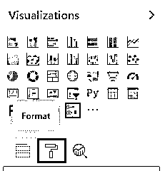

**第十四步:**首先，我们将改变图表的方向。在“格式”部分的“方向”部分，单击必要的选项。从可用选项中，我们选择了“垂直底部”选项。

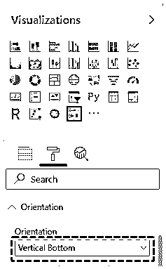

**步骤 15:** 当我们按照上面的步骤选择“垂直底部”选项时，我们得到垂直的项目符号图。请注意，产品名称出现在项目符号图表下方。

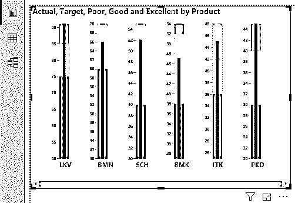

现在，我们可以在颜色部分设置所需的颜色。这里“最低”代表差，“需要改进”代表好，“满意”代表优。

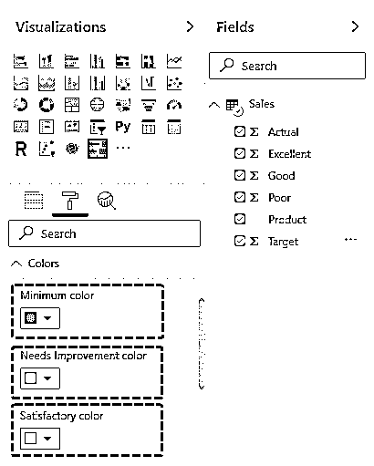

**步骤 17:** 现在，我们已经将最小值设置为紫色，将需要改进设置为绿色，将满意设置为黄色。

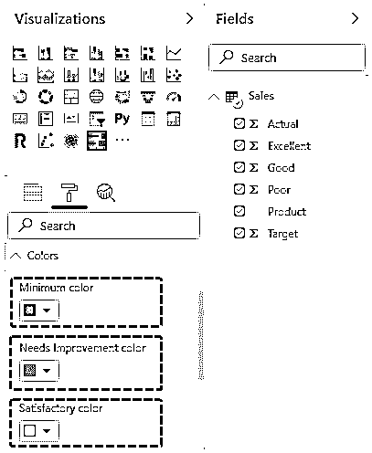

**步骤 18:** 现在，从下面的截图中可以看出，我们得到了一个项目符号图，其中红色代表差的性能类别，黄色代表好的性能，而绿色代表优秀。我们可以在下面的截图中看到，BMN、施乐和 BMK 的产品未能达到目标，而其余三个产品则远远超过了目标。

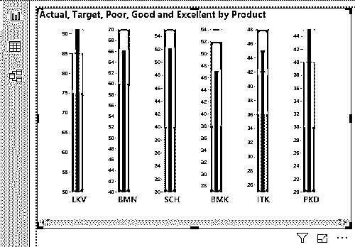

**Note:** Power BI Bullet Chart file can also be downloaded from the link below and the final output can be viewed.You can download this Power BI Bullet Chart Template here – [Power BI Bullet Chart Template](#popmake-227875)

### 要记住的事情

*   项目符号图表可视化不能作为内置可视化图表类型直接使用。它需要从市场导入到 Power BI 中。
*   要生成项目符号图，必须以适当的顺序选择度量，否则将生成不正确的可视化。
*   市场上可用的各种项目符号图选项应该已经过试验，以便了解它们各自提供的独特功能。

### 推荐文章

这是一个权力 BI 项目符号图指南。在这里，我们将讨论如何在 Power BI 中创建项目符号图，以及示例和可下载的 Power BI 模板。您也可以阅读以下文章，了解更多信息——

1.  [电力毕历(例题)](https://www.educba.com/power-bi-calendar/)
2.  [如何创建 Power BI 气泡图？](https://www.educba.com/power-bi-bubble-chart/)
3.  [创建功率 BI 图表的简单步骤](https://www.educba.com/power-bi-charts/)
4.  [动力 BI 钻取|如何工作？](https://www.educba.com/power-bi-drillthrough/)

