# 功率双甘特图

> 原文：<https://www.educba.com/power-bi-gantt-chart/>

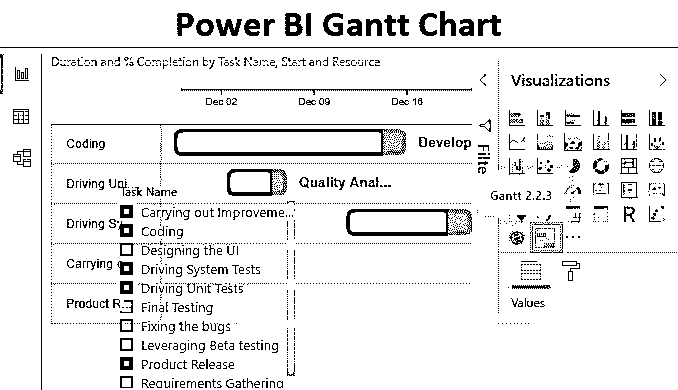

## 什么是甘特图？

甘特图通常用于项目管理，是按时查看活动(任务或事件)的最流行和最有用的方法之一。它是甘特图，是项目管理专业人员的一种方便工具，主要用于跟踪项目。甘特图实质上是将项目信息转化为直观的表示。通过可视化的表示来监控项目的进展比实际查看数据要容易得多。Power BI 提供了一个最新的甘特图功能，使用它可以构建一个有洞察力的甘特图。

### Power BI 甘特图的组成部分

甘特图由一些重要的部分组成。这些措施如下:

<small>Hadoop、数据科学、统计学&其他</small>

**1。** **任务:**任务基本上是项目中涉及的活动。
2**。持续时间:**是指完成每项任务的预计时间线。
**3。任务开始执行的日期。
**4。完成百分比:**它基本上显示了任务工作已经完成了多少。
**5。资源:**项目所需的技术、领域或其他专家。**

要创建 Power BI 甘特图，您需要处理数据，因此您可以从下面的链接下载用于本示例的 excel 工作簿模板。

You can download this Power BI Gantt Chart Excel Template here – [Power BI Gantt Chart Excel Template](#popmake-167767)

### 如何在 Power BI 中创建甘特图？

在下一节中，我们将详细介绍在 Power BI 中创建甘特图的步骤。

*   **第一步:**将数据集加载到 Power BI 中。单击主页选项卡下的获取数据菜单。从获取数据的下拉菜单中，选择适当的数据源类型。在这种情况下，它是 Excel，所以单击 Excel，如下图所示。

*   **第二步:**从存储位置选择文件。选择必要的数据集后，在导航窗口中，从 Excel 工作簿中选择适当的工作表，然后单击 Load。

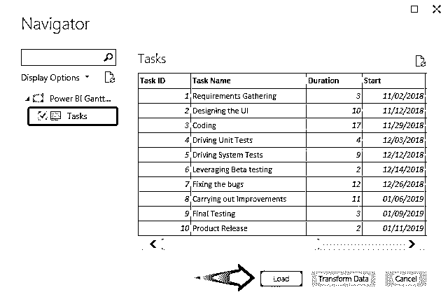

*   **步骤 3:** 数据加载到 Power BI 中。在屏幕右侧可以看到数据集中存在的必要维度和度量。

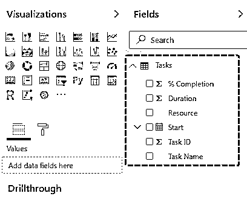

*   **步骤 4:** 注意，在上面的截图中，在可视化部分我们找不到甘特图。这是因为，甘特图不是直接可用的，它需要作为自定义可视化导入。为此，单击下面突出显示的“导入自定义视觉”符号。

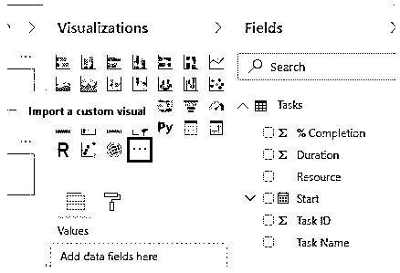

*   **步骤 5:** 甘特图需要从市场导入，因此单击“从市场导入”选项。

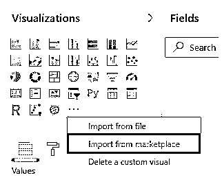

*   **第六步:**需要通过官方邮箱 id 注册。登录以访问市场。

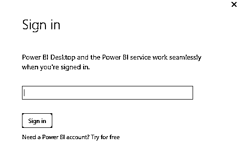

*   **步骤 7:** 在 marketplace 窗口的搜索中，键入“Gantt”以发现所有可用的甘特图选项。如下图所示。我们得到一个甘特图列表，只需点击 Add 按钮，将图表添加到 Visualizations 部分。

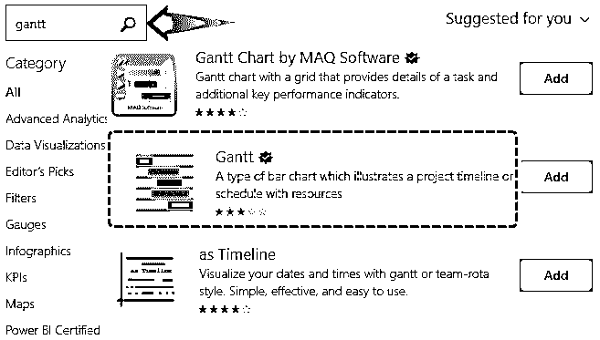

*   **步骤 8:** 一旦图表被导入到 Power BI 环境中，我们就会得到一条成功消息，如下所示。

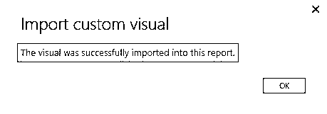

*   **步骤 9:** 导入的甘特图可以在可视化部分找到。它已经在下面的截图中突出显示。

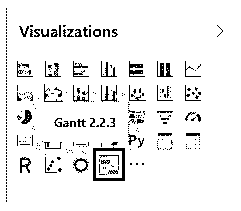

*   **第十步:**图表可以带入分析。为此，单击新带来的甘特图符号，如下所示。

*   **第 11 步:**甘特图是由某些部分组成的。作为给出项目进度的清晰细节并帮助项目经理监控任务的可视化工具，它必须明智地使用每个组件。Power BI 作为一种可视化分析工具，可以很好地确保项目的甘特图以最有效的方式给出细节。

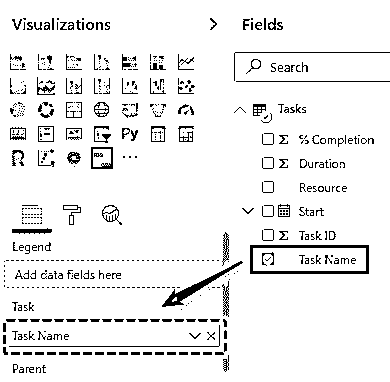

为了生成有洞察力的甘特图，我们必须将维度或度量拖到字段部分的相应组件上。我们将按顺序一个接一个地拖动它们。让我们首先从任务名称开始。将任务名称维拖到字段部分中的任务上。确保在相应字段上拖动维度或度量时，密切观察甘特图受到的影响。

*   步骤 12: 现在，将 Start 拖动到字段中的 Start 上。

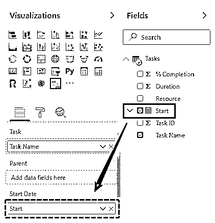

*   **步骤 13:** 现在，在字段中的持续时间上拖动测量持续时间。

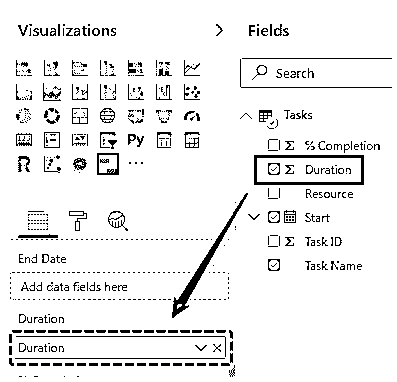

*   **步骤 14:** 现在，将“完成百分比”度量拖到“字段”部分的“完成百分比”上。

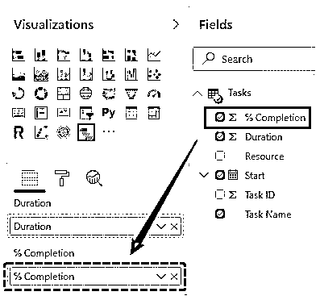

*   **第 15 步:**最后将资源拖到字段中的资源上。请记住，资源是项目的一个非常重要的组成部分，甘特图必须有它。

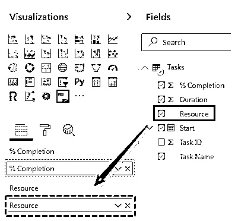

*   **第 16 步:**当我们正确执行上述步骤时，我们最终会得到如下截图所示的甘特图。在这里，甘特图有两种颜色，浅绿色和深绿色。前者对应于持续时间，而后者对应于完成百分比。通过这种方式， [Power BI 中的甘特图为我们提供了对项目进度的详细了解。然而，在下面的图表中，文字的尺寸太小了。我们将按照下一节中提到的步骤来解决这个问题。](https://www.educba.com/power-bi-drillthrough/)

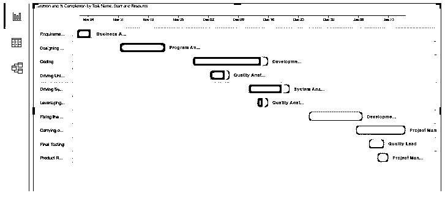

*   **第 17 步:**在“视图”选项卡的“页面视图”菜单下，选择“实际尺寸”，点击即可。下面的截图说明了这一点。

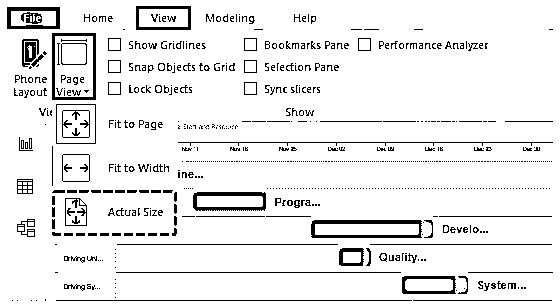

按照上面的步骤，我们得到了一个有洞察力的甘特图。现在，我们可以看到文本的大小增加了很多。我们可以使用卷轴来查看它的必要部分。

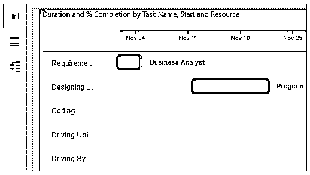

*   **步骤 18:** 从上面我们可以看到，任务名称已经被稍微掩埋了，我们无法清楚地查看名称。为了克服这个问题，我们可以使用一个切片器，这样就可以正确地查看任务名称。下面的屏幕截图显示了添加一个切片器，以方便任务选择。

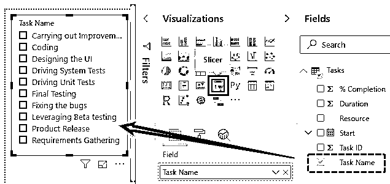

切片器还允许我们根据自己的需求选择任务，并分析项目进度。如下图所示。

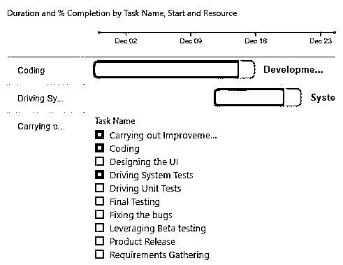

**注:** Power BI 仪表板文件也可从以下链接下载，并可查看最终输出。

You can download this Power BI Gantt Chart Template here – [Power BI Gantt Chart Template](#popmake-227875)

### 要记住的事情

*   甘特图 as 功能不能直接使用，需要从市场导入。
*   甘特图有不同的组成部分，所有这些都必须考虑在内。此外，它们必须对应于各自的字段。
*   在市场上，各种类型的甘特图都是可用的。一个一个地探索它们总是好的，以便发现它们中的每一个所提供的独特性。

### 推荐文章

这是一个功率 BI 甘特图的指南。在这里，我们将讨论如何创建 Power BI 甘特图，以便将项目信息转换为可视化表示，并给出了一个实例。您也可以阅读以下文章，了解更多信息——

1.  [使用功率 BI IF 语句](https://www.educba.com/power-bi-if-statement/)
2.  [电力毕历(例题)](https://www.educba.com/power-bi-calendar/)
3.  [Power BI 工具提示|创建报告页面工具提示](https://www.educba.com/power-bi-tooltips/)
4.  [如何创建 Power BI 气泡图？](https://www.educba.com/power-bi-bubble-chart/)
5.  [Power BI 项目符号图指南](https://www.educba.com/power-bi-bullet-chart/)
6.  [功率 BI 图表的步骤](https://www.educba.com/power-bi-charts/)
7.  [权力 BI 主题|如何设置？](https://www.educba.com/power-bi-themes/)

