# Power BI 气泡图

> 原文：<https://www.educba.com/power-bi-bubble-chart/>

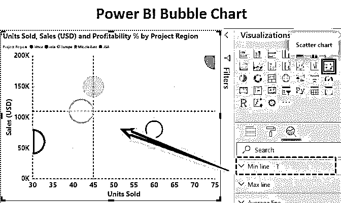

## Power BI 中的气泡图

气泡图用于三维可视化数据集。它与散点图有很大关系。散点图有两个数值轴。一个数值数据长水平轴，一个沿着垂直轴。散点图显示了两个数值之间的关系。气泡图用代表第三个数据维度的气泡大小替换数据点。基本上，气泡图在一个图形中表示三组数据。一个是 X 轴坐标，第二个是 Y 轴坐标，最后一个是气泡尺寸数据集。散点图和气泡图可以在任何可视化软件中绘制，包括 Power BI。借助气泡图，我们可以显示不同数据集之间的关系。可以在 Excel 或任何可视化软件(如 Power BI、Tableau 等)中绘制气泡图。

**举例:**

<small>Hadoop、数据科学、统计学&其他</small>

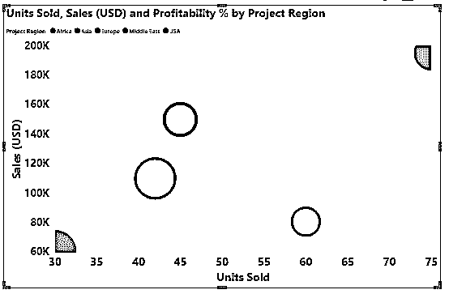

上图显示了 X 轴上的销售单位，Y 轴上的利润百分比。气泡大小显示销售额。将光标放在一个气泡上显示项目区域、售出单位、销售额和利润的详细信息。这就是气泡图的优势，它使数据可视化更加清晰。

### 如何在 Power BI 中创建气泡图？

要在 Power BI 中构建气泡图，我们必须有一组数据。首先，我们需要导入它。为了演示，我们有相同的 Excel 数据。

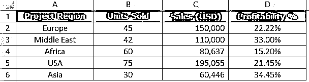

您也可以从下面的链接下载用于本例的 excel 工作簿。

You can download this Power BI Bubble Chart Excel Template here – [Power BI Bubble Chart Excel Template](#popmake-167767)

*   要导入这些数据，我们将进入 Power BI > Get data，如下所示。然后，我们必须从如下所示的位置选择 Excel 文件。

*   现在，我们的数据以表格形式导入到 Power BI 中。

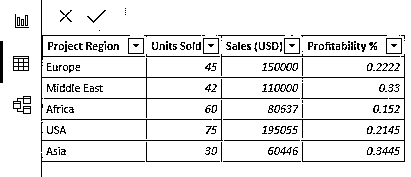

*   现在，我们必须转到“报告”选项卡，然后是可视化。

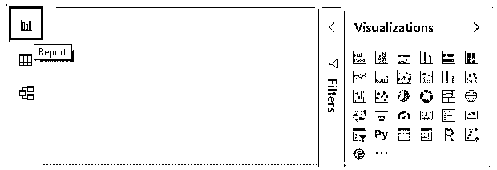

*   从可视化效果来看，我们将选择散点图，因为气泡图是散点图的高级版本。

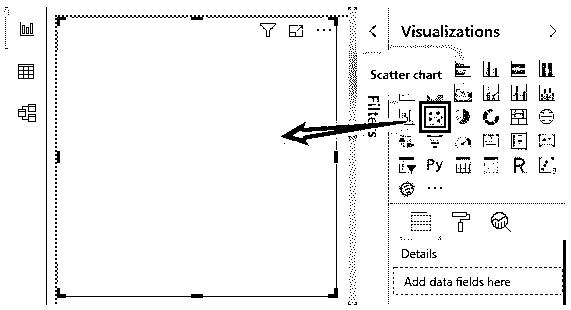

*   现在，我们需要向字段添加值，以便在图表中显示出来。

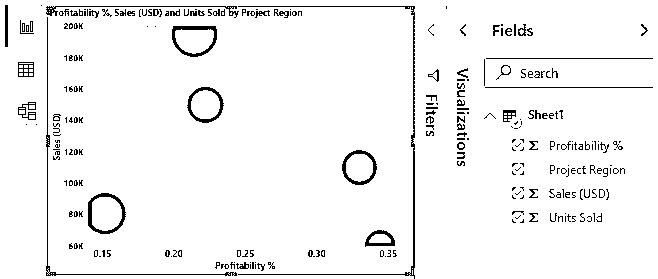

*   现在散点图绘制出来了，如上图所示。要绘制气泡图，我们只需将“项目区域”从“细节”字段拖到“图例”中。

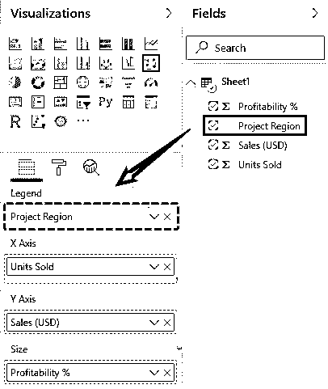

*   气泡图现在可以用不同的颜色显示不同的气泡。

所有区域以不同的颜色显示。将光标放在一个气泡上，会显示所有细节，包括销售额、售出单位、利润和地区。这样，气泡图不同于散点图。

如果我们需要设置气泡图上数据点的数量，我们可以简单地转到可视化下的“格式”选项卡，展开“常规”并将“数据量”设置为最大，以确保正确的可视化。

*   为了增加气泡的形状，我们可以选择形状>尺寸，然后根据我们的需要增加尺寸。对于泡泡聊天，我们将坚持圆形。我们可以在“标记形状”下改变形状，如下所示。

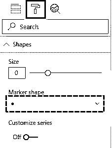

*   要向图表添加更多信息，我们可以转到“分析”选项卡，选择添加一条中线。对于中线的测量，我们将选择“单位销售量”,因为它将创建一条两边各有两点的中线。

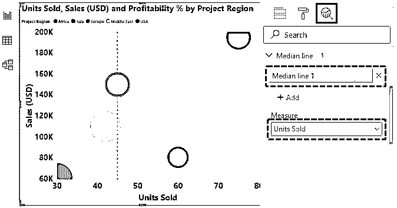

*   为了显示哪些点的 X 轴度量值比 Y 轴大，反之亦然，我们可以在图表中添加“对称阴影”。对称阴影显示基于当前轴上下边界的气泡图的背景。

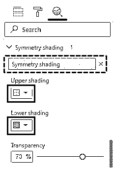

现在可以看到对称阴影。由于我们没有更多的值或数据点，背景只有一种颜色，因为值更高且彼此相似。

*   随着“分析”窗格中更多功能的添加，我们可以根据自己的方便修改图表。

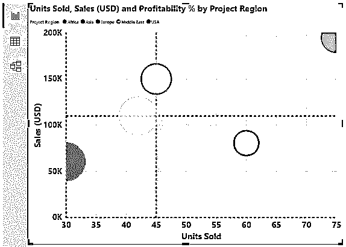

***NOTE:** I have done so much of formatting to these charts, you can download the Power BI Bubble Chart file from below link and apply each formatting technique as applied.*You can download this Power BI Bubble Chart Template here – [Power BI Bubble Chart Template](#popmake-227875)

### 气泡图的优点和缺点

使用气泡图有很多好处:

*   气泡图引人注目，能迅速吸引读者的注意力。
*   由于它是一个直观的图表，所以它比表格格式更好、更清晰。

导致气泡图不被使用的一些缺点如下:

*   这对于第一次使用的人来说是困难的。一个新用户可能需要别人的帮助来可视化。
*   气泡重叠是这个图表中的问题。如果两个或多个数据点具有相似的 X 和 Y 值，一个气泡可能会重叠或隐藏在另一个气泡后面。

### 要记住的事情

*   在绘制气泡图之前，需要对数据进行排列。
*   我们需要决定将哪个数据集设置为气泡。同样，我们需要首先确定目标受众。
*   X & Y 轴需要被格式化到最小程度，以使图形看起来更好。
*   避免花哨或难看的颜色，并设置背景色，使图表更好，业务就绪。

### 推荐文章

这是一个权力 BI 气泡图指南。在这里，我们将讨论如何创建气泡图，以及如何使用 Power BI 中的分析选项卡，并提供一些实例。您也可以阅读以下文章，了解更多信息——

1.  [如何在](https://www.educba.com/power-bi-gantt-chart/) [Power BI 中创建甘特图？](https://www.educba.com/power-bi-gantt-chart/)
2.  [电力毕历(例题)](https://www.educba.com/power-bi-calendar/)
3.  [动力 BI 地图|如何使用？](https://www.educba.com/power-bi-maps/)
4.  [Power BI 项目符号图| Power BI 中的自定义视觉效果](https://www.educba.com/power-bi-bullet-chart/)
5.  [Power BI 图表|创建步骤](https://www.educba.com/power-bi-charts/)

