# 功率 BI 瀑布图

> 原文：<https://www.educba.com/power-bi-waterfall-chart/>

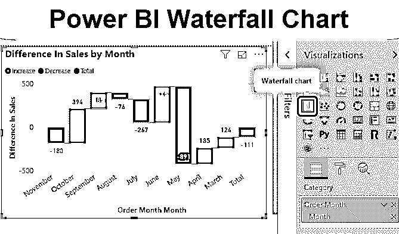

## 功率 BI 瀑布图简介

一般来说，瀑布图是一种[柱形图](https://www.educba.com/column-chart-in-excel/)，用于显示数据从起点开始通过一系列变化而增加或减少。在现实中，我们都见过瀑布，瀑布在不同的层面上创造了一系列的迭代。类似地，任何工具中的瀑布图显示了数据的增加和减少，迭代从先前数据集的端点开始。这意味着如果我的第一个数据点是 100，下一个数据点是-50，那么在图表中，我的第二个数据点将从第一个数据点的末端开始，在瀑布步骤中给出+50 的跳跃。我们将在接下来的例子中看到更多。

### 如何使用 Power BI 瀑布图？

Power BI 中的瀑布图借助上下柱的上升显示数据中的任何正或负变化(或差异)。Power BI 中的瀑布图很容易在可视化部分找到，如下图所示。

<small>Hadoop、数据科学、统计学&其他</small>

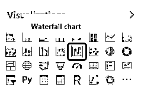

使用 Power BI 瀑布图有一定的局限性。为此，我们应该有 2 个数值，从中我们可以计算方差或差异，并绘制在图表上。

下面我们总结了 8 个月左右的销售数据。我们有总销售额(货币)，销售数量和目标列。我们可以通过在 Power BI 中上传来使用相同的数据，然后使用 DAX 计算方差，或者我们可以先在这里获得数字的差异，然后上传它。

### 如何在 Power BI 中创建瀑布图？

为了在 Power BI 中创建瀑布图，请考虑我们将要使用的以下数据。因此，您可以从下面的链接下载用于本例的 excel 工作簿。

You can download this Power BI Waterfall Chart Excel Template here – [Power BI Waterfall Chart Excel Template](#popmake-167767)

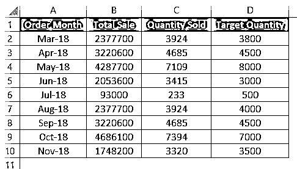

让我们只在幂 BI 中进行方差计算。

*   因为我们有数据，所以我们将把它上传到 Power BI。为此，点击**主页**菜单选项卡下的**获取数据**选项。

*   选择包含数据的文件的源。正如我们所看到的，我们的数据在一个 Excel 文件中，所以我们将选择相同的。

*   浏览文件位置，点击**打开**。

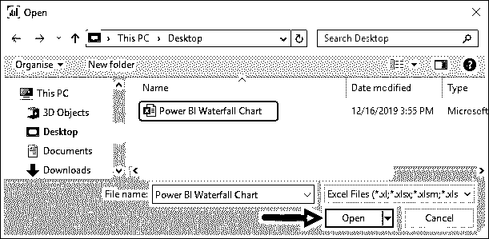

*   从“导航”窗口中选择包含数据的工作表。选中该框后，点击 **Load** 将数据上传至 Power BI。

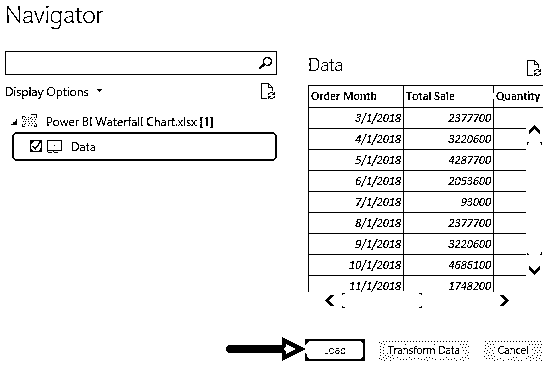

*   我们将能够在**字段**部分看到上传的数据字段。

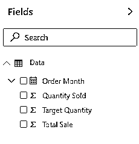

*   这是数据选项卡下上传的数据。

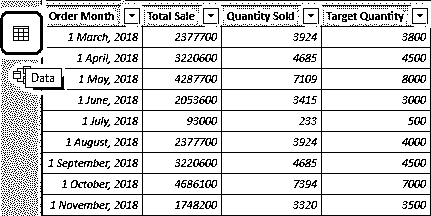

*   我们将创建一个列来查找目标销售量和实际销售量之间的差异。为此，在**建模**选项卡下，点击**新列**。

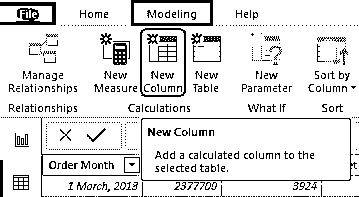

*   一旦我们这样做了，我们将得到一个新的没有数据的虚拟列，如下所示。

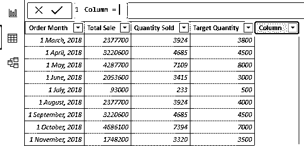

*   根据需要更改列的名称。

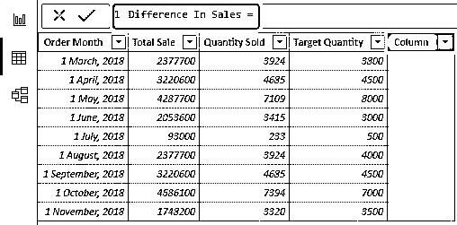

*   为了获得差异或差异，我们将从“售出数量”列中减去目标售出数量，如下所示。

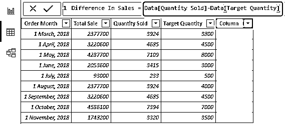

*   按回车键继续。我们将得到一个新列，其中包含一个计算字段“销售差额”。

*   现在转到报告视图，从可视化部分选择**瀑布图**，如下所示。

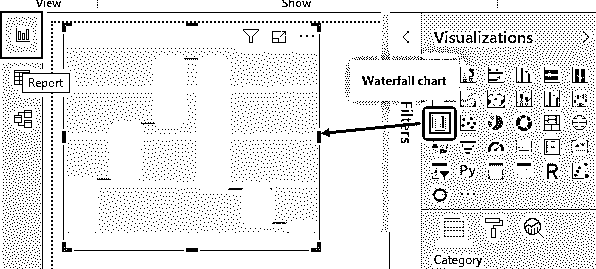

*   现在要绘制瀑布图，将月份拖到类别中，将销售额差异拖到 Y 轴上，就像在普通轴上创建图表一样。

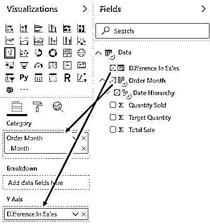

*   之后，我们会得到一个瀑布图，上面有我们使用的数据。

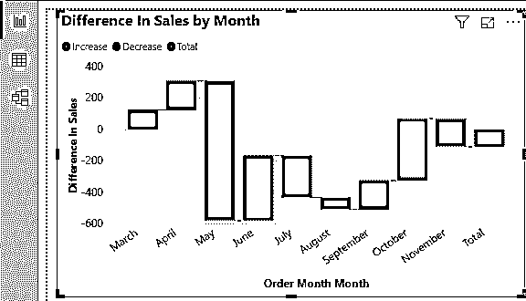

*   现在，为了让图表对用户来说更有吸引力、更容易理解，我们将在这里添加数据标签。

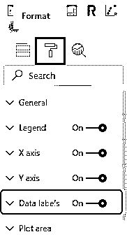

*   我们可以从格式部分做进一步的格式化。
*   如果我们点击下面突出显示的 3 个点(…)，我们会有更多的选项。这将给出列表，其中有出口日期，显示数据，聚光灯，排序。

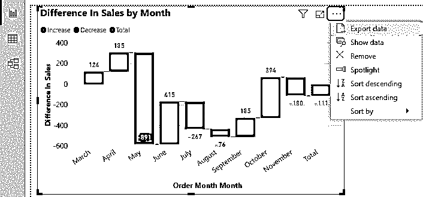

*   我们把数据按月份排序，看看有什么变化。

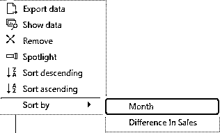

*   我们将看到数据已经按照瀑布图中的方式进行了排序。

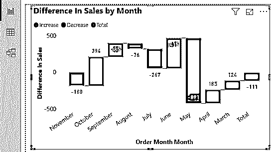

正如我们在创建的瀑布图中所看到的，当数据出现正变化时，它会以绿色向上柱显示，而负变化会以红色向下柱显示。最终的总和以蓝色显示。

现在，如果我们想进一步格式化图表，可以使用 **Format** 部分。

*   我们可以从**情绪颜色**部分更改列的颜色，通过它我们可以定义任何我们想要的颜色。

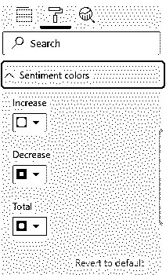

*   我们甚至可以根据自己的选择和需要改变图表的背景颜色。

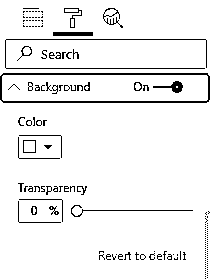

*   然后我们就有了**标题**。这有助于我们看到图表的名称。我们甚至可以在这里自定义名称，如下所示。

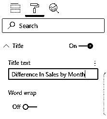

*   在格式下，我们有一个**边框**选项。通过它我们可以随意改变颜色边框。

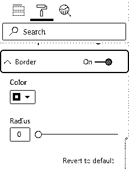

*   如果我们试着总结一下我们所用的数据。我们可以看到，在 8 个月中，有 4 个月销售额低于目标。并且在**5 月**月出现大幅下跌，数量为 891 个。

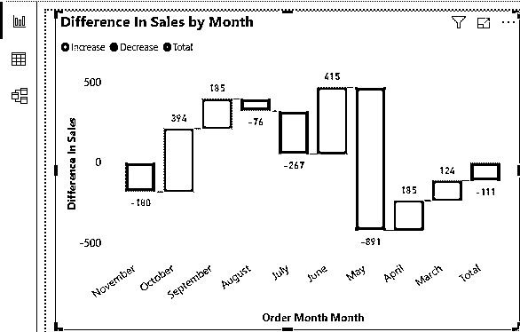

**NOTE: **Power BI Waterfall Chart file can also be downloaded from the link below and the final output can be viewed.You can download this Power BI Waterfall Chart Template here – [Power BI Waterfall Chart Template](#popmake-227875)

### 功率 BI 瀑布图的优点

*   它给出了目标数据值和实际数据值之间的比较。
*   我们可以很容易地分析数据，看看我们需要改进的地方。
*   我们可以用任何数据创建 Power BI 瀑布图，甚至在创建柱形图之后。

### 要记住的事情

*   我们可以使用 DAX 来创建不同的计算字段。
*   我们需要计算或者有一个方差来得到每次迭代中的差异。
*   总是试图用绿色显示数据中的增益，用红色或深色显示数据中的下降。
*   如果我们没有差异列，Power BI 会自动插入差异列。

### 推荐文章

这是一个权力 BI 瀑布图指南。这里我们讨论如何在 Power BI 中使用、创建和格式化瀑布图，并给出一个实例。您也可以阅读以下文章，了解更多信息——

1.  [创建 Power BI 仪表板样本的步骤](https://www.educba.com/power-bi-dashboard-samples/)
2.  [如何使用 Power BI 中的 IF 语句？](https://www.educba.com/power-bi-if-statement/)
3.  [Power BI 报告(模板示例)](https://www.educba.com/creating-reports-in-power-bi/)
4.  [如何在 Power BI 中使用可视化地图？](https://www.educba.com/power-bi-maps/)
5.  [创建功率 BI 图表的步骤](https://www.educba.com/power-bi-charts/)

