# Power BI 钻取

> 原文：<https://www.educba.com/power-bi-drillthrough/>

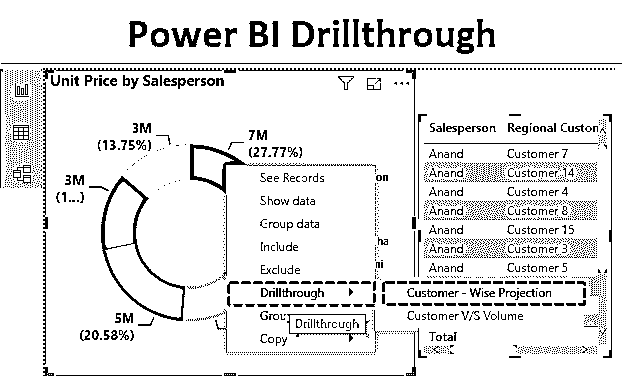

## Power BI 中的钻取

Power BI 中的 Drill through 用于过滤具有特定值和参数的数据，以便用户可以专注于他/她想要显示的内容。大多数时候，当我们在 Power BI 或任何其他工具中创建任何仪表板或图表时，我们都专注于显示项目或业务的总体进度报告。但是借助 Power BI 中的 Drillthrough 操作，我们可以根据需要过滤数据，并将其分解成小的预测，这样获得邮件数据集的实际数字就变得容易了。

### 如何在 Power BI 中使用钻取过滤器？

为了在 Power BI 中使用钻取，我们需要首先遵循在 Power BI 中创建仪表板视图的步骤。为此，我们需要数据来处理。下面是一些电子产品的销售数据截图，如笔记本电脑、台式机、平板电脑和手机。这些销售数据包含不同的类别，如销售人员、地区客户名称、单价、数量和日期。数据的最大范围是 1000 行。

<small>Hadoop、数据科学、统计学&其他</small>

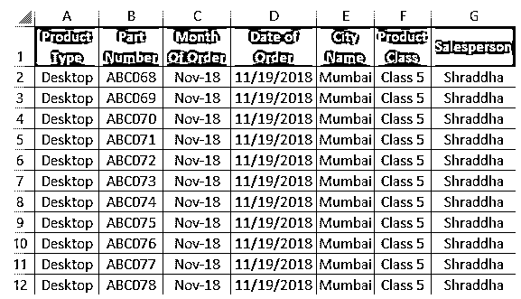

如果需要，我们可以对数据进行分类。一旦我们开始在 Power BI 视图中处理数据，我们将根据需要对数据进行排序。您也可以从下面的链接下载用于本例的 excel 工作簿。

You can download this Power BI Drillthrough Excel Template here – [Power BI Drillthrough Excel Template](#popmake-167767)

让我们一步一步地完成这个过程，并在 Power BI 中使用钻取。具体步骤如下:

*   将数据集加载到 Power BI 中。单击主页选项卡下的获取数据菜单。从获取数据的下拉菜单中，选择适当的数据源类型。在本例中，它是 Excel，因此单击 Excel，如下图所示。

*   从“获取数据”选项的下拉菜单中，选择我们要上传的文件源类型。在这里，我们的数据是 Excel 格式的。在导航窗口中选择文件后，它会要求我们选择要上传的工作表。这是因为，可能有一个以上的数据表，但我们想选择的表可以是任何东西。之后，单击以黄色突出显示的 Load 按钮，将数据加载到 Power BI 中。

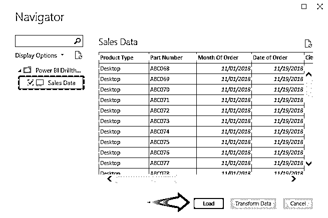

几分钟后，工作表将上传到 Power BI 中。

*   让我们创建第一个视图，通过它我们将显示所有产品类型的不同销售额。为此，请从可视化中选择柱形图。

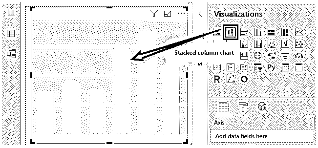

*   将“产品类型”和“数量”字段拖到所选可视化的“轴”和值部分。

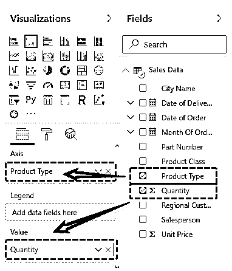

*   根据需要进行基本格式化，如数据颜色、数据标签，以获得最终视图。

*   现在，我们将创建一个饼图或圆环图，通过它我们将显示销售人员明智的图表。为此，从可视化中选择圆环图。

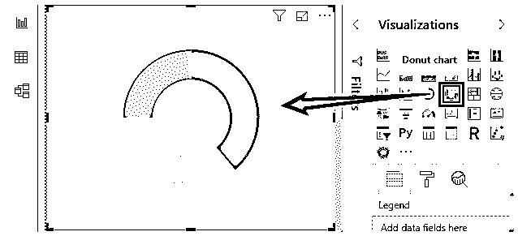

*   现在拖动相应的字段以查看所选圆环图中的值。在这里，我们选择了销售人员的姓名和他们销售的质量。

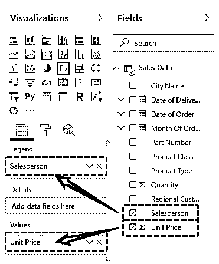

然后我们的环形图将看起来如下所示。这样，我们可以清楚地看到，在总销售额中，哪个销售人员持有多少股份。

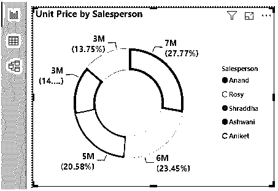

*   现在，我们将在 Power BI 报告中插入另一个[页面，并将其命名为“客户导向预测”。正如我们在 Power BI 中上传的数据截图中所看到的，我们有一个区域客户编号列，我们将在这里使用它。](https://www.educba.com/power-bi-report/)

*   现在，我们将把销售人员、区域客户号和单价拖入值中。

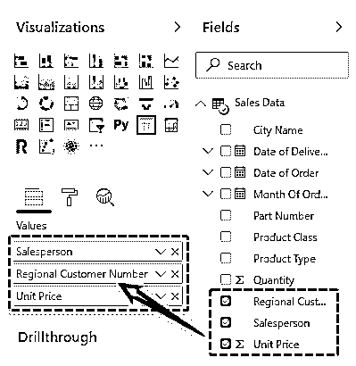

*   这将给出如下所示的表格，从中我们可以看到哪个销售人员有哪些客户编号，以及他/她完成了多少销售。

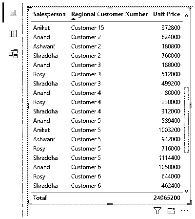

*   格式化后，表格图将如下所示。

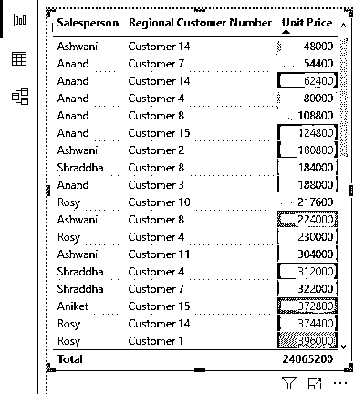

*   然后，我们将为客户和批量销售创建另一个页面，如下所示。

*   在这里，选择漏斗图，然后将区域客户编号和数量拖到相关字段部分。

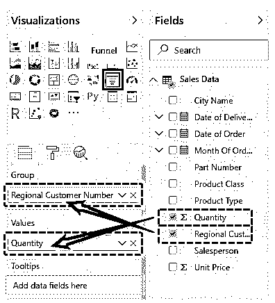

*   格式化后，我们将得到如下所示的漏斗图。这将显示哪个客户订购了多少数量的产品。

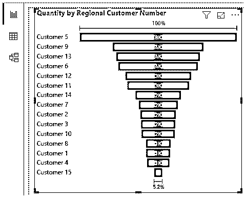

现在，我们将在创建的每个页面中添加钻取功能。我们将创建一个包含销售人员姓名的完整销售数据的分类。

*   为此，在当前表**客户 v/s 量**中，右键单击字段部分的销售人员，并从菜单列表中选择**添加到** **钻取**。

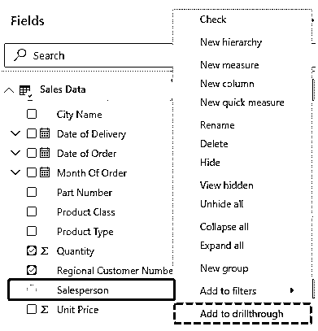

*   我们将看到，销售人员的姓名将被添加到钻取中。

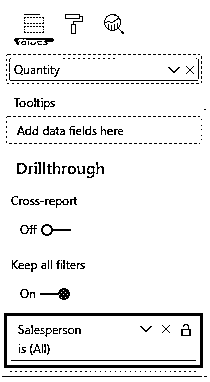

*   一旦我们这样做，我们将看到一个返回箭头将出现在图表上。

*   现在，我们将把来自**客户导向预测**页面的销售人员添加到**钻取**部分。

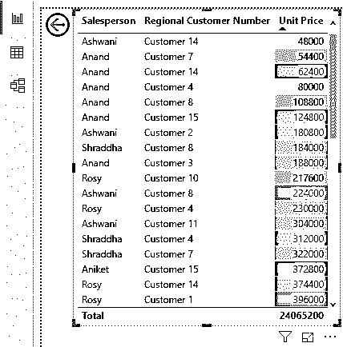

*   现在，我们已经准备好了我们可能需要的所有钻孔。之后，我们将转到第一页，在那里我们为销售人员创建了圆环图，为产品类型创建了柱形图。

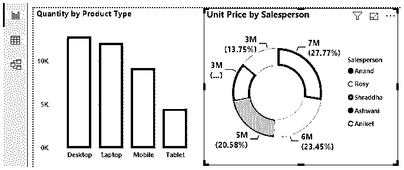

*   正如我们在上面的截图中看到的，在环形图中，我们有所有销售人员的姓名和他们各自的销售号码。在这个图表中，销售人员是 Anand、Rosy、Shraddha、Ashwani 和 Aniket。现在，假设我们想要钻取任何销售人员，比如说 Rosy。然后右键单击该名称，并选择“从此处钻取”选项。让我们首先选择客户导向预测。

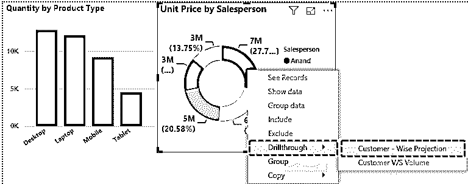

*   我们将看到钻取将带我们进入第二页，并过滤名为 **Rosy** 的数据。返回，在返回箭头上单击+Ctrl。

*   现在，如果我们想要钻取 Anand 的数据，请右键单击该数据，然后选择“客户与数量”。

*   这将直接将我们带到该页面，数据也将得到过滤。

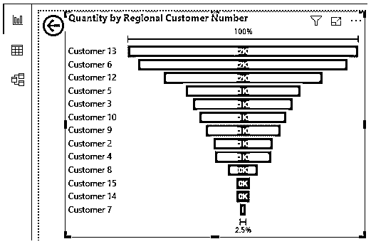

同样，我们可以应用钻取并深入了解任何项目。

**注意:**我已经对该表格和图表进行了大量的格式化，您可以从下面的链接下载 Power BI Drillthrough 文件，并应用所应用的每种格式化技术。

You can download this Power BI Drillthrough here – [Power BI Drillthrough](#popmake-227875)

### 动力 BI 钻取的优点

*   这有助于我们更深入地了解项目数据。
*   我们可以分析数据集的任何部分。
*   我们可以创建任意数量的钻取视图。

### 要记住的事情

*   首先，找到你想要挖掘的区域以获得洞察力。
*   在后退按钮的帮助下，我们可以回到第一页。
*   钻取仅提供报告的细分，或者我们可以筛选焦点组并执行进一步的分析。
*   钻取类似于筛选数据。但是这将过滤所有创建的图表以及我们选择的相关字段。

### 推荐文章

这是一个关于 BI 钻取能力的指南。在这里，我们通过一个示例和可下载的模板来讨论如何在 Power BI 中使用钻取过滤器。您也可以阅读以下文章，了解更多信息——

1.  [什么是](https://www.educba.com/power-bi-bullet-chart/) [异能匕](https://www.educba.com/power-bi-bullet-chart/)中的子弹图？
2.  [电源 BI 主题|如何设置？](https://www.educba.com/power-bi-themes/)
3.  [功率 BI 参数|示例](https://www.educba.com/power-bi-parameters/)
4.  [如何实现 Power BI SUMX？](https://www.educba.com/power-bi-sumx/)

