# Power BI 主题

> 原文：<https://www.educba.com/power-bi-themes/>

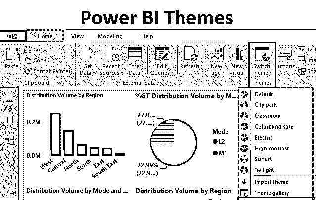

## Power BI 中的主题

Power BI 中的一个主题与可视化的外观有关。字典对主题的定义之一是“与艺术或文学有关的想法”。在 Power BI 中，我们可以根据需要修改主题。作为 BI 和分析工具，Power BI 提供了许多选项，用户可以从中选择所需的主题。但是，应该记住，主题不仅仅是与仪表板或报告的外观相关的设计或设置。相反，拥有不同主题的目的是使分析生动。

### 应用 Power BI 主题

为了理解 Power BI 主题的使用，我们将进行一次演示。在本次演示中，我们将使用分布体积数据集。该数据集包含与按维度城市分布在印度各地的数量相关的详细信息。更高的维度即。分布单元和区域也出现在数据集中。数据集中的另一个维度是城市。分布体积是数据集中的度量。

<small>Hadoop、数据科学、统计学&其他</small>

下面的屏幕截图显示了上面描述的 Power BI 中的分析。

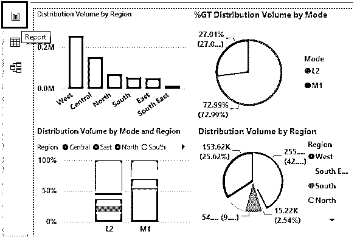

现在，我们将探讨如何应用主题和相关概念。这将在下一节中介绍。让我们一步步来应用 Power BI 主题。具体步骤如下。

*   **第一步**:为了改变主题，打开 Power BI 可视化软件。转到主页选项卡，找到“切换主题”选项。

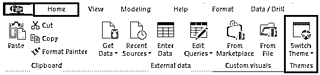

*   **第二步**:为了改变主题，点击主菜单中“切换主题”选项的下拉菜单。如下图所示。当前的主题是默认的，还有各种各样的主题，我们可以从中选择想要的。

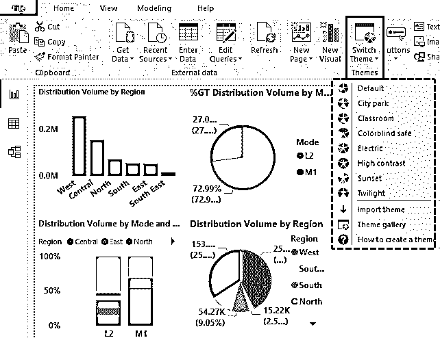

*   第三步:我们可以找到更多的选择，比如城市公园、教室等等。正如我们在下面看到的，我们应用了“城市公园”主题。请注意，颜色和格式已经更改。我们发现绿色的使用越来越多。

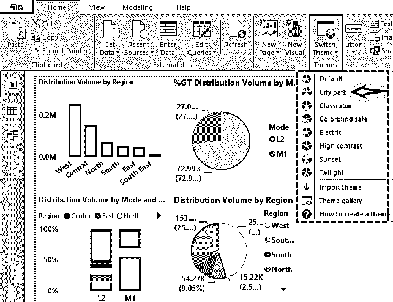

*   **步骤 4** :下面的截图演示了“教室”主题的使用。与前一个相比，它看起来更吸引人。在这里，我们发现更多的蓝色色调的使用。

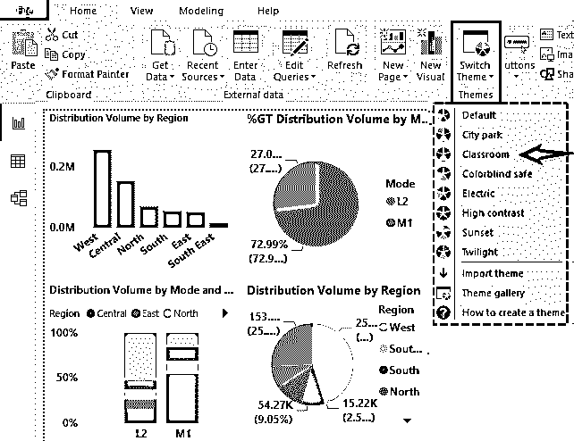

*   **步骤 5** :下面的截图显示了应用“色盲安全”主题如何改变了视觉分析的外观。主题影响背景颜色。

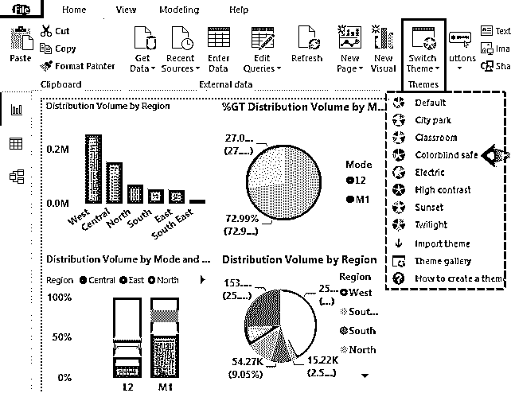

*   **步骤 6** :下面的截图展示了应用“Electric”主题如何影响颜色和格式。深蓝色阴影的使用在这里更多。请注意，在饼图中，最深的蓝色对应于在总分发量中贡献最大的分发单位。随着我们从最高到最低，颜色 2 的色调变得越来越淡，直到变成粉红色。颜色变为粉红色后，值越低，阴影越深。在最暗的粉红-红色组合之后，再一次考虑不同的颜色。

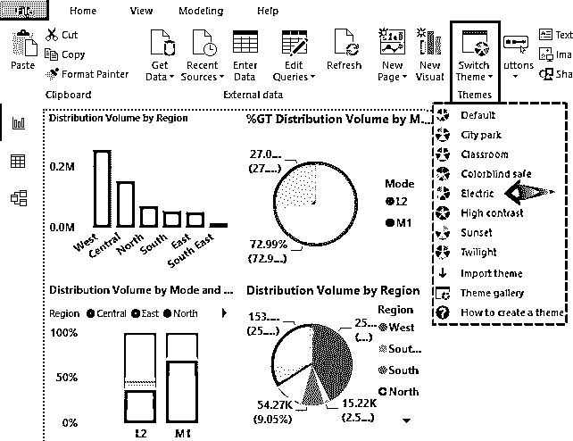

*   第 7 步:下面的例子说明了主题不仅仅是改变颜色和格式。相反，它们带有潜在的含义，这在给定的问题上下文中非常重要。因此，主题应该总是适合分析，因为颜色和格式与如何传达洞察力有很大关系。它们不仅要让视觉效果吸引人，还要能够轻松有效地捕捉洞察力。

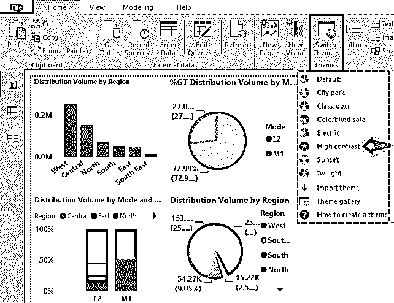

### 设计 Power BI 主题

Power BI 带有多种内置设计主题，可根据需要使用。让我们看看下面展示的几个主题。Power BI 允许我们创建可以导入的主题。这些是 JSON 文件。下面的 JSON 代码创建了一个 Power BI 主题。

**代码:**

`{
"name": "Manmade Theme",
"dataColors": [
"#a95295",
"#a78cd4",
"#a8c3ff",
"#38a6c6",
"#02949f",
"#cccccc"
] }`

*   **步骤 1** :我们将上述主题导入到 Power BI 中。首先，点击导入主题选项，如下所示。

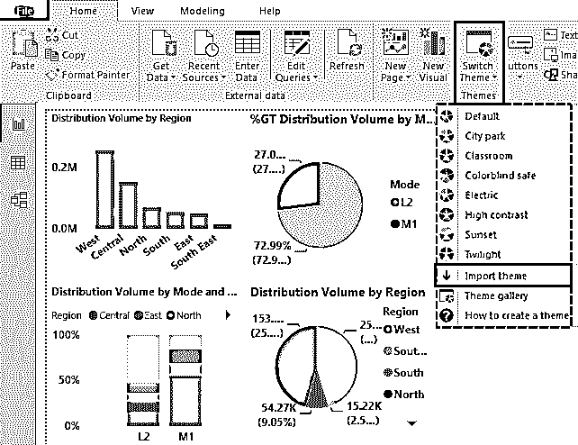

*   **步骤 2** :选择 Manmade.json 文件，点击打开，如下图所示。

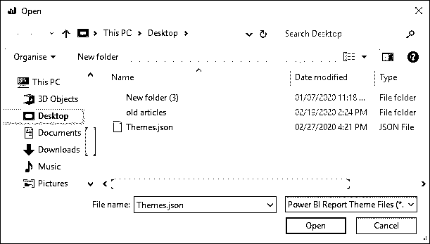

*   **第三步**:从下面的截图中我们可以看到，导入的主题已经成功应用。

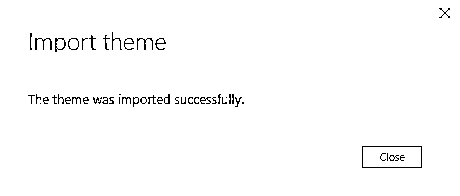

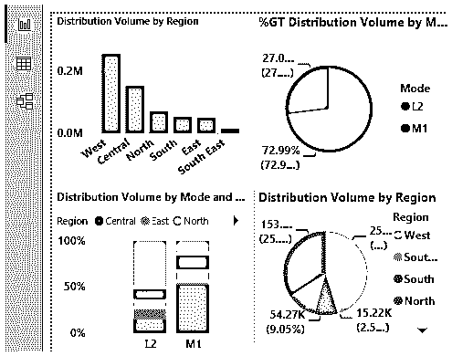

*   第四步:现在我们将探索主题画廊。我们可以通过点击下拉菜单中的“主题图库”来探索更多 Power BI 主题。如下图所示。只需向下滚动，从选项中找到想要的主题。

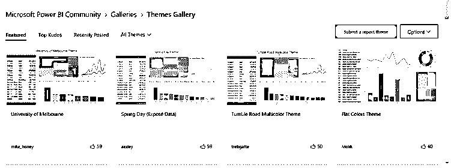

*   **步骤 5:** 这里我们将看到“如何创建主题”功能。这是一个广泛的指导材料，让用户详细了解主题的概念。请注意，Power BI 除了提供内置主题外，还支持用户创建的主题。这些是 JSON 格式的文件。

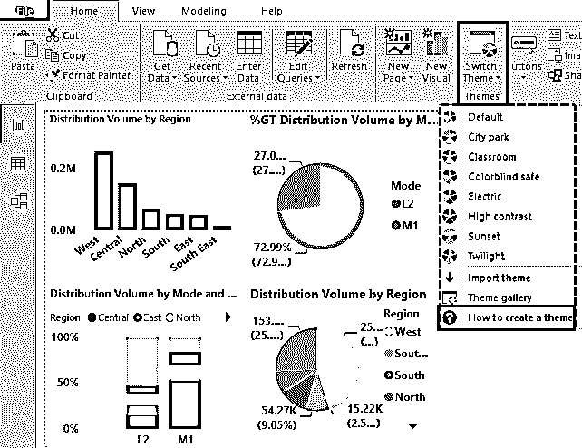

### 定制的电源 BI 主题

我们可以通过选择必要的设置和应用颜色来定制主题。对于每个对象，我们可以格式化设置。如下所示。

*   **第一步:**在下面的截图中我们发现“格式”中有多个选项。要更改格式，只需选择任意对象。我们有各种选项，从图例、数据颜色到外观和边框。正是这些元素，即。构成主题的名称、前景色、背景色、表格设置和数据颜色。

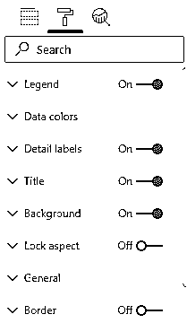

*   **步骤 2:** 下面的截图展示了我们如何在饼图中改变馅饼的颜色。使用这些选项，我们可以有自己的定制主题。

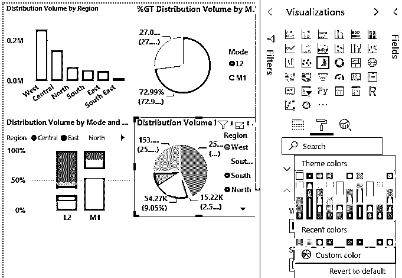

### 要记住的事情

*   每个主题都确保了颜色和格式与数据的关联，从而可以轻松理解数据所描述的模式或趋势，因此，在决定使用哪个主题之前，必须对多个主题进行试验。
*   Power BI 中的一些主题相关选项将我们导航到微软社区，访问该社区需要互联网连接。在线社区论坛提供了大量的主题信息。

### 推荐文章

这是一个权力 BI 主题的指南。在这里，我们讨论如何应用仪表板报告的默认主题，以及如何使用 JSON 代码设计您自己的 Power BI 主题。您也可以阅读以下文章，了解更多信息——

1.  [电源双向滤波器](https://www.educba.com/power-bi-filter/)
2.  [电力 BI 气泡图](https://www.educba.com/power-bi-bubble-chart/)
3.  [威力匕子弹图](https://www.educba.com/power-bi-bullet-chart/)
4.  [电源 BI 提示](https://www.educba.com/power-bi-tooltips/)

