# 电源 BI 热图

> 原文：<https://www.educba.com/power-bi-heat-map/>

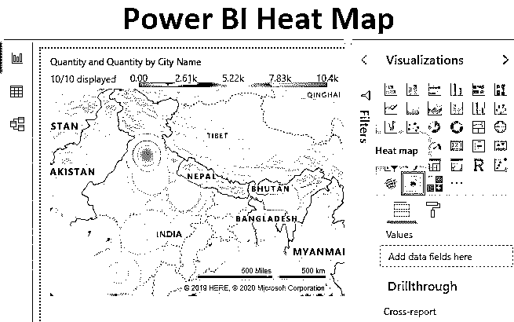

## Power BI 中的热图

顾名思义，热图是一种可视化工具，当我们需要将任何给定点的数据密度投影到地图上时，就会用到它。Power BI 中的热图是数据可视化的定制类型，在可视化部分中直接不可用。我们都在新闻频道中看到，当记者播放天气预报时，他们总是用一些红黄色的等高线显示温度从低到高不同的地区或区域。当我们看板球比赛时，还有一个场景。他们总是把击球手的得分区域投射在马车车轮热图上。得分最高的区域用深色，而得分最低的区域用浅色。

我们将在本文中看到类似的热图，我们可以在日常工作中实施。

<small>Hadoop、数据科学、统计学&其他</small>

### 如何使用 Power BI 热力图？

要获得 Power BI 热图，首先，打开 Power BI Desktop 并使用登录选项登录。

我们只能使用公司或学生 ID 来访问此功能。进入 Power BI 服务器后，单击可视化部分末尾的 3 个点，导入自定义的视觉效果。并选择**从市场**导入。

这将把我们带到 Power BI 市场。在搜索选项中搜索热图，选择**热图**，点击**添加**即可。

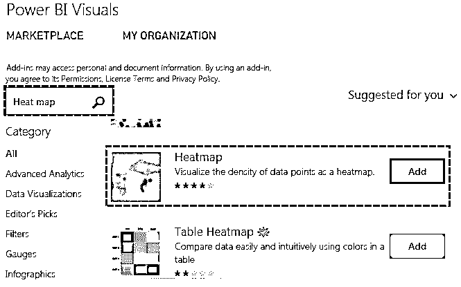

成功导入后，我们将得到如下所示的消息。

我们将能够在可视化部分看到热图。

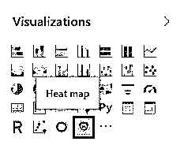

#### 示例#1

要创建热图，我们需要数据。因此，您可以从下面的链接下载用于本例的 excel 工作簿。

You can download this Power BI Heat Map Excel Template here – [Power BI Heat Map Excel Template](#popmake-167767)

现在我们有了城市名称和在这些城市的销售量，如下所示。

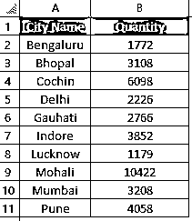

*   现在我们将把这些数据上传到 Power BI 中。点击**获取数据**选项，选择文件来源。在这里，我们的数据在 Excel 中。

*   浏览文件并打开它。选择带有数据的工作表，然后点击**加载**。

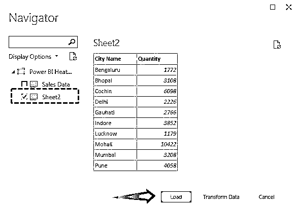

*   一旦数据加载完毕，我们就可以开始了。接下来，从 Visualization 部分选择热图，如下所示。

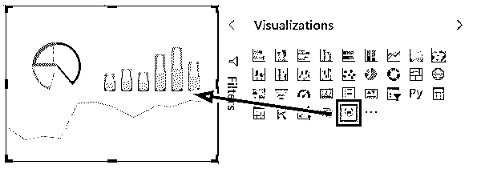

*   现在拖动可视化中的必需字段。将城市名放入位置 ID，将数量放入值。

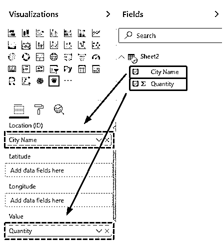

*   然后，我们将得到基本的第一个热图视图，如下所示。

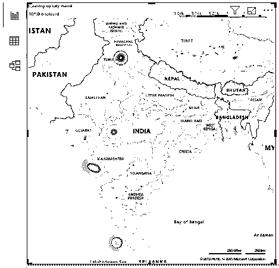

*   现在，让我们把它变成热图。为此，转到格式部分，将类型从轮廓更改为热量，如下所示。

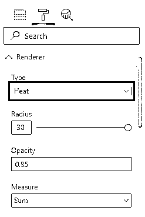

*   我们将会看到，当我们从渲染器类型中选择**热度**时，该地图被更改为实际的热度地图。我们可以注意到莫哈利是销售数量最多的城市。莫哈利的颜色变成了红色。

*   如果我们试图理解创建的热图，那么我们会注意到在右上方的标题中，有一个图例列表，显示了在该范围内哪个城市的销售量最高。这是通过看颜色来理解地图的最简单的方法。

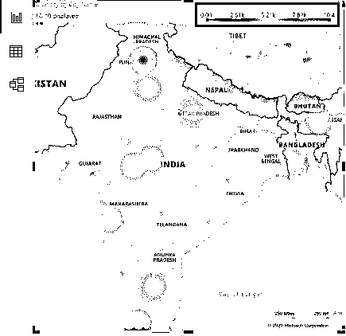

#### 实施例 2

当我们在 Power BI Market place 的搜索栏中搜索热图时，我们也找到了表格热图。表格热图也是一种以表格形式出现的热图。我们将用同样的过程将这个表格热图添加到我们的可视化中。

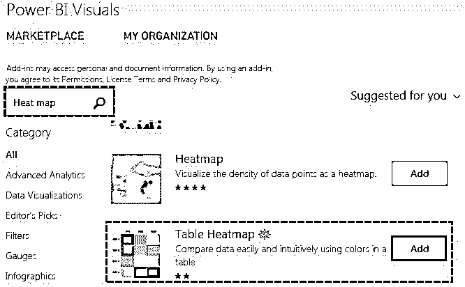

*   这是可视化中可以找到表热图的地方。

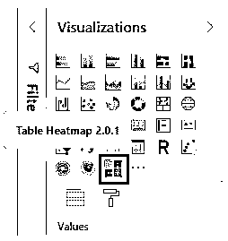

*   打开表格热图的新页面，并从上面的列表中选择表格热图。

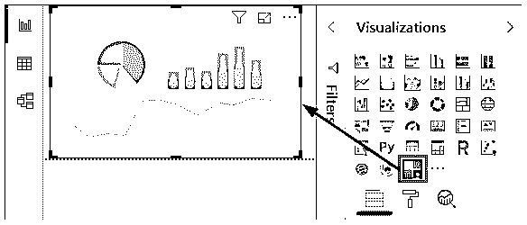

*   现在将“城市名称”和“数量”字段拖到“类别”和“Y”部分。

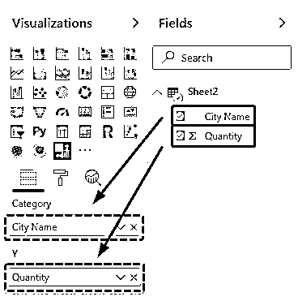

*   我们会看到，在表格的形式中，所有的城市名称和售出数量都以颜色和表格的形式突出显示。

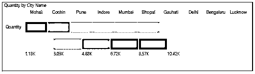

如果我们注意的话，我们会发现上面提到城市名称的线条颜色从深红色到浅红色不等。第二条线从浅红色阴影开始到暗红色，这表示哪个颜色区域观察到了什么范围的销售。颜色越深，销售额越高。

*   如果我们想要对创建的表热图进行任何更改，那么可以使用 visualization 部分下的 Format 选项轻松完成。

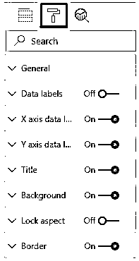

**注:** Power BI 热图文件也可从以下链接下载，并可查看最终输出。

You can download this Power BI Heat Map Template here – [Power BI Heat Map Template](#popmake-227875)

### 电源 BI 热图的优点

*   我们可以使用 Power BI 中的热图来投影任何类型的视图，其中包含数字或数量。
*   热图很容易创建。
*   进一步格式化上面创建的热图，我们可以使它们看起来更好。

### 要记住的事情

*   热图只接受数字。
*   选择热图中代表热量或密度的颜色。
*   Power BI 中的热图是定制的可视化，我们只能从 Power BI Marketplace 访问。
*   Marketplace 有各种不常用的可视化图表。常见图表仅在可视化部分可见。

### 推荐文章

这是一个功率 BI 热图指南。在这里，我们将讨论如何使用 Power BI 热图以及实际示例和可下载的 Power BI 模板。您也可以阅读以下文章，了解更多信息——

1.  [使用功率 BI IF 语句](https://www.educba.com/power-bi-if-statement/)
2.  [电力毕历(例题)](https://www.educba.com/power-bi-calendar/)
3.  [Power BI 工具提示完整指南](https://www.educba.com/power-bi-tooltips/)
4.  [电源 BI 气泡图指南](https://www.educba.com/power-bi-bubble-chart/)
5.  [使用力量匕子弹图](https://www.educba.com/power-bi-bullet-chart/)
6.  [异能匕钻取|如何使用？](https://www.educba.com/power-bi-drillthrough/)
7.  [Power BI 主题|如何应用？](https://www.educba.com/power-bi-themes/)

