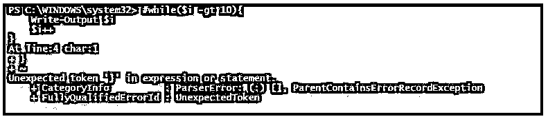
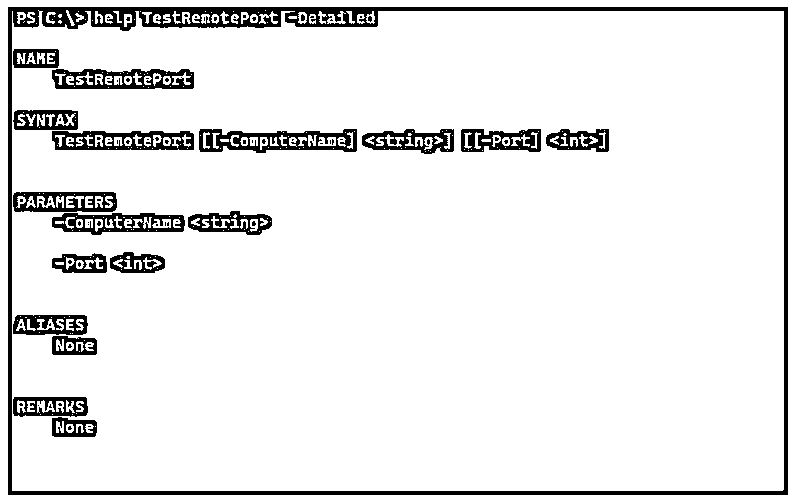
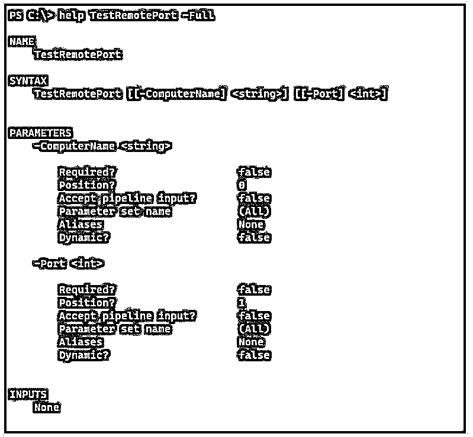
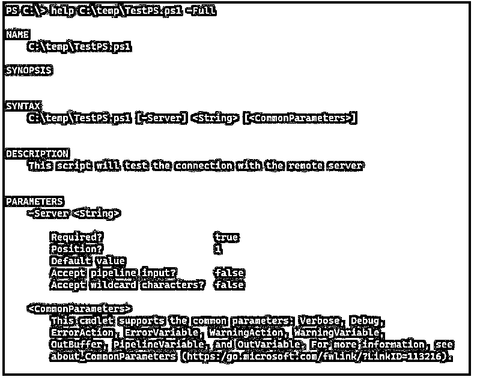

# PowerShell 注释

> 原文：<https://www.educba.com/powershell-comment/>

## PowerShell 注释简介

PowerShell 注释是一种帮助，可以给出代码的基本简短细节。您可以向 PowerShell 脚本的任何部分添加注释，例如您可以为函数提供的注释，或者您可以为条件、循环等提供的注释。阅读代码的脚本编写者会很容易理解代码的内容。我们也可以使用注释来提供帮助部分。执行脚本时不会显示注释；它仅用于用户信息。

### PowerShell 注释的类型

我们可以使用两种类型的 PowerShell 注释:

<small>Hadoop、数据科学、统计学&其他</small>

*   **单行注释:**这也叫行内注释，只能注释掉一行。
*   **多行注释:**这也叫块注释，适用于几行代码或者整行代码。

**语法:**

单行注释或行内注释可以用散列(#)语法来描述，而多行注释或块注释可以用标签和散列来描述，如

### 例子

以下是 PowerShell 注释的示例:

#### 示例#1

描述代码的单行注释。

**代码:**

`Rename-Item C:\Temp\azgroup.json -NewName azuregroup.json  # This command will rename the item`

#### 实施例 2

描述函数的单个注释。

**代码:**

`function GetData{
#Function will get the data from azure blob
}`

#### 实施例 3

注释来禁用特定代码。

**代码:**

`# Copy-Item C:\Temp\NewUsers.csv -Destination \\test1-win2k12\c$\temp`

当您注释任何代码时，您可能会注意到线条的颜色发生了变化。这取决于编辑器和您为该编辑器应用的主题。如果你有描述多行的程序块，比如“循环”、“函数”、“for 循环”等等。，如果对单行应用注释，可能会产生错误。

**代码:**

`while($i -gt 10){
Write-Output $i
$i++
}`

如果在上面的例子中使用注释禁用第一行，将会产生一个错误。

**代码:**

`# while($i -gt 10){
Write-Output $i
$i++
}`

**输出:**

该错误指出不需要额外的“}”，因为我们已经禁用了“{ 0 }”。您可以使用单行注释来禁用多行代码。

**代码:**

`# while($i -gt 10){
#  Write-Output $i
#  $i++
#}`

但不推荐这种方法；相反，我们可以使用多行注释来禁用它们，如后面的示例所示。

#### 实施例 4

描述脚本的多行注释。

**代码:**

`<#
This program is to test the server connectivity.
Once connectivity establishes it checks the WINRM connection on the server.
The third step is to push the Application agent on the servers
In the final step, server will be rebooted
#>`

在上面的例子中，我们已经使用 PowerShell 创建了一个多行注释块，它不会被执行。当你想把关于参数的具体细节，例如，日期格式，或者用户在执行脚本之前应该注意的像日志的输出路径时，就使用它。

#### 实施例 5

禁用函数或部分代码的多行注释。

如示例“c”所示，我们可以使用单行注释禁用整个 while 循环，但使用多行注释会容易得多。

**代码:**

`<#while($i -gt 10){
Write-Output $i
$i++
}#>`

这比单行注释简单多了。

### 基于 PowerShell 注释的帮助

这也是多行注释的一种类型。基于 PowerShell 注释的帮助处理关键字。每个关键字都描述了特定主题的预期用途，它们可以在多行注释部分中使用。

这些关键字可以以任何顺序出现，并且不区分大小写，它们以点(.).没有必要提及所有关键词。你可以根据自己的需要添加一些。

*   **。概要:**对函数或脚本的简要描述。该关键字只使用一次。
*   .**描述:**脚本的详细描述。该关键字只使用一次。
*   **。示例:**一个带有输入和输出的脚本示例。我们可以举多个例子。
*   **。参数<参数名称> :** 参数描述。该关键字可用于脚本中的每个参数。它可以是任何顺序，但是它们在 Param()块中的顺序将出现在帮助部分。
*   **。INPUTS:** 输入对象的描述或者可以通过管道传递给脚本或函数的对象类型。
*   **。OUTPUTS:**cmdlet 返回的对象或对象类型的描述。

以上是我们描述函数的基于评论的帮助部分一般需要的基本关键词。除此之外，您还可以指定其他关键字，如注释、链接、组件、角色、功能等。

**举例:**

**代码:**

`function TestRemotePort{
param(
[String]$ComputerName,
[Int]$Port
)
<#
.SYNOPSIS
Function to test remote ports.
.DESCRIPTION
This script checks port on the remote computers
.EXAMPLE
TestRemotePort -ComputerName ServerName -Port 8080
.PARAMETER ComputerName
Remote Server Name
.PARAMETER Port
Remote port number
.INPUTS
ComputerNames can be passed and a port can be passed
.OUTPUTS
True or False
#>
Test-NetConnection -ComputerName $ComputerName -Port $Port
}`

**输出:**

您也可以将基于注释的帮助放在脚本的开头。

**代码:**

`<#
.DESCRIPTION
This script will test the connection with the remote server
#>
param(
[Parameter(Mandatory=$true)] [String]$Server
)
Test-Connection -ComputerName $Server -Count 2 -quiet`

**输出:**

基于注释的帮助可以放在脚本的末尾。

**代码:**

`function TestNetConnection{
Test-Netconnection -ComputerName $computername -Port $port
}
<#
.DESCRIPTION
The above function checks the port on the remote computer.
#>`

### 推荐文章

这是 PowerShell 注释的指南。这里我们讨论介绍、类型、示例和基于 PowerShell 注释的帮助。您也可以看看以下文章，了解更多信息–

1.  [PowerShell 转义符](https://www.educba.com/powershell-escape-character/)
2.  [PowerShell 不像](https://www.educba.com/powershell-not-like/)
3.  [PowerShell 继续](https://www.educba.com/powershell-continue/)
4.  [Windows PowerShell ISE](https://www.educba.com/windows-powershell-ise/)

