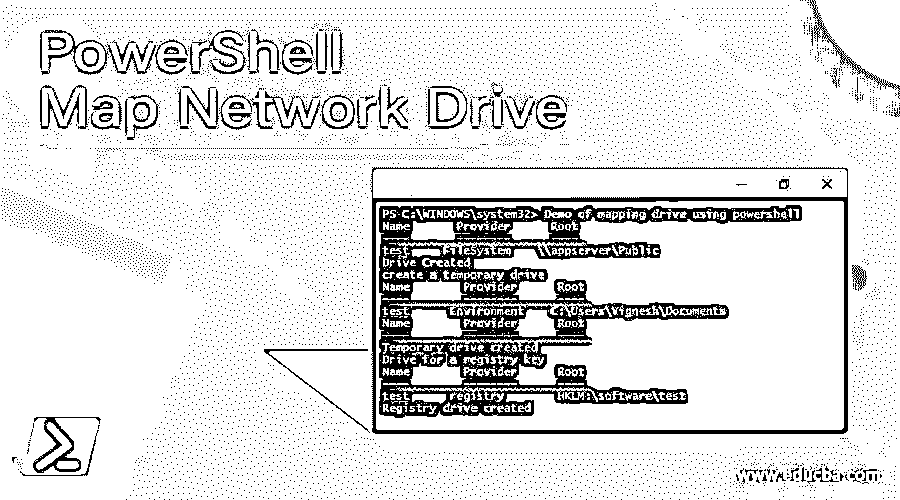
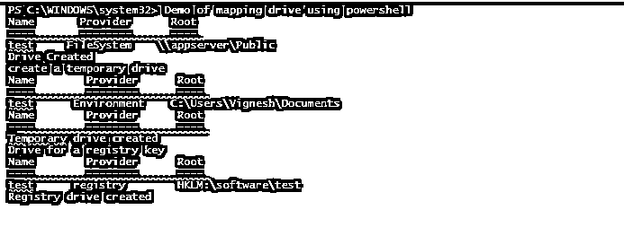

# PowerShell 映射网络驱动器

> 原文：<https://www.educba.com/powershell-map-network-drive/>

## PowerShell 映射网络驱动器简介

开发人员或用户经常会遇到这样的情况，他们需要访问保存在一个集中位置的文件。这些集中的位置称为网络驱动器。每次都登录到该服务器来访问这些文件是不可行的；在这种情况下，这些网络驱动器被映射到用户的本地系统。本文将详细解释将网络驱动器映射到本地计算机的各种方法。在本主题中，我们将了解 PowerShell 映射网络驱动器。

### 映射网络驱动器的不同方式

映射网络驱动器最简单也是最重要的方法是使用命令提示符并运行以下命令

<small>Hadoop、数据科学、统计学&其他</small>

net 使用驱动器号:要映射的路径

例如:

净使用 k:\\ Vignesh\test

在上面的例子中，网络共享位置测试将被映射到 K 驱动器。

如果网络驱动器需要身份验证才能访问，那么每次都提供凭据将会非常繁琐。为了避免凭据可以作为命令的一部分提供

net 使用 K:\ \ vignesh \ test/user:vignesh Pass @ 123

使用上述命令时要记住的要点是，一旦系统重新启动，映射将会丢失。为了克服这一点并进行永久映射，应该启用 persistent 关键字。

net 使用 K:\ \ vignesh \ test/user:vignesh Pass @ 123 persistent:是

一旦启用永久，除非明确设置为否，否则创建的驱动器将被永久映射。

上面的方法是老方法了，PowerShell 已经不支持了。

当前使用的方法是使用 New-PSDrive cmdlet。

### 使用 New-PSDrive 创建网络驱动器

New-PSDrive cmdlet 用于创建临时和永久网络映射驱动器。临时驱动器仅在 PowerShell 的当前会话中可用。它可以有任何名称，并且可以映射到任何远程计算机、目录或数据存储。每当需要访问数据和执行某些操作时，就会创建临时映射驱动器。由于临时驱动器与 PowerShell 相关联，因此无法从文件资源管理器、命令提示符、WMI 或访问它们。net 框架。这个 cmdlet 是在 PowerShell 3.0 中引入的。此 cmdlet 的 persist 参数用于创建与 windows 关联的映射驱动器。这些驱动器不是基于会话的。

它们被保存，可以像其他驱动器一样使用文件资源管理器轻松访问。当在脚本中使用 New-PSDrive cmdlet 时，如果驱动器应该无限期存在，则脚本应该是点源的。创建永久映射的最佳方式是使用 scope 参数，并将其值设置为 global。如果外部驱动器连接到系统，PowerShell 会自动将 PSDrive 添加到系统中。一旦驱动器断开连接，映射也会被删除。两种情况下都不需要重启。创建时，如果在 root 参数中指定了 UNC 路径，则指定的凭据将用于创建 PSDrive。

#### 因素

以下是不同的参数:

**-Confirm:** 此参数用于在运行 cmdlet 之前获得用户的确认。此参数的数据类型是开关。它的别名是 cf，默认值是 false。此参数不接受管道输入和通配符。

**-Credential:** 这表示必须运行 cmdlet 的用户帐户。默认情况下，使用当前用户的凭据。用户名存储在 PSCredential 对象中，密码以安全字符串格式存储。此参数的数据类型是 PSCredential。此参数接受管道输入，但不允许使用通配符。

**-描述:**这表示正在创建的驱动器的描述。此参数的数据类型是字符串。此参数接受管道输入，但不允许使用通配符。若要查找所有驱动器的描述，可以使用 Get-PSDrive | Description cmdlet。若要获取驱动程序的描述，请获取-PSDrive 驱动器名。可以用描述。

**-名称:**这是正在创建的驱动器的名称。对于永久驱动器名，可以使用字母。对于临时 PSDrives，可以使用任何字符串作为名称。此参数的数据类型是字符串。此参数接受管道输入，但不允许使用通配符。这是一个强制参数。

**-Persist:** 用于创建一个窗口关联的网络驱动器。这些类型的驱动器不是特定于会话的，可以通过文件资源管理器查看和访问它们。要创建永久驱动器，需要将 scope 参数设置为 global。当作用域设置为 local 时，在 cmdlet 运行的作用域内创建 PSDrive，而不使用点源。当驱动器应该无限期存在时，应该在脚本中使用点源。驱动器的名称可以是任何字母，而根参数应该是 UNC。断开 windows 映射驱动器时，映射将被永久删除。这些映射的驱动器是用户特定的。此参数的数据类型是 Switch。默认值为 false。它接受管道输入，而不允许使用通配符。

**-PSProvider:** 这表示应该用于创建驱动器的提供商。如果驱动器与文件系统相关联，则提供者是文件系统；对于注册表项，提供程序是注册表。此参数的数据类型是字符串。默认值为无。它接受管道输入，而不允许使用通配符。

**-根:**

这表示数据存储的位置。临时 PS 驱动器可以与任何本地或远程计算机或驱动器提供商相关联。映射驱动器只能与远程计算机的文件系统相关联。此参数的数据类型是字符串。默认值为无。它接受管道输入，而不允许使用通配符。

**-范围:**用于表示创建的驱动器的范围。它可以是全局的、本地的、脚本的或与范围相关的数字。当前作用域由 0 表示，父作用域由 1 表示。此参数的数据类型是字符串。默认值为本地。它接受管道输入，而不允许使用通配符。

**-Whatif:** 这是 cmdlet 运行时的输出示例。它的数据类型是开关。它的别名是 wi。默认值为 false。它不接受管道输入，也不允许使用通配符。

### 例子

以下是 PowerShell 映射网络驱动器的示例:

**输入:**

`Write-Host "Demo of mapping drive using powershell"
New-PSDrive -Name "test" -PSProvider "FileSystem" -Root "\\appserver\Public"
Write-Host "Drive created"
Write-Host "create a temporary drive"
New-PSDrive -Name "Test" -PSProvider Environment -Root "C:\Users\vignesh\Documents" -Description "Test"
Write-Host "Temporary drive created"
Write-Host "Drive for a registry key"
New-PSDrive -Name "test" -PSProvider "Registry" -Root "HKLM:\Software\test"
Write-Host "Registry drive created"
Demo of mapping drive using powershell`

**输出:**

### 结论–PowerShell 映射网络驱动器

因此，本文介绍了使用 PowerShell 创建网络映射驱动器的各种方法。还介绍了各种参数及其用途，以及临时驱动器和永久驱动器之间的区别。要了解更多细节，建议编写示例脚本并实践它们。

### 推荐文章

这是 PowerShell 映射网络驱动器的指南。在这里，我们将讨论如何在 PowerShell 中更改目录，并给出示例和输出。您也可以看看以下文章，了解更多信息–

1.  [PowerShell 睡眠](https://www.educba.com/powershell-sleep/)
2.  [PowerShell 子串](https://www.educba.com/powershell-substring/)
3.  [PowerShell 脚本块](https://www.educba.com/powershell-scriptblock/)
4.  [PowerShell 转义符](https://www.educba.com/powershell-escape-character/)

