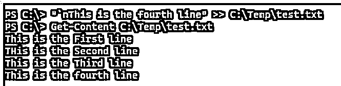
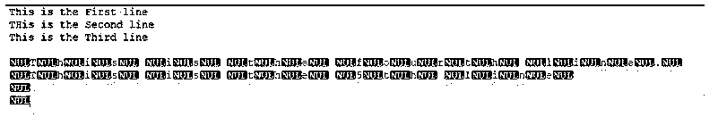
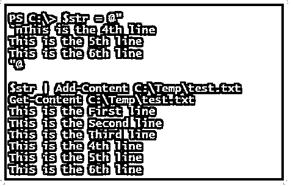
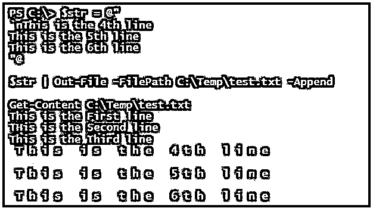
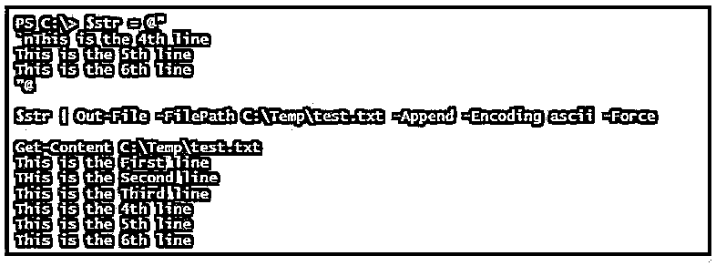
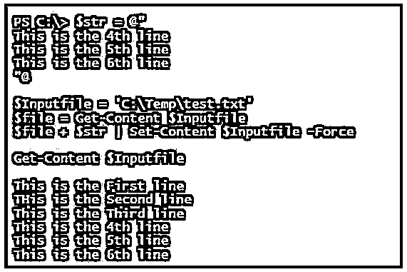
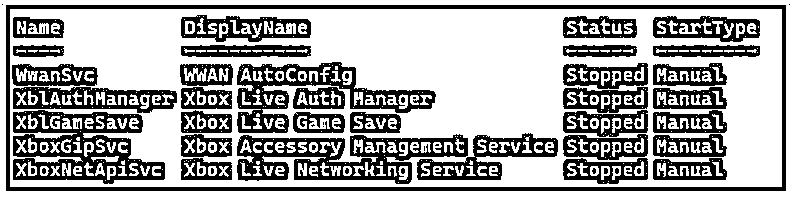
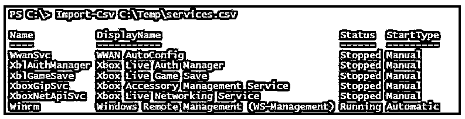

# PowerShell 附加到文件

> 原文：<https://www.educba.com/powershell-append-to-file/>

## PowerShell 附加到文件简介

以下文章提供了 PowerShell 附加到文件的概述。PowerShell 向文件追加内容的操作是将内容添加到不同类型的文件，如 TXT、CSV、Excel、JSON 等。通过使用各种 cmdlets，如 Out-File、Add-Content、Export-CSV 等。和现有文件上的各种方法，方法是将新行添加到内容中，或者将数据追加到文件最后一行的延续部分。

### PowerShell 附加到文件的语法

有各种 cmdlet 用于向现有文件追加内容，但它们都不是直接的 cmdlet 或语法，而是使用有助于追加文件的参数。

<small>Hadoop、数据科学、统计学&其他</small>

**1。Add-Content cmdlet**

`Add-Content
[-Path] <string[]>
[-Value] <Object[]>
[-PassThru] [-Filter <string>] [-Include <string[]>] [-Exclude <string[]>] [-Force] [-Credential <pscredential>] [-WhatIf] [-Confirm] [-NoNewline] [-Encoding <Encoding>] [-AsByteStream] [-Stream <string>] [<CommonParameters>]`

**2。文件外 cmdlet。**

`Out-File
[-FilePath] <string>
[[-Encoding] <Encoding>] [-Append] [-Force] [-NoClobber] [-Width <int>] [-NoNewline] [-InputObject <psobject>] [-WhatIf] [-Confirm] [<CommonParameters>]`

还有其他类似 CSV 的文件，它有一个单独的 cmdlet 来将内容追加到文件中。

`Export-Csv
-InputObject <PSObject>
[[-Path] <String>] [-LiteralPath <String>] [-Force] [-NoClobber] [-Encoding <Encoding>] [-Append] [[-Delimiter] <Char>] [-IncludeTypeInformation] [-NoTypeInformation] [-QuoteFields <String[]>] [-UseQuotes <QuoteKind>] [-WhatIf] [-Confirm] [<CommonParameters>]`

我们可以使用 Out-File 和 Export-CSV cmdlet 中的-Append 参数将内容附加到文件中。

### PowerShell 附加到文件是如何工作的？

用 PowerShell 或其他编程语言追加文件或向文件添加内容并不困难。在 PowerShell 中，支持各种 cmdlets 及其参数将内容追加到现有文件中。

我们在 C:\Temp 中存储了一个名为 test.txt 的文件名，其内容如下。

**代码:**

`Get-Content C:\Temp\test.txt`

**输出:**

要添加这一行，我们将使用双箭头(>>)，这是基本语法，也是。Net 方法。

**代码:**

`"This is the fourth line" >> C:\Temp\test.txt
Get-Content C:\Temp\test.txt`

**输出:**

最后一行被追加到新的一行。使用回车(` n)添加新行，而不是将其追加到最后一行。

**代码:**

`"`nThis is the fourth line" >> C:\Temp\test.txt
Get-Content C:\Temp\test.txt`

**输出:**

如果要添加多行，可以直接使用 append，也可以使用 string 变量。

**代码:**

`$str = "`nThis is the fourth line.`nThis is the 5th line"
$str >> C:\Temp\test.txt
Get-Content C:\Temp\test.txt`

**输出:**

但是不建议使用这种方法，因为当您在其他编辑器(使用 notepad++)中检查该文件时，可以看到添加了空值。下面的快照来自 Notepad++编辑器。

还有其他方法，如输出文件、添加内容等。，以追加内容，它们显示在下面的示例中。

### PowerShell 附加到文件的示例

以下是 PowerShell 附加到文件的示例:

#### 示例#1

用 Add-Content cmdlet 追加文件。

我们将使用相同的文件 test.txt，通过 Add-Content cmdlet 追加文件的内容。

**代码:**

`"This is the 4th line" | Add-Content -Path C:\Temp\test.txt`

或者

`Add-Content -Value "This is the 4th line" -Path C:\Temp\test.txt
Get-Content C:\Temp\test.txt`

**输出:**

使用变量添加多行。

**代码:**

`$str = "`nThis is the 4th line. `nThis is the 5th line. `nThis is the 6th line"
$str | Add-Content -Path C:\Temp\test.txt`

或者

`Add-Content -Value $str -Path C:\Temp\test.txt
Get-Content C:\Temp\test.txt`

**输出:**

#### 实施例 2

使用 Here-String 命令追加内容。

使用 here-string @ "追加多行字符串的最佳方式。@方法如下所示。

**代码:**

`$str = @"
`nThis is the 4th line
This is the 5th line
This is the 6th line
"@
$str | Add-Content C:\Temp\test.txt
Get-Content C:\Temp\test.txt`

**输出:**

#### 实施例 3

使用 Out-File 命令追加文件。

我们可以使用带有-Append 参数的 Out-File 命令将内容添加到文件中。

**代码:**

`$str = @"
`nThis is the 4th line
This is the 5th line
This is the 6th line
"@
$str | Out-File -FilePath C:\Temp\test.txt -Append -Force
Get-Content C:\Temp\test.txt`

**输出:**

这里，由于编码问题，您将得到类似于>>输出的输出，当您用 Notepad++ editor 检查输出文件时，它们被$null 值填充。我们不希望这样，所以相反，我们可以使用这个 cmdlet 支持的编码方法，使用-encoding 参数。

您可以使用标准 ASCII 或 utf8 编码标准来获得正确的输出格式。

**代码:**

`$str | Out-File -FilePath C:\Temp\test.txt -Append -Encoding ascii -Force`

**输出:**

确保使用-Append 参数；否则，该文件将被覆盖。

#### 实施例 4

使用 Set-Content 命令添加内容。

我们还可以使用 Set-Content 命令来追加文件，但这不是文件追加操作的标准命令，因为我们需要在现有文件中添加新内容后覆盖整个内容。

**代码:**

`$str = @"
This is the 4th line
This is the 5th line
This is the 6th line
"@
$Inputfile = 'C:\Temp\test.txt'
$file = Get-Content $Inputfile
$file + $str | Set-Content $Inputfile -Force
Get-Content $Inputfile`

**输出:**

#### 实施例 5

追加 CSV 文件数据。

如果已经有了 CSV 文件，那么使用带有-Append 参数的 Export-CSV cmdlet 可以很容易地将其附加到 CSV 文件。

我们在 C:\temp\Services.csv 中有下面的 CSV 文件，我们想将数据附加到它上面。

如果你想附加更多的服务，比如说 WinRM 服务信息，那么你可以使用下面的命令。

**代码:**

`Get-Service Winrm | Select Name, DisplayName, Status, StartType | Export-Csv C:\Temp\services.csv -Append -Force`

**输出:**

### 结论

向文件添加内容或追加文件操作是最有用和最常用的操作之一，但手动完成所有这些工作并向最终用户(如财务、人力资源、法律部门等)提供数据是一项痛苦的任务。但是使用这些 cmdlets，我们还可以在没有任何用户干预的情况下自动执行和安排文件更新任务。

### 推荐文章

这是 PowerShell 附加到文件的指南。这里我们讨论引言；PowerShell 附加到文件是如何工作的？还有例子。您也可以看看以下文章，了解更多信息–

1.  [PowerShell 睡眠](https://www.educba.com/powershell-sleep/)
2.  [PowerShell 子串](https://www.educba.com/powershell-substring/)
3.  [PowerShell 不像](https://www.educba.com/powershell-not-like/)
4.  [否则如果在 PowerShell 中](https://www.educba.com/else-if-in-powershell/)

