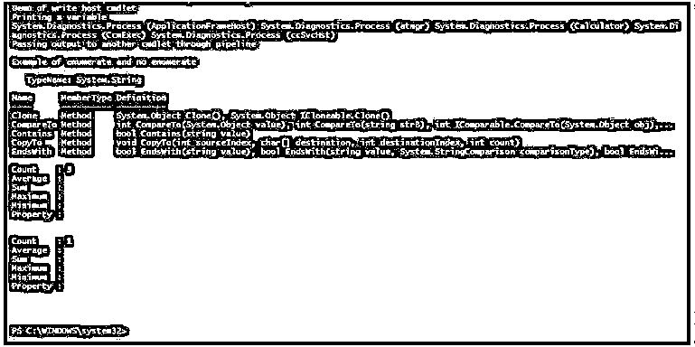
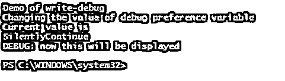
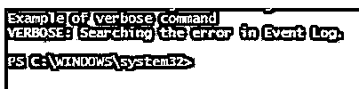

# PowerShell 打印

> 原文：<https://www.educba.com/powershell-print/>

## PowerShell 打印简介

将输出写入控制台或文件是任何语言的重要要求。输出通常可以是单行、多行或表达式或表达式的结果。打印值也可用于调试或作为错误处理机制的一部分。PowerShell 中有多种打印输出的方式。PowerShell 中的一些打印方式有写输出、写主机、写详细、写警告和写错误。

### PowerShell 中打印输出的不同方式

下面给出了在 PowerShell 中打印输出的不同方式:

<small>Hadoop、数据科学、统计学&其他</small>

#### 1.写输出

输出的第一种方法是使用 Write-Output cmdlet。此 cmdlet 用于将管道中的对象传递给后续命令。如果命令是最后一个，最后一个对象将被写入控制台。若要传递错误对象，请使用 Write-Error cmdlet。

**语法:**

`Write-Output [-InputObject] <PSObject[]> [-NoEnumerate] [<CommonParameters>]`

**参数:**

*   **-InputObject:** 表示应该通过管道传递的对象。它可以是表达式、对象的变量或表达式。此参数的数据类型是 PSObject[]。其默认值为无。它接受管道输入，但不接受通配符。
*   **-NoEnumerate:** 默认情况下，write-output cmdlet 枚举输出。为了避免这种情况，使用了这个参数。此参数的数据类型是 Switch。无是默认值。它不接受管道输入，也不允许通配符。

**举例:**

**代码:**

`Write-Host "Demo of write host cmdlet" -ForegroundColor Green
$test= Get-Process
Write-Host "Printing a variable" -ForegroundColor Green
Write-Output $test
Write-Host "Passing output to another cmdlet through pipeline" -ForegroundColor Green
Write-Output "sample output" | Get-Member
Write-Host "Example of enumerate and no enumerate" -ForegroundColor Green
Write-Output 10,20,30 | Measure-Object
Write-Output 10,20,30 -NoEnumerate | Measure-Object`

**输出:**

#### 2.写主机

这个 cmdlet 的主要用途是用不同的颜色显示输出。这与 read-host cmdlet 一起工作，后者从用户处检索输入。此 cmdlet 使用 ToString()方法生成输出并将其写入控制台。我们可以分别使用前景和背景参数来指定输出的文本颜色和背景颜色。为了分隔输出中的各种对象，分隔符参数作为 cmdlert 的一部分出现。有两个变量；与此参数相关联的 informationpreference 和 Informationaction 参数，但它们不影响输出。

**参数:**

*   **-BackgroundColor:** 表示背景的颜色。没有默认颜色。一些值是灰色、绿色、蓝色、红色、白色、深绿色、深蓝色和 magneta。该参数的数据类型是控制台颜色。它不接受管道输入，也不允许使用通配符。
*   **-前景颜色:**表示文本的颜色。没有默认颜色。一些值是灰色、绿色、蓝色、红色、白色、深绿色、深蓝色和 magneta。该参数的数据类型是控制台颜色。它不接受管道输入，也不允许使用通配符。
*   **-NoNewLine:** 这表示所有的输出都写在同一行上，并且在输出之间不插入新行。参数的数据类型是开关。默认值为无。它不接受管道输入，也不允许使用通配符。
*   **-对象:**表示要作为输出写入的对象。此参数的数据类型是对象。该参数的别名是 Msg 和 message。这是一个强制参数。默认值为无。它接受管道输入，而不允许使用通配符。
*   **-分隔符:**表示插入对象之间的分隔符。此参数的数据类型是对象。默认值为无。它不接受管道输入，也不允许使用通配符。

**举例:**

**代码:**

`Write-Host "Demo of write-host"
Write-Host "printing in same line example" -NoNewline
Write-Host "test of second line"
Write-Host "example with separator"
Write-Host (20,49,69,80,10,128) -Separator ", +4= "
Write-Host "Example of background colours"
Write-Host (21,41,62,81,110,121) -Separator ", ->> " -ForegroundColor Blue -BackgroundColor White
Write-Host "Iam vignesh, from chennai" -ForegroundColor DarkGreen -BackgroundColor white
Write-Host "Preventing from printing"
Write-Host "this wont be displayed" -InformationAction Ignore
Write-Host "it wont be available on screen" 6>$null`

**输出:**

#### 3.写调试

这用于从脚本或命令中打印控制台中的调试消息。默认情况下，不显示这些消息，但可以在需要时使用$debugPreference 变量显示这些消息。

**语法:**

`Write-Debug [-Message] <String> [<CommonParameters>]`

**参数:**

*   **-消息:**表示需要显示的调试消息。此参数的数据类型是字符串。这是一个强制参数。这个参数的别名是 msg。无是其默认值。它接受管道输入，但不允许使用通配符。

**举例:**

**代码:**

`Write-Host "Demo of write-debug"
Write-Debug "This wont be printed"
Write-Debug "my name is vignesh"
Write-Host "Changing the value of debug preference variable" -ForegroundColor Green
Write-Host "Current value is" -ForegroundColor Green
$DebugPreference
Write-Debug "wont print this on console"
$DebugPreference = "Continue"
Write-Debug "now this will be displayed"`

**输出:**

#### 4.详细写入

Write-Verbose cmdlet 将文本写入 PowerShell 中的详细消息流。通常，详细消息流用于传递有关命令处理的更全面的信息。默认情况下，不显示详细消息流，但可以通过更改$VerbosePreference 变量的值或在任何命令中使用 Verbose common 参数来显示。

**语法:**

`Write-Verbose [-Message] <String> [<CommonParameters>]`

**参数:**

*   **-消息:**表示需要显示的消息。这是一个强制参数。此参数的数据类型是字符串。别名是 msg。默认值为无。它接受管道输入，但不允许使用通配符。

**举例:**

**代码:**

`Write-Host "Example of verbose command"
Write-Verbose -Message "Searching the error in Event viewer."
Write-Verbose -Message "Searching the error in Event viewer." -Verbose`

**输出:**

### 结论–PowerShell 打印

因此，本文详细介绍了 PowerShell 中的打印。它详细解释了打印输出的各种方法，并附有适当的例子。

### 推荐文章

这是 PowerShell 打印指南。这里我们讨论 PowerShell 中的简介和不同的打印输出方式。您也可以看看以下文章，了解更多信息–

1.  [PowerShell 睡眠](https://www.educba.com/powershell-sleep/)
2.  [PowerShell 子串](https://www.educba.com/powershell-substring/)
3.  [PowerShell 不像](https://www.educba.com/powershell-not-like/)
4.  [否则如果在 PowerShell 中](https://www.educba.com/else-if-in-powershell/)

