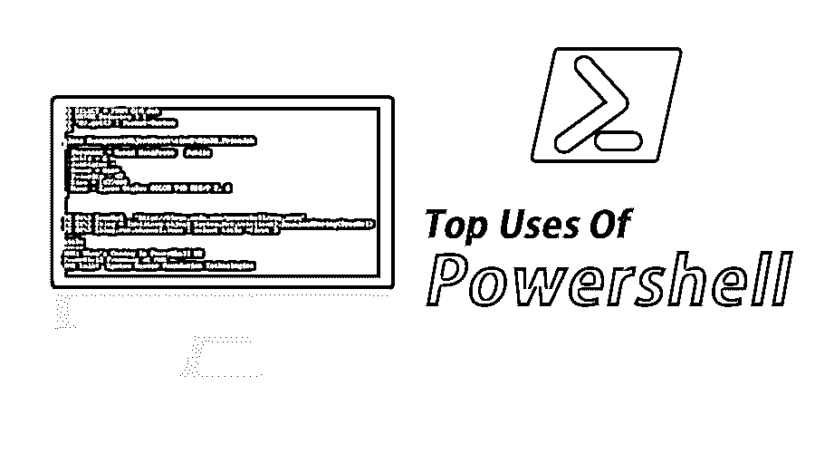
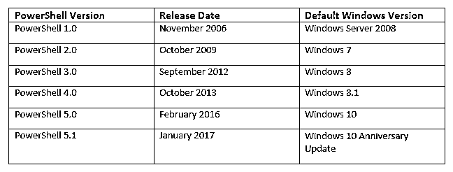
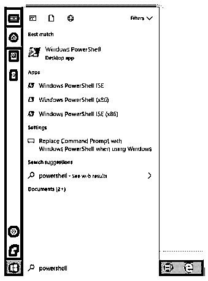
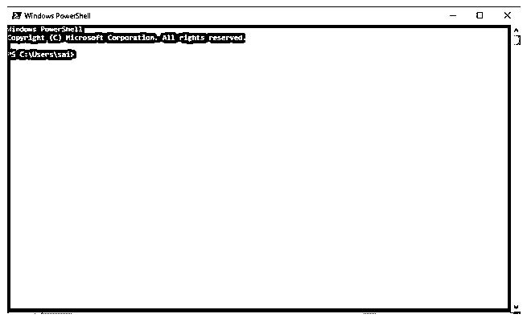
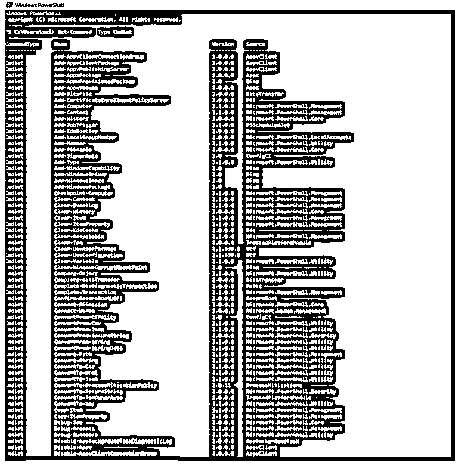

# Powershell 的用途

> 原文：<https://www.educba.com/uses-of-powershell/>

## PowerShell 是什么？

PowerShell 的使用主要与 Windows 操作系统的管理任务相关。它是一种脚本语言，与 Windows 操作系统相关联，最终作为一个开源实用程序提供。对于 windows 管理员来说，这是一个非常有用的工具，可以通过编写脚本来自动执行重复的任务，从而提高效率。这是一个支持 PowerShell 脚本的命令行实用程序。它还支持基于 GUI 的界面，称为 PowerShell ISE 或集成脚本环境。它支持几个本机命令，这些命令可以在 Windows 操作系统中通过批处理脚本进行交互和控制。PowerShell 脚本的一些基本用途是安装和卸载 windows 应用程序、查找 IP 地址、打印正在运行的资源列表以及统计文件和文件夹列表。

### PowerShell 的发展

下表简要介绍了《盗梦空间》的不同版本

<small>Hadoop、数据科学、统计学&其他</small>

### 在 Windows 中哪里可以找到 PowerShell？

*   **最简单的方法是在搜索栏中搜索，如下图所示:**

步骤如下:开始->键入“Windows PowerShell”

*   **然后会打开一个新窗口，如下图**

### 使用 PowerShell 可以做哪些事情？

它是由微软设计的，作为一种工具，将帮助用户自动化和解决许多管理任务，否则需要人工干预。这种任务的一些例子包括:
显示安装在一个系统上或者甚至是网络上的所有端口/USB 设备。
将在后台执行的脚本，另一方面，这可能是一项耗时的任务。
我们还可以使用它作为任务管理器，终止那些没有响应或者花费太多时间来完成整个报告并将其导出为 HTML 格式的进程。

它允许用户通过使用/组合多个命令来编写脚本，以自动化重复的任务。

当网络管理员使用活动目录时，它是一个非常有用的工具。它有许多可定制的命令，称为 cmdlets，可以帮助他们变得更有效率。

### PowerShell 和 PowerShell ISE 有什么区别？

如果 PowerShell 中添加了 GUI(图形用户界面),我们就会得到 PowerShell ISE，ISE 代表集成脚本环境。与 PowerShell 命令行界面不同，在 PowerShell ISE 中，用户必须在一行中编写所有的命令集，他/她可以通过保存脚本来创建、修改或运行脚本。ISE 开发工具允许用户添加多个命令，这些命令可用于构建执行逻辑。

该工具是专门为 Windows 管理员设计的，他们很少执行重复性任务或执行通常操纵系统配置的命令。

下图显示了 PowerShell ISE 的外观:

GUI(图形用户界面)有点类似于记事本的 GUI，帮助用户在 shell 中执行脚本之前编辑脚本。

### PowerShell 命令的一些用法如下:

Cmdlet->这些是命令的用途，找到所有命令用途列表的最好方法之一是键入并执行命令“Get-Command -Type Cmdlet”。

如上图所示，该命令将给出所有可用命令的完整列表。列表很大，需要上下滚动，直到他/她找到命令。有许多文章描述了所有这些命令的使用，这些命令帮助用户自动化繁琐的重复任务。

#### 一些常规任务包括:

1.  卸载 Windows 10 应用
2.  重新安装所有 Windows 10 默认应用
3.  使用 PowerShell 有助于统计所有文件和文件夹
4.  在 Windows 中查找您的 IP 地址
5.  从 Windows 中删除分区
6.  打印正在运行的进程列表
7.  查找任何网卡的 MAC 地址

精通 CLI(命令行界面)和 Linux 的用户使用 PowerShell 有自己的别名列表，这些别名与在那里使用的命令具有相似的名称。一些例子包括 cat、dir、mount、em、chdir、sort 等。如果用户想要别名的完整列表，那么他/她必须运行以下命令“Get-Command -Type Alias”。

### 谁用 PowerShell？

它是许多 It 管理员的终极武器，因为它可以自动化重复的任务，使用 Powershell 还可以管理许多复杂网络中的操作。

让我们举一个例子，了解它的用途和功能:
例如，我们有 500 台服务器，我们需要在所有服务器上安装补丁，但是补丁需要最新版本的软件才能安装到机器上。因此，通常我们会检查系统上软件的最新版本，如果有，我们会继续安装补丁，否则我们会尝试更新软件。因此，如果我们手动执行这项简单的任务，将会花费大量时间，使用 PowerShell 可以帮助 it 管理员编写脚本并发送服务器的状态。该状态可能包括在两个单独的文件中列出所有安装了最新版本软件和没有安装最新版本软件的服务器，从而使 IT 管理员能够提高工作效率。

因此，从上面的例子中我们可以看到，不仅 IT 管理员，普通用户也可以使用 PowerShell 来自动化或调试他们在使用系统时遇到的任何错误。

### 推荐文章

这是 Powershell 的常用指南。在这里，我们讨论了 PowerShell 的不同用途、基本概念和特征，它们有助于 IT 管理员管理运营。你也可以看看下面的文章:

1.  [c#的用途](https://www.educba.com/uses-of-c-sharp/)
2.  [Scala 的用途](https://www.educba.com/uses-of-scala/)
3.  [编码的用途](https://www.educba.com/uses-of-coding/)
4.  [JQuery 的用途](https://www.educba.com/uses-of-jquery/)

