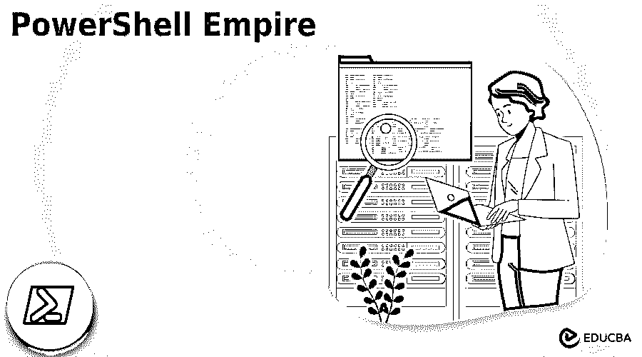
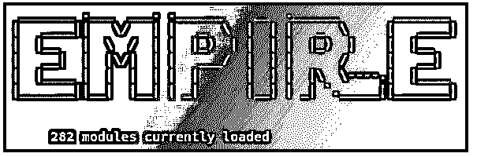
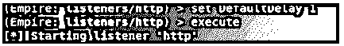
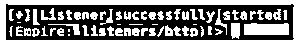

# PowerShell 帝国

> 原文：<https://www.educba.com/powershell-empire/>




## PowerShell 帝国简介

PowerShell Empire 可以暗示为后剥削代理。PowerShell Empire 实现可以在 PowerShell 代理上执行，而无需任何 PowerShell.exe、键盘记录程序、mimikatz 或其他模块的支持。它具有自适应通信以逃避网络检测。它可以加入到一个可以从 GitHub 访问的框架中。由于源 PowerShell 帝国不可用，可以由 BC 安全从 GitHub 分叉。

### 关键要点

PowerShell 帝国的主要运作是:

<small>Hadoop、数据科学、统计学&其他</small>

*   创建一个侦听器来连接面对的主机。
*   为监听器开发一个 stager 来上传代理。
*   为远程主机准备有效负载或创建代理。
*   代理定义模块来完成某些目标。

### 什么是 PowerShell 帝国？

PowerShell Empire 是一个后开发代理，可以在所有 PowerShell 代理上执行。它可以在没有模块、键盘记录程序和 PowerShell.exe 支持的情况下安装。它有一个自适应的通信来逃避网络检测，它捆绑每一个框架，放在 GitHub 上，可以作为公共源码访问。入侵者通过一些未知的模式利用任何 windows 服务器，并利用 PowerShell 中的所有框架来实现目标。然后服务器返回攻击者想要的响应或信息。

### 如何使用 PowerShell 帝国？

有些操作可以通过权限提升来实现，即从标准帐户向管理员帐户提升权限，或者找出主机和服务所在的位置，这称为主机和网络侦察、主机之间的横向移动和凭据收集。所有这些都是趋势渗透测试的基本要素。PowerShell 帝国有三个主要组件:代理、登台者和监听器。

监听器是一种方法，它窥探来自尚未被攻击的主机的连接，并帮助帝国将战利品发送回入侵者的计算机。stager 是一个代码片段，它使恶意软件代码能够在代理上执行，该代理是被入侵的主机。这里的代理是一个软件程序，它管理计算机和主机之间的连接。因此，模块被用来执行恶意软件命令，这些命令会找到凭证、提升权限并破解机器。

### PowerShell 帝国的装置

执行 PowerShell 需要 kali Linux 操作系统机器，kali 最适合黑客攻击。要在 Linux 机器上安装 PowerShell Empire，从 GitHub 克隆源代码。

打开终端，给出以下命令:

**命令:**

```
# git clone https: //github.com/Empire project / Empire.git
```

要创建一个新的目录，命名为帝国，并通过提供 cd 帝国移动指南。以便更改该目录，然后传递 ls 命令来列出目录中的内容。

现在，用户可以通过自述文件中的 cat 命令读取数据。Md 文件。

安装文件夹位于帝国一栏的目录中。通过发出 cd setup 命令移动到该文件夹，并再次发出 ls 命令列出 setup 文件夹中的文件。因此，安装 shell 脚本是强制性的。

类型。/ install.sh 通过执行脚本来安装 Empire 工具。安装过程中会要求用户配置服务器协商密码。提供一个强密码。以上是安装步骤，现在您可以执行 PowerShell 帝国了。




通过提供光盘导航到帝国目录..命令并执行。/帝国可执行脚本。如果帝国在初始化的时候留下一个错误，然后移动到安装文件夹。现在，使用 cd 安装程序，执行。/ reset.sh 脚本。现在，像前面的步骤一样重新启动 Empire，如果需要，用户可以安装缺少的模块，如监听器、登台程序、代理和其他依赖项。







### PowerShell 帝国司令部

Empire 中的侦听器是从目标主机接收连接的结构化通道。所以在使用 Empire 之前，首先启动监听器。在监听器管理中，给出一个显示一些基本命令的帮助命令。

*   **代理—**使用户能够导航到代理菜单。
*   **返回和主菜单—**可导航至主菜单。
*   **退出—**退出帝国。
*   **Info–**显示关于工作中的监听器的信息。
*   **Kill-**终止特定的监听器。
*   **Launcher–**为监听器生成一个初始启动控制台。
*   **列表—**活动监听器的详细视图。
*   **启动器—**用于为监听器生成一个初始启动器。

### PowerShell 帝国工具

PowerShell Empire 严格地在 windows 机器上工作，并利用了渗透测试。这是由于大多数目标使用 windows 风格。一个基本的例子，大量的人在使用微软 Excel，它比 mac 版本有更多的创新功能，财务部门显然比普通人更多地使用 Excel；他们可以接触到银行账户和其他机密细节，这很容易吸引入侵者。

PowerShell Empire 允许攻击者执行内存中的命令；它坚持认为，恶意软件攻击只发生在 PowerShell 帝国上，不能在硬盘上执行。因此，它降低了被防病毒软件捕获的风险，并留下数字指纹以帮助法医调查人员。

### 常见问题解答

下面提到了其他常见问题:

#### Q1。我们用 PowerShell 帝国吗？

**回答:**源代码，也就是帝国项目，不维护。但是它可以从 GitHub 存储库中派生出来。

#### Q2。PowerShell 帝国现在取代的是什么？

**回答:**可以换成 Python 3。

#### Q3。帝国工具的发明者是谁？

**答案:**密尔沃基是帝国工具的开发商和制造商。这是 Techtronic industries 的品牌。

### 结论

因此，PowerShell Empire 在恶意软件攻击中是一个著名的后利用代理，并根据要求进行配置。它使用户能够执行 PowerShell 脚本并建立回主机的连接。

### 推荐文章

这是 PowerShell 帝国的指南。在这里，我们讨论介绍，安装，以及如何使用命令和工具的 PowerShell 帝国。您也可以看看以下文章，了解更多信息–

1.  [PowerShell 创建目录](https://www.educba.com/powershell-create-directory/)
2.  [PowerShell 正常运行时间](https://www.educba.com/powershell-uptime/)
3.  [PowerShell 停止服务](https://www.educba.com/powershell-stop-service/)
4.  [PowerShell 日志](https://www.educba.com/powershell-logging/)


